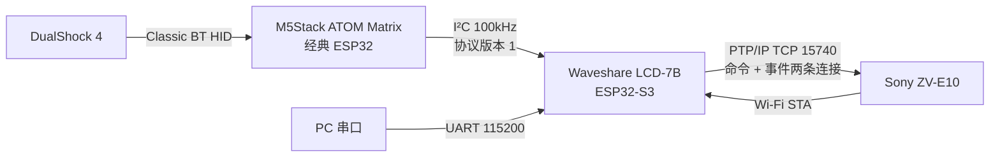
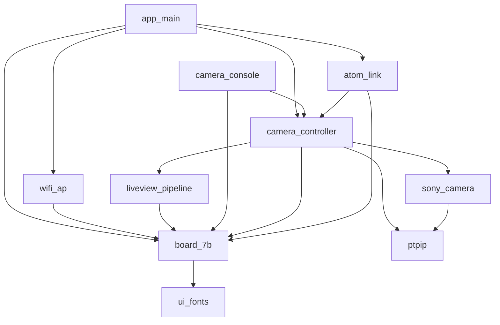
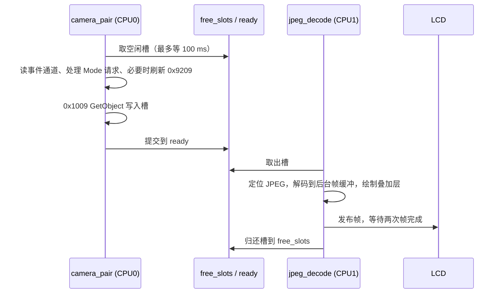
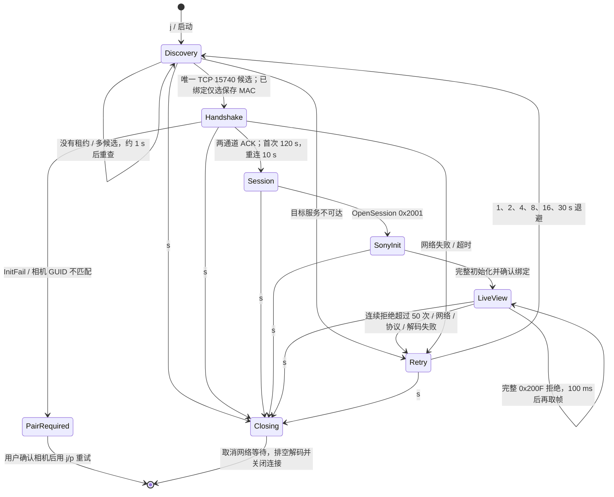

# 当前系统架构

本文描述**当前固件**的整体结构：硬件连接、软件模块、任务与核心、队列与同步、缓冲区所有权、相机连接状态机和各链路的协议版本。重构目标见 [Sony PTP/IP 客户端分层设计](sony-ptpip-design.md)；本文随实现变化更新。

> 草案：内容依据当前 `main/`、`components/board_7b/` 和 `m5_atom_matrix/main/` 源码整理。

## 1. 系统组成

| 设备 | 角色 | 固件工程 |
| --- | --- | --- |
| LCD-7B（ESP32-S3，16MB Flash，8MB Octal PSRAM） | Wi-Fi 热点、PTP/IP 客户端、JPEG 解码与显示、I²C 主机 | 根目录 |
| ATOM Matrix（ESP32-PICO） | DS4 蓝牙主机、I²C 从机（地址 `0x42`）、5×5 灯阵 | `m5_atom_matrix/` |
| Sony ZV-E10 | PTP/IP 服务端，提供取景对象 `0xFFFFC002` | — |

硬件引脚和时序见 [硬件配置](hardware-design.md)。

## 2. 软件模块

### LCD 端

| 模块 | 文件 | 职责 |
| --- | --- | --- |
| 启动 | `main/app_main.c` | 初始化顺序；每 10 秒记录客户端和内存 |
| Wi-Fi 热点 | `main/wifi_ap.c/.h` | 创建 SoftAP；查询客户端、DHCP 地址和 RSSI |
| 相机身份 | `main/camera_identity.c` | NVS GUID/peer 加载、旧记录迁移、成功确认及清除 |
| 连接策略 | `main/camera_link.c` | 候选身份筛选、唯一目标判定、退避 |
| 相机控制 | `main/camera_controller.c`、`main/camera_pair.h` | 保留原公开接口；动态发现、握手、配对绑定、退避重连、Sony 初始化、取景生产端、Mode/MF 请求与属性显示更新 |
| PTP/IP | `components/ptpip/` | socket 传输、原有事务与事件排空、DeviceInfo 解析、小端字段工具和协议常量 |
| Sony 协议 | `components/sony_camera/` | Mode 旧搜索解析、完整标量/MF 能力解析、曝光 Mode 与 MF 写入；属性通过同步回调交给控制器显示 |
| 取景解码 | `main/liveview_pipeline.c/.h` | 双槽上下文、JPEG 对象边界检查、解码工作任务和帧统计 |
| 串口控制台 | `main/camera_console.c/.h` | 保留 `j` / `s` / `S` / `p` 单字符命令 |
| ATOM 链路 | `main/atom_link.c/.h` | I²C 轮询 ATOM，处理缓存按键事件，触发界面切换和 Mode 切换 |
| 板级与显示 | `components/board_7b/board_7b.c` | I²C 总线、IO 扩展器、RGB 面板、帧缓冲、三条 JPEG 解码路径、连接页 / 叠加层 / 设置面板绘制、FPS 统计、Sony 枚举名称 |
| 字体 | `components/board_7b/ui_fonts.c` | FreeType 灰度渲染、字形缓存 |

依赖关系（箭头表示调用）：

相机逻辑已拆分，并增量接入完整标量/MF 能力解析、手动对焦和扩展参数显示；新代码已测试并烧录，连接验收见 [实机记录](../records/connection-test-20261001.md)。连接已接入动态 DHCP 发现、GUID/peer 持久化、可取消传输、事务期限及退避重连。Mode 枚举仍沿用搜索算法；完整属性描述模型、显示抽象与显示故障恢复仍未实施。连接流程及实现边界集中见 [相机连接设计](sony-ptpip-design.md#当前实现连接与运行)。

`board_7b` 同时承担硬件驱动、界面绘制和相机状态保存三类职责，这是重构的主要对象。

### ATOM 端

| 模块 | 文件 | 职责 |
| --- | --- | --- |
| 主循环 | `m5_atom_matrix/main/app_main.c` | 灯阵 RMT 驱动、板载按键、I²C 从机命令处理 |
| DS4 主机 | `ds4_host.c/.h` | 扫描、连接、认证、保存配对地址；线程安全状态快照 |
| 报告解析 | `ds4_report.c/.h` | 解析 DS4 HID 输入报告（纯 C，有主机测试） |
| 事件缓存 | `ds4_events.c/.h` | 128 项按键位图变化环形缓存，按事件 ID 确认（纯 C，有主机测试） |

## 3. 启动顺序

LCD 端 `app_main`：

1. `nvs_flash_init()`：失败直接复位，不自动擦除。
2. `board_7b_init(AP_SSID, AP_PASSWORD)`：I²C 总线、IO 扩展器、LCD 电源、RGB 面板、帧缓冲、字体；显示连接页。
3. 堆完整性检查。
4. `atom_link_start()`：创建 `atom_link` 任务，复用 `I2C_NUM_0` 总线。
5. `wifi_ap_start()`：创建热点。
6. `camera_pair_console_init()`：创建 Mode 请求队列、安装 UART 驱动、创建 `pair_console` 任务。
7. `camera_jpeg_start()`：创建 `camera_pair` 任务，开始等待相机。
8. 主循环每 10 秒记录客户端、运行时间和剩余内存。

ATOM 端 `app_main`：按键 GPIO → RMT 灯阵（红色）→ I²C 从机 → `ds4_host_init()` → 主循环。

## 4. 任务与核心

### LCD 端

| 任务 | 核心 | 优先级 | 栈 | 生命周期 | 说明 |
| --- | --- | --- | --- | --- | --- |
| `main` | 默认 | 默认 | 默认 | 常驻 | 10 秒周期日志 |
| `camera_pair` | 0 | 4 | 32KiB，PSRAM | 每次 `j` / `p` 创建，结束后删除 | 持有两个 socket；握手、Sony 初始化、取景循环、属性刷新、Mode 设置 |
| `jpeg_decode` | 1 | 4 | 32KiB，PSRAM | 每个取景会话创建，排空后删除 | 唯一调用 `board_7b_show_jpeg` 的任务；FreeType 需要 16KiB 栈上工作区 |
| `atom_link` | 不限 | 4 | 3072 字节 | 常驻 | 在线时约 50 ms 轮询一次 |
| `pair_console` | 不限 | 3 | 4096 字节 | 常驻 | 读取 UART 单字符命令 |
| Wi-Fi / lwIP / esp_timer | 系统 | 系统 | 系统 | 常驻 | ESP-IDF 内部任务 |

两个大栈放在 PSRAM，为 lwIP 和 Wi-Fi 保留内部 RAM。身份加载及配对保存由临时 `camera_nvs` 任务完成，使用 4KiB 内部栈；Flash 写入关闭缓存时不能使用 PSRAM 栈。控制任务等待该操作完成后才继续。

### ATOM 端

| 任务 | 优先级 | 栈 | 说明 |
| --- | --- | --- | --- |
| `main` | 默认 | 默认 | 每 10 ms 循环：DS4 日志、按键去抖（阻塞 30 ms）、I²C 从机读写 |
| `ds4_connect` | 4 | 4096 字节 | 扫描与连接重试 |
| Bluedroid / HID Host | 系统 | 系统 | 输入回调中写入状态快照和事件缓存 |

## 5. 队列与同步

| 对象 | 类型 | 生产者 → 消费者 | 说明 |
| --- | --- | --- | --- |
| `free_slots` | 队列，深度 2 | `jpeg_decode` → `camera_pair` | 空闲对象槽编号 |
| `ready` | 队列，深度 2 | `camera_pair` → `jpeg_decode` | 已填满的槽和长度；`slot = -1` 为结束项 |
| `done` | 二值信号量 | `jpeg_decode` → `camera_pair` | 解码任务排空后通知，之后才能释放流水线 |
| `mode_requests` | 队列，深度 32 | `atom_link` → `camera_pair` | 曝光 Mode 步进方向 ±1 |
| `stop_requested`、`busy` | 原子变量 | `pair_console` → `camera_pair` | 停止请求；同一时刻只运行一个相机任务 |
| `display_mutex` | 互斥量 | 所有显示调用方 | 保护帧缓冲、解码器和字体渲染 |
| `frame_done` | 计数信号量 | LCD 帧完成中断 → 显示发布 | 发布后等待两次完成通知，超时 1 秒即置 `display_sync_lost` |
| 属性 `prop_*`、`exposure_mode`、`wifi_rssi` | 原子变量 | `camera_pair` / `wifi_ap` → 绘制 | 叠加层每帧读取 |
| `camera_model`、`camera_firmware` | 普通字符数组 | `camera_pair` → 绘制 | 只在解码任务启动前写入，见修改清单 |

## 6. 缓冲区与所有权

| 缓冲 | 位置 | 大小 | 所有者 |
| --- | --- | --- | --- |
| 对象槽 ×2 | PSRAM | 各 1MiB | 通过 `free_slots` / `ready` 在两个任务间交接，同一时刻只属于一方 |
| LCD 帧缓冲 ×2 | PSRAM | 各 1024×600×2 字节 | `board_7b`；前台由面板扫描，后台由解码写入 |
| DMA bounce buffer ×2 | 内部 RAM | 各 30 行，共约 120KiB | LCD 驱动 |
| TJpgDec 工作区 | PSRAM | 4KiB | `board_7b`，仅解码任务使用 |
| `esp_new_jpeg` 解码器 ×2 | 堆 | — | 全尺寸和 768×432 缩放各一个，首次使用时创建 |
| 字形缓存 | PSRAM | 见字体说明 | `ui_fonts`，只在 `display_mutex` 内访问 |
| 握手报文 | `camera_pair` 栈 | 512 字节 | — |

一帧的流转：

两个槽使网络接收和解码显示可以重叠：解码当前帧时，下一帧已在读取。

## 7. 相机连接状态机（当前实现）

网络 select 每最多 100 ms 检查停止，事务使用绝对期限。部分数据阶段中断后直接关闭连接，不继续发送控制命令。1 秒整机停止、实际 DHCP 和断网回归仍待实机验证；连接细节见 [相机连接设计](sony-ptpip-design.md#当前实现连接与运行)。

## 8. 显示状态

| 状态 | 进入条件 | 绘制内容 |
| --- | --- | --- |
| 连接页 | 启动；`board_7b_show_connection()` | 标题、SSID、密码、ATOM / DS4 状态、连接阶段文字 |
| 预览 | 第一帧解码成功 | 1024×576 取景 + 右上角 6 行状态框 |
| 设置 | 预览中按 Start 或串口 `S` | 768×432 缩略图 + 右侧 15 行面板 + 下方 9 项扩展参数 |
| 失效 | 帧同步超时 | 不再更新，需要重启 |

## 9. 协议版本

| 链路 | 当前版本 | 说明 |
| --- | --- | --- |
| LCD ↔ ATOM I²C | 版本 1，8 字节命令，无校验 | 见 [ATOM 子项目说明](../../m5_atom_matrix/README.md#lcd-主从通信)；版本 2 设计见 [I²C 通信协议](i2c-protocol-design.md) |
| PTP/IP | `0x00010000` | 设备名 `ESP32-Camera-Remote` |
| Sony 扩展协议 | 300（3.00） | `0x9202(300)` |

两端 I²C 协议必须同时升级；只修改 LCD 界面或相机控制时只需烧录 LCD。

## 10. 持久化

| 设备 | NVS 命名空间 / 键 | 内容 |
| --- | --- | --- |
| LCD | `sony_remote` / `guid` | 16 字节 PTP/IP 设备 GUID，首次启动随机生成 |
| LCD | `sony_remote` / `peer` | 完成 Sony 初始化后保存的相机 MAC[6]+GUID[16]；仅持有 guid 时不视为已绑定 |
| LCD | Wi-Fi | 不保存（`WIFI_STORAGE_RAM`） |
| ATOM | `ds4_host` | 上次成功连接的 DS4 地址；绑定信息由蓝牙栈保存 |

LCD 分区：`nvs` 0x9000（24KiB）、`phy_init` 0xF000、`factory` 0x10000（12MiB）、`data` SPIFFS 0xC10000（0x3F0000，当前未使用）。没有 OTA 分区。
