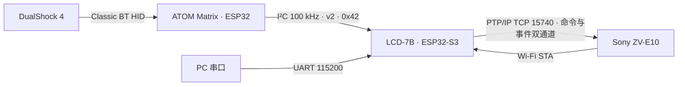
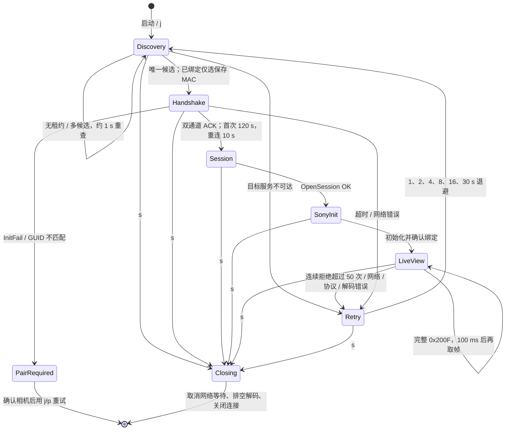

# 当前系统架构

本文按 2026-10-03 工作区源码描述模块、任务、协议与持久化。代码接入不代表实机验收通过，验证证据及剩余需求见 [实施状态](../development/implementation-status.md)。后续目标接口见 [Sony PTP/IP 分层设计](sony-ptpip-design.md)。

## 1. 系统组成

LCD 工程位于根目录，ATOM 独立工程位于 `m5_atom_matrix/`。LCD 不启用触摸；ATOM 当前仅支持经典蓝牙 DS4，BLE Xbox 兼容手柄与云台尚未实现。左摇杆不上报 LCD，L3 从实时位图和缓存事件中清除。引脚、时序见 [硬件配置](hardware-design.md)。

## 2. 软件模块

### LCD 端

| 模块 / 文件 | 当前职责 |
| --- | --- |
| `main/app_main.c` | NVS / 配置 / 显示及任务启动后返回；health 每 10 秒记录内存并处理显示耗尽重启 |
| `main/wifi_config.*`、`wifi_apply.*` | 纯 C 默认值、字段校验、100 字节记录、随机密码、保存与驱动重启 / 回滚策略 |
| `main/wifi_ap.*`、`factory_reset.*` | AP / DHCP / 目标 RSSI、NVS、异步配置队列；全部重置前停止并保留相机维护占用，成功后重启 |
| `main/wifi_menu.*`、`wifi_menu_ui.*` | 热点草稿、SSID 编辑、二次确认及异步结果；相机离线时也可导航 |
| `main/camera_identity.*`、`camera_link.*` | GUID / peer 读取、迁移、确认、清除；唯一候选选择及退避 |
| `main/camera_controller.c`、`camera_pair.h` | socket 所有者、双通道握手、Sony 初始化、取景生产、属性刷新、控制执行及维护占用 |
| `main/gamepad_input.*`、`camera_actions.*` | 输入边沿、扳机迟滞、按键映射、方向键重复；高优先级动作缓存及独立释放屏障 |
| `main/setting_control.*`、`camera_menu.*` | Mode 与七项参数的目标合并、回读确认、拒绝及超时；Focus 菜单与 X 共用状态 |
| `main/atom_link.*`、`common/atom_client.*` | I²C v2 主机收发、HELLO / POLL、重试、事件确认、boot_id / gap 及输入清理 |
| `main/camera_console.*`、`wifi_console.*`、`common/debug_args.*` | LCD 按行串口、兼容单字符命令、Wi-Fi 命令及恢复出厂确认 |
| `main/liveview_pipeline.*` | 取景对象 JPEG 边界检查、双槽上下文、解码工作任务和帧统计 |
| `components/ptpip/` | 可取消 socket 传输、事务期限、数据 / 响应校验、Probe 与事件消费、DeviceInfo 解析 |
| `components/sony_camera/` | 完整属性描述顺序遍历、标量 / 能力解析及 Sony 控制写入 |
| `components/board_7b/` | LCD / I²C 初始化、board_lcd 帧同步 / 恢复、JPEG 解码、参数保存与绘制；`ui_fonts` 管理字体缓存 |
| `common/atom_protocol.*` | 两端共用的 CRC8、编解码与请求接收重同步 |

`main/focus_input.*` 仍有主机回归，但已不在 LCD 的 `main/CMakeLists.txt` 中；运行时输入由 `gamepad_input` 处理。`camera_model`、`ui_presenter` 和通用 `display` 接口仍为目标设计。`board_7b` 尚未完成硬件、界面与相机领域模型的分离。

### ATOM 端

| 模块 / 文件（`m5_atom_matrix/main/`） | 当前职责 |
| --- | --- |
| `app_main.c` | 板载按键非阻塞去抖（30 ms）、累计次数与 DS4 日志 |
| `ds4_host.*`、`ds4_report.*` | 扫描 / 连接 / 保存手柄地址、线程安全快照、纯 C HID 报告解析 |
| `ds4_events.*` | 128 项按键变化缓存，清除本地 L3、去重、事件 ID 确认及溢出 gap |
| `atom_i2c.*`、`atom_slave_tx.*` | 新版 I²C 从机 ISR 收包、独立解析任务；ESP-IDF 5.5.1 专用软件缓冲 / FIFO 响应替换 |
| `matrix_status.*`、`matrix_model.*` | 独立 RMT 渲染、纯 C 启动 / 连接 / 故障状态模型、异步 HID 超时与 LED 恢复 |

灯阵由 ATOM 状态任务独占，LCD 不发送 RGB 命令，板载按键不再切换颜色。物理映射和视觉效果仍待实机验收。

## 3. 启动顺序

LCD 的 `app_main` 按以下顺序执行：

1. `nvs_flash_init()`；失败记录错误、保留 NVS，继续使用默认热点配置。
2. `wifi_ap_load_config()` / `wifi_ap_get_config()`，从 NVS 加载配置。
3. `board_7b_init()`、`board_7b_set_wifi_info()`，按密码显示开关绘制连接页；堆完整性检查。
4. `wifi_menu_ui_start()` / `ui_preferences_start()`，先建立 UI 输入队列并加载显示偏好。
5. `atom_link_start()`，复用板级 `I2C_NUM_0` 总线。
6. `wifi_ap_start()`，启动热点及配置工作任务。
7. `maint_mode_start()` / `camera_pair_console_init()`，创建维护控制任务、单槽 MF 请求队列及行控制台。
8. `camera_jpeg_start()`；创建内部 RAM 的 health 任务，app_main 返回释放初始化大栈。

ATOM：`matrix_status_init()` → 按键 GPIO → `atom_i2c_start()` → 存储启动阶段 → `ds4_host_init()` → `atom_i2c_ready()` → 10 ms 主循环。HID 初始化结果由异步回调提交灯阵模型。LCD 保持 ATOM 先于 Wi-Fi 的启动次序，相关实机问题见 [Wi-Fi 记录](../records/wifi-test-20261002.md)。

## 4. 任务与核心

### LCD 端

| 任务 | 核心 | 优先级 | 栈 | 生命周期 / 职责 |
| --- | --- | --- | --- | --- |
| `main` | 默认 | 默认 | 32KiB（默认配置） | 初始化结束后返回 / 删除，释放字体初始化栈 |
| `health` | 不限 | 2 | 4096 字节，内部 RAM | 常驻；内存日志、显示耗尽后的排空 / 软重启 |
| `maint_ctl` | 不限 | 2 | 3072 字节，内部 RAM | 常驻；维护异步启停、超时与相机 lease |
| `httpd` | 不限 | 3 | 6144 字节，内部 RAM | 仅维护开启时存在；认证 / 网页 / 设备信息 |
| `camera_pair` | 0 | 4 | 32KiB，PSRAM | `j` / `p` 创建、结束删除；socket 及相机控制唯一所有者 |
| `jpeg_decode` | 1 | 4 | 32KiB，PSRAM | 每个取景会话创建、排空删除；解码及发布 JPEG |
| `lcd_status` | 1 | 2 | 32KiB，PSRAM | 常驻；异步绘制连接屏，显示锁保护恢复与字体缓存；不阻塞输入 / NVS 工作任务 |
| `camera_nvs` | 不限 | 4 | 4096 字节，内部 RAM | 临时身份读取 / 保存；相机任务等待完成 |
| `atom_link` | 不限 | 4 | 3072 字节 | 常驻；在线轮询周期约 50 ms |
| `debug_console` | 不限 | 2 | 4096 字节，内部 RAM | 两端常驻；最多 255 字节行输入，Enter 执行，状态 / 日志 / 请求号 |
| `wifi_menu` | 不限 | 2 | 4096 字节 | 常驻；热点菜单输入与完成结果 |
| `wifi_config` | 不限 | 2 | 4096 字节 | 常驻；NVS / 热点重启、2 秒客户端更新及 10 秒客户端日志 |

Wi-Fi、lwIP、esp_timer 等由 ESP-IDF 管理。大栈位于 PSRAM；Flash 写入由内部栈工作任务执行。

### ATOM 端

| 任务 | 核心 | 优先级 | 栈 | 职责 |
| --- | --- | --- | --- | --- |
| `main` | 默认 | 默认 | 默认 | 每 10 ms 采样按键及输出 DS4 日志，不执行 I²C 收发或灯阵渲染 |
| `atom_i2c` | 0 | `configMAX_PRIORITIES - 1` | 3072 字节 | 接收队列解析、请求重同步及响应替换 |
| `matrix_render` | 1 | 2 | 3072 字节 | 125 ms 状态循环，独占 RMT |
| `ds4_connect` | 不限 | 4 | 4096 字节 | 扫描 / 重连及手柄地址保存 |
| `debug_console` | 不限 | 2 | 4096 字节 | UART 行命令与异步终态输出 |
| `pad_player` | 不限 | 3 | 3072 字节 | 开发模拟动作，四项队列、10ms 检查绝对截止；生产可关闭 |

Bluedroid / HID Host 回调只提交快照、事件缓存和状态。

## 5. 队列与同步

| 对象 | 形式 | 所有权 / 作用 |
| --- | --- | --- |
| `free_slots` / `ready` | 两个深度 2 的 FreeRTOS 队列 | `camera_pair` 与 `jpeg_decode` 交接槽；结束项 `slot=-1` |
| `done` | 二值信号量 | 解码任务排空后才允许释放流水线 |
| `camera_actions` | 纯 C，32 项缓存 + 独立释放屏障 | 输入投递，socket 所有者执行；`controls_mux` 保护、generation 拒绝旧动作 |
| `mode_steps`、`focus_mode_steps`、`menu_steps[7]` | 原子步数 | 输入任务累加，相机任务消费；最终目标保存在 `setting_control` / `camera_menu` |
| `focus_requests` | 深度 1 的队列 | MF 请求覆盖旧请求，执行前校验能力、取消代数、generation 与有效期 |
| 热点配置请求 | 深度 2 队列，8 槽结果记录 | 复制配置、token 查询完成；只淘汰已完成结果 |
| 热点菜单输入 | 深度 16 队列 | `atom_link` → `wifi_menu`；缺口 / 断开取消草稿 |
| ATOM 收包 | 深度 8 队列 | 从机 ISR → `atom_i2c` 任务；溢出丢弃不完整请求 |
| `display_mutex`、`frame_done` | 互斥量、计数信号量 | 显示、字体与帧缓冲互斥；发布后等待两次帧完成，单次等待上限 1 秒 |
| 运行状态及 UI 元数据 | 原子变量 / 短临界区复制 | 参数、电量、热点文本、菜单状态与连接代数 |

曝光 Mode 不再使用深度 32 的 `mode_requests` 队列。输入任务不操作相机 socket，也不执行 NVS 写入。维护占用阻止新相机请求，等待旧 socket 所有者与解码任务退出；全部重置成功后保留占用直到设备重启。

## 6. 缓冲区与所有权

| 缓冲 | 位置 / 大小 | 所有者 |
| --- | --- | --- |
| 取景对象槽 ×2 | PSRAM，各 1MiB | 队列交接，单槽同一时刻仅属于生产或解码任务；属性读取仍复用空闲槽 |
| LCD 帧缓冲 ×2 | PSRAM，各 1024×600×2 字节 | `board_7b`；前台扫描、后台解码绘制 |
| DMA bounce buffer ×2 | 内部 RAM，各 30 行 | LCD 驱动，合计约 120KiB |
| TJpgDec 工作区 | PSRAM，4KiB | `board_7b` |
| `esp_new_jpeg` 解码器，最多一个 | 堆 | 全尺寸或 768×432 缩放，切换路径先释放未使用实例 |
| 字形缓存 | PSRAM | `ui_fonts`，显示锁内访问，见 [字体说明](../../components/board_7b/fonts/README.md) |

每帧先处理事件、释放动作及必要的属性 / 参数事务，再读取 `0x1009` 到空闲槽并交给 CPU1 解码。CPU1 发布帧后归还槽，因此网络接收与显示可以重叠。

## 7. 相机连接状态机

select 每最多 100 ms 检查停止，事务使用绝对期限；中断数据阶段不再发送控制事务。`p` 共用初始化路径并验证同身份重连，完成后退出，不进入连续取景。停止时保留最后画面；一般故障返回连接页。连接实测范围见 [2026-10-01 记录](../records/connection-test-20261001.md)，完整故障注入与停止时延指标仍需验收。

## 8. 显示与控制

| 画面 | 当前内容 |
| --- | --- |
| 连接页 | 标题、SSID、按开关处理的密码、动态 IP、ATOM / DS4 / 云台状态及连接阶段；云台当前为禁用 / 未连接 |
| LIVE | 1024×576 取景、右上角八行状态（含相机电量与对焦模式）、左上角录像计时及底部控制状态 |
| SETTINGS | 768×432 缩略图、右侧 16 行（含七项参数与 WI-FI 入口）、下方九项扩展参数、目标与终态 |
| 热点菜单 | SETTINGS 右栏显示 SSID、密码、随机密码、信道、显示开关、应用、两级重置及返回 |
| 显示失效 | 失去同步后停止帧缓冲写入；优先复用缓冲重启 RGB / GDMA，驱动错误才删除 / 重建面板；重置解码器，三次失败后排空相机并软重启 |

Start 或串口 `S` 切换设置偏好，相机离线时也能导航热点页。Y 切下一曝光 Mode，X 切下一 Focus，L1 / R1 为 Wide / Tele；确认非电动变焦镜头且 MF 才启用近 / 远对焦替代，当前用户确认电动变焦镜头，替代分支不启用。LT / RT 驱动 S1、录像目标及 S2；相机动作和菜单视觉仍待验收，见 [手柄手册](../user-guide/controller.md)。

## 9. 协议版本

| 链路 | 当前版本 / 帧长 | 说明 |
| --- | --- | --- |
| LCD ↔ ATOM | v2；请求 9 字节，HELLO 成功响应 19 字节，POLL 35 字节，错误响应 7 字节 | CRC-8/SMBUS、boot_id、ack_id、gap；不兼容 v1，两端同时升级 |
| PTP/IP | `0x00010000` | 设备名 `ESP32-Camera-Remote` |
| Sony 扩展 | 300（3.00） | `0x9202(300)` |

ATOM 在线 POLL 周期 50 ms，写后等待 15 ms；失败保持 seq / ack 重试，连续三次失败才离线；离线每秒探测，版本不匹配每 5 秒重试。重启重新 HELLO，重连先丢弃旧缓存，gap 只同步位图并取消旧操作。完整协议见 [I²C v2 设计](i2c-protocol-design.md)，15 ms 响应上限与长期稳定性仍需实测。

## 10. 持久化

| 设备 | 命名空间 / 键 | 内容 |
| --- | --- | --- |
| LCD | `sony_remote/guid` | 16 字节 PTP/IP 身份，首次生成 |
| LCD | `sony_remote/peer` | 成功 Sony 初始化后保存的相机 MAC[6] + GUID[16] |
| LCD | `wifi_ap/cfg` | 100 字节应用记录：SSID、密码、信道、密码显示开关；Wi-Fi 驱动仍用 RAM |
| ATOM | `ds4_host/peer` | 上次手柄地址；蓝牙绑定由蓝牙栈保存 |

默认热点为 `easycamctrl` / `00000000` / 信道 6 / 显示密码；保存配置优先。只重置热点会删除 `wifi_ap/cfg`，相机身份保留；全部重置另清除 `sony_remote` 并重启 LCD，不清除 ATOM 的手柄绑定。相关操作见 [串口手册](../user-guide/serial.md)。

LCD 分区为 `nvs` 0x9000（24KiB）、`phy_init` 0xF000、`factory` 0x10000（12MiB）、`data` SPIFFS 0xC10000（0x3F0000，当前未使用），没有 OTA 分区。NVS 初始化失败保留内容并降级运行，NVS 分区修复仍未实现。
