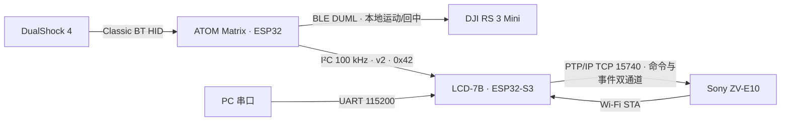
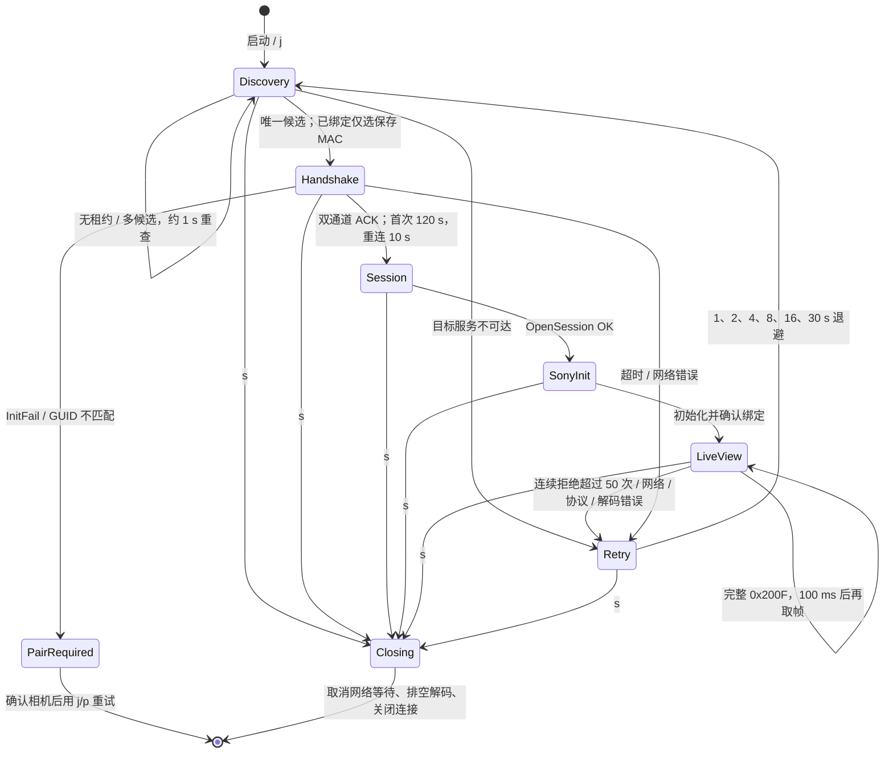

# 当前系统架构

[English](../en/design/architecture-design.md) · **简体中文** · [日本語](../ja/design/architecture-design.md)

本文按2026-10-10源码描述架构，保留2026-10-06拆分后的owner边界，增加ATOM本地RS 3 Mini。软件实现与硬件验证见 [当前状态](../development/current-status.md)；后续目标接口见 [Sony PTP/IP设计](sony-ptpip-design.md)。

当前实际编译依赖（含 post-project HTTP bind 边）和运行关系见 [模块关系图](module-dependency-graph.md)。任务、队列、缓冲和停止约束的逐个 owner 核对见 [资源所有权表](module-resource-ownership.md)。

## 1. 系统组成

LCD 工程位于根目录，ATOM 独立工程位于 `m5_atom_matrix/`。LCD 不启用触摸；ATOM包含经典蓝牙DS4与BLE手柄客户端/Ultimate 2报告解析；具体已测设备范围见实施状态，不保证全部Xbox兼容手柄。云台真实控制仍待实现。左摇杆不上报 LCD，L3 从实时位图和缓存事件中清除。引脚、时序见 [硬件配置](hardware-design.md)。

## 2. 软件模块

### LCD 端

| 模块 | 当前职责与边界 |
| --- | --- |
| `main/app_main.c` | 仅调用 `app_core_start()`，检查启动错误；无服务实现或兼容转发 |
| `app_core` | 唯一组合根：NVS 初始化、Wi-Fi 对象、启动屏障、模式竞争、生命周期、停止顺序、维护存储回调、OTA 健康确认及重启；公共头只提供版本与 start |
| `app_console` | typed message router、endpoint/订阅、request/reply、readonly lease；UART gateway 读取与编码，不依赖功能模块实现 |
| `app_wifi` / `wifi_esp32` / `app_wifi_messages` | 通用网络对象；ESP32 AP/NVS/配置 jobs；正常发现/RSSI/两 TCP lane 消息桥。保存配置仅维护 Web 修改，正常 UART 只查询 |
| `app_maintenance` | 启动页端口80 trigger、无认证维护 Web、配置/偏好/工厂恢复/OTA/退出；只经注入 ops 请求 Core 独占与重启，无 Camera/UI/Input/Console 实现依赖 |
| `common_runtime` | 共享纯值逻辑、Wi-Fi config 编码、I²C 结果格式、ui_prefs 与 camera identity NVS primitives；正常偏好启动读取，配对确认保留内部 RAM worker |
| `app_input` | report 仲裁、来源 epoch、边沿/迟滞/释放屏障、按键映射；仅以 typed Camera/UI 消息执行业务 |
| `app_input_atom` / `atom_protocol` | 独占物理 I²C device/monitor；原始 report 经 provider API 提交 Input。同步 prepare 不启动 worker；协议纯逻辑由两端共享 |
| `app_input_sim` | Debug 独立模拟 provider/player；UART 只发 message。Release 保留空组件注册，无实现编译源和符号 |
| `app_camera` | 唯一 backend owner、身份/发现/连接、设置状态机、动作缓存、双 JPEG 槽及端点；运行时请求/状态通过消息，public 生命周期仅 Core 调用 |
| `camera_backend` / `camera_backend_sony` | 通用纯 C ops 契约；私有 Sony factory、属性/能力/控制/取景编码，内嵌唯一 PTP client |
| `ptpip` | 实例化 session/transaction/deadline/cancel；仅 typed Wi-Fi channel request/reply，无裸 socket、lwIP 或 Wi-Fi 实现依赖 |
| `app_ui` | 私有 model、连接/设置页、JPEG 解码/overlay、字体、Debug benchmark；唯一普通画布使用者。偏好正常只读；维护排空后清空 model 并固定 `MAINTENANCE` |
| `display_surface` / `board_7b` | 唯一写 lease/generation；板级 I²C、电源、RGB/GDMA 双帧缓冲与恢复。硬件头 private，其他功能模块不可绕过 UI |

原主机逻辑及退休 API 的回归辅助代码保存在 `tests/support/legacy/`，不编入固件。Console→ATOM 的旧共享 formatter 引用已迁 common_runtime；真实依赖与静态库符号检查覆盖直接调用边，间接 callback/ops 仍需结合源码和实机验证。实施与未验收项目见 [拆分进度](../development/module-split-status.md) 与 [验收清单](../development/module-split-checklist.md)。

### ATOM 端

| 模块 / 文件（`m5_atom_matrix/main/`） | 当前职责 |
| --- | --- |
| `app_main.c` | 板载按键非阻塞去抖（30 ms）、累计次数与 DS4 日志 |
| `ds4_host.*`、`ds4_report.*` | 扫描 / 连接 / 保存手柄地址、线程安全快照、纯 C HID 报告解析 |
| `ds4_events.*` | 128 项按键变化缓存，清除本地 L3、去重、事件 ID 确认及溢出 gap |
| `ble_clients.*`、`ble_gamepad.*` | 共用BLE回调与扫描owner，BLE HID/标准电量/限定Ultimate 2报告 |
| `gimbal_link.*`、`gimbal_control.*`、`gimbal_proto_rs3.*`、`gimbal_tx.*` | 独立云台BLE生命周期/NVS、真实DS4控制、DUML重组/严格遥测、写入和停止保留槽；不经过LCD |
| `atom_i2c.*`、`atom_slave_tx.*` | 新版 I²C 从机 ISR 收包、独立解析任务；ESP-IDF 5.5.1 专用软件缓冲 / FIFO 响应替换 |
| `matrix_status.*`、`matrix_model.*` | 独立 RMT 渲染、纯 C 启动 / 连接 / 故障状态模型、异步 HID 超时与 LED 恢复 |

灯阵由 ATOM 状态任务独占，LCD 不发送 RGB 命令，板载按键不再切换颜色。物理映射和视觉效果仍待实机验收。

## 3. 启动顺序

LCD 的 `app_main` 只调用 `app_core_start()`，Core 的当前顺序为：

1. 初始化 NVS（失败保留内容），创建并绑定 Wi-Fi 对象，读取保存配置。
2. 初始化 UI 连接页，设置网络信息并检查堆。
3. `app_core_input_providers_prepare()` 同步添加板级 I²C 总线上的 ATOM 设备；此时没有 provider task、endpoint 或 Input 注册。
4. `app_core_wifi_start()` 启动 AP/配置 owner；初始化独立维护服务并开放启动页端口 80 trigger。
5. 仅在模式仍为 STARTUP 时，依次启动 router/System/UI/Input、正常网络 bridge、ATOM/Debug SIM provider、Camera/UART。每个阶段之间重新检查模式；已在执行的创建调用由 boot 屏障保护，直到返回后才能关闭资源。
6. 现有 endpoints 注册完成后冻结订阅；正常启动必须有 UART，UART 创建失败时 producer 不启动并返回错误。提前维护 claim 可跳过普通 endpoints，无需冻结。标记 OTA startup，创建原内部 RAM health task，释放 boot 屏障，初始化调用返回。

启动页 HTTP 可先竞争为 ACTIVATING；exclusive 等待 boot 屏障后才关闭、排空正常 owners，再清空 UI model、发布唯一 MAINTENANCE 画面并激活维护。等待超时或初始化错误转 RESTART，不能恢复正常。初始化错误释放屏障后先关闭 HTTP，再尝试正常 owner 排空；返回原错误，由 app_main fatal 处理，失败排空的资源保留到重启。局部 UI/Input 组合失败先排空 IPU 再停止 router，详见 [初始化失败记录](../records/module-startup-failure-20261006.md)。

ATOM 固件启动顺序保持 `matrix_status_init()` → 按键 GPIO → `atom_i2c_start()` → 存储 → `ds4_host_init()` → `atom_i2c_ready()` → 10 ms 主循环。LCD 的 I²C 设备准备仍在 AP 前，正常 ATOM task 已移至 trigger 后；这种调整尚未经过真实 I²C/AP 启动与 cache-off 验证，不能沿用旧实机安全结论。旧问题见 [Wi-Fi 记录](../records/wifi-test-20261002.md)，当前源码/主机/构建证据见 [启动顺序整理](../records/module-startup-order-20261006.md)。

## 4. 任务与核心

### LCD 端

任务的 CPU、优先级、栈、创建/停止位置及保留资源统一列在 [资源所有权表](module-resource-ownership.md)，避免维护两份不同的数值表。当前任务包括 Core health、Console router/UART、Input、ATOM/Debug SIM、Camera producer/endpoint/临时 identity、UI endpoint/connection refresh/Debug benchmark、Wi-Fi bridge/两 TCP lane/config、维护 HTTP。

初始化 main 栈为32768字节，返回后由 SDK 回收。Camera producer 和 UI drawing/endpoint 大栈位于 PSRAM；NVS 操作使用内部 RAM worker 或内部 HTTP 栈。health 常驻；正常模式停止 trigger HTTP，独占维护停止正常 owners 并保留 AP。不存在旧 maint_ctl、Wi-Fi 菜单/偏好 worker 或单独 JPEG decode task。Wi-Fi、lwIP、esp_timer 等基础任务由 SDK 管理。

### ATOM 端

| 任务 | 核心 | 优先级 | 栈 | 职责 |
| --- | --- | --- | --- | --- |
| `main` | 默认 | 默认 | 默认 | 每 10 ms 采样按键及输出 DS4 日志，不执行 I²C 收发或灯阵渲染 |
| `atom_i2c` | 0 | `configMAX_PRIORITIES - 1` | 3072 字节 | 接收队列解析、请求重同步及响应替换 |
| `matrix_render` | 1 | 2 | 3072 字节 | 125 ms 状态循环，独占 RMT |
| `ds4_connect` | 不限 | 4 | 4096 字节 | 扫描 / 重连及手柄地址保存 |
| `debug_console` | 不限 | 2 | 4096 字节 | UART 行命令与异步终态输出 |
| `pad_player` | 不限 | 3 | 3072 字节 | 开发模拟动作，四项队列、10ms 检查绝对截止；生产可关闭 |

Bluedroid / HID Host 回调只提交快照、事件缓存和状态。

## 5. 队列与同步

Console 提供有界 control/bulk inbox、16 request waiters 和32 readonly lease slots；每个 endpoint 的容量及成功停止后保留对象见 [资源表](module-resource-ownership.md)。消息带 request/correlation、绝对 deadline、generation/epoch，迟到结果不能改变新会话。取消需要 owner 确认，停止不强制回收仍在使用的 lease。

Input 使用静态16 report ring及各 provider disconnect 通知；正常关闭先完整 release，Camera/Router 保留到 release 完成。Camera 控制缓存与独立释放屏障、目标合并和 focus queue 属于 Camera owner；Wi-Fi 两 TCP lane 各自独占 channel 和 jobs/control queues。配置 queue2/results8 属于 Wi-Fi backend，维护可重启该 owner；它不恢复普通业务模式。

独占维护关闭 admission 后按依赖排空 UART/Input/providers/benchmark、Camera physical/endpoint、正常网络、UI endpoint/renderer，最后 System/router。初始化失败和停止失败保留资源并进入重启；单项1000/3000ms预算不构成全流程统一时限，SDK HTTP stop 同步 join 没有项目层严格有界保证。

## 6. 缓冲区与所有权

Camera 开机预分配两个512KiB PSRAM槽以 readonly JPEG lease交给 UI，经 Console 转发；最后引用及 completion metadata都归还后才可复用。UI 在 CPU1 的 endpoint 解码、获取唯一 surface lease、绘制 overlay及refresh，成功/坏帧/丢帧/停止都须归还 JPEG引用，停止等待真实使用者退出。

board 管理两个1024×600 RGB565 PSRAM frame buffers与10行内部bounce buffers（两块共40960字节）；surface区分扫描/绘制和generation，不引入第三全屏copy。UI decoder/TJpgDec工作区和字体cache所有权详见 [资源表](module-resource-ownership.md)。固定维护画面需要保留面板、字体及显示同步对象；normal model清空并冻结，不能把维护切换描述成释放所有内存。

## 7. 相机连接状态机

select 每最多 100 ms 检查停止，事务使用绝对期限；中断数据阶段不再发送控制事务。`p` 共用初始化路径并验证同身份重连，完成后退出，不进入连续取景。停止时保留最后画面；一般故障返回连接页。连接实测范围见 [2026-10-01 记录](../records/connection-test-20261001.md)，完整故障注入与停止时延指标仍需验收。

## 8. 显示与控制

| 画面 | 当前内容 |
| --- | --- |
| 连接页 | 标题、SSID、按开关处理的密码、动态 IP、ATOM / DS4 / 云台状态及连接阶段；云台当前为禁用 / 未连接 |
| LIVE | 1024×576 取景、右上角八行状态（含相机电量与对焦模式）、左上角录像计时及底部控制状态 |
| SETTINGS | 768×432 缩略图、右侧17行/9项导航（七项参数、Wi-Fi信息、MORE）、下方九项扩展参数、目标与终态 |
| MAINTENANCE | 排空普通业务、清空 model 后仅黑底白字固定 `MAINTENANCE`；其他绘制请求永久拒绝 |
| 显示失效 | 失去同步后停止帧缓冲写入；优先复用缓冲重启 RGB / GDMA，驱动错误才删除 / 重建面板；重置解码器，三次失败后排空相机并软重启 |

Start 或串口 `S` 切换设置偏好，Wi-Fi信息只读，热点修改、偏好保存与恢复出厂通过启动页维护 Web 完成。Y 切下一曝光 Mode，X 切下一 Focus，L1 / R1 为 Wide / Tele；确认非电动变焦镜头且 MF 才启用近 / 远对焦替代，当前用户确认电动变焦镜头，替代分支不启用。RT 半压驱动 S1、全压驱动 S2；LT 半压无动作，全压请求录像目标；相机动作和菜单视觉仍待验收，见 [手柄手册](../user-guide/controller.md)。

## 9. 协议版本

| 链路 | 当前版本 / 帧长 | 说明 |
| --- | --- | --- |
| LCD ↔ ATOM | v2；请求 9 字节，HELLO 成功响应 19 字节，POLL 35 字节，错误响应 7 字节 | CRC-8/SMBUS、boot_id、ack_id、gap；不兼容 v1，两端同时升级 |
| PTP/IP | `0x00010000` | 设备名 `ESP32-Camera-Remote` |
| Sony 扩展 | 300（3.00） | `0x9202(300)` |

ATOM 在线 POLL 周期 50 ms，写后等待 15 ms；失败保持 seq / ack 重试，连续三次失败才离线；离线每秒探测，版本不匹配每 5 秒重试。重启重新 HELLO，重连先丢弃旧缓存，gap 只同步位图并取消旧操作。完整协议见 [I²C v2 设计](i2c-protocol-design.md)，15 ms 响应上限与长期稳定性仍需实测。

## 10. 持久化与 OTA

| 设备 | 命名空间 / 键 | 内容与写入所有权 |
| --- | --- | --- |
| LCD | `sony_remote/guid`、`peer` | GUID16字节、MAC6+GUID16配对记录；common_runtime primitive，正常首次身份/配对确认使用 Camera 内部 RAM worker；Web all reset直接清除 |
| LCD | `wifi_ap/cfg` | 100字节SSID/密码/信道/显示开关记录；Wi-Fi backend唯一SDK/NVS owner，Core启动层不主动保存；后端无效blob仍自动修复，国家范围无效值仅RAM回退 |
| LCD | `ui_prefs/schema`、`pad`、`info` | schema1、控制器/信息等级；common_runtime唯一存储，普通启动加载，Web保存或all reset后重启生效 |
| ATOM | `ds4_host/peer` | 上次手柄地址；蓝牙绑定由蓝牙栈保存 |

默认热点 `easycamctrl` / `00000000` / 信道6 / 显示密码。Web Wi-Fi reset保存默认热点；all额外清除Sony配对并重置UI偏好，不清除ATOM绑定。正常UART/LCD没有配置保存、factory或配对清除入口。NVS初始化错误保留内容；原子跨namespace事务不存在，失败可能部分改变记录，证据见 [Web恢复记录](../records/module-web-factory-20261006.md)。

当前 partitions.csv：nvs `0x9000/0x6000`，otadata `0xF000/0x2000`，phy_init `0x11000/0x1000`，ota_0 `0x20000/6MiB`，ota_1 `0x620000/6MiB`，data SPIFFS `0xC20000/0x3E0000`。无 factory app分区。CI限制LCD镜像≤5MiB；OTA只写非当前分区，完整校验后切换，Core对pending镜像进行60秒健康确认，失败进入SDK回退重启。分区/Flash实际更新与OTA实机恢复尚待验证，见 [构建与烧录](../development/build-and-flash.md)。
