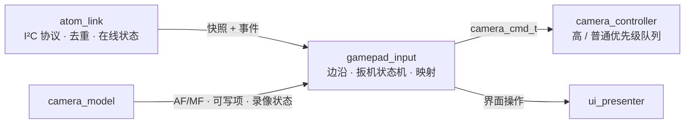
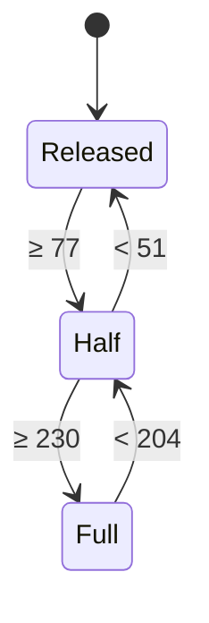

# 手柄输入处理设计

本文是 [手柄控制方案](../request/gamepad-request.md) 在 LCD 端的实现设计：如何把 ATOM 上报的手柄快照和按键事件转换成相机命令和界面操作，并保证拍照、录像、变焦在任何异常下都能安全释放。ATOM 端的云台处理见 [BLE 云台控制设计](gimbal-design.md)，链路协议见 [I²C 通信协议](i2c-protocol-design.md)。

> 部分实现：X/Y 条件对焦通过 `focus_input.c` 接入现有 `atom_link` 和相机任务；完整模块拆分、扳机及其他映射仍是目标设计。重复节奏已实现为 400 ms 后每 150 ms，实际执行速度受相机事务限制，新增功能待实机验收。

## 1. 现状

`main/atom_link.c` 中的 `atom_link_task` 同时负责 I²C 轮询和按键处理：

- 缓存事件到达时，`report_buttons(previous, buttons)` 计算按下边沿；
- L1 / R1 单独按下时调用 `camera_mode_step(∓1)`，写入 `mode_requests` 队列（深度 32），同时按下不处理；
- Options（Start）按下时调用 `board_7b_toggle_settings_mode()`；
- 摇杆、扳机和电池只写日志。

问题：按键处理与链路协议耦合；Mode 请求逐条排队并各自基于旧值计算；没有扳机、变焦等需要“按下必释放”的命令，也就没有统一的安全释放路径。

## 2. 模块划分



| 模块 | 职责 | 不负责 |
| --- | --- | --- |
| `atom_link` | 协议收发、事件确认与去重、`boot_id` / `gap` 处理、ATOM 在线判定 | 按键含义 |
| `gamepad_input` | 按键边沿、扳机档位、组合键互斥、按界面模式映射为动作、限速与合并、安全释放 | I²C、PTP/IP |
| `camera_controller` | 执行相机命令，见 [Sony PTP/IP 客户端分层设计](sony-ptpip-design.md#93-camera_controller状态机重连与命令) | 按键 |
| `ui_presenter` | 界面模式、菜单光标、对焦框绘制，见 [界面设计](ui-design.md) | 相机协议 |

`gamepad_input` 运行在 `atom_link` 任务上下文中，每次轮询（约 50 ms）调用一次；它不阻塞，命令投递失败时记录日志并丢弃。

## 3. 接口

```c
typedef struct {
    bool     connected;          /* DS4 link_state == 已连接 */
    uint32_t buttons;            /* 实时位图，已清除 local_mask */
    int8_t   rx, ry;
    uint8_t  l2, r2;
    uint8_t  battery;            /* 0–10，255 不可用 */
} gamepad_snapshot_t;

typedef struct {
    uint32_t buttons;            /* 事件发生后的位图 */
    bool     gap;                /* 之前有事件丢失，只同步不生成边沿 */
} gamepad_event_t;

void gamepad_input_on_online(const gamepad_snapshot_t *first);   /* 进入 ONLINE 或 boot_id 变化 */
void gamepad_input_on_event(const gamepad_event_t *event);
void gamepad_input_on_snapshot(const gamepad_snapshot_t *snapshot, TickType_t now);
void gamepad_input_on_offline(void);                             /* ATOM 离线或 DS4 断开 */
void gamepad_input_on_camera_session(bool open);                 /* 相机会话建立 / 关闭 */
```

## 4. 按键边沿

- 一次性操作（Start、LB/RB、Select、X/Y 的放大或信息显示、R3）只由**事件**触发，比较事件位图与上一次事件位图得到按下边沿。方向键及 X/Y 手动对焦的首步也由事件触发，快照只维持按住重复和检测释放，不重新生成首步。
- `gap = 1` 的事件和 `on_online` 只同步 `event_buttons`，不生成边沿。
- 互斥键同时按下时忽略：LB+RB、方向键上+下、左+右。
- 实时快照只用于扳机、右摇杆、状态显示和日志，不生成按键边沿。

## 5. 扳机状态机

LT、RT 各一个状态机，输入为 0–255 模拟量，阈值换算如下：

| 档位 | 进入 | 退出 |
| --- | --- | --- |
| 半压 | ≥ 77（30%） | < 51（20%）回到松开 |
| 全压 | ≥ 230（90%） | < 204（80%）回到半压 |



**解锁条件**：DS4 连接、ATOM 重新上线或相机会话建立后，`armed = false`；只有观察到 LT、RT 同时处于 Released 后才置 `armed = true`。未解锁时状态机照常更新，但不产生任何相机命令。

**输出合成**（每次快照后计算，只在变化时发送）：

| 输出 | 规则 |
| --- | --- |
| `S1` | `LT ≥ Half 或 RT ≥ Half` |
| `S2` | `RT == Full` |
| 录像目标 | LT 从非 Full 进入 Full 的边沿，按相机确认状态请求开始或停止；状态未知或请求待确认时不发送 |

发送顺序约束：S1 按下先于 S2 按下；S2 释放先于 S1 释放。同一快照内同时变化时按此顺序投递。

## 6. 其他动作

| 输入 | 处理 |
| --- | --- |
| LB / RB | 投递 `MODE_STEP ±1`，由控制器合并为目标值 |
| A / B | 按下边沿投递 `ZOOM_START(±)`；松开投递 `ZOOM_STOP`。A+B 同时按下立即 `ZOOM_STOP`，并锁定到两键都松开 |
| Select | 仅当 `camera_model` 报告 MF 时切换对焦框开关 |
| 右摇杆 | 对焦框开启时移动绿框：死区 ±12，速度与偏移量成正比；R3 按下期间不计入 |
| R3 | 对焦框开启时绿框回中 |
| 对焦框提交 | 绿框停止移动（摇杆回到死区或按 R3）后 300 ms 投递 `FOCUS_POINT(x, y)`；位置类命令最多 5 次/秒 |
| X | LIVE+MF+变焦确认不可用时投递 `MF_STEP(NEAR)`；其他 LIVE 条件投递 `MAGNIFY_NEXT` |
| Y | LIVE+MF+变焦确认不可用时投递 `MF_STEP(FAR)`；其他 LIVE 条件循环信息档位 |
| Start | 界面操作：LIVE / SETTINGS 切换；进入 SETTINGS 时投递 `MAGNIFY_OFF` |
| 方向键（SETTINGS） | 上 / 下移动光标；左 / 右投递 `PROP_STEP(code, ±1)`；按住 400 ms 后每 150 ms 重复一次，控制器只保留最新目标 |

X/Y 对焦条件不依赖对焦框开关，且 SETTINGS 无效；“无变焦”使用相机模型的能力状态，不能以当前变焦未运行或单次命令失败判断。未知能力不启用对焦映射。事件到来时锁定本次按压的功能；MF、能力、界面变化时取消本次按压，必须松开再按才接受新功能。

对焦首步由事件触发，按住 400 ms 后每 150 ms 产生一个步进。X+Y 同按取消重复并锁定到两键松开。控制器最多保留一个未执行 MF 步进，重复输入不积压也不累加成大步；步进请求不是绝对目标值。用户确认正值向近处，Sony 层发送 NEAR=+1、FAR=−1。

协议已确认 `0x9207(0xD2D1)` 的 i16 ±1/±3/±7 样本，用户确认正值向近处；录像目标设计使用 `0x9207(0xD2C8)` u16 2/1 请求开始/停止，并以 `0xD21D` 的已解析状态确认，不能立即发送 1 作为“释放”。S1 的 2/1 及 S2 的 2 已捕获，S2 标准释放和拍照后 `0xD2E6=1` 含义仍待验证。依据见 [抓包分析](../records/protocol-analysis-20261001.md)。

## 7. 命令优先级

```c
typedef enum { CMD_PRIO_HIGH, CMD_PRIO_NORMAL } camera_cmd_prio_t;
```

| 优先级 | 命令 | 规则 |
| --- | --- | --- |
| 高 | S1 / S2 按下与释放、录像切换、`ZOOM_START`、`ZOOM_STOP` | 每帧读取前全部执行；释放类命令永不丢弃 |
| 普通 | `MODE_STEP`、`PROP_STEP`、`FOCUS_POINT`、`MAGNIFY_*`、`MF_STEP` | 每帧最多执行一个；目标类合并为最新目标，MF 步进最多保留一个未执行项 |

## 8. 安全释放

`gamepad_input_release_all(reason)` 在以下情况调用：

- ATOM 离线（连续 3 次事务失败）或 `boot_id` 变化；
- DS4 `link_state` 离开“已连接”；
- 相机会话关闭（之后相机命令无处发送，只清本地状态）；
- `atom_link` 任务重启。

动作：

1. 若当前 S2 按下，投递 S2 释放；若 S1 按下，投递 S1 释放；若正在变焦，投递 `ZOOM_STOP`（相机会话关闭时跳过投递）。
2. 清除扳机状态机、`armed`、对焦框移动中状态和待提交位置，以及 X/Y 对焦重复计时和按压功能锁定。
3. 清除普通优先级队列中尚未执行的命令。
4. 记录日志，包含原因和释放了哪些命令。

重连后不得重放任何旧命令。

## 9. 测试

主机单元测试（纯 C，输入为快照和事件序列，输出为投递的命令序列）：

- 扳机迟滞：在每个阈值附近抖动不产生多余命令。
- LT、RT 交叉按压和交叉释放：S1 只在两者都松开后释放。
- 带压连接：连接时扳机已按下，松开前不产生命令。
- 全压保持再退回半压：S2 释放先于 S1 释放。
- LT 全压边沿：每次进入全压只发一次录像切换。
- `gap` 事件、`on_online`、`boot_id` 变化不产生边沿。
- 每个安全释放触发条件都投递正确的释放命令，并清空普通队列。
- A+B 同时按下立即停止，且两键松开前不再开始变焦。
- 方向键重复节奏与合并。
- X/Y 只在 LIVE+MF+变焦明确不可用时投递对焦；不会同时放大或切换信息档位，能力未知时不启用对焦。
- X/Y 同按、松开、切 AF、能力变化、进入 SETTINGS 和断线均取消重复；条件恢复后旧按压不触发新功能。
- MF 重复不会积压或累加为大步，按用户确认的协议方向检查 X 近/Y 远。
- 录像只发目标对应的 2 或 1；等待状态确认期间重复全压不再次发送，未知状态不猜测。

## 10. 迁移步骤

1. 从 `atom_link.c` 拆出 `gamepad_input.c`，先只迁移现有 Start 和 L1/R1 行为，确认实机一致。
2. 加入扳机状态机和安全释放，相机命令暂时只写日志，主机测试通过。
3. 相机端实现 S1/S2、录像、变焦后接入实际命令。
4. 随 I²C 版本 2 升级，接入 `boot_id`、`gap` 和 `link_state`。
