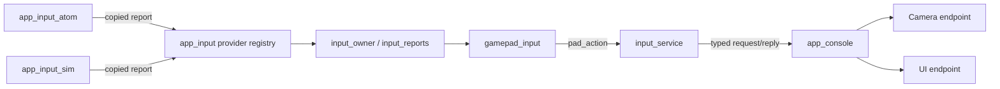
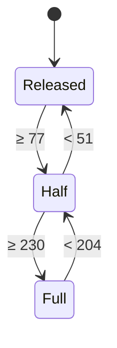

# 手柄输入处理设计

本文是 [手柄控制方案](../request/gamepad-request.md) 在 LCD 端的实现设计：如何把 ATOM 上报的手柄快照和按键事件转换成相机命令和界面操作，并保证拍照、录像、变焦在任何异常下都能安全释放。ATOM 端的云台处理见 [BLE 云台控制设计](gimbal-design.md)，链路协议见 [I²C 通信协议](i2c-protocol-design.md)。

当前输入动作规则保留原纯C状态机，结构按最终 [拆分计划](../../main-module-split-plan.md) 整理。历史烧录和镜头声明有日期范围，不能代表当前完整拆分固件已验收；当前测试证据见 [验收清单](../development/module-split-checklist.md)。

## 1. 当前输入路径

物理app_input_atom与Debug app_input_sim各自独占protocol client，提交复制的normalized report到app_input provider registry；只有input_owner服务解释按键、来源、capabilities和UI状态。真实I²C provider只负责协议/monitor/device，不执行gamepad映射，不调用相机或UI。SIM不停止物理ATOM轮询，仲裁只选一个来源，切换先完整release再baseline。

Input owner内部栈4096/priority4，50ms循环，经Console typed Camera/UI request消费能力并输出动作。普通请求deadline100ms且可取消；安全release需owner确认，失败保留重试并禁止新press。UI菜单结果为只读route/property，Camera动作随后独立消息提交；Wi-Fi只信息、MORE可进入，普通偏好写入与维护入口忽略。所有任务数值和停止依赖见 [资源表](module-resource-ownership.md)。

## 2. 模块划分



| 实现 | 职责 |
| --- | --- |
| input_provider.c | task-safe非阻塞报告复制、固定16槽ring、各provider独立安全disconnect通知、opaque handle |
| input_owner.c | 唯一报告消费者、来源/handle更新、1秒过期backlog拒绝、状态快照 |
| input_reports.c | 来源选择、epoch/id去重、ID回退隔离、安全释放retry及baseline |
| gamepad_input.c | 边沿、扳机迟滞、按键/重复/肩键映射，无协议与业务实现依赖 |
| input_service.c | Camera/UI capabilities与epoch缓存、typed actions、停止join；没有直接Camera/UI门面依赖 |

Camera actions/controls/setting kernels归app_camera；它们不是Input provider的队列。输入私有kernel头不得跨功能component包含，公开provider API是唯一报告入口。

## 3. 接口与生命周期

公开input_provider.h版本1，注册一个source kind得到非零opaque handle；report包含connected/ATOM online/SIM、buttons、rx/ry、lt/rt、电池0..10或255、source_epoch/report_id、gap及独立event_valid/event_buttons。传入值复制，不持有caller pointer。epoch/id非零、每注册生命周期内不wrap；重置ID前增加epoch，provider重启须unregister/register，旧handle不能重新发布。

重复ID、旧epoch拒绝；ID倒退隔离该epoch，直到新epoch恢复。report ring满时返回NO_MEM，丢弃该来源排队报告并安排优先disconnect；其他来源保留。gap/reconnect只同步held基线，不把已按键当新press。来源切换失败release阻塞新按压，直到release/MF_CANCEL确认。

Core先启动router与Input，再启动providers；关闭Input admission并等待完整释放后才停止providers及Camera。Input timeout保留worker和依赖owners，不强删。生命周期与当前规范以真实public header为准，不能用旧atom_link线程上下文推断执行位置。

## 4. 按键边沿

- 一次性操作（Start、X 对焦模式、Y 曝光 Mode；目标中的 Select 和 R3）只由**事件**触发。LB/RB 变焦或对焦首步也只由按下事件触发，快照只维持重复和检测释放，不重新生成首步。
- `gap = 1` 的事件和 `on_online` 只同步 `event_buttons`，不生成边沿。
- 互斥键同时按下时忽略：LB+RB、方向键上+下、左+右。
- 实时快照只用于扳机、右摇杆、状态显示和日志，不生成按键边沿。

## 5. 扳机状态机

LT、RT 各一个状态机，输入为 0–255 模拟量，阈值换算如下：

| 档位 | 进入 | 退出 |
| --- | --- | --- |
| RT 半压 | ≥ 77（30%） | < 51（20%）回到松开 |
| RT 全压 | ≥ 230（90%） | < 204（80%）离开全压 |
| LT 录像全压 | ≥ 230（90%） | < 204（80%）离开全压，LT 不保存半压状态 |

RT 的对焦 / 拍照阶段如下；LT 只有独立的录像全压状态：



**解锁条件**：所选手柄连接、provider重新上线或相机会话建立后，`armed = false`；只有观察到 LT、RT 同时处于 Released 后才置 `armed = true`。未解锁时状态机照常更新，但不产生任何相机命令。

**输出合成**（每次快照后计算，只在变化时发送）：

| 输出 | 规则 |
| --- | --- |
| `S1` | `RT ≥ Half`；LT 半压无动作，LT 按压或松开不改变 S1 |
| `S2` | `RT == Full` |
| 录像目标 | LT 从非 Full 进入 Full 的边沿，按相机确认状态请求开始或停止；状态未知或请求待确认时不发送 |

发送顺序约束：S1 按下先于 S2 按下；S2 释放先于 S1 释放。同一快照内同时变化时按此顺序投递。

## 6. 其他动作

| 输入 | 处理 |
| --- | --- |
| LB / RB | Wide / Tele；确认非电动变焦镜头且 MF 时近 / 远对焦。两键同按立即停止并锁定到均松开 |
| A / B | SETTINGS确认与MORE返回；Wi-Fi只信息，无热点编辑 |
| Select（规划） | 仅当 `camera_model` 报告 MF 时切换对焦框开关 |
| 右摇杆（规划） | 对焦框开启时移动绿框：死区 ±12，速度与偏移量成正比；R3 按下期间不计入 |
| R3（规划） | 对焦框开启时绿框回中 |
| 对焦框提交（规划） | 绿框停止移动（摇杆回到死区或按 R3）后 300 ms 投递 `FOCUS_POINT(x, y)`；位置类命令最多 5 次/秒 |
| X | 取消肩键操作，投递下一对焦模式，等待实际回读；LIVE / SETTINGS 均有效 |
| Y | 投递下一曝光 Mode，等待实际回读；LIVE / SETTINGS 均有效 |
| Start | 切换设置 / 预览偏好；退出放大仍是目标功能，当前未投递 MAGNIFY_OFF |
| 方向键（SETTINGS） | 上 / 下移动光标；左 / 右投递 `PROP_STEP(code, ±1)`；按住 400 ms 后每 150 ms 重复一次，控制器只保留最新目标 |

LB/RB 对焦条件不依赖对焦框开关，LIVE / SETTINGS 相同。必须确认非电动变焦镜头且 MF，数字变焦可用也优先对焦；不能以 ZoomEnableStatus 判断镜头类型。未知类型不启用对焦替代。按下时锁定功能；MF、镜头或能力变化时取消，必须松开再按，界面切换不改变映射。

对焦首步由事件触发，按住 400 ms 后每 150 ms 产生一个步进。LB+RB 同按取消重复并锁定到两键松开。控制器最多保留一个未执行 MF 步进，不积压也不累加；L1=NEAR +1，R1=FAR −1。X 取消当前肩键操作并要求重新松开再按。

协议已确认 `0x9207(0xD2D1)` 的 i16 ±1/±3/±7 样本，用户确认正值向近处；录像目标设计使用 `0x9207(0xD2C8)` u16 2/1 请求开始/停止，并以 `0xD21D` 的已解析状态确认，不能立即发送 1 作为“释放”。S1 的 2/1 及 S2 的 2 已捕获，S2 标准释放和拍照后 `0xD2E6=1` 含义仍待验证。依据见 [抓包分析](../records/protocol-analysis-20261001.md)。

## 7. 命令优先级（目标与当前差异）

当前 `camera_actions` 保存 S1 / S2 / 录像 / 变焦，另有独立释放屏障；Mode / 菜单用原子步数和目标状态，MF 用单槽队列。FOCUS_POINT / MAGNIFY 尚未实现，下表统一优先级接口仍为目标。

```c
typedef enum { CMD_PRIO_HIGH, CMD_PRIO_NORMAL } camera_cmd_prio_t;
```

| 优先级 | 命令 | 规则 |
| --- | --- | --- |
| 高 | S1 / S2 按下与释放、录像切换、`ZOOM_START`、`ZOOM_STOP` | 每帧读取前全部执行；释放类命令永不丢弃 |
| 普通 | `MODE_STEP`、`PROP_STEP`、`FOCUS_POINT`、`MAGNIFY_*`、`MF_STEP` | 每帧最多执行一个；目标类合并为最新目标，MF 步进最多保留一个未执行项 |

## 8. 安全释放

输入模块内部统一释放在以下情况触发：

- ATOM 离线（连续 3 次事务失败）或 `boot_id` 变化；
- DS4 `link_state` 离开“已连接”；
- 相机会话关闭（之后相机命令无处发送，只清本地状态）；
- provider注销/注册、来源切换、报告过期/overflow或Input关闭。

动作：

1. 若当前 S2 按下，投递 S2 释放；若 S1 按下，投递 S1 释放；若正在变焦，投递 `ZOOM_STOP`（相机会话关闭时跳过投递）。
2. 清除扳机状态机、`armed`、LB/RB 对焦重复计时和按压功能锁定；对焦框实现后也需清除待提交位置。
3. 取消当前Input状态机待执行重复/目标；相机队列取消由typed安全动作及generation处理。
4. 记录日志，包含原因和释放了哪些命令。

重连后不得重放任何旧命令。

## 9. 测试

主机单元测试（纯 C，输入为快照和事件序列，输出为投递的命令序列）：

- 扳机迟滞：在每个阈值附近抖动不产生多余命令。
- LT 半压不产生相机命令，全压只请求录像目标，松开不发送 S1。
- LT 仅保存录像全压状态，不参与 RT 的半压 / 全压对焦状态机；达到 230 进入全压、低于 204 离开全压，避免阈值抖动重复触发录像。
- LT、RT 交叉按压和交叉释放：S1 仅跟随 RT，RT 松开即释放；LT 录像及松开不释放仍按住的 RT 对焦。
- 带压连接：连接时扳机已按下，松开前不产生命令。
- 全压保持再退回半压：S2 释放先于 S1 释放。
- LT 全压边沿：每次进入全压只发一次录像切换。
- `gap` 事件、`on_online`、`boot_id` 变化不产生边沿。
- 每个安全释放触发条件都投递正确的释放命令，并清空普通队列。
- LB+RB 同时按下立即停止，且两键松开前不再开始变焦。
- 方向键重复节奏与合并。
- LB/RB 仅在确认非电动变焦镜头且 MF 时对焦，数字变焦可用不改变优先级；镜头未知不启用。
- LB/RB 同按、松开、切 AF、能力变化和断线取消重复；LIVE / SETTINGS 映射一致，旧按压不触发新功能。
- MF 重复不积压或累加为大步，验证 L1 近 / R1 远；X/Y 单击切模式，长按不重复，X 停止肩键。
- 录像只发目标对应的 2 或 1；等待状态确认期间重复全压不再次发送，未知状态不猜测。

## 10. 迁移步骤

1. 已拆出纯 C 输入模块，接入新映射、扳机状态机及安全释放，主机回归通过。
2. 已接入 S1/S2、录像、变焦协议写入与目标确认，待实机验证方向、释放和状态。
3. 补齐可信镜头类型识别，验证非电动变焦镜头 MF 分支，再验收菜单和对焦框。
4. I²C v2 已接入 boot_id、gap 和 link_state；继续验证单端重启、丢事件与链路稳定性。

## Ultimate 2 BLE 接入（2026-10-03）

ATOM 使用独立 GATTC 客户端，以免覆盖 Classic DS4 HID 回调。扫描选择唯一手柄候选，认证和服务发现均完成后验证 HID 服务，标准 Battery Level 仅用于 Matrix 第二行。实机读到 88% 和后续 86%。

`ultimate2_report` 仅接受本机实测的 113 字节报告描述，且服务中必须恰好有一个可通知报告特征；该描述只有 Input ID 1（264 位 / 33 字节），ID 5 是 Output。因此通知数据不含报告 ID，也无需通过长度在多个输入 ID 中猜测。未知描述或多输入特征保持电量功能，拒绝输入控制。描述含四轴、Accelerator / Brake、24 个按钮和 23 字节厂商数据；厂商尾部不用于相机动作。实体 A/B/X/Y 及扳机字母映射仍需按键验证，不能从名称或报告描述推定字母。

共享 `pad_publish` 在显式 SIM 之外优先采用有效 DS4 输入，DS4 离线才采用 BLE；来源切换清缓存并递增 I²C 输入代数，当前持键仅同步为基线。BLE 断连或一秒没有可解析报告时发布离线，LCD 使用既有来源释放 / 重新就绪逻辑。Matrix 第一行读取独立 Classic 状态，不使用聚合输入的电量；LCD 在 BATTERY 下方显示当前手柄电量（DS4 示例 `DS4: 80%`），未知或断连显示 `--`。

### 当前设备声明与来源选择（2026-10-03）

当前镜头类型来自用户确认，并非自动识别。POWER_ZOOM 下 L1/R1 请求 Wide/Tele，即使 ZoomEnableStatus 缺失或为 0 也允许提交，实际执行由相机响应决定；松开、同按、断连、切换来源均停止。更换镜头时需重新确认类型，不能沿用该声明推断新镜头。

维护页 /api/controller 的 type=ds|xbox 保存到 ui_prefs/pad，默认及恢复出厂为 DS。物理ATOM provider发现类型变化先离线释放，随后以 HELLO 参数字节 2 传递类型；ATOM 清空旧事件、增加来源代数并选择 DS4 或 BLE。调试 SIM 显式覆盖该选择，退出后恢复所选来源。

## 2026-10-06 provider边界

ATOM物理I²C与UART本地SIM已分为app_input_atom/app_input_sim；两者独立protocol client及normalized epoch/id，仅publish copied report至app_input。业务gamepad状态机、cap门禁、释放屏障与typed Camera/UI动作只有Input owner一份。本地SIM选择不停止物理ATOM心跳；SRC切换先释放再baseline，新来源held键不能当新press。SIM raw命令/readonly sequence leases经endpoint校验，播放器4jobs/8reserved completion，UART lifetime丢失取消已完成HOLD残留。Core quiesce先关闭Input，之后分别停止provider并归还ATOMdevice，不删除仍有资源未归还的worker。当前主机/编译证据见[provider迁移记录](../records/module-input-providers-20261006.md)，无本次实机时序/稳定性验收。
