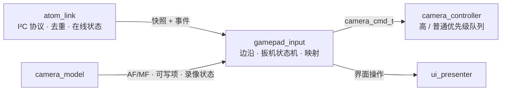
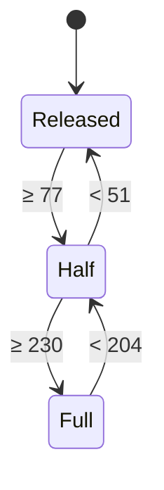

# 手柄输入处理设计

本文是 [手柄控制方案](../request/gamepad-request.md) 在 LCD 端的实现设计：如何把 ATOM 上报的手柄快照和按键事件转换成相机命令和界面操作，并保证拍照、录像、变焦在任何异常下都能安全释放。ATOM 端的云台处理见 [BLE 云台控制设计](gimbal-design.md)，链路协议见 [I²C 通信协议](i2c-protocol-design.md)。

> 工作区已接入 gamepad_input、camera_actions、setting_control 和 camera_menu：Y 曝光 Mode、X 对焦模式、肩键变焦 / 条件 MF、扳机与七项参数菜单；当前统一 28 项主机回归通过。新映射与菜单已有烧录记录；相机效果仍待验收。镜头类型保持未知，MF 替代未启用。两端 I²C v2 已烧录；对焦框与其他未完成项仍为目标设计。菜单细节见 [设置菜单设计](camera-menu-design.md)。

## 1. 现状

`main/atom_link.c` 中的 `atom_link_task` 同时负责 I²C 轮询和按键处理：

- 缓存事件和实时快照交给纯 C 的 `gamepad_input`，`report_buttons` 仅记录日志；
- Y / X 分别投递下一曝光 Mode / 对焦模式，参数目标合并，等待真实属性回读；
- L1 / R1 根据已确认能力投递变焦或 MF 步进，扳机驱动 S1/S2 和录像目标；
- Options（Start）切换界面；电池写入显示状态；右摇杆仍只记录日志。
- SETTINGS 内 A（DS4 叉）确认、B（圈）返回热点页；方向键可在相机离线时导航，拍摄类操作仍需有效相机会话。热点草稿与异步应用见 [热点设计](wifi-ap-design.md#当前请求接口与验证边界2026-10-02)。

高优先级队列容量 32，另有独立释放屏障；会话代数拒绝旧命令，过期或溢出取消待执行项并释放。ATOM 连续三次事务失败才判离线；重连丢弃旧缓存事件并同步当前按键。工作区 v2 已接入 `boot_id`、CRC 和 `gap`；重启重新 HELLO、缺口只同步位图并释放；已有两端烧录和握手记录，高频输入及故障恢复仍待验收。

## 2. 模块划分

以下为目标分层：`ui_presenter` / `camera_model` 尚未建立。当前输入通过 `pad_action_t` 交给 `camera_actions`、参数步数与 `board_7b` / `wifi_menu_ui`；不存在统一的 `camera_cmd_t` 普通命令队列。



| 模块 | 职责 | 不负责 |
| --- | --- | --- |
| `atom_link` | 协议收发、事件确认与去重、`boot_id` / `gap` 处理、ATOM 在线判定 | 按键含义 |
| `gamepad_input` | 按键边沿、扳机档位、组合键互斥、按界面模式映射为动作、限速与合并、安全释放 | I²C、PTP/IP |
| `camera_controller` | 执行相机命令，见 [Sony PTP/IP 客户端分层设计](sony-ptpip-design.md#93-camera_controller状态机重连与命令) | 按键 |
| `ui_presenter` | 界面模式、菜单光标、对焦框绘制，见 [界面设计](ui-design.md) | 相机协议 |

`gamepad_input` 运行在 `atom_link` 任务上下文中，每次轮询（约 50 ms）调用一次；它不阻塞，命令投递失败时触发统一释放并锁定到松开。

## 3. 接口

```c
typedef struct {
    bool     connected;          /* DS4 link_state == 已连接 */
    uint32_t buttons;            /* 实时位图，已清除 local_mask */
    int8_t   rx, ry;
    uint8_t  lt, rt;
    uint8_t  battery;            /* 0–10，255 不可用 */
} gamepad_snapshot_t;

/* gamepad_caps_t 提供已确认 AF/MF、变焦、镜头类型、录像及会话代数。 */
void gamepad_input_init(gamepad_input_t *, pad_action_fn, void *context);
void gamepad_input_online(gamepad_input_t *, const gamepad_snapshot_t *, const gamepad_caps_t *);
void gamepad_input_event(gamepad_input_t *, uint32_t buttons, bool gap,
                         const gamepad_caps_t *, uint32_t now_ms);
void gamepad_input_snapshot(gamepad_input_t *, const gamepad_snapshot_t *,
                            const gamepad_caps_t *, uint32_t now_ms);
void gamepad_input_offline(gamepad_input_t *);
```

## 4. 按键边沿

- 一次性操作（Start、X 对焦模式、Y 曝光 Mode；目标中的 Select 和 R3）只由**事件**触发。LB/RB 变焦或对焦首步也只由按下事件触发，快照只维持重复和检测释放，不重新生成首步。
- `gap = 1` 的事件和 `on_online` 只同步 `event_buttons`，不生成边沿。
- 互斥键同时按下时忽略：LB+RB、方向键上+下、左+右。
- 实时快照只用于扳机、右摇杆、状态显示和日志，不生成按键边沿。

## 5. 扳机状态机

LT、RT 各一个状态机，输入为 0–255 模拟量，阈值换算如下：

| 档位 | 进入 | 退出 |
| --- | --- | --- |
| 半压 | ≥ 77（30%） | < 51（20%）回到松开 |
| 全压 | ≥ 230（90%） | < 204（80%）回到半压 |



**解锁条件**：DS4 连接、ATOM 重新上线或相机会话建立后，`armed = false`；只有观察到 LT、RT 同时处于 Released 后才置 `armed = true`。未解锁时状态机照常更新，但不产生任何相机命令。

**输出合成**（每次快照后计算，只在变化时发送）：

| 输出 | 规则 |
| --- | --- |
| `S1` | `LT ≥ Half 或 RT ≥ Half` |
| `S2` | `RT == Full` |
| 录像目标 | LT 从非 Full 进入 Full 的边沿，按相机确认状态请求开始或停止；状态未知或请求待确认时不发送 |

发送顺序约束：S1 按下先于 S2 按下；S2 释放先于 S1 释放。同一快照内同时变化时按此顺序投递。

## 6. 其他动作

| 输入 | 处理 |
| --- | --- |
| LB / RB | Tele / Wide；确认非电动变焦镜头且 MF 时近 / 远对焦。两键同按立即停止并锁定到均松开 |
| A / B | SETTINGS / 热点页确认与返回，已接入 |
| Select（规划） | 仅当 `camera_model` 报告 MF 时切换对焦框开关 |
| 右摇杆（规划） | 对焦框开启时移动绿框：死区 ±12，速度与偏移量成正比；R3 按下期间不计入 |
| R3（规划） | 对焦框开启时绿框回中 |
| 对焦框提交（规划） | 绿框停止移动（摇杆回到死区或按 R3）后 300 ms 投递 `FOCUS_POINT(x, y)`；位置类命令最多 5 次/秒 |
| X | 取消肩键操作，投递下一对焦模式，等待实际回读；LIVE / SETTINGS 均有效 |
| Y | 投递下一曝光 Mode，等待实际回读；LIVE / SETTINGS 均有效 |
| Start | 切换设置 / 预览偏好；退出放大仍是目标功能，当前未投递 MAGNIFY_OFF |
| 方向键（SETTINGS） | 上 / 下移动光标；左 / 右投递 `PROP_STEP(code, ±1)`；按住 400 ms 后每 150 ms 重复一次，控制器只保留最新目标 |

LB/RB 对焦条件不依赖对焦框开关，LIVE / SETTINGS 相同。必须确认非电动变焦镜头且 MF，数字变焦可用也优先对焦；不能以 ZoomEnableStatus 判断镜头类型。未知类型不启用对焦替代。按下时锁定功能；MF、镜头或能力变化时取消，必须松开再按，界面切换不改变映射。

对焦首步由事件触发，按住 400 ms 后每 150 ms 产生一个步进。LB+RB 同按取消重复并锁定到两键松开。控制器最多保留一个未执行 MF 步进，不积压也不累加；L1=NEAR +1，R1=FAR −1。X 取消当前肩键操作并要求重新松开再按。

协议已确认 `0x9207(0xD2D1)` 的 i16 ±1/±3/±7 样本，用户确认正值向近处；录像目标设计使用 `0x9207(0xD2C8)` u16 2/1 请求开始/停止，并以 `0xD21D` 的已解析状态确认，不能立即发送 1 作为“释放”。S1 的 2/1 及 S2 的 2 已捕获，S2 标准释放和拍照后 `0xD2E6=1` 含义仍待验证。依据见 [抓包分析](../records/protocol-analysis-20261001.md)。

## 7. 命令优先级（目标与当前差异）

当前 `camera_actions` 保存 S1 / S2 / 录像 / 变焦，另有独立释放屏障；Mode / 菜单用原子步数和目标状态，MF 用单槽队列。FOCUS_POINT / MAGNIFY 尚未实现，下表统一优先级接口仍为目标。

```c
typedef enum { CMD_PRIO_HIGH, CMD_PRIO_NORMAL } camera_cmd_prio_t;
```

| 优先级 | 命令 | 规则 |
| --- | --- | --- |
| 高 | S1 / S2 按下与释放、录像切换、`ZOOM_START`、`ZOOM_STOP` | 每帧读取前全部执行；释放类命令永不丢弃 |
| 普通 | `MODE_STEP`、`PROP_STEP`、`FOCUS_POINT`、`MAGNIFY_*`、`MF_STEP` | 每帧最多执行一个；目标类合并为最新目标，MF 步进最多保留一个未执行项 |

## 8. 安全释放

输入模块内部统一释放在以下情况触发：

- ATOM 离线（连续 3 次事务失败）或 `boot_id` 变化；
- DS4 `link_state` 离开“已连接”；
- 相机会话关闭（之后相机命令无处发送，只清本地状态）；
- `atom_link` 任务重启。

动作：

1. 若当前 S2 按下，投递 S2 释放；若 S1 按下，投递 S1 释放；若正在变焦，投递 `ZOOM_STOP`（相机会话关闭时跳过投递）。
2. 清除扳机状态机、`armed`、LB/RB 对焦重复计时和按压功能锁定；对焦框实现后也需清除待提交位置。
3. 清除普通优先级队列中尚未执行的命令。
4. 记录日志，包含原因和释放了哪些命令。

重连后不得重放任何旧命令。

## 9. 测试

主机单元测试（纯 C，输入为快照和事件序列，输出为投递的命令序列）：

- 扳机迟滞：在每个阈值附近抖动不产生多余命令。
- LT、RT 交叉按压和交叉释放：S1 只在两者都松开后释放。
- 带压连接：连接时扳机已按下，松开前不产生命令。
- 全压保持再退回半压：S2 释放先于 S1 释放。
- LT 全压边沿：每次进入全压只发一次录像切换。
- `gap` 事件、`on_online`、`boot_id` 变化不产生边沿。
- 每个安全释放触发条件都投递正确的释放命令，并清空普通队列。
- LB+RB 同时按下立即停止，且两键松开前不再开始变焦。
- 方向键重复节奏与合并。
- LB/RB 仅在确认非电动变焦镜头且 MF 时对焦，数字变焦可用不改变优先级；镜头未知不启用。
- LB/RB 同按、松开、切 AF、能力变化和断线取消重复；LIVE / SETTINGS 映射一致，旧按压不触发新功能。
- MF 重复不积压或累加为大步，验证 L1 近 / R1 远；X/Y 单击切模式，长按不重复，X 停止肩键。
- 录像只发目标对应的 2 或 1；等待状态确认期间重复全压不再次发送，未知状态不猜测。

## 10. 迁移步骤

1. 已拆出纯 C 输入模块，接入新映射、扳机状态机及安全释放，主机回归通过。
2. 已接入 S1/S2、录像、变焦协议写入与目标确认，待实机验证方向、释放和状态。
3. 补齐可信镜头类型识别，验证非电动变焦镜头 MF 分支，再验收菜单和对焦框。
4. I²C v2 已接入 boot_id、gap 和 link_state；继续验证单端重启、丢事件与链路稳定性。
