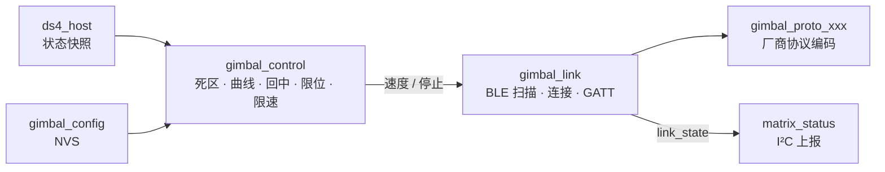
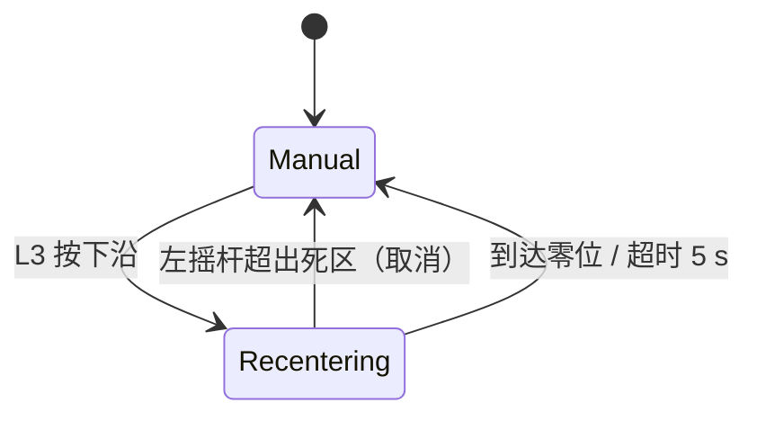

# BLE 云台控制设计

本文是 [BLE 云台控制需求](../request/gimbal-request.md) 的实现设计，定义 ATOM 端云台模块的结构、控制算法、连接状态、本地配置和测试方法。

> 草案：目标云台为大疆 RS 3 Mini，BLE 协议尚未确定。本设计把厂商协议隔离在一个适配层后面，其余部分与具体云台无关；协议确定后补充第 6 节。

## 1. 前置改动

当前 ATOM 已启用BTDM、BLE/GATTC，未释放BLE内存；BLE手柄客户端与Ultimate 2 parser已编译。云台协议/运动控制仍未实现，须验证DS4、BLE手柄与云台并发的内存/时序，见[双模限制](matrix-led-design.md#bluetooth-双模限制)。

## 2. 模块结构



| 规划模块（尚未实现） | 规划文件 | 职责 |
| --- | --- | --- |
| `gimbal_control` | `m5_atom_matrix/main/gimbal_control.c` | 纯 C：输入快照和时间，输出目标速度或停止；回中状态机；软限位 |
| `gimbal_link` | `gimbal_link.c` | BLE GAP/GATT 客户端；连接状态；命令写入与失败计数 |
| `gimbal_proto_*` | `gimbal_proto_<型号>.c` | 实现 `gimbal_proto_ops_t`，把速度 / 停止 / 回中编码为厂商报文 |
| `gimbal_config` | `gimbal_config.c` | NVS 读写校准、限位、零位、启用开关、目标设备地址 |

## 3. 控制任务

独立任务 `gimbal_ctrl`，优先级低于 I²C 处理、高于灯阵渲染，周期 50 ms：

1. 读取 `ds4_host_get_state()` 快照和最近一次输入时间。
2. 调用 `gimbal_control_step()` 得到输出。
3. 输出与上次发送不同，或距上次发送超过 200 ms（保活），且距上次发送不少于 200 ms 时写入云台。停止命令不受 200 ms 间隔限制，立即发送。

### 3.1 摇杆到速度

对每个轴（输入 `raw ∈ [-128, 127]`，先减去校准偏移）：

```text
n = clamp(raw / 127, -1, 1)
d = 0.10                         # 死区
若 |n| ≤ d：v = 0
否则：    t = (|n| - d) / (1 - d)
          v = sign(n) × t²       # 二次方曲线，v ∈ [-1, 1]
```

`v` 再乘以该轴的最大速度（配置项），交给协议层编码。Y 轴方向是否取反作为配置项。

### 3.2 回中状态机



- 协议支持“回到零位”命令时直接发送；否则在已知当前位置的前提下按限速向零位发送速度命令，接近零位时减速。
- 回中期间 L3 保持按下时摇杆偏移不计入。

### 3.3 软限位

- 协议能回报当前角度时：角度接近限位且速度方向朝外时输出 0。
- 协议不能回报角度时：软限位不可用，配置界面隐藏该项并记录日志。

### 3.4 停止条件

以下任一条件成立时输出停止，并清除回中状态：

| 条件 | 判定 |
| --- | --- |
| DS4 断开 | `ds4.connected == false` |
| 输入超时 | 距最近一次 DS4 输入报告超过 200 ms |
| 功能关闭 | 配置 `enabled == false` |
| 云台刚重连 | 连接建立后先发停止，再进入 Manual |

I²C 链路状态不参与判定，LCD 断开不影响云台。

## 4. 连接状态

`gimbal_link` 内部状态映射到 `matrix_link_state_t`，同时作为 I²C 版本 2 `POLL` 响应的云台 `link_state` 上报：

| 内部状态 | 上报 |
| --- | --- |
| 未启用 / BLE 未就绪 | 未连接 |
| 扫描已保存地址或寻找新设备 | 后台搜索 |
| 已选定目标：连接、发现服务、协商 MTU、订阅通知 | 连接中 |
| 控制特征确认可写 | 已连接 |

写入连续失败 5 次时置 I²C 故障位 bit 3（云台故障），并断开重连；恢复可写后清除。

## 5. 本地配置

```c
typedef struct {
    uint8_t  version;
    bool     enabled;
    uint8_t  target_addr[6];       /* 全 0 表示未配对 */
    int8_t   offset_x, offset_y;   /* 左摇杆漂移校准 */
    bool     invert_y;
    uint8_t  max_speed_pan, max_speed_tilt;   /* 协议单位 */
    bool     limits_enabled;
    int16_t  pan_min, pan_max, tilt_min, tilt_max;  /* 0.1° */
    int16_t  zero_pan, zero_tilt;
} gimbal_config_t;
```

- 保存在 NVS 命名空间 `gimbal`，键 `cfg`；版本号不匹配时使用默认值并记录日志。
- 本地操作入口（暂定）：板载按键长按 2 秒进入云台设置；短按切换项目，再长按确认。灯阵用专用图案提示当前项目，图案在实现时补充到 Matrix LED 文档。
- 漂移校准：进入后保持摇杆不动 1 秒，取平均值作为偏移。

## 6. 协议适配层

```c
typedef struct {
    const char *name;
    bool (*match_adv)(const uint8_t *adv, size_t len);      /* 扫描时识别目标云台 */
    const ble_uuid_t *service_uuid, *control_uuid, *notify_uuid;
    size_t (*encode_speed)(uint8_t *out, size_t cap, float pan, float tilt);
    size_t (*encode_stop)(uint8_t *out, size_t cap);
    size_t (*encode_recenter)(uint8_t *out, size_t cap);   /* 不支持时为 NULL */
    bool (*decode_angle)(const uint8_t *in, size_t len, int16_t *pan, int16_t *tilt);  /* 可为 NULL */
} gimbal_proto_ops_t;
```

目标型号为大疆 RS 3 Mini。协议确认后新建 `gimbal_proto_rs3_mini.c` 实现以上函数，并在本节记录报文格式、抓包来源和已验证的固件版本。

## 7. 测试

计划新建主机单元测试（`m5_atom_matrix/tests/test_gimbal_control.c`，当前不存在）：

- 死区边界、曲线单调性、正负对称、满偏输出为 ±1。
- 校准偏移后中心输出为 0。
- 每个停止条件都立即输出停止，且不受 200 ms 间隔限制。
- 回中：L3 按下沿进入，摇杆超出死区取消，超时退出；L3 按住期间摇杆不计入。
- 软限位：朝外速度被截断，朝内速度保留。
- 输出限速：连续变化的输入每 200 ms 最多一次写入。

实机测试按 [BLE 云台控制需求](../request/gimbal-request.md#验收测试) 执行。
