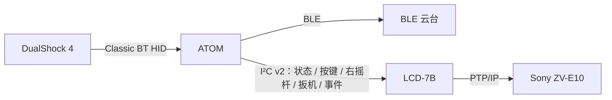
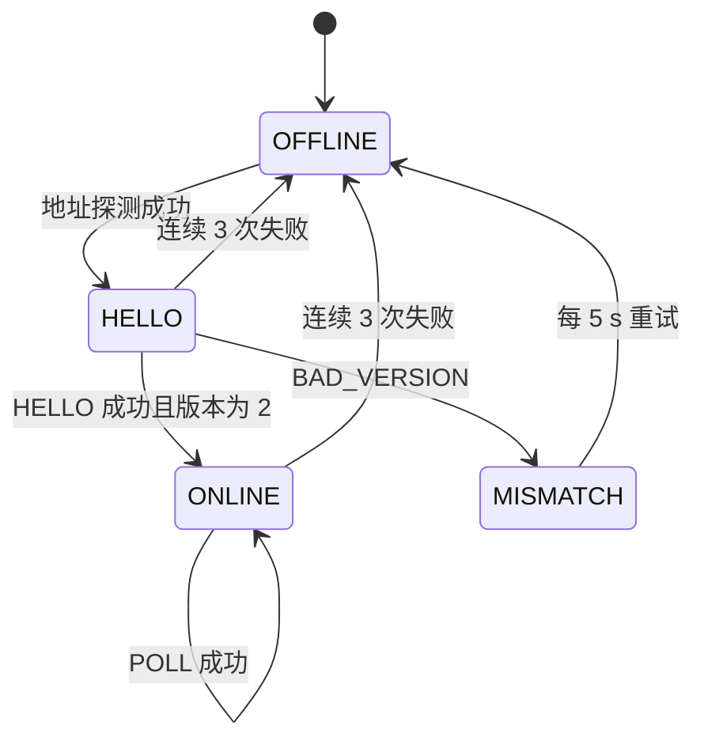

# LCD ↔ ATOM I²C 通信协议（版本 2）

本文定义 Waveshare LCD-7B（主机）与 M5Stack ATOM Matrix（从机）之间的 I²C 协议版本 2，当前实现见 [ATOM 子项目说明](../../m5_atom_matrix/README.md#lcd-主从通信)，协议 v2 已替代旧版 v1。两端 v2 已接入、编译并烧录，主机回归通过，链路稳定性尚待验收；两端固件必须同时升级，版本 2 与版本 1 不兼容。ATOM 已迁移新版从机 v2 驱动，ISR 复制收包到队列，核心 0 的独立任务解析；每次响应使用项目内的 ESP-IDF 5.5.1 专用适配层替换软件缓冲与 FIFO。云台不在本轮范围。

## 设计目标

下文云台与对焦框的职责是预留设计：当前云台状态为 0，左摇杆不传输、L3 已过滤，但 ATOM 没有云台运动控制；LCD 已接收右摇杆，尚未实现对焦框操作。

- **云台在 ATOM 内部闭环**：左摇杆和 L3 由 ATOM 直接转换为云台控制命令，不上报 LCD，LCD 也不下发云台命令。LCD 断开、重启或相机通信阻塞都不影响云台操作。
- **完整性校验**：每帧带 CRC8，从机可从错位中重新同步。
- **一次往返完成一次轮询**：状态、手柄快照、一个缓存事件及上次事件确认合并到同一条命令。
- **可检测重启与丢事件**：ATOM 每次启动生成随机 `boot_id`；事件缓存溢出由 ATOM 直接标记，LCD 不再靠事件 ID 推断。
- **灯阵归 ATOM 所有**：取消版本 1 的 RGB 命令，灯阵按 [Matrix LED 状态显示需求](../request/matrix-led-request.md) 由 ATOM 自行显示。

## 职责划分

| 输入 | 处理位置 | 是否上报 LCD |
| --- | --- | --- |
| 左摇杆 LX / LY | ATOM：云台 Pan / Tilt | 否 |
| L3 | ATOM：云台回中 | 否（实时位图和事件中恒为 0） |
| 其余 17 个按键 | LCD：相机与界面操作 | 是 |
| 右摇杆 RX / RY | LCD：手动对焦框 | 是 |
| L2 / R2 模拟量 | LCD：S1 / S2、录像 | 是 |
| 手柄电池 | LCD：状态显示 | 是 |
| 云台连接状态 | ATOM 判断 | 仅连接状态，用于界面显示 |

LCD 只显示云台“未连接 / 搜索中 / 连接中 / 已连接”，不显示也不参与云台位置、速度、回中进度和校准。

## 物理层

与版本 1 相同：

| 项目 | 配置 |
| --- | --- |
| 主机 | LCD-7B，GPIO8 SDA / GPIO9 SCL，与扩展芯片 `0x24` 共用总线 |
| 从机 | ATOM Matrix，GPIO26 SDA / GPIO32 SCL，7 位地址 `0x42` |
| 速率 | 100 kHz |
| 电平 | 上拉至 3.3V，两端共地；分别 USB 供电时不连接 Grove 5V |

## 事务时序

每个事务由两次独立的 I²C 传输组成，不使用重复起始：

1. 主机写入 9 字节请求帧。
2. 主机等待 `T_prepare`，从机在此期间解析请求并把响应写入发送 FIFO。
3. 主机读取该命令对应长度的响应帧。

| 参数 | 值 | 说明 |
| --- | --- | --- |
| `T_prepare` 从机上限 | 10 ms | 从机使用独立 I²C 任务阻塞接收，不与按键、灯阵共用循环 |
| 主机写后等待 | 15 ms | 版本 1 为 30 ms；从机改为独立任务前保持 30 ms |
| 轮询周期 | 50 ms | 从写请求开始计 |
| 单次传输超时 | 100 ms | `i2c_master_transmit` / `i2c_master_receive` |
| 链路断开判定 | 连续 3 次事务失败 | 失败指超时、CRC 错误、头部或序号不符 |
| 离线重试 | 每 1 s | 先地址探测，成功后发送 `HELLO` |

主机必须读完上一条响应后才能发送下一条请求。从机在写入新响应前清空发送 FIFO，避免主机读到旧响应。

## 帧格式

多字节字段一律小端。CRC 采用 CRC-8/SMBUS：多项式 `0x07`，初值 `0x00`，不反射，无输出异或；ASCII `123456789` 的校验值为 `0xF4`。

### 请求帧（LCD → ATOM，固定 9 字节）

| 字节 | 字段 | 说明 |
| --- | --- | --- |
| 0 | `magic` | `0xA5` |
| 1 | `version` | `2` |
| 2 | `seq` | 请求序号，每个新请求加 1，重试时保持不变 |
| 3 | `cmd` | 命令码 |
| 4–7 | `param` | 命令参数，未用填 0 |
| 8 | `crc` | 字节 0–7 的 CRC8 |

### 响应帧（ATOM → LCD，6 + N + 1 字节）

| 字节 | 字段 | 说明 |
| --- | --- | --- |
| 0 | `magic` | `0x5A` |
| 1 | `version` | `2` |
| 2 | `seq` | 回显请求序号 |
| 3 | `cmd` | 回显命令码 |
| 4 | `status` | 结果码，见下表 |
| 5 | `len` | 载荷长度 N |
| 6 … 5+N | `payload` | 命令载荷 |
| 6+N | `crc` | 字节 0 … 5+N 的 CRC8 |

主机按命令的成功响应长度读取，但以 `len` 字段定位 CRC。`status` 非 0 时 `len` 为 0，响应只有 7 字节，主机多读的尾部字节忽略。

### 结果码

| 值 | 名称 | 含义 |
| --- | --- | --- |
| 0 | `OK` | 成功 |
| 1 | `BAD_CRC` | 请求 CRC 错误 |
| 2 | `BAD_VERSION` | 请求版本不是 2 |
| 3 | `UNKNOWN_CMD` | 未知命令 |
| 4 | `BAD_PARAM` | 参数非法 |
| 5 | `NOT_READY` | 从机初始化未完成 |

帧头不是 `0xA5` 的数据不产生响应，按下文“从机接收与重新同步”丢弃。

## 命令

| 命令码 | 名称 | 成功载荷 | 响应总长 | 用途 |
| --- | --- | --- | --- | --- |
| `0x01` | `HELLO` | 12 字节 | 19 字节 | 建立连接、版本与能力协商 |
| `0x10` | `POLL` | 28 字节 | 35 字节 | 周期轮询状态、输入和事件 |

`0x20`–`0x2F` 预留给后续 LCD → ATOM 的状态通知，`0x30`–`0x3F` 预留给 ATOM 本地功能配置。云台控制不使用任何命令。

### `0x01` HELLO

请求参数：

| 参数字节 | 内容 |
| --- | --- |
| 0 | 主机支持的最低协议版本，填 `2` |
| 1 | 主机支持的最高协议版本，填 `2` |
| 2–3 | 保留，填 0 |

成功载荷：

| 载荷偏移 | 类型 | 内容 |
| --- | --- | --- |
| 0–3 | u32 | `boot_id`，ATOM 启动时随机生成，非 0 |
| 4 | u8 | ATOM 固件主版本 |
| 5 | u8 | ATOM 固件次版本 |
| 6 | u8 | 能力位，见下表 |
| 7 | u8 | 事件缓存容量，当前 128 |
| 8–10 | u24 | `local_mask`：由 ATOM 本地消费、不上报的按键位，当前为 `0x000002`（L3） |
| 11 | u8 | 保留，填 0 |

| 能力位 | 含义 |
| --- | --- |
| bit 0 | 支持 Classic Bluetooth 手柄（DS4） |
| bit 1 | 支持 BLE 手柄 |
| bit 2 | 支持 BLE 云台，左摇杆与 L3 在 ATOM 本地处理 |
| bit 3 | 事件带 `gap` 标志 |

主机版本区间不包含 2 时，从机回 `BAD_VERSION`。LCD 收到 `BAD_VERSION`、版本字段不为 2 或连续 `HELLO` 失败时，在连接页显示“ATOM 固件版本不匹配”，不进入 `POLL`。

### `0x10` POLL

请求参数：

| 参数字节 | 内容 |
| --- | --- |
| 0–3 | `ack_id`：LCD 已处理的最后一个事件 ID，0 表示无确认 |

成功载荷：

| 载荷偏移 | 类型 | 内容 |
| --- | --- | --- |
| 0–3 | u32 | `boot_id`，与 `HELLO` 返回值相同 |
| 4 | u8 | 手柄连接状态 `link_state` |
| 5 | u8 | 云台连接状态 `link_state`，仅用于显示 |
| 6 | u8 | ATOM 本地状态：bit 0 板载按键按下，其余为 0 |
| 7 | u8 | 故障位，见下表 |
| 8 | u8 | 手柄电池原始值 0–10，255 表示不可用 |
| 9–10 | u16 | ATOM 板载按键累计按下次数，65535 后回绕 |
| 11–13 | u24 | 实时按键位图，已清除 `local_mask` 位 |
| 14 | i8 | RX，-128～127 |
| 15 | i8 | RY，-128～127 |
| 16 | u8 | L2，0–255 |
| 17 | u8 | R2，0–255 |
| 18 | u8 | 事件标志：bit 0 `valid`，bit 1 `gap` |
| 19–22 | u32 | 事件 ID，`valid` 为 0 时填 0 |
| 23–25 | u24 | 事件发生后的按键位图，已清除 `local_mask` 位 |
| 26 | u8 | 本次返回之后仍待确认的事件数，超过 255 时为 255 |
| 27 | u8 | 输入来源标记：bit 0 为 SIM，bit 1–7 为输入代数（模 128）；旧版本填 0 |

手柄未连接时，字节 8 为 255，字节 11–17 全部为 0。

`link_state` 取值与 [Matrix LED 状态显示设计](matrix-led-design.md#状态模型) 一致：

| 值 | 状态 |
| --- | --- |
| 0 | 未连接 / 功能未启用 |
| 1 | 后台搜索 |
| 2 | 连接中 |
| 3 | 已连接 |

故障位：

| 位 | 含义 | 清除方式 |
| --- | --- | --- |
| bit 0 | 事件缓存溢出 | 携带 `gap` 的事件被确认后清除 |
| bit 1 | I²C 协议错误达到阈值 | 连续 3 个合法请求后清除 |
| bit 2 | Bluetooth 运行期错误 | 当前实现保持到重启 |
| bit 3 | 云台故障（连接后控制服务不可用、写入连续失败） | 云台恢复可写后清除 |

## 按键位图

位定义与 `ds4_report.h` 相同：

| bit | 按键 | bit | 按键 | bit | 按键 |
| --- | --- | --- | --- | --- | --- |
| 0 | Share | 6 | 下 | 12 | 三角 |
| 1 | L3（本地，恒为 0） | 7 | 左 | 13 | 圆圈 |
| 2 | R3 | 8 | L2 数字位 | 14 | 叉 |
| 3 | Options | 9 | R2 数字位 | 15 | 方块 |
| 4 | 上 | 10 | L1 | 16 | PS |
| 5 | 右 | 11 | R1 | 17 | 触摸板按下 |

bit 18–23 保留，填 0。L2 / R2 数字位只用于日志，扳机档位由字节 16–17 的模拟量判断，见 [手柄控制方案](../request/gamepad-request.md#扳机lt--rt)。

## 事件缓存

ATOM 在蓝牙输入回调中，用清除 `local_mask` 后的按键位图与上一次入队的位图比较，不同时才入队。因此只有 L3 变化或只有摇杆、扳机变化时不产生事件，不占用缓存。

确认与读取规则沿用版本 1：

1. `POLL` 携带 `ack_id`。若队首事件 ID 等于 `ack_id`，从机删除队首。
2. 从机返回新的队首事件；队列为空时 `valid = 0`。
3. 未确认的事件重复返回，LCD 按事件 ID 去重。重试同一个 `POLL` 是幂等的。

`gap` 标志：

- ATOM 在溢出丢弃最旧事件时置位内部的 `gap_pending`。
- 下一个返回给 LCD 的事件携带 `gap = 1`；该事件被确认后清除 `gap_pending` 和故障位 bit 0。
- LCD 收到 `gap = 1` 的事件时，只用该事件位图同步本地按键状态，不生成按下边沿，不触发拍照、录像、模式切换等任何操作。

事件 ID 从随机非 0 值开始，逐个递增并跳过 0。

## LCD 端处理

- **进入 ONLINE**：记录 `boot_id`，`ack_id = 0`，本地事件按键状态设为第一次 `POLL` 的实时位图，不生成边沿。
- **`boot_id` 变化**：视为 ATOM 重启，按“进入 ONLINE”重新初始化；不生成边沿，不重放任何命令。
- **单次失败**：保留 `ack_id` 和事件按键状态，下一周期用相同 `seq` 和 `ack_id` 重试。
- **进入 OFFLINE**：清除手柄连接状态和实时快照，立即释放 S1/S2、停止变焦，与 [手柄控制方案](../request/gamepad-request.md#扳机lt--rt) 的安全规则一致。云台不受影响。

2026-10-03 双端扩展：输入来源 / 连接边界变化时递增输入代数。LCD 比较完整来源标记，变化时先安全释放并丢弃缓存边沿，再接新快照；快速 off / on 即使跨过一次轮询也能识别。SIM 标记用于 LCD 可见提示。该字段仍保持 v2 载荷长度；旧 LCD 把非零保留字节判为非法，因此此版本必须两端一起升级。
- 按键动作只由事件触发；实时快照用于扳机、右摇杆、状态显示和日志。
- 手柄 `link_state` 从 3 变为其他值时，按手柄断开处理，同样释放 S1/S2、停止变焦。

## ATOM 端处理

### 从机接收与重新同步

- 使用独立 I²C 任务阻塞读取，接收缓冲为 9 字节。
- 缓冲第 0 字节不是 `0xA5` 时丢弃该字节，在剩余数据中搜索下一个 `0xA5`。
- 半帧超过 20 ms 没有新字节时清空缓冲。
- 凑满 9 字节后先校验 CRC：失败回 `BAD_CRC`，计为非法命令。
- 合法请求（CRC 正确、版本为 2、命令已知）刷新 LCD 心跳，用于灯阵的 LCD 链路显示。
- 处理 `POLL` 时重新获取一次手柄快照，不使用主循环中缓存的旧数据。

### 云台本地控制

云台控制只依赖 DS4 输入，与 I²C 链路无关：

- 左摇杆 X 轴控制 Pan，Y 轴控制 Tilt；中心死区约 10%，速度采用二次方曲线。
- L3 按下沿触发回中，以限速平滑转回零位；回中期间推动左摇杆立即取消。按下 L3 时左摇杆偏移量不计入。
- 云台命令限速约 5 次/秒，只发送最新目标，不排队。
- DS4 断开、DS4 输入超过 200 ms 未更新、云台断开时，立即发送停止。
- LCD 断开或 LCD 发送非法帧时，云台继续按手柄输入工作。
- 漂移校准、软限位、零位记录和启用开关保存在 ATOM 的 NVS 中，入口在 ATOM 本地实现（例如板载按键长按），不经过 LCD。

## 与版本 1 的差异

| 项目 | 版本 1 | 版本 2 |
| --- | --- | --- |
| 请求长度 | 8 字节 | 9 字节，增加 CRC8 |
| 响应长度 | 8 / 18 / 26 字节 | 19 / 35 字节，含 `len` 和 CRC8 |
| 响应回显命令码 | 无 | 有 |
| 完整性 | 无 | CRC-8/SMBUS |
| 重新同步 | 无 | 搜索 `0xA5` + 20 ms 半帧超时 |
| 灯阵 | LCD 可设置全屏 RGB | 取消，ATOM 自行显示状态 |
| 左摇杆 / L3 | 上报 LCD | ATOM 本地控制云台，不上报 |
| 云台 | 无 | 仅上报连接状态 |
| 版本协商 | 无 | `HELLO` |
| ATOM 重启检测 | 依赖随机事件 ID | `boot_id` |
| 事件丢失检测 | LCD 推断 ID 跳号 | ATOM 提供 `gap` 标志 |
| 写后等待 | 30 ms | 15 ms（从机改为独立 I²C 任务后） |

## 实现清单

- [x] 新增两端共用的 `common/atom_protocol.h/.c`：命令码、结果码、帧长度、偏移量和 `crc8()`。
- [x] ATOM：I²C 接收拆为独立任务，实现重新同步、CRC 校验和 `HELLO` / `POLL`。
- [x] ATOM：生成 `boot_id`；事件入队前清除 `local_mask` 并去重；实现 `gap_pending`。
- [x] ATOM：RGB 命令已移除，接入 `matrix_status` 独立渲染与纯 C 状态模型；实机视觉 / 恢复验收另记。
- [ ] ATOM：新增云台模块，消费左摇杆和 L3，处理断开和输入超时停止。
- [x] LCD：`main/atom_link.c` 改为 OFFLINE / HELLO / ONLINE 状态机，按 `len` 定位 CRC，连续 3 次失败才判定断开。
- [x] LCD：处理 `boot_id` 变化和 `gap` 事件，不生成边沿。
- [x] LCD：界面显示云台连接状态和“ATOM 固件版本不匹配”。
- [x] 更新 [ATOM 子项目说明](../../m5_atom_matrix/README.md) 和根目录 README 中的协议描述。

- [x] 迁移新版从机驱动，清理未读完响应的软件缓冲与 FIFO；主机替换测试及固件构建通过，硬件时序仍需验收。
- [ ] 完成实机、时序与稳定性验收。

## 测试

### 主机单元测试

- CRC8 校验值：`123456789` → `0xF4`。
- 请求编码 / 解码往返；每个字段边界值。
- 接收端在丢 1 字节、多 1 字节、半帧超时、连续垃圾数据后能重新对齐。
- `status` 非 0 时按 `len = 0` 定位 CRC，忽略尾部字节。
- 事件入队：只有 L3 或摇杆变化时不入队；L3 与其他键同时变化时只记录其他键。
- 溢出后第一个返回事件带 `gap`，确认后清除；`gap` 事件不产生边沿。
- 同一 `POLL` 重复发送不会多删除事件。
- `boot_id` 变化时 LCD 重置 `ack_id` 且不产生边沿。

### 实机测试

- 两端冷启动、单独重启 ATOM、单独重启 LCD，事件不重放、不误触发。
- 拔插 SDA / SCL：3 次失败后 LCD 显示 ATOM 断开并释放 S1/S2；恢复后自动重连。
- LCD 断电或拔掉 I²C 时，左摇杆和 L3 仍可正常控制云台。
- 手柄断开、手柄静止超过 200 ms 未上报时，云台立即停止。
- 两端版本不一致时 LCD 显示版本不匹配，不进入轮询。
- 连续运行 30 分钟，记录事务失败率、CRC 错误数和最长响应时间。

### 新从机适配层

`atom_slave_tx.c` 针对 IDF 5.5.1 使用驱动私有结构，在与 ISR 同核心的任务临界区内禁用 TX 中断、零等待清空软件 ringbuffer、重置 FIFO，写入新响应并启用 TX。长响应的尾部交给驱动 ISR 补充。无动态分配，不重建驱动；SDK 升级会编译失败，必须重新核对适配层。主机测试模拟 0 / 1 / 7 / 19 / 31 / 32 / 34 / 35 字节的旧响应读取，替换为 7 / 19 / 35 字节的新响应；测试不代替真实中断与总线验证。

首轮板上验证确认 HELLO 与 HID 初始化；DS4 高频上报后出现 I²C 重试，优先级修正后 65 秒仍有一次 CRC 尾部错误；IRAM 修正已烧录，DS4 高频窗口尚待复现。不能将主机测试、成功握手或构建当成硬件稳定性已通过。
