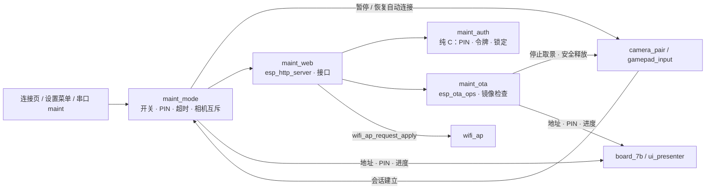
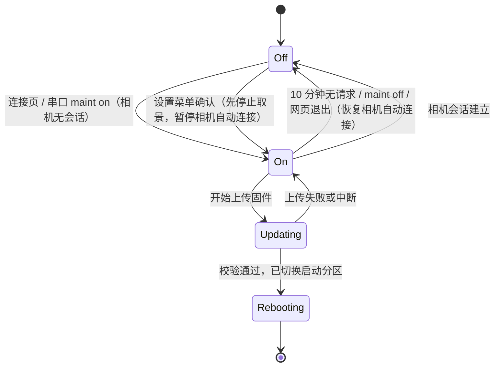
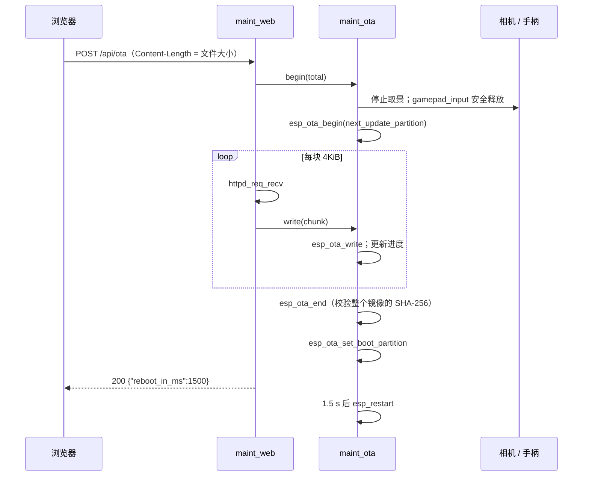

# 维护页面设计

本文是 [维护页面需求](../request/maintenance-request.md) 的实现设计，定义维护模式、分区表调整、网页服务、登录、HTTP 接口、热点设置、OTA 流程与回退。需求编号（R1.1 等）指需求文档中的条目。热点配置的数据结构、校验和生效流程沿用 [Wi-Fi 热点设计](wifi-ap-design.md)。

> 维护 / 登录 / 热点设置 / 安全重启，以及 OTA 检查 / 上传 / 进度 / 双分区与六十秒回滚确认已接入。下面包含尚待完成的提示、并发失败和完整验收目标；各项证据与边界见实施状态。

## 1. 设计约束

- 网页服务只在维护模式下运行（R1.1）。平时不监听 80 端口，不占用 socket 和内存。
- 网页服务与相机会话互斥（R1.5）：相机 PTP/IP 会话建立后立即关闭维护模式，取景期间 HTTP 服务不运行，见 4.1 节。
- 访问者必须同时满足两点：已加入热点（知道 Wi-Fi 密码），并且能看到 LCD 屏幕（读取 PIN）。
- 不使用 HTTPS。设备没有可信证书，自签名证书在手机浏览器上会被拦截；链路由 WPA2 加密，PIN 一次性且有错误次数限制。
- 网页处理不得阻塞 `atom_link`、`camera_pair`、`jpeg_decode`：HTTP 服务任务优先级低于它们，热点重启交给 `wifi_ap` 任务。
- 任何 OTA 失败都不得让设备停在不可启动状态：写入的是非当前运行分区，切换启动分区是最后一步，并启用引导程序回退。
- 只更新 LCD 固件。ATOM 不使用 Wi-Fi，仍通过 USB 烧录。

## 2. 分区表

当前双 OTA 分区表为：

| 名称 | 类型 | 子类型 | 偏移 | 大小 | 说明 |
| --- | --- | --- | --- | --- | --- |
| `nvs` | data | nvs | `0x9000` | `0x6000`（24KiB） | 位置和大小不变，保留配对身份和热点配置 |
| `otadata` | data | ota | `0xF000` | `0x2000` | 记录启动分区和回退状态 |
| `phy_init` | data | phy | `0x11000` | `0x1000` | 从 `0xF000` 后移 |
| `ota_0` | app | ota_0 | `0x20000` | `0x600000`（6MiB） | |
| `ota_1` | app | ota_1 | `0x620000` | `0x600000`（6MiB） | |
| `data` | data | spiffs | `0xC20000` | `0x3E0000` | 当前未使用，比原来小 64KiB |

```text
# Name, Type, SubType, Offset, Size, Flags
nvs, data, nvs, 0x9000, 0x6000,
otadata, data, ota, 0xf000, 0x2000,
phy_init, data, phy, 0x11000, 0x1000,
ota_0, app, ota_0, 0x20000, 6M,
ota_1, app, ota_1, 0x620000, 6M,
data, data, spiffs, 0xc20000, 0x3e0000,
```

- 应用分区从 12MiB 缩小到 6MiB。当前固件内嵌三套裁剪字体，实际大小需用 `idf.py size` 确认；CI 中检查镜像不超过 5MiB，留出余量。
- 改表后第一次必须通过 USB 执行 `idf.py flash`（写入新分区表、`otadata` 和 `ota_0`）。`nvs` 位置不变，配对身份和热点配置保留；`phy_init` 移动后 PHY 校准数据在首次启动时重新生成。
- 之后的固件可以通过 OTA 或 USB 更新。USB 烧录 `idf.py flash` 会写入 `ota_0` 并擦除 `otadata`，因此总是从 `ota_0` 启动。
- 同步更新 [编译与烧录](../development/build-and-flash.md) 中的分区说明和 [故障排查与恢复](../user-guide/troubleshooting.md) 中的擦除地址。

## 3. 模块划分



| 模块 | 文件 | 职责 |
| --- | --- | --- |
| `maint_mode` | `main/maint_mode.c/.h` | 维护模式开关、PIN 生成、无操作超时、与相机会话互斥、LCD 显示内容；常驻控制任务 `maint_ctl` |
| `maint_auth` | `main/maint_auth.c/.h` | PIN 比较、错误计数与锁定、会话令牌；纯 C，时间和随机数由调用方传入，可主机测试 |
| `maint_web` | `main/maint_web.c/.h` | 启停 HTTP 服务、静态页面、JSON 接口 |
| `maint_ota` | `main/maint_ota.c/.h` | 流式写入 OTA 分区、镜像头检查、切换启动分区、启动后自检与确认 |
| 网页 | `main/web/index.html` | 单个 HTML 文件，内联 CSS 和 JS；构建时压缩为 `index.html.gz` 并用 `EMBED_FILES` 内置 |

## 4. 维护模式



```c
typedef enum { MAINT_ENABLE_KEEP_CAMERA, MAINT_ENABLE_STOP_CAMERA } maint_enable_mode_t;

esp_err_t maint_mode_enable(maint_enable_mode_t mode);
void      maint_mode_request_disable(const char *reason);  /* 不阻塞，由 maint_ctl 执行 */
void      maint_mode_on_camera_session(bool open);         /* 相机模块调用，不阻塞 */
bool      maint_mode_is_on(void);
void      maint_mode_touch(void);        /* 每个已登录的请求调用，重置无操作计时 */
```

- **进入**：生成 PIN 和空的会话表 → 启动 HTTP 服务 → 通知显示。服务启动失败时返回错误，维护模式保持关闭。
- **退出**：停止 HTTP 服务（`httpd_stop` 会关闭所有连接）→ 清除 PIN 和令牌 → 通知显示 → 若相机自动连接因维护模式暂停，则恢复（见 4.1）。`Updating` 状态下拒绝退出，返回 `ESP_ERR_INVALID_STATE`。
- **控制任务**：开启、退出、超时都由常驻任务 `maint_ctl`（优先级 2，栈 3072 字节）串行执行。`httpd_stop` 要等正在执行的请求处理函数返回，可能阻塞数百毫秒，因此其他任务只发送请求，不直接调用。
- **超时**：`maint_ctl` 空闲时每约 100 ms 检查，距最后一次已登录请求超过 10 分钟即退出（R1.4）。登录页面的请求不刷新计时，防止未登录者让维护模式一直开启。
- **显示**：维护模式只在相机没有会话时开启，因此信息框只画在连接页的空白区域（y = 560 附近），不进入取景叠加层：`MAINTENANCE http://192.168.4.1/ PIN 482913 09:42`。过渡期通过 `board_7b_set_maint_text()` 提交文字，重构后由 `ui_presenter` 生成。
- **入口**：
  - 连接页（相机无会话且非 SETTINGS）：按住 Select / Share 2 秒切换开 / 关，见 [手柄控制方案](../request/gamepad-request.md)。按住只触发一次；断连、gap、相机会话或切页取消计时，只有新的按下边沿能重新开始。开启允许相机继续连接。
  - SETTINGS 菜单末尾 `MAINTENANCE`：第一次按 A 显示 `STOP LIVE? PRESS A AGAIN`，3 秒内再按一次后取得相机维护 lease、排空并暂停自动连接，再开启网页。左右重复不会确认；导航、B、切页或输入 gap / 断连递增输入代数，取消确认与尚未处理的旧请求。开启后回连接页；维护已开启时菜单 A 关闭，不需要停止确认。菜单增加为 17 行、30 像素行高，七个相机参数和 WI-FI 仍保留。
  - 串口命令 `maint on [stop]|off|status` 注册在 [UART 调试控制台](uart-debug-design.md) 中。相机有会话时 `maint on` 返回 `ERR camera connected, use "maint on stop"`；`maint status` 输出状态、剩余时间、PIN 和相机是否被暂停。

### 4.1 与相机会话互斥（R1.5）

取景是本设备的主要负载：JPEG 帧连续经 Wi-Fi 传输，单帧解码和显示约 214–244 ms，内部 RAM 余量约 63–66KiB（实测见 [抓包工具与通信分析记录](../records/protocol-analysis.md#扩大缓冲及快速-jpeg-解码)）。HTTP 服务不与取景同时运行，带来三点收益：

- 释放约 16KiB 内部 RAM（服务任务栈、3 个连接的缓冲），留给 lwIP 收包；
- 浏览器的轮询（`/api/info` 每 5 秒一次）和上传不再与取景争用 Wi-Fi 空口和 CPU；
- 相机控制路径上不存在网页修改热点、触发 OTA 的可能，取景中热点不会被意外重启。

规则：

| 情况 | 动作 |
| --- | --- |
| 维护模式开启时相机会话建立 | 相机模块调用 `maint_mode_on_camera_session(true)`；`maint_ctl` 立即关闭维护模式，原因 `camera connected`；LCD 提示 `MAINTENANCE OFF: camera connected`，显示 3 秒 |
| 取景中以 `MAINT_ENABLE_STOP_CAMERA` 开启 | 请求停止取景（与串口 `s` 相同），等待相机任务结束（最多 2 秒），置 `camera_paused = true`，然后启动 HTTP 服务 |
| `camera_paused` 时退出维护模式 | 清除标志，调用 `camera_jpeg_start()` 恢复自动连接 |
| `Updating` 状态 | 相机已在 OTA 开始时停止，不会建立会话；不响应会话通知 |
| 相机会话建立时维护模式未开启 | 无动作 |

- **触发时刻**选在 PTP/IP `OpenSession` 成功之后、Sony 初始化和第一帧取景之前：此时已确定是本项目的相机，且大流量的取景还未开始。相机只是加入热点而握手失败时，维护模式不受影响。
- `maint_mode_on_camera_session()` 只设置标志并通知 `maint_ctl`，不阻塞相机任务；HTTP 服务在之后约 100 ms 内停止，与 Sony 初始化（数百毫秒）重叠，不推迟第一帧。
- 正在处理的网页请求会先执行完。若恰好是 `POST /api/wifi`，热点修改请求已进入 `wifi_ap` 队列，照常生效；若是 OTA 上传，状态为 `Updating`，相机不会连上，不存在冲突。
- 关闭 HTTP 服务不会断开手机与热点的 Wi-Fi 连接。手机留在热点上仍会产生少量后台流量，LCD 的关闭提示附加一行 `Disconnect phone from Wi-Fi`。
- 网页的请求失败（连接被拒绝或超时）时，显示“维护模式已关闭（可能因相机已连接）”，并清除令牌（R2.4）。
- 重构为 `camera_controller` 后，会话通知改由控制器的状态变化回调发出，规则不变。

## 5. 网页服务

| 项目 | 配置 |
| --- | --- |
| 组件 | `esp_http_server` |
| 端口 | 80 |
| 任务优先级 | 3（低于 `atom_link` 4 和相机任务 4） |
| 任务栈 | 6144 字节，内部 RAM |
| 最大连接数 | 3（`max_open_sockets`），开启 `lru_purge_enable` |
| 接收超时 | 10 秒；OTA 上传时单次 `httpd_req_recv` 超时也为 10 秒 |
| URI 数量 | 不超过 12 |

LCD 实测空闲内部 RAM 约 63–66KiB（见 [抓包工具与通信分析记录](../records/protocol-analysis.md#扩大缓冲及快速-jpeg-解码)）。HTTP 服务栈、3 个连接和 OTA 4KiB 缓冲合计约 16KiB，需在实现后用 `status` 复测内部 RAM 余量。

### 5.1 静态页面

- 唯一页面 `GET /` 返回压缩后的 HTML，带 `Content-Encoding: gzip` 和 `Cache-Control: no-store`；目标大小不超过 20KiB。
- 不引用任何外部 CSS、JS、字体（R6.2）。布局使用单列卡片，最大宽度 640 像素，手机和电脑共用（R6.3）。
- 页面分为：登录、设备信息、热点设置、固件更新、重启 / 退出维护模式。

### 5.2 登录与会话（R2）

```c
typedef struct {
    char     pin[7];
    uint8_t  failures;
    uint32_t locked_until_ms;
    uint8_t  token[16];         /* 全 0 表示没有会话 */
} maint_auth_t;

void maint_auth_reset(maint_auth_t *auth, maint_random_fn random);
maint_auth_result_t maint_auth_login(maint_auth_t *auth, const char *pin,
                                     uint32_t now_ms, maint_random_fn random,
                                     uint8_t token_out[16]);
bool maint_auth_check(const maint_auth_t *auth, const char *bearer_hex);
```

- PIN 为 6 位数字，用 `esp_fill_random()` 拒绝采样生成（此时射频已开启，熵源有效）。
- 登录成功生成 128 位随机令牌，以十六进制返回给网页；新令牌覆盖旧令牌，旧会话随之失效（R2.3）。
- 令牌只保存在页面的 JS 变量中，每个请求以 `Authorization: Bearer <hex>` 头携带；不使用 Cookie。其他网站的页面无法让浏览器自动附带该头，因此不需要额外的 CSRF 防护；代价是刷新页面后需要重新输入 PIN。
- 比较 PIN 和令牌使用逐字节异或累加的定长比较。
- 连续 5 次错误：锁定 60 秒，期间登录一律返回 `429`；同时生成新的 PIN 并刷新 LCD 显示（R2.2）。登录成功后错误计数清零。

### 5.3 HTTP 接口

除 `GET /` 和 `POST /api/login` 外，所有接口都需要有效令牌，否则返回 `401`。请求和响应正文均为 JSON（OTA 上传除外），字段为英文。

| 方法 | 路径 | 请求 | 成功响应 |
| --- | --- | --- | --- |
| GET | `/` | — | 网页 |
| POST | `/api/login` | `{"pin":"482913"}` | `{"token":"…"}`；错误 `401`，锁定 `429` 并带 `retry_after` |
| POST | `/api/logout` | — | `{}`，令牌失效 |
| GET | `/api/info` | — | 设备信息，见下文 |
| GET | `/api/wifi` | — | `{"ssid":"…","channel":6,"password_len":12,"show_password":true,"max_channel":13}` |
| POST | `/api/wifi` | `{"ssid":"…","password":"…","channel":11}`，字段可省略 | `{"restart_in_ms":1500}`；校验失败 `400` 并带 `field` 和 `error` |
| GET | `/api/wifi/random_password` | — | `{"password":"k7mq3xh9tw2p"}`，只生成，不保存 |
| POST | `/api/ota/check` | 镜像前 288 字节（`application/octet-stream`） | 镜像版本信息与比较结果，见第 6 节 |
| POST | `/api/ota` | 完整镜像（`application/octet-stream`） | `{"reboot_in_ms":1500}` |
| GET | `/api/ota/status` | — | `{"state":"idle\|receiving\|verifying\|done\|failed","received":…,"total":…,"error":"…"}` |
| POST | `/api/reboot` | `{"confirm":true}` | `{"reboot_in_ms":1500}` |
| POST | `/api/maint/exit` | — | `{}`，随后退出维护模式 |

- 请求正文上限：JSON 接口 512 字节，超过返回 `413`。JSON 用 ESP-IDF 自带的 cJSON 解析。
- `/api/info` 字段：`version`、`build_time`、`idf_version`、`running_partition`、`uptime_s`、`free_internal`、`free_psram`、`camera_state`、`atom_state`、`clients[]`（`mac`、`ip`、`rssi`）。MAC 只在本页面显示，不写入日志。
- 网页不返回当前 Wi-Fi 密码（R4.2）；需要查看时看 LCD 连接页或串口 `wifi show password`。

### 5.4 安全重启（已接入）

网页按钮先弹出确认，再发送仅包含 `confirm:true` 的平面对象；未登录返回 401，未确认 / 字段类型 / 重复或多余字段返回 400。服务器先预留唯一重启请求，重复请求 409；完整发送 `reboot_in_ms:1500` 响应后提交截止时间，发送失败取消，预留期间不会重启。

约 1.5 秒后，已有内部 RAM 栈的 health 任务执行重启，不在 HTTP 或 PSRAM 栈上重启。先调用 `maint_mode_quiesce(3000)` 设置终止标志，拒绝新开启，并由维护任务串行关闭 HTTP、清除鉴权及释放自己持有的相机 lease，终止路径不恢复相机自动连接；确认关闭后再由 health 取得相机 lease，最多三秒排空，记录结果并软重启。LCD 三次恢复失败也走同一路径，避免维护先前持有 lease 时直接二次取得而失败。所有等待有界，若关闭 / 排空失败仍记录失败并尝试重启；不能把该退路视为成功排空。重启后维护默认关闭、调试模拟默认关闭，NVS 不擦除。

## 6. 热点设置（R4）

`POST /api/wifi` 的处理：

1. 用当前配置填充未提供的字段，逐项调用 `wifi_config_check_*`；失败返回 `400`，正文为 `{"field":"password","error":"password must be 8-63 printable ASCII characters"}`，错误文字与串口相同。
2. 与当前配置相同时返回 `{"restart_in_ms":0}`，不重启。
3. 先调用 `wifi_ap_prepare_apply` 预留任务与结果槽，队列忙返回 `409`；发送 `200` 响应，包含 `restart_in_ms:1500`、任务 `token` 和 `state:"pending"`。完整发送成功后调用 `wifi_ap_commit_apply(token, 1500)`；发送失败则取消，未提交的任务最多等待 25 秒，不修改 NVS 或驱动。延迟从提交时起算，避免热点重启打断响应。`GET /api/wifi` 返回最近任务的 `apply_state` / `apply_token`，失败时附 `apply_error`；响应成功表示已排队，尚不表示保存成功。
4. 热点重启后浏览器的连接断开。网页在收到响应时显示新的 SSID 和“请重新连接热点后刷新本页”；不显示新密码，用户刚刚自己输入过。

HTTP 服务的监听 socket 绑定在任意地址，热点重启时网络接口不销毁。每次驱动重启尝试递增网络代数，HTTP 登录 / 鉴权时同步代数并作废旧令牌；维护模式和 PIN 保持不变（R4.4），需要重新登录。外部手机断开 / 重连和浏览器效果仍需实机验收。

## 7. OTA（R5）

### 7.1 上传前检查（R5.2、R5.3）

网页选择文件后，先读取前 288 字节（镜像头 24 字节 + 段头 8 字节 + `esp_app_desc_t` 256 字节）发送到 `/api/ota/check`。设备检查：

| 检查 | 规则 | 失败提示 |
| --- | --- | --- |
| 镜像魔数 | `esp_image_header_t.magic == 0xE9` | `not an ESP firmware image` |
| 芯片 | `chip_id == ESP_CHIP_ID_ESP32S3` | `firmware is for another chip`（ATOM 固件为 ESP32，在此被拒绝） |
| 应用描述魔数 | `esp_app_desc_t.magic_word == ESP_APP_DESC_MAGIC_WORD` | `missing app description` |
| 项目名称 | 与当前运行固件的 `project_name` 相同 | `firmware is for another project` |
| 大小 | 文件大小不超过目标分区大小 | `image too large` |

通过后返回 `{"version":"…","date":"…","time":"…","current_version":"…","same_or_older":true}`。网页显示版本对比，版本相同或文件编译时间早于当前固件时提示，但允许继续。

`/api/ota` 在收到第一块数据时重复以上检查，不依赖网页先调用 `/api/ota/check`。

### 7.2 上传流程



- 同一时间只允许一个上传；已有上传时返回 `409`。
- 进入上传前由维护控制任务取得相机 lease，最多两秒停止 / 排空；已经由 STOP 维护持有时复用，不重复取得。停止失败拒绝上传，不写目标分区，避免与取景或动作并发。上传期间拒绝退出维护、暂停自动连接及超时关闭，仍读取手柄；失败后保留维护占用，可重试或关闭维护恢复自动连接。
- 调用 `gamepad_input` 的安全释放（原因 `ota`），释放 S2、S1 和变焦（R5.4）。上传期间手柄输入仍会被读取，但相机已断开，不会发送命令。
- `esp_ota_begin` 使用 `OTA_WITH_SEQUENTIAL_WRITES`，按需擦除扇区，避免一次性擦除 6MiB 造成长时间阻塞。
- 进度每 5% 更新一次 LCD 文字 `UPDATING 45%`；网页通过 `XMLHttpRequest.upload.onprogress` 显示自己的进度，并在上传结束后轮询 `/api/ota/status` 获取校验结果。
- 当前 HTTP 服务单任务串行处理完整上传，状态查询在上传处理完成后响应；上传中网页使用浏览器发送进度，LCD 独立显示设备实际收到比例。`/api/ota/check` 正文恰为 288 字节，并要求 `X-Image-Size` 声明完整文件大小；上传接口重新检查头部和大小。要求附带 SHA256，完整验证使用 `esp_ota_end`；`esp_ota_end` 失败时句柄已释放，只有尚未 end 的失败才调用 abort。
- 完整镜像校验与启动元数据提交成功后，即使最后 HTTP 回执丢失也会重启进入新镜像；接收中断或校验失败不切换启动分区。网页发送进度满不代表校验通过。
- 失败处理（R5.5）：接收超时、连接断开、`esp_ota_write` 或 `esp_ota_end` 失败时调用 `esp_ota_abort()`，状态置为 `failed` 并记录原因；不切换启动分区，不重启；维护模式回到 `On`。相机取景不自动恢复，用户在 LCD 或串口手动恢复（与 `s` 之后相同）。
- OTA 只写应用分区，不触碰 `nvs`（R5.7）。

### 7.3 启动后确认与回退（R5.6）

启用 `CONFIG_BOOTLOADER_APP_ROLLBACK_ENABLE=y`。新固件第一次启动时处于 `ESP_OTA_IMG_PENDING_VERIFY` 状态，若在确认之前复位，引导程序下次启动时回到旧分区。

`maint_ota_self_test_start()` 在 `app_main` 末尾调用，满足以下全部条件后调用 `esp_ota_mark_app_valid_cancel_rollback()`：

- `board_7b_init()` 成功，连接页已显示；
- `wifi_ap_start()` 成功，收到 `WIFI_EVENT_AP_START`；
- `atom_link`、`dbg_console` 任务已创建；
- 启动后连续运行 60 秒，期间堆完整性检查通过。

不把“相机已连接”或“ATOM 在线”作为条件：现场可能没有相机或 ATOM，不能因此回退。

自检期间若检测到上述条件失败，调用 `esp_ota_mark_app_invalid_rollback_and_reboot()` 立即回退。回退后启动日志输出 `OTA ROLLBACK: running previous firmware <version>`，维护页面的 `/api/info` 中 `last_ota` 字段显示 `rolled_back`。

### 7.4 镜像签名（后续）

第一版只检查芯片、项目名称和 `esp_ota_end` 的 SHA-256 校验，能防止误传其他固件和传输损坏，但不能防止有意构造的同名固件。由于访问前提是加入热点并看到 LCD 上的 PIN，第一版接受这一风险。需要更强保护时启用 `CONFIG_SECURE_SIGNED_APPS_NO_SECURE_BOOT` 对镜像签名，签名密钥不进入仓库。

## 8. 网页结构

```text
┌───────────────────────────────┐
│ ESP32 Camera Remote · 维护    │
├───────────────────────────────┤
│ [登录] PIN ______  [进入]      │  未登录时只显示这一块
├───────────────────────────────┤
│ 设备信息  版本 / 分区 / 内存 …  │  每 5 秒刷新
├───────────────────────────────┤
│ 热点      SSID [__________]   │
│           密码 [______] 👁 [随机] │
│           信道 [6 ▼]  [保存]    │
├───────────────────────────────┤
│ 固件更新  [选择 .bin] 版本对比   │
│           ████████░░ 80% [上传] │
├───────────────────────────────┤
│ [重启设备]   [退出维护模式]      │
└───────────────────────────────┘
```

- 文字使用中文；接口错误文字为英文，页面原样显示。
- 保存热点、上传固件、重启都弹出浏览器 `confirm()` 二次确认（R4.3、R6.1）。
- 收到 `401` 时清除令牌，回到登录块。

## 9. 并发与所有权

| 资源 | 所有者 | 其他访问方式 |
| --- | --- | --- |
| HTTP 服务句柄 | `maint_ctl` 任务（启停） | — |
| 相机会话标志、`camera_paused` | `maint_ctl` 任务 | 相机模块通过 `maint_mode_on_camera_session()` 发送通知，不直接修改 |
| `maint_auth_t` | HTTP 服务任务 | `maint_mode` 在服务停止后重置，不并发 |
| OTA 句柄与进度 | `maint_ota`，只在 HTTP 服务任务中写 | 显示读取进度：原子变量 |
| 热点配置 | `wifi_ap` 任务 | HTTP 服务只发送请求，见 [Wi-Fi 热点设计](wifi-ap-design.md#12-并发) |
| 维护模式状态 | `maint_ctl` 任务写，互斥量保护 | 菜单、串口、HTTP 服务读取或发送请求 |

`esp_http_server` 在单个任务中顺序处理请求，OTA 上传期间其他请求排队等待；`/api/ota/status` 在上传结束后才会被处理，这符合网页的轮询方式。

## 10. 测试

### 主机单元测试 `test_maint_auth`

- PIN 只含数字、长度 6；固定随机序列下拒绝采样正确。
- 第 5 次错误后锁定，锁定期间正确 PIN 也被拒绝；60 秒后恢复，且 PIN 已变化。
- 新令牌使旧令牌失效；`maint_auth_reset` 后所有令牌失效。
- 令牌十六进制解析：长度错误、非十六进制字符。
- 时间回绕附近的锁定判断。

### 主机单元测试 `test_ota_header`

把镜像头检查拆为纯 C 函数 `maint_ota_check_header(const uint8_t *data, size_t len, const char *project, uint32_t partition_size)`：

- 正确的 LCD 镜像头通过。
- ESP32 芯片 ID（ATOM 固件）、错误魔数、项目名不同、数据不足 288 字节、声明大小超过分区，分别返回对应错误。
- 测试样本为两个工程编译产物的前 288 字节，放在 `tests/host/fixtures/`，不含设备标识。

### 实机测试

验收以 [需求文档](../request/maintenance-request.md#验收测试) 为准，另外补充：

- 维护模式开启、手机每 5 秒刷新页面时让相机连接：从 `OpenSession` 成功到 HTTP 服务停止不超过 500 ms；第一帧出现时间与未开启维护模式时相比不增加。
- 取景 5 分钟的平均帧率和最低内部 RAM，与从未开启维护模式时一致（确认 HTTP 资源已全部释放）。
- `maint on stop` 后相机不自动重连；`maint off` 和 10 分钟超时两种退出方式都会恢复取景。
- 网页正在保存热点设置的同时相机会话建立：热点修改照常生效，维护模式关闭，无死锁。
- OTA 上传期间测量内部 RAM 最低值，不低于 20KiB。
- 上传 5MiB 镜像的耗时，作为文档中的参考值记录。
- 热点重启后 HTTP 监听是否仍有效（第 6 节待验证项）。
- 连续 OTA 10 次（`ota_0` 与 `ota_1` 交替），每次配对身份和热点配置不变。
- USB 烧录后从 `ota_0` 启动，`otadata` 被擦除，不会意外回到旧的 `ota_1`。

## 11. 实施步骤

1. 修改分区表和 `sdkconfig.defaults`（`CONFIG_BOOTLOADER_APP_ROLLBACK_ENABLE=y`），USB 烧录验证 NVS 保留；更新编译与故障排查文档。
2. 实现 `maint_ota` 的自检与确认逻辑，先通过 USB 烧录验证不会误回退。
3. 实现 `maint_auth` 与主机测试，`maint_mode`（含 `maint_ctl` 任务和相机会话互斥）与串口 `maint` 命令、LCD 信息框；在 `camera_pair` 的 `OpenSession` 成功处调用 `maint_mode_on_camera_session(true)`。
4. 实现 `maint_web` 的登录、`/api/info` 和网页。
5. 接入 [Wi-Fi 热点设计](wifi-ap-design.md) 的 `wifi_ap_request_apply`，实现热点设置。
6. 实现 OTA 上传、头部检查和失败处理；最后加入连接页的开关操作和设置菜单的 `MAINTENANCE` 项。

## 2026-10-03 当前接入边界

- 常驻 maint_ctl 串行启停服务与相机 lease，优先级 2 / 3072 字节；维护默认关闭，RAM 状态，已登录请求刷新 10 分钟计时。
- maint on 保留相机自动连接；maint on stop 使用已有 camera_maintenance_acquire(2000) 停止 / 排空并阻止新开始，失败不启动 HTTP；退出时释放 lease 并重新启动相机。
- OpenSession 成功处只提交会话通知；在进入 Sony 初始化之前等 HTTP 关闭（最多 2 秒，失败则关闭本次会话），保证 HTTP 不与 JPEG 取景并行。关闭前唤醒已连接 socket 的读写，随后 httpd_stop 排空；具体时延仍需在线相机验收。
- 显示只提交文字 / 页面切换请求，board 连接页任务拥有绘制，避免 3 KiB 维护任务执行字体渲染。相机暂停后的最后一帧也会切到连接页。PIN 和令牌不写 NVS；HTTP 回环探测不输出凭据。
- auth 使用拒绝采样 PIN、定长比较、128 位令牌；5 次失败换 PIN / 锁定 60 秒，新登录覆盖旧会话。
- 页面内置确定性 gzip，端口 80 / priority 3 / stack 6144 / sockets 3。当前接口为 GET /、POST /api/login、POST /api/logout、GET /api/info、POST /api/maint/exit；JSON 上限 512 字节，认证失败 401、锁定 429。
- 开发 maint probe 通过设备 AP 本地地址的 TCP / HTTP 执行回环审计，不通过 Wi-Fi 空口；生产关闭 REMOTE_DBG_SIM 时移除探测任务。手机实际访问与网页视觉仍待验收。
- 自动关闭的 10 分钟实机窗口、60 秒锁定实机窗口、相机在线互斥 / 恢复、关闭提示 3 秒消失及 hand-held 入口尚待补齐 / 验证。设备信息只是基础网页，热点 / OTA 等继续实施，不降低原需求。
