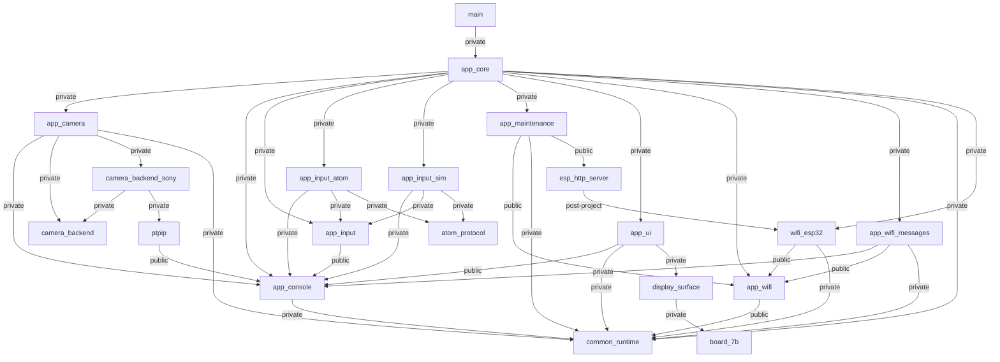
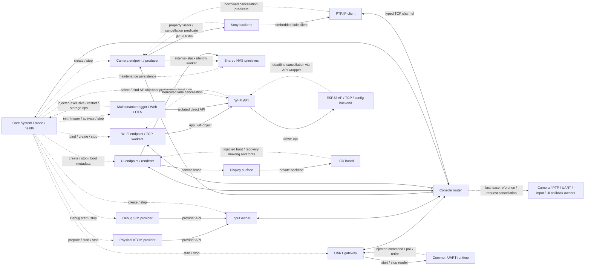

# 当前模块依赖与运行关系

[English](../en/design/module-dependency-graph.md) · **简体中文** · [日本語](../ja/design/module-dependency-graph.md)

> 2026-10-10：下方为有日期的详细台账，旧路径/件数/未完成项按当时范围解释；最新源码与验证以 [当前状态](../development/current-status.md)为准。当前main启动栈24576字节，旧32768表已被取代；Host基线267、四个新构建通过，未烧录。

采集日期：2026-10-06。本图来自当前 LCD Default Debug 的实际构建，而不是计划目录。`tools/check_component_graph.py` 读取 IDF project_description.json、compile_commands.json 与顶层 CMake 生成的 module-http-links.txt。直接符号引用由 tools/check_module_symbols.py 检查实际 component archives，并与声明边匹配；已补间接 ops/callback [源码绑定核对](../records/module-indirect-callbacks-20261006.md)；符号门禁自身不证明动态函数指针目标。机器可读的完整显式依赖（包括 SDK/第三方叶节点）见本地 build/module-sony-control-merge-graph-{default,stable,release}.json；每次 LCD CI 构建都会重新检查。

## 编译期关系

箭头表示调用方 component 依赖被调用方；public/private 是实际 IDF 元数据中的可见性。图中展示项目模块及 HTTP bind SDK 节点，SDK/第三方基础依赖由 JSON 保留，不在此扩展其内部关系。检查无环的范围是所有项目 component 加唯一有项目注入边的 SDK HTTP 节点，不能声称整个 IDF 内部图也无环。

`esp_http_server → wifi_esp32` 为实际 post-project link interface，普通 IDF 元数据缺失此边。检查同时确认全部 SDK HTTP translation units 带 lwip_bind=wifi_esp32_http_bind，禁止只靠手写图证明绑定。Core 公共头只有 startup，不再 public 导出 app_wifi；Camera backend/Sony 依赖为 private。

Release 的 SIM 是 IDF 保留的空注册 component，没有实现源文件/库代码；依赖展开先于 sdkconfig，不能通过配置条件删掉 early requirement，否则 Debug 无法找到 header。检查要求 Release 不编译 SIM，另由 Release 符号门禁检查镜像无模拟代码。Debug 图中的 SIM 关系适用于实际可编译实现。

## 运行时功能关系

以下图经当前 endpoint、Core 编排和 backend 源码核对。双向实线是 typed request/reply/event/lease（router 不执行业务）；provider、对象/ops 和画布边是明确注明的直接接口。虚线是 Core 生命周期或注入系统回调，不代表正常功能直接调用。

新增反向虚线是注入函数指针的调用方向，不增加编译期依赖；LCD绘制回调只用于初始化/恢复，RGB ISR只通知后端信号量，不调用UI。lease归还可在最后一个持有者的任务中发生，不能假定一定在router任务。[回调清单](../records/module-indirect-callbacks-20261006.md)列出绑定者、执行上下文与资源寿命。

Camera/UI 的 JPEG transfer 与 TCP buffer 均由 router lease 转发；UI 归还完成元数据后 Camera 才复用槽。相机与输入不直接操作显示。PTP 的 network generation/correlation/deadline 与缓冲所有权在消息契约中，Sony 不另建事务/session。

启动为 UI/I²C prepare → AP/trigger → 正常 router/Input/bridge/providers/Camera/UART → health/boot barrier release。进入维护时 Core 关闭普通 admission、按 owner 排空、清空/冻结 model、发布固定 MAINTENANCE，之后维护直接使用 AP/config 对象；正常 router 已停止。维护 HTTP 任务不等待自身 stop，停止失败只能重启，不能重新恢复正常。

本图描述源码路径，不证明真实 SMP、HTTP join 时限、Flash/cache-off 或实机效果。当前验收仍见 [完整清单](../development/module-split-checklist.md)与[本批记录](../records/module-dependency-graph-20261006.md)。
