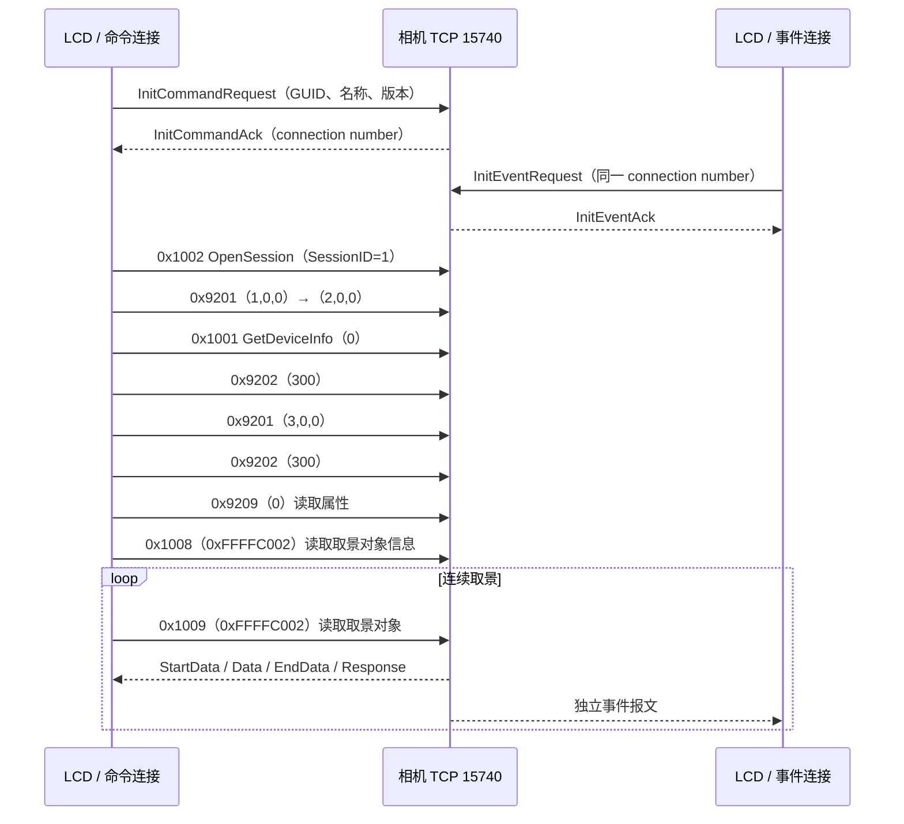
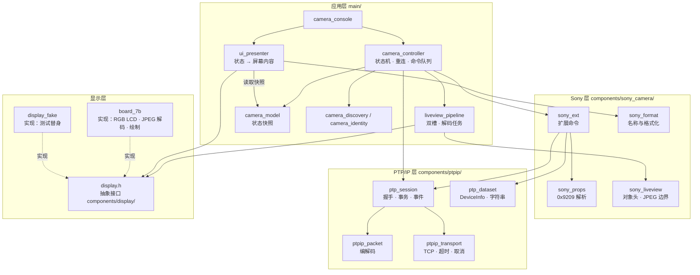
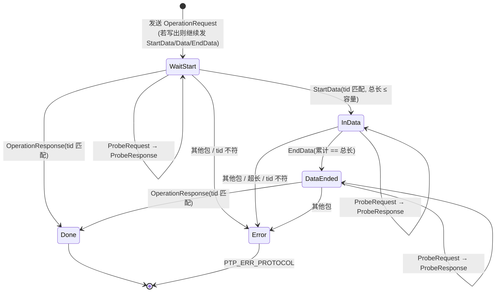
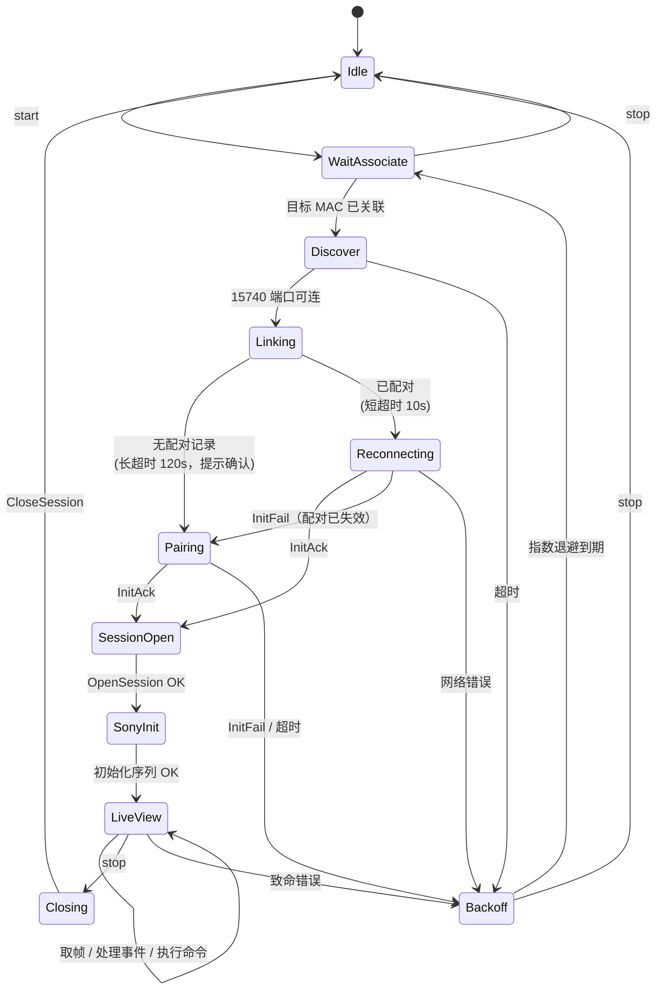
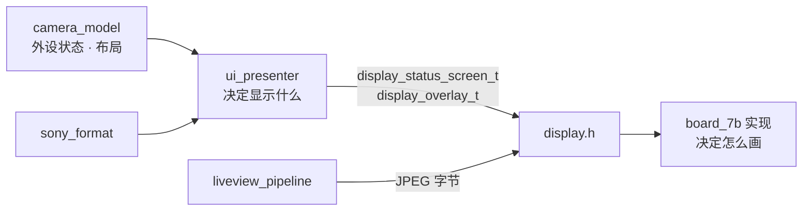
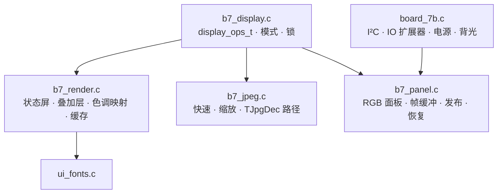

# Sony PTP/IP 相机连接与分层设计

本文集中说明相机连接的当前实现、已确认协议及后续分层设计。对应 [相机连接需求](../request/sony-ptpip-request.md)，操作步骤见 [相机连接手册](../user-guide/camera.md)。当前实现核对日期：2026-10-03。

阅读时区分三个层次：本节“当前实现”按代码核对；协议观测以 [历史记录](../records/protocol-analysis.md) 和 [2026-10-01 抓包分析](../records/protocol-analysis-20261001.md) 为依据；第 1–14 节保留重构背景与目标接口，不能据此认定全部模块已经实现。新加入的连接恢复、MF 控制及扩展参数读取已通过主机测试与固件构建，已烧录；实机通过项目、发现的问题及剩余验收见 [烧录与连接测试](../records/connection-test-20261001.md)。

## 当前实现：连接与运行

### 网络及身份

| 项目 | 当前代码行为 | 限制 |
|---|---|---|
| 网络拓扑 | LCD 建立 SoftAP，相机作为 Wi-Fi 客户端加入 | 不是 LCD 加入相机热点 |
| 热点配置 | 默认值在 `main/wifi_config.h`，应用记录保存至 NVS `wifi_ap/cfg`；串口与手柄热点页已接入 | 默认 easycamctrl / 00000000 / 信道 6；网页入口未实现，实机边界见 [Wi-Fi 设计](wifi-ap-design.md) |
| 相机地址 | `wifi_ap_get_clients` 从当前关联客户端的 DHCP 租约取得 IP | 只探测热点客户端，不扫描整个子网 |
| 相机选择 | 未配对时要求唯一可达 TCP 15740 候选；已配对仅探测已保存 MAC | 多候选时提示只连接一台；更换相机先停止，再用 `u` 清除绑定 |
| 服务端口 | TCP 15740，命令与事件各一条连接 | 事件连接使用命令初始化返回的 connection number |
| 客户端身份 | `sony_remote/guid` 保存 16 字节 GUID；`peer` 保存相机 MAC[6]+GUID[16] | 只有完成会话和 Sony 初始化后才保存 peer；旧 GUID-only 记录保留身份，迁移时补绑定 |

PC 抓包中的 `192.168.110.46` 是相机在抓包网络中的地址，不是固件热点上的固定地址；更换网络时须分别核对地址，不直接把抓包地址写入连接手册的默认配置。

### 初始化顺序



初始化顺序位于 `camera_controller.c:initialize_sony`，取景与配对诊断共用。命令连接串行执行事务；JPEG 解码任务只消费缓冲区，不操作相机 socket。每轮取帧之前排空事件，并处理属性轮询及待执行控制命令。

### 运行状态及退出

1. 每次从 AP 关联列表和 DHCP 租约取得候选，单候选 TCP 探测超时 800 ms。没有目标或存在多候选时约每秒重查；候选服务无法连接时进入退避。
2. 已绑定相机只接受保存的 MAC，InitCommandAck 中的相机 GUID 也必须匹配。未绑定时只选择唯一可达候选，完整 Sony 初始化成功后持久化绑定。
3. 首次/旧记录迁移的 InitCommandAck 等待上限 120 秒，已配对为 10 秒；事件连接及正常事务为 5 秒。事务使用绝对期限，嵌套收包不能重置整笔超时；非阻塞 socket 的 select 每次最多等待 100 ms，期间检查停止标志。
4. 双通道建立、会话及 Sony 初始化完成后读取取景。`0x200F` 的完整拒绝响应不会断开：归还缓冲槽，等待 100 ms 后继续原会话；连续拒绝超过 50 次才重连。缺 EndData、错事务号、超长或网络错误必须断开。
5. TCP/会话失败使用 1、2、4、8、16、30 秒退避。成功取得取景对象后重置失败计数。InitFail 或相机 GUID 不匹配暂停自动重试，提示用户确认相机后用 `j/p` 重试。
6. `s` 取消网络等待和 MF 请求，清空控制队列，排空解码任务并关闭连接，保留最后画面。中断数据阶段不发送 CloseSession；正常诊断结束才关闭会话。整机停止耗时还受解码及 LCD 同步影响，1 秒指标仍需实机验收。

`j` 启动取景，`p` 完成 Sony 初始化并验证同身份重连，`s` 停止，`u` 在空闲时清除 `sony_remote` 身份。运行中 `u` 被拒绝，需先 `s` 并等日志 `Camera task finished`。NVS 读取/保存失败会记录错误，不使用 ESP_ERROR_CHECK 复位。GUID 与 peer 均做长度检查；损坏或孤立 peer 要求用户清除身份，不自动覆盖。

### 属性读取与相机控制

| 能力 | 当前实现 | 协议或验收边界 |
|---|---|---|
| 属性刷新 | 初始化、每约 5 秒，以及 `0xC203` 事件后执行 `0x9209(0)` | 事件参数不能标识具体属性，所以刷新全部；5 秒轮询保底 |
| 基础参数 | Mode、ISO、快门、光圈、EV、白平衡、对焦、测光、闪光 | 完整描述遍历替代特征搜索；整个数据集校验成功后才发布 |
| 扩展参数 | 画幅、驱动、照片效果、DRO、对焦区域、无线闪光、WB 色温及 AB/GM 原始微调 | 完整数据集校验后发布；未知值保留十六进制，缺失值显示 `--` |
| 曝光 Mode / Focus | Y / X 循环下一个枚举；setting_control / camera_menu 合并目标并等待回读 | 待确认时约 500 ms 刷新、10 秒超时；已有烧录记录，实际参数效果待验收 |
| 手动对焦 | 确认非电动变焦镜头且 MF 时，L1 / R1 替代为 +1 / −1 | 运行时镜头类型 UNKNOWN，替代分支未启用；不能由变焦不可用推断镜头类型 |
| 半按 / 拍照 | RT 半压 S1、全压 S2；LT 半压无动作，全压仅请求录像目标；2 / 1 按下与释放写入、释放屏障已有代码及主机线格式测试 | S2 释放及真实拍照效果、连拍仍需实机验证，0xD2E6=1 含义未明 |
| 录像 | LT 全压按已确认状态写 0xD2C8 的 2 / 1，等待 0xD21D 回读 | parser 支持 0 / 1 / 未知值；实际机型枚举与录像效果待验收，未知或等待时不猜测 |
| 变焦、七项菜单 | 肩键变焦启停、枚举标量写入、快门 / 光圈无枚举时相对步进已接入 | 线格式及状态机有回归，实际效果与快门 / 光圈协议待验证；不把 OK 当作生效证据 |

条件 MF 输入先等待肩键释放，再接受新按下；长按在 400 ms 后每 150 ms 请求一步，两肩键同时按下锁定到释放。每步发送前再次读取能力；切换设置页、断开手柄、停止或能力变化取消旧请求。socket 所有者串行发送命令，输入任务不直接写 socket。详细规则见 [手柄设计](gamepad-design.md)。

WB “+2”已由用户识别为白平衡，但 AB/GM 编码到补偿数值的映射仍未确认；无线闪光值也暂显示原始编码。参数代码、类型和真实快照值统一见 [截图参数分析](../records/protocol-analysis-20261001.md#截图参数补充分析与显示实现)，布局见 [界面设计](ui-design.md#截图参数扩展)。

### 当前模块与后续工作

| 文件或目录 | 当前职责 |
|---|---|
| `main/camera_controller.c` | DHCP 候选选择、双通道握手、会话运行、控制队列、停止及退避 |
| `main/camera_identity.c` | GUID/peer 的 NVS 读取、迁移、确认和清除 |
| `main/camera_link.c` | 纯 C 候选筛选、唯一目标判定和退避策略 |
| `main/camera_console.c` | 串口入口 |
| `main/liveview_pipeline.c` | 取景对象提取、双槽缓冲与 JPEG 解码任务 |
| `components/ptpip/` | TCP 收发、PTP/IP 事务、事件消费、DeviceInfo 数据集 |
| `components/sony_camera/` | Sony 写命令、完整属性描述遍历、标量及 MF / Zoom / 录像能力解析 |
| `main/setting_control.*`、`camera_menu.*`、`camera_actions.*` | 参数目标合并、七项菜单与高优先级动作 / 释放屏障 |
| `components/board_7b/` | 参数存储、格式化及屏幕显示；尚未完全解耦相机领域模型 |

下一步：实机验证动态地址、首次/重复配对、断网重连及停止时延；随后验证拍照释放、录像状态、WB 微调及无线闪光映射。通用状态模型、全类型领域模型与显示恢复仍是后续工作；已有完整描述遍历不等同于第 8.2 节的全部目标 API。

### 验证范围

当前统一 CTest 31 项，覆盖连接 / 属性 / 写入 / 控制状态、两端 I²C / DS4 / 灯阵与热点；完整清单见 [测试文档](../development/testing.md#当前注册测试)。2026-10-01 的九项是历史基线。连接回归覆盖阻塞/部分收发取消、整笔与嵌套事务期限、TCP 超时及错误、拒绝后同会话成功取帧、缺 EndData、错事务号、ProbeRequest、属性变化事件、GUID-only 迁移、身份不匹配、NVS 保存失败和坏记录。3210 字节真实属性快照及全部截断点也已验证。固件已编译、烧录并完成连接实测，见烧录与连接测试记录；主机网络和 NVS 使用模拟接口，实机验收范围以记录为准。

以下第 1–14 节是后续分层设计，保留目标接口、迁移步骤及待验证问题。

## 1. 现状与问题（重构前）

`camera_pair.c` 同时承担以下全部职责：

| 职责 | 现有函数 |
|---|---|
| TCP 连接、收发、超时 | `connect_camera`、`transfer`、`timeout_set` |
| PTP/IP 封包与拆包 | `receive_packet`、`operation`、`request_data`、`set_exposure_mode` 中手写偏移 |
| PTP 会话与事务编号 | `handshake`、`read_liveview` 中的 `next_transaction` |
| 标准 PTP 数据集 | `ptp_string`、`parse_device_info` |
| Sony 属性解析 | `sony_property_value`、`parse_sony_properties` |
| 实时取景对象与 JPEG 边界 | `display_object` |
| 解码流水线 | `jpeg_pipeline_t`、`jpeg_decode_task`、`read_liveview` |
| 状态机、重连、配对身份 | `pair_task`、`start_request` |
| 控制命令 | `camera_mode_step`、`mode_requests` |
| 串口控制台 | `console_task` |

主要问题：

1. **协议数字散落**：包类型 `6/7/9/10/12/13`、操作码 `0x9201/0x9209/0x1009`、属性码都是字面量，`set_exposure_mode` 逐字节手写报文。
2. **三份事务实现**：`operation`、`request_data`、`set_exposure_mode` 各自处理 ProbeRequest、响应匹配和长度校验，规则不一致。例如 `operation` 不响应 ProbeRequest。
3. **属性解析靠逐字节搜索特征**：`sony_property_value` 在整个数据集里匹配 `code+type`，可能误命中其他条目的数据区。
4. **错误不分类**：所有失败都返回 `false`。上层无法区分相机拒绝（会话仍可用）、超时、协议错乱（必须断开）和用户取消。
5. **不可取消**：`recv` 阻塞期间 `stop_requested` 不生效，首次握手最长等待 120 秒。
6. **跨层直接调用**：协议代码直接调用 `board_7b_set_camera_property` 等 UI 接口，`board_7b` 里又包含 Sony 枚举名称表。
7. **无法在主机上测试**：解析逻辑与 lwIP、FreeRTOS 混在一起。

## 2. 分层总览



依赖规则：

- 只允许上层依赖下层，同层之间单向依赖。下层不 `#include` 上层头文件。
- **纯 C 模块**（`ptpip_packet`、`ptp_dataset`、`sony_props`、`sony_format`、`sony_liveview`、`display.h`、`ui_presenter` 的内容生成部分）只依赖 `<stdint.h>`、`<stddef.h>`、`<stdbool.h>`、`<string.h>`。不使用 FreeRTOS、lwIP、`esp_log`，可以直接在 PC 上编译测试。
- 只有 `ptpip_transport` 接触 socket，只有 `camera_controller` 持有 socket 和会话对象。
- **只有 `app_main.c` 包含 `board_7b.h`**：它创建板级对象，把 `display_t *` 和 I²C 总线句柄分别交给需要的模块。其余模块只依赖 `display.h`，不知道具体是哪块板子。
- 显示实现只负责显示，不认识 Sony 属性码，也不保存相机状态。

## 3. 文件布局

```text
components/
  ptpip/                         与相机品牌无关的 PTP/IP
    CMakeLists.txt
    include/
      ptp_codes.h                包类型、标准操作码、响应码、数据类型
      ptp_status.h               统一错误码
      ptpip_packet.h
      ptpip_transport.h
      ptp_session.h
      ptp_dataset.h
    ptpip_packet.c               纯 C
    ptpip_transport.c            lwIP
    ptp_session.c                依赖 transport + packet
    ptp_dataset.c                纯 C
  sony_camera/                   Sony 扩展
    CMakeLists.txt
    include/
      sony_codes.h               Sony 操作码、属性码、事件码、对象句柄
      sony_ext.h
      sony_props.h
      sony_format.h
      sony_liveview.h
    sony_ext.c                   依赖 ptp_session
    sony_props.c                 纯 C
    sony_format.c                纯 C
    sony_liveview.c              纯 C
  display/                       显示抽象接口（见第 11 节）
    CMakeLists.txt               仅头文件组件
    include/
      display.h                  纯 C：类型、操作表、内联调用封装
  board_7b/                      display 的一个实现 + 板级资源
    CMakeLists.txt               REQUIRES display
    include/
      board_7b.h                 只给 app_main：创建板级对象
    board_7b.c                   I²C 总线、IO 扩展器、LCD 电源、背光
    b7_panel.c / .h              RGB 面板、帧缓冲、发布、恢复
    b7_jpeg.c / .h               三条 JPEG 解码路径
    b7_render.c / .h             状态屏、叠加层、颜色映射、叠加层缓存
    b7_display.c                 display_ops_t 实现、锁
    ui_fonts.c                   FreeType 字体（不变）
main/
  camera_controller.c/.h         替代 camera_pair.c 的 pair_task / read_liveview
  camera_model.c/.h              线程安全的相机状态快照
  camera_identity.c/.h           NVS：GUID、已配对相机 MAC
  camera_discovery.c/.h          DHCP 客户端表 + 15740 端口探测
  liveview_pipeline.c/.h         对象槽、解码任务、帧统计
  camera_console.c/.h            UART 命令
  ui_presenter.c/.h              相机状态 → 状态屏 / 叠加层内容
tests/host/
  CMakeLists.txt
  display_fake.c/.h              display 的测试实现
  test_ptpip_packet.c
  test_ptp_dataset.c
  test_sony_props.c
  test_sony_format.c
  test_sony_liveview.c
  test_ui_presenter.c
  fixtures/                      从抓包裁剪的脱敏样本
```

## 4. 公共定义

### 4.1 `ptp_codes.h` / `sony_codes.h`

所有协议数字集中定义，代码中不再出现裸字面量。

```c
typedef enum {
    PTPIP_INIT_COMMAND_REQUEST = 1,
    PTPIP_INIT_COMMAND_ACK     = 2,
    PTPIP_INIT_EVENT_REQUEST   = 3,
    PTPIP_INIT_EVENT_ACK       = 4,
    PTPIP_INIT_FAIL            = 5,
    PTPIP_OPERATION_REQUEST    = 6,
    PTPIP_OPERATION_RESPONSE   = 7,
    PTPIP_EVENT                = 8,
    PTPIP_START_DATA           = 9,
    PTPIP_DATA                 = 10,
    PTPIP_CANCEL               = 11,
    PTPIP_END_DATA             = 12,
    PTPIP_PROBE_REQUEST        = 13,
    PTPIP_PROBE_RESPONSE       = 14,
} ptpip_packet_type_t;

#define PTPIP_PORT                  15740
#define PTPIP_PROTOCOL_VERSION      0x00010000u
#define PTPIP_DATA_PHASE_NONE_OR_IN 1u
#define PTPIP_DATA_PHASE_OUT        2u

#define PTP_OC_GET_DEVICE_INFO      0x1001
#define PTP_OC_OPEN_SESSION         0x1002
#define PTP_OC_CLOSE_SESSION        0x1003
#define PTP_OC_GET_OBJECT_INFO      0x1008
#define PTP_OC_GET_OBJECT           0x1009

#define PTP_RC_OK                   0x2001
#define PTP_RC_ACCESS_DENIED        0x200F
```

```c
/* Sony 扩展操作码。名称参考 libgphoto2，语义以抓包为准。 */
#define SONY_OC_SDIO_CONNECT              0x9201  /* 参数 phase=1/2/3, 0, 0 */
#define SONY_OC_SDIO_GET_EXT_DEVICE_INFO  0x9202  /* 参数 300 = 协议版本 3.00 */
#define SONY_OC_SET_CONTROL_DEVICE_A      0x9205  /* 设置属性值，数据阶段写出 */
#define SONY_OC_SET_CONTROL_DEVICE_B      0x9207  /* 已捕获 S1、S2、录像及手动对焦请求 */
#define SONY_OC_GET_ALL_EXT_PROP_INFO     0x9209  /* 参数 0 */

#define SONY_LIVEVIEW_HANDLE              0xFFFFC002u

#define SONY_EC_PROPERTY_CHANGED          0xC203  /* libgphoto2 命名，待实测确认 */
/* 0xC207、0xC20C 已在抓包中出现，语义待确认 */

#define SONY_DPC_WHITE_BALANCE            0x5005
#define SONY_DPC_F_NUMBER                 0x5007
#define SONY_DPC_FOCUS_MODE               0x500A
#define SONY_DPC_METERING                 0x500B
#define SONY_DPC_FLASH                    0x500C
#define SONY_DPC_EXPOSURE_PROGRAM         0x500E
#define SONY_DPC_EXPOSURE_BIAS            0x5010
#define SONY_DPC_SHUTTER_SPEED            0xD20D
#define SONY_DPC_COLOR_TEMPERATURE        0xD20F
#define SONY_DPC_ISO                      0xD21E
```

### 4.2 `ptp_status.h`：统一错误码

```c
typedef enum {
    PTP_OK = 0,
    PTP_ERR_CANCELLED,      /* 用户停止，socket 已被 abort */
    PTP_ERR_TIMEOUT,        /* 收发超时 */
    PTP_ERR_CLOSED,         /* 对端关闭或连接复位 */
    PTP_ERR_IO,             /* 其他 socket 错误 */
    PTP_ERR_PROTOCOL,       /* 包类型、长度、事务号不符 */
    PTP_ERR_TOO_LARGE,      /* 数据超过调用方缓冲 */
    PTP_ERR_INIT_FAIL,      /* 收到 InitFail，原因码另行返回 */
    PTP_ERR_RESPONSE,       /* 相机返回非 0x2001；会话仍然可用 */
} ptp_status_t;

/* 除 PTP_OK 和 PTP_ERR_RESPONSE 外，流的同步状态都不可信，必须断开重连。 */
static inline bool ptp_status_fatal(ptp_status_t s)
{
    return s != PTP_OK && s != PTP_ERR_RESPONSE;
}
```

这条规则替代现在代码里的注释「On parsing/network failure, close sockets instead of sending into an unconsumed data phase」：数据阶段可能只读了一半，此后不能在同一连接上继续发请求。

2026-10-01 抓包中 58 次 `GetObject(0xFFFFC002)` 返回 `0x200F`（AccessDenied），随后同一会话继续成功通信；所有 36 次属性写入/控制请求均返回 OK。完整且事务号匹配的非 OK 响应应保留原始响应码并返回 `PTP_ERR_RESPONSE`，不能直接作为断线或配对失效处理。若已经进入数据阶段但尚未完整结束，仍按协议错误处理，不能仅凭响应码继续复用流。

## 5. TCP 连接层：`ptpip_transport`

### 职责

- 带超时的非阻塞 `connect`。
- `send_all` / `recv_all`：循环直到收发完整长度，处理 `EINTR`。
- 按毫秒设置收发超时。
- **可取消**：其他任务可以调用 `ptpip_transport_abort()`，用 `shutdown(fd, SHUT_RDWR)` 唤醒阻塞中的 `recv`/`send`。
- 零超时或短超时的可读检查，用于轮询事件通道。

### 不负责

不认识 PTP/IP 报文格式，不记录协议日志。

### 接口

```c
typedef struct {
    int command_fd;
    int event_fd;
    atomic_bool aborted;
} ptpip_transport_t;

void         ptpip_transport_init(ptpip_transport_t *t);
ptp_status_t ptpip_transport_connect(ptpip_transport_t *t, int *fd,
                                     uint32_t ipv4, uint16_t port, uint32_t timeout_ms);
ptp_status_t ptpip_transport_set_timeout(int fd, uint32_t timeout_ms);
ptp_status_t ptpip_send_all(ptpip_transport_t *t, int fd, const void *data, size_t size);
ptp_status_t ptpip_recv_all(ptpip_transport_t *t, int fd, void *data, size_t size);
ptp_status_t ptpip_poll_readable(ptpip_transport_t *t, int fd, uint32_t timeout_ms, bool *readable);

/* 任意任务可调用：只 shutdown，不 close。 */
void ptpip_transport_abort(ptpip_transport_t *t);
/* 仅所有者任务调用：close 两个 fd，并将其置为 -1。 */
void ptpip_transport_close(ptpip_transport_t *t);
```

### 规则

- 错误映射：`recv` 返回 0 时为 `PTP_ERR_CLOSED`；`EAGAIN`/`EWOULDBLOCK` 时为 `PTP_ERR_TIMEOUT`；`aborted` 置位后的任何失败都为 `PTP_ERR_CANCELLED`。
- `abort` 与 `close` 分开：在一个任务阻塞于某个 fd 时，另一个任务 `close` 这个 fd 是未定义行为。`shutdown` 可以安全地从其他任务调用。
- 长等待（首次配对 120 秒）不再依赖单次 `SO_RCVTIMEO`。会话层用 1 秒超时循环接收，每轮检查 `aborted`，作为 `shutdown` 之外的第二道保障。
- 相机 IP 由调用方传入，本层不再出现 `CAMERA_IP` 宏。

## 6. PTP/IP 解析层：`ptpip_packet`（纯 C）

### 职责

PTP/IP 报文的编码与解码，以及每种包类型的长度边界校验。不做 I/O。

### 报文格式（全部小端）

| 类型 | 布局（长度和类型头之后） | 长度约束 |
|---|---|---|
| InitCommandRequest | GUID[16]，名称 UTF-16LE 含结尾 0，版本 u32 | ≥ 30 |
| InitCommandAck | 连接号 u32，GUID[16]，名称 UTF-16LE，版本 u32 | ≥ 30 |
| InitEventRequest | 连接号 u32 | = 12 |
| InitEventAck | 无 | = 8 |
| InitFail | 原因 u32 | ≥ 12 |
| OperationRequest | 数据阶段 u32，操作码 u16，事务号 u32，参数 u32×0..5 | 18..38 |
| OperationResponse | 响应码 u16，事务号 u32，参数 u32×0..5 | 14..34 |
| Event | 事件码 u16，事务号 u32，参数 u32×0..3 | 14..26 |
| StartData | 事务号 u32，总长度 u64 | = 20 |
| Data / EndData | 事务号 u32，负载 | ≥ 12 |
| ProbeRequest / ProbeResponse | 无 | = 8 |

### 接口

```c
#define PTPIP_HEADER_SIZE 8
#define PTPIP_MAX_PARAMS  5

typedef struct { uint32_t length, type; } ptpip_header_t;

typedef struct {
    uint16_t code;
    uint32_t transaction;
    uint32_t params[PTPIP_MAX_PARAMS];
    uint8_t  param_count;
} ptpip_container_t;  /* 请求、响应、事件共用 */

/* 编码：返回写入字节数，缓冲不足返回 0。 */
size_t ptpip_encode_init_command(uint8_t *out, size_t cap, const uint8_t guid[16],
                                 const char *ascii_name);
size_t ptpip_encode_init_event(uint8_t *out, size_t cap, uint32_t connection);
size_t ptpip_encode_operation(uint8_t *out, size_t cap, uint32_t data_phase,
                              const ptpip_container_t *request);
size_t ptpip_encode_start_data(uint8_t *out, size_t cap, uint32_t transaction, uint64_t total);
size_t ptpip_encode_data_header(uint8_t *out, size_t cap, ptpip_packet_type_t type,
                                uint32_t transaction, size_t payload);  /* 只写 12 字节头 */
size_t ptpip_encode_probe_response(uint8_t *out, size_t cap);

/* 解码：校验长度上下限；max_length 由调用方按上下文给出。 */
bool ptpip_decode_header(const uint8_t in[PTPIP_HEADER_SIZE], uint32_t max_length,
                         ptpip_header_t *out);
bool ptpip_decode_init_command_ack(const uint8_t *packet, size_t size, uint32_t *connection,
                                   char *camera_name, size_t name_cap);
bool ptpip_decode_init_fail(const uint8_t *packet, size_t size, uint32_t *reason);
bool ptpip_decode_response(const uint8_t *packet, size_t size, ptpip_container_t *out);
bool ptpip_decode_event(const uint8_t *packet, size_t size, ptpip_container_t *out);
bool ptpip_decode_start_data(const uint8_t *packet, size_t size, uint32_t *transaction,
                             uint64_t *total);
```

### 设计要点

- **数据负载不经过本层**：Data/EndData 只解码 12 字节头，负载由会话层直接 `recv_all` 进调用方缓冲（例如 1MiB 取景槽），避免多拷贝一次 100KB 以上的数据。
- **分包、粘包**：TCP 边界和报文边界无关。会话层总是先读 8 字节头，再按长度读剩余部分，所以无论分包还是粘包都能正确处理。`ptpip_packet` 的单元测试负责覆盖头部长度的边界值。
- **名称编码**：只把 ASCII 写成 UTF-16LE；解码时非 ASCII 字符替换为 `?`，与现有 `ptp_string` 行为一致。

## 7. PTP 会话层：`ptp_session`

### 职责

- 建立链路：InitCommandRequest/Ack，然后在第二条 TCP 连接上做 InitEventRequest/Ack。
- 打开、关闭会话，分配事务号。
- **单一通用事务函数**，覆盖三种情况：无数据阶段、数据读入（相机→ESP32）、数据写出（ESP32→相机）。
- 所有接收循环里统一应答 ProbeRequest。
- 事件通道读取。

### 接口

```c
typedef struct {
    ptpip_transport_t transport;
    uint32_t connection;
    uint32_t session_id;
    uint32_t next_transaction;
    char camera_name[64];
} ptp_session_t;

typedef struct {
    uint8_t *data;
    size_t capacity;
    size_t size;        /* 输出：实际收到的字节数 */
} ptp_buffer_t;

typedef struct {
    const uint8_t *data;
    size_t size;
} ptp_const_buffer_t;

typedef struct {
    uint32_t timeout_ms;         /* 总等待时长；内部以 1s 为步长检查取消 */
} ptp_link_options_t;

ptp_status_t ptp_link_open(ptp_session_t *s, uint32_t camera_ipv4,
                           const uint8_t guid[16], const char *name,
                           const ptp_link_options_t *options, uint32_t *init_fail_reason);
ptp_status_t ptp_session_open(ptp_session_t *s);
ptp_status_t ptp_session_close(ptp_session_t *s);
void         ptp_link_close(ptp_session_t *s);

/* 通用事务。data_in 与 data_out 至多一个非 NULL。
 * 相机返回非 OK 时为 PTP_ERR_RESPONSE，response->code 保存实际响应码。 */
ptp_status_t ptp_transaction(ptp_session_t *s, uint16_t opcode,
                             const uint32_t *params, unsigned param_count,
                             ptp_buffer_t *data_in, const ptp_const_buffer_t *data_out,
                             ptpip_container_t *response);

/* 读取一个事件；没有待读事件时 *got = false。 */
ptp_status_t ptp_event_poll(ptp_session_t *s, uint32_t timeout_ms,
                            ptpip_container_t *event, bool *got);
```

### 事务接收状态机



校验规则统一实现一次：

- 每个包的长度都要经过 `ptpip_decode_header` 的上限检查。Data 包的上限是 `剩余期望长度 + 12`，不是笼统的「容量 + 12」。
- StartData 的 u64 总长度高 32 位必须为 0，且总长度不能超过 `data_in->capacity`。
- 没有 StartData 就收到 Data，或 EndData 时累计长度不等于总长度，都判为协议错误。
- 尚未进入数据阶段时，允许相机直接返回完整的非 OK OperationResponse；在长度、事务号和状态校验通过后返回 `PTP_ERR_RESPONSE`，输出数据长度为 0。已进入数据阶段则必须先完整消费 EndData，非 OK 响应不得掩盖截断或长度错误。
- 不设「最多 256 个包」这种计数上限，改用总超时。正常的 1MiB 对象可能拆成很多 Data 包。
- `ptp_transaction` 里不写日志。成功的高频事务（如 `0x1009`）由调用方决定是否记录，非 OK 响应由调用方带上下文记录。

### 事件通道

第一阶段沿用当前模型：事件 socket 也由控制任务持有，每帧之间调用 `ptp_event_poll(s, 0, ...)` 读完积压的事件，单次最多读 32 个。读到的事件交给 `sony_ext` 处理（见第 8 节）。

本轮 61 次 `0xC203` 的唯一 u32 参数均为 0，`0xC207`、`0xC20C` 各出现一次且无参数。不得把 `0xC203` 参数当成具体属性码或命令成功确认：先将属性刷新标志置位，合并重复提示，再用 `0x9209` 读回状态；保留 5 秒轮询兜底。事件准确语义和覆盖范围仍待专项验证。

第二阶段可选：如果事件响应延迟成了问题，可以给事件 socket 单独开一个只读任务，通过队列把事件交给控制任务。ProbeResponse 只在事件 socket 上由该任务发送，两个 socket 不共享写者。

### `ptp_dataset`（纯 C）

标准 PTP 数据集解析，从 `camera_pair.c` 中的 `ptp_string`、`parse_device_info` 迁移而来：

```c
typedef struct {
    uint16_t standard_version;
    char manufacturer[32];
    char model[24];
    char device_version[24];
    char serial[40];
} ptp_device_info_t;

bool ptp_read_string(const uint8_t *data, size_t size, size_t *offset, char *out, size_t cap);
bool ptp_skip_u16_array(const uint8_t *data, size_t size, size_t *offset);
bool ptp_parse_device_info(const uint8_t *data, size_t size, ptp_device_info_t *out);
```

`ptp_parse_device_info` 按字段顺序完整解析，并保留现有的越界检查方式：所有数组计数都按剩余长度比较。

## 8. Sony 扩展层

### 8.1 `sony_ext`：扩展命令

把抓包得到的 Sony 命令序列封装成有名字的函数。对外只暴露语义，不暴露操作码。

```c
typedef struct {
    ptp_device_info_t device;
    uint16_t ext_protocol_version;   /* 0x9202 请求参数 300 */
} sony_camera_info_t;

/* 抓包顺序：0x9201(1) → 0x9201(2) → 0x1001 → 0x9202(300)
 *          → 0x9201(3) → 0x9202(300)。 */
ptp_status_t sony_connect(ptp_session_t *s, sony_camera_info_t *info, ptp_buffer_t *scratch);

/* 0x9209(0)：读取全部扩展属性，结果交给 sony_props 解析。 */
ptp_status_t sony_get_all_props(ptp_session_t *s, ptp_buffer_t *out);

/* 0x9205：属性码作为参数，值在数据写出阶段发送。 */
ptp_status_t sony_set_prop_u8(ptp_session_t *s, uint16_t code, uint8_t value,
                              uint16_t *response_code);
ptp_status_t sony_set_prop_u32(ptp_session_t *s, uint16_t code, uint32_t value,
                               uint16_t *response_code);
ptp_status_t sony_set_prop_u16(ptp_session_t *s, uint16_t code, uint16_t value,
                               uint16_t *response_code);
/* 经属性类型及可写约束校验的可变长/结构负载；不能推断未知字段语义。 */
ptp_status_t sony_set_prop_data(ptp_session_t *s, uint16_t code, ptp_const_buffer_t value,
                                uint16_t *response_code);

/* 0x1008 / 0x1009，句柄 0xFFFFC002。 */
ptp_status_t sony_liveview_info(ptp_session_t *s, ptp_buffer_t *scratch);
ptp_status_t sony_liveview_fetch(ptp_session_t *s, ptp_buffer_t *object);

/* 0x9207 控制：S1 按下/释放和 S2 按下已有样本；S2 释放尚未完整验证。
 * 录像开始/停止请求已有样本，实际状态仍须读回确认。
 * 手动对焦 i16 正负样本已捕获，近/远符号对应待实测。 */
```

`sony_set_prop_*` 取代 `set_exposure_mode` 中的手写报文：数据写出阶段的 StartData、Data、EndData 由 `ptp_transaction` 统一发送；会话层只处理字节缓冲和长度，Sony 层按属性类型编码小端值，并检查可写状态和允许值。u8/u16/u32 分别发送 1/2/4 字节，不统一补齐到 4 字节。结构负载只在布局已确认后由专用 Sony 编码器生成。

本轮写出样本如下，所有事务均为 phase=2，使用完整数据阶段并收到 `0x2001`；OK 表示请求被接受，实际生效仍需读回确认。

| 操作 / 参数 | 负载长度 | 示例 | 证据范围 |
|---|---:|---|---|
| 0x9205 / 0xD201 | 1 | `1f` | 参考命名 DRangeOptimize，枚举效果待验证 |
| 0x9205 / 0x500A、0x5005、0xD21B | 2 | `0100`、`0480`、`7180` | 本次 u16 写出无补齐 |
| 0x9205 / 0x500E | 4 | `02000100` | 曝光模式 |
| 0x9205 / 0xD254 | 8 | `ffffffff0a000000` | 参考命名 FocusMagnifierSetting，内部字段待验证 |
| 0x9207 / 0xD2D1 | 2 | `0100` | ManualFocusAdjust；用户确认正值向近处，档位实际幅度待验证 |

后两轮新增控制证据：

| 控制 | 参数 | 2 字节小端值 | 已确认 / 尚缺 |
|---|---|---|---|
| S1 半按 / 释放 | 0xD2C1 | 2 / 1 | 两轮捕获，均 OK；合焦效果另行验证 |
| S2 全按 | 0xD2C2 | 2 | 两轮捕获；未捕获标准释放值 1 |
| 拍照后未知控制 | 0xD2E6 | 1 | 两轮紧随 S2 出现，不作为已证实释放 |
| 录像开始 / 停止请求 | 0xD2C8 | 2 / 1 | 与参考实现一致；不能将 1 作为开始后的按键释放，实际状态须核验 |
| 手动对焦步进 | 0xD2D1 | i16 +1/+3/+7/−3/−7 | 双符号及多档负载均 OK；用户确认正值近、负值远 |

录像目标根据已确认的 `0xD21D` 状态决定；当前 parser 已解析 0 / 1 / 未知状态，实际机型枚举仍未验收，未知时不猜测开始 / 停止。命令 OK 或属性变化事件不直接视为录像状态确认。S2 标准释放和连拍验证完成前，不能宣称扳机拍照功能已完整实现。

手柄在 LIVE / SETTINGS 中由 L1/R1 控制变焦；确认非电动变焦镜头且 MF 时改为近 / 远对焦（无需对焦框开启），L1=+1、R1=−1，步进不积压。数字变焦可用不改变 MF 优先级；不能用 ZoomEnableStatus 推断镜头类型，目前运行时类型未知，MF 替代尚未启用。Y 切曝光 Mode，X 切对焦模式并取消肩键操作；详细规则见 [手柄设计](gamepad-design.md#6-其他动作)。

当前实现：`sony_manual_focus_step` 使用 +1 / −1；`sony_parse_focus_caps` 完整校验单 / 双列表并提取 Focus、ZoomEnableStatus 和录像状态。MF 替代必须另确认非电动变焦镜头，不能以 zoom=0 判断；运行时镜头类型 UNKNOWN，分支不启用。每步前重新读取属性，单槽请求带取消代数、generation 与有效期。旧 UI / Mode 特征搜索已被完整描述遍历替代，已有烧录记录；主机覆盖真实快照及截断，实际相机动作仍待验收。

名称参考及帧号见 [本轮分析](../records/protocol-analysis-20261001.md)。旧样本 `0x9205(0xD21E)` 的 4 字节 `f4010000` 继续作为回归样本。电脑端部分同值写入连续两次，不能据此规定客户端必须双发；目标合并和读回确认规则不变。

### 8.2 `sony_props`：0x9209 属性解析（纯 C）

#### 数据格式

历史抓包首个 0x9209 返回 2811 字节，本轮事务 9 为 2661 字节，两者首部均表示 93 条目和 4 字节保留值 0；近期实机日志还出现 2898 字节。不能固定数据集长度，必须按实际长度和条目数解析。每个条目的目标解析布局如下：

| 字段 | 类型 | 说明 |
|---|---|---|
| code | u16 | 属性码 |
| type | u16 | PTP 数据类型 |
| get_set | u8 | 0 只读，1 可读写；观察到最高位置位的取值，含义待验证 |
| enabled | u8 | Sony 特有，比标准 DevicePropDesc 多出的字节；取值 0..2 |
| default | 按 type | |
| current | 按 type | |
| form | u8 | 0 无，1 范围，2 枚举 |
| 范围表单 | min、max、step，均按 type | form = 1 |
| 枚举表单 | count u16，values[count] 按 type | form = 2 |

数据类型宽度：`0x0001/0x0002` 为 1 字节，`0x0003/0x0004` 为 2 字节，`0x0005/0x0006` 为 4 字节，`0x0007/0x0008` 为 8 字节，`0x0009/0x000A` 为 16 字节。`0x4000 | 基本类型` 是数组，格式为 u32 计数加元素。`0xFFFF` 是 PTP 字符串，格式为 u8 字符数加 UTF-16LE。

**当前验证范围：** 2026-10-01 第三轮的 3210 字节快照已按双列表顺序遍历：93 个条目，正好到数据末尾，所有截断点均拒绝。当前 `sony_parse_focus_caps` 和 `sony_parse_scalar_properties` 只有在整份单列表或双列表布局校验成功后才发布结果；2026-10-02 工作区已用 `sony_parse_descriptors` 替换 Mode 特征搜索，并验证 2811 / 2661 / 2672 / 3210 字节四份历史快照完整遍历及所有截断点；数字属性裁剪样本已纳入 CTest。支持单 / 双列表按完整布局校验，不能仅因这些样本为双列表便认定所有版本相同。`get_set` 最高位及两组列表的准确业务含义仍待验证。下面的 `sony_prop_desc_t` 等接口是后续目标，并非当前 API。

#### 接口

```c
typedef enum { SONY_FORM_NONE = 0, SONY_FORM_RANGE = 1, SONY_FORM_ENUM = 2 } sony_form_t;

typedef struct {
    uint16_t code, type;
    uint8_t  get_set, enabled;
    bool     is_integer;         /* false 时 current/default 无意义 */
    uint64_t default_value, current_value;  /* 有符号类型已做符号扩展 */
    sony_form_t form;
    uint64_t range_min, range_max, range_step;
    uint16_t enum_count;
    const uint8_t *enum_values;  /* 指向原始缓冲，仅在回调期间有效 */
} sony_prop_desc_t;

typedef enum {
    SONY_PROPS_OK,
    SONY_PROPS_TRUNCATED,        /* 条目越过数据末尾 */
    SONY_PROPS_BAD_HEADER,
    SONY_PROPS_UNKNOWN_TYPE,     /* 无法确定宽度，无法继续顺序解析 */
    SONY_PROPS_COUNT_MISMATCH,   /* 解析条目数与头部计数不符 */
} sony_props_result_t;

typedef void (*sony_prop_visitor_t)(const sony_prop_desc_t *desc, void *ctx);

sony_props_result_t sony_props_parse(const uint8_t *data, size_t size,
                                     sony_prop_visitor_t visit, void *ctx,
                                     size_t *parsed_entries, size_t *error_offset);

uint64_t sony_prop_enum_value(const sony_prop_desc_t *desc, unsigned index);
```

#### 规则

- **顺序解析**：从偏移 8 开始逐条解析，每条都按类型宽度计算长度。不再在整个缓冲里搜索 `code+type`。
- 遇到未知类型无法确定条目长度，必须停止并返回 `SONY_PROPS_UNKNOWN_TYPE` 和出错偏移。已回调的条目仍然有效。
- 用访问者回调，不做动态分配。调用方（`camera_controller`）在回调里挑出关心的属性写入 `camera_model`。曝光模式的枚举值复制到模型的固定数组里（最多 64 项）。
- 0x500E 的可选值和可写标志都从同一条目得到，不再单独扫描一遍。

### 8.3 `sony_format`：名称与格式化（纯 C）

从 `board_7b.c` 迁出 `exposure_mode_name`、`white_balance_name`、`focus_name`、`meter_name`、`flash_name`、`format_shutter`，以及光圈、EV、ISO 的格式化逻辑。

```c
const char *sony_exposure_mode_name(uint32_t value);  /* 未知返回 NULL */
const char *sony_white_balance_name(uint16_t value);
const char *sony_focus_mode_name(uint16_t value);
const char *sony_metering_name(uint16_t value);
const char *sony_flash_name(uint16_t value);

/* 格式化为界面文本；缺失值输出 "--"。返回写入长度。 */
int sony_format_shutter(char *out, size_t cap, uint32_t value);
int sony_format_f_number(char *out, size_t cap, uint16_t value);
int sony_format_ev(char *out, size_t cap, int16_t milli_ev);
int sony_format_iso(char *out, size_t cap, uint32_t value);
```

同一个数值在不同属性下含义不同（例如 `0x8001` 在 0x500B 中表示 MULTI），所以每个属性一个函数，不提供通用的「值到名称」查找。

### 8.4 `sony_liveview`：实时取景对象与 JPEG 边界（纯 C）

```c
typedef struct {
    size_t jpeg_offset;
    size_t jpeg_size;
} sony_liveview_frame_t;

typedef enum {
    SONY_LV_OK,
    SONY_LV_TOO_SHORT,
    SONY_LV_BAD_OFFSET,
    SONY_LV_NO_SOI,
    SONY_LV_NO_EOI,
} sony_lv_result_t;

sony_lv_result_t sony_liveview_parse(const uint8_t *object, size_t size,
                                     sony_liveview_frame_t *frame);
```

已确认的格式：对象开头的 u32 小端字段等于 JPEG 起始偏移，观察到的取值有 136 和 160。

解析规则：

1. 校验 `offset + 3 ≤ size`，并且起始字节为 `FF D8 FF`。
2. 偏移 4 处的 u32 不作为 JPEG 精确长度使用。本轮事务 14：对象 45832 字节、起点 136、第二字段 45696，但 EOI 后的位置为 45794；第二字段覆盖 JPEG 后的尾部空间。事务 15 也出现同样情况，字段真实语义仍待验证。
3. 从已确认 SOI 处按 JPEG 标记及扫描数据规则确定该图像的 EOI，`jpeg_size` 截止到 EOI 两字节结束，忽略对象尾部附加数据。不能直接采用对象总长或头部第二字段，也不能无条件取尾部最后一个 `FF D9`，以免误命中附加数据。
4. 对象头中的其他字段（可能含对焦框信息）暂不解析，等抓包对比后再补充。

## 9. 应用层

### 9.1 `camera_model`：相机状态快照

替代 `board_7b.c` 中十几个 `atomic_uint prop_*` 和 `camera_pair.c` 中的 `mode_values`、`current_mode`、`mode_writable`。

```c
typedef struct {
    bool     valid;
    bool     writable;
    uint32_t value;
} camera_value_t;

typedef struct {
    uint32_t revision;              /* 每次更新加一，UI 可据此判断是否需要重绘叠加层 */
    char model[24], firmware[24];
    camera_value_t exposure_mode, iso, shutter, f_number, ev,
                   white_balance, focus_mode, metering, flash;
    uint32_t mode_choices[64];
    uint8_t  mode_choice_count;
    camera_link_state_t link;       /* 见 9.3 */
    char status_text[96];           /* 状态屏上的当前提示，替代 connection_status() 的参数 */
    char last_error[48];            /* 最近一次失败原因，供 UI 显示 */
    int8_t rssi;
    uint16_t fps_tenths;            /* 由 liveview_pipeline 写入 */
} camera_state_t;

void camera_model_update(void (*mutate)(camera_state_t *state, void *ctx), void *ctx);
void camera_model_snapshot(camera_state_t *out);
```

- 内部用一个互斥量保护，写者是控制任务，读者是 UI。快照约 300 字节，复制开销可以忽略。
- 这样就解决了清单中「为运行期间更新的相机信息增加同步保护」的问题：`camera_model`、`camera_firmware` 不再是无保护的全局字符数组。
- RSSI 由 `wifi_ap` 写入，改为按目标相机 MAC 查询（清单 P1）。

### 9.2 `liveview_pipeline`：JPEG 处理流水线

从 `read_liveview` 中拆出 `jpeg_pipeline_t`、`jpeg_decode_task`，所有权模型保持不变：两个 1MiB PSRAM 槽，空闲队列和就绪队列都有界，结束项为 `slot = -1`。

```c
typedef struct liveview_pipeline liveview_pipeline_t;

typedef struct {
    float    fps;                       /* 最近 1 秒成功显示的帧率 */
    uint32_t frames, bad_frames, recoveries;
    display_frame_stats_t last;         /* 显示实现回传的分段耗时 */
    int64_t  last_read_us;
} liveview_stats_t;

esp_err_t liveview_pipeline_create(liveview_pipeline_t **out, display_t *display);
void      liveview_get_stats(liveview_pipeline_t *p, liveview_stats_t *out);
/* 生产者（控制任务）：取空闲槽，最多等待 timeout_ms。 */
bool      liveview_acquire(liveview_pipeline_t *p, ptp_buffer_t *slot, uint32_t timeout_ms);
/* 生产者：提交已填满的槽；read_us 用于统计。 */
void      liveview_submit(liveview_pipeline_t *p, const ptp_buffer_t *slot, int64_t read_us);
/* 生产者：把未提交的槽还回去（例如取帧失败或收到停止）。 */
void      liveview_release(liveview_pipeline_t *p, const ptp_buffer_t *slot);
bool      liveview_failed(const liveview_pipeline_t *p);
/* 发送结束项，等待解码任务排空后释放资源。 */
void      liveview_pipeline_destroy(liveview_pipeline_t *p);
```

- 解码任务调用 `sony_liveview_parse` 得到 JPEG 边界，再调用 `display_show_jpeg`。流水线只依赖 `display.h`，`display_t *` 由 `app_main` 经 `camera_controller` 传入。
- 按显示接口返回值区分处理（见 11.4），不再把任何显示失败都当成会话失败：
  - `DISPLAY_ERR_BAD_FRAME`：丢弃这一帧，`bad_frames` 加一；连续 10 帧失败才置 `failed`。
  - `DISPLAY_ERR_SYNC_LOST`：在解码任务内调用 `display_recover`，最多连续 3 次；仍失败则置 `failed` 并上报致命错误，由控制器执行可诊断的软重启。
- FPS 统计从 `board_7b` 的 `record_displayed_frame` 移到这里。解码任务约每秒把 FPS 写进 `camera_model.fps_tenths`；`ui_presenter` 只读模型，不持有流水线指针（流水线随会话创建和销毁）。
- 分阶段计时：读取由流水线记录，解码、叠加、等待、发布由显示实现通过 `display_frame_stats_t` 回传，满足清单 P2「记录各阶段耗时」。
- 属性请求不再借用取景槽：`sony_get_all_props` 改用控制任务自己的 8KiB 内部或 PSRAM 缓冲。当前抓包中 0x9209 只有约 2.8KB，超过缓冲时返回 `PTP_ERR_TOO_LARGE` 并记录日志。

### 9.3 `camera_controller`：状态机、重连与命令

替代 `pair_task`、`handshake`、`read_liveview` 的控制逻辑。只有一个控制任务，固定在 CPU0，持有 `ptp_session_t` 和所有 socket。

#### 状态



#### 规则

- **首次配对与重连分开**：NVS 中保存「已与某相机配对」标记，首次 InitAck 成功后写入。有标记时用短超时，不显示「请在相机上确认」；收到 InitFail 才回到配对流程。
- **退避**：按失败类型分别处理。网络失败从 1 秒开始指数退避，上限 30 秒；InitFail 等待用户操作，不自动重试；协议错误记录出错位置后退避。最近一次失败原因写入 `camera_model.last_error`。
- **停止**：`camera_controller_stop()` 先置标志，再调用 `ptpip_transport_abort()`。阻塞中的 `recv` 会立即返回 `PTP_ERR_CANCELLED`。控制任务在退出路径上关闭 socket、销毁流水线。不再需要等待最长 120 秒。
- **不直接画屏**：现在的 `connection_status("...")` 改为把链路状态和提示文字写进 `camera_model`，由 `ui_presenter` 决定画状态屏还是叠加层。控制器不持有 `display_t`，只把它转交给流水线。

#### 命令队列与曝光模式

外部调用者（ATOM 手柄、控制台）只投递命令，不接触会话：

```c
typedef enum { CAMERA_CMD_MODE_STEP, CAMERA_CMD_REFRESH_PROPS /* 以后：拍照、录像、设置参数 */ } camera_cmd_type_t;
typedef struct { camera_cmd_type_t type; int32_t arg; } camera_cmd_t;

bool camera_controller_post(const camera_cmd_t *cmd);   /* 非阻塞；队列满返回 false */
```

曝光模式改用目标值合并，替代现在逐条执行、每条都基于旧值计算的做法：

1. 收到 `MODE_STEP ±1` 时，以「待生效目标」为基准计算下一个目标（如果没有待生效目标，则以当前值为基准）。连续按键只更新目标，不排队。
2. 帧间如果有未发送的目标，调用 `sony_set_prop_u32(EXPOSURE_PROGRAM, target)`，模型状态置为 `PENDING`。
3. `SONY_EC_PROPERTY_CHANGED` 事件仅触发属性刷新；在下一次完整且解析成功的 0x9209 中读回值等于目标时，状态置为 `APPLIED`。事件本身和 OK 响应均不证明已生效。相机返回非 OK 时置为 `REJECTED`，2 秒内未确认则置为 `TIMEOUT`。
4. UI 根据 `camera_model` 中的命令状态显示反馈（对应清单 P2「在 UI 中增加命令状态」）。

拍照、录像实现时沿用同样的规则：断线或超时后直接丢弃命令，不重放。

#### 帧间调度（LiveView 状态内一轮循环）

1. `liveview_acquire` 拿到空闲槽，最多等 100ms，期间检查停止标志。
2. 读完事件通道积压的事件：属性变化事件把「需要刷新属性」置位，ProbeRequest 由会话层自动应答。
3. 执行一个待处理命令，最多一个，保证取景不被饿死。
4. 如果需要刷新属性，或距上次刷新已超过 5 秒，调用 `sony_get_all_props` 和 `sony_props_parse`，再更新模型。
5. `sony_liveview_fetch` 成功读入完整对象后才调用 `liveview_submit`。完整非 OK 响应返回 `PTP_ERR_RESPONSE` 时归还空闲槽，不提交旧数据；本轮观察到的 `0x200F` 保留会话，采用可取消的短等待后重试，并继续处理事件和命令。首次拒绝不立即重连，也不切回配对页。连续拒绝的次数/持续时间阈值及等待间隔需实测后确定；达到阈值再进入恢复流程。网络、截断或协议错误按 fatal 规则关闭连接；成功取帧后清零连续拒绝计数。

### 9.4 `camera_identity` 与 `camera_discovery`

- `camera_identity`：从 NVS 读写 GUID、已配对相机的 MAC 和配对标记。处理 `ESP_ERR_NVS_NO_FREE_PAGES`、`ESP_ERR_NVS_NEW_VERSION_FOUND`（清单 P0），提供「清除配对身份」接口。
- `camera_discovery`：
  - 没有配对记录时，对 AP 下所有客户端依次探测 15740 端口，第一个完成 InitCommandAck 的设备即为目标相机，并记录其 MAC。
  - 有记录时只等待该 MAC 关联，IP 从 DHCP 租约表查询，不再写死 `192.168.4.2` 和 MAC。
  - 多个客户端都能连上 15740 时，以已记录的 MAC 为准；没有记录则提示用户只连接一台相机。

### 9.5 `camera_console`

从 `console_task` 迁出，命令保持不变（`p`、`j`、`s`、`S`），全部通过 `camera_controller_*` 或 `camera_controller_post` 实现。

## 10. 任务、核心与所有权

| 任务 | 核心 | 优先级 | 栈 | 持有 |
|---|---|---|---|---|
| `camera_ctrl` | 0 | 4 | 32KiB，PSRAM | `ptp_session_t`、两个 socket、属性缓冲、命令队列的消费端 |
| `jpeg_decode` | 1 | 4 | 32KiB，PSRAM | 当前处理中的槽；唯一调用 `display_show_jpeg` 和 `display_recover` 的任务 |
| `ui_presenter` | 0 | 2 | 16KiB，PSRAM | 布局状态；调用 `display_set_overlay`、`display_show_status_screen` |
| `pair_console` | 不限 | 3 | 4KiB | 无 |
| ATOM 轮询（现有） | 不限 | 现有 | 现有 | 命令队列的生产端；外设在线状态的写者 |

所有权规则：

- socket 只在 `camera_ctrl` 中读写和关闭；其他任务唯一能做的是 `ptpip_transport_abort`。
- 取景槽同一时刻只属于一个任务，交接只通过两个队列完成，与现在相同。
- `camera_model` 由 `camera_ctrl` 写入（FPS 一项由 `jpeg_decode` 写入），`ui_presenter` 只读快照。
- 帧缓冲、解码器和字体缓存都是显示实现的私有资源，外部看不到。
- 状态屏只在链路状态不是 `LiveView` 时显示；流水线销毁之后控制器才会离开 `LiveView`，所以状态屏和取景帧不会交替出现。`ui_presenter` 的栈需要容纳 FreeType 的 16KiB 栈上工作区，因为它会触发状态屏渲染。

## 11. 显示抽象接口与 `board_7b` 实现

### 11.1 现状

`board_7b.h` 同时暴露三类东西，调用方直接依赖这块具体的板子：

| 类别 | 现有接口 | 问题 |
|---|---|---|
| 板级初始化 | `board_7b_init(ssid, password)` | 把 Wi-Fi 凭据传进显示驱动；I²C 总线在这里创建，`atom_link` 再按 `I2C_NUM_0` 去拿 |
| 显示 | `board_7b_show_connection`、`board_7b_show_jpeg` | 错误只有 `esp_err_t`，调用方分不清「这一帧坏了」和「显示失效了」 |
| 应用状态 | `set_atom_status`、`set_wifi_rssi`、`set_camera_info`、`set_exposure_mode`、`set_camera_property`、`toggle_settings_mode` | 驱动里保存相机状态和 Sony 枚举；`set_atom_status` 要等解码完成才能拿到锁 |

目标是拆成两部分：一个与具体板子无关的**显示接口** `display.h`，和一个**板级对象** `board_7b`。`board_7b` 是显示接口的一个实现，同时提供 I²C 总线等板上资源。

### 11.2 职责划分



- **`ui_presenter`（应用层）决定显示什么**：把相机状态、外设在线状态、Wi-Fi 凭据、FPS 转换成若干行文字和语义色调。它会用到 `sony_format`，但不接触像素。
- **显示实现决定怎么画**：字体、字号、坐标、RGB565 颜色、缩放、帧缓冲数量、叠加层缓存，全部是实现细节。
- **接口里不出现像素格式**：颜色只用语义色调表示，坐标和字号由实现按自身分辨率决定。这样换一块 800×480 或 SPI 屏的板子时，`ui_presenter` 不用改。

### 11.3 接口定义：`components/display/include/display.h`

纯 C 头文件，不依赖 ESP-IDF，主机测试可以直接包含。

```c
#pragma once
#include <stdbool.h>
#include <stddef.h>
#include <stdint.h>

typedef enum {
    DISPLAY_OK = 0,
    DISPLAY_ERR_ARG,
    DISPLAY_ERR_NO_MEM,
    DISPLAY_ERR_BAD_FRAME,      /* JPEG 损坏或尺寸不支持；丢弃此帧，可以继续 */
    DISPLAY_ERR_SYNC_LOST,      /* 扫描同步丢失；调用 display_recover */
    DISPLAY_ERR_STATE,          /* 已失效且尚未恢复 */
} display_status_t;

typedef enum {
    DISPLAY_TONE_NORMAL,        /* 普通文字 */
    DISPLAY_TONE_MUTED,         /* 次要提示 */
    DISPLAY_TONE_ACCENT,        /* 标题、当前状态 */
    DISPLAY_TONE_VALUE,         /* 相机参数值 */
    DISPLAY_TONE_GOOD,          /* 已连接 */
    DISPLAY_TONE_WARN,          /* 信号弱等 */
    DISPLAY_TONE_BAD,           /* 断开、错误 */
} display_tone_t;

#define DISPLAY_TEXT_MAX  48
#define DISPLAY_MAX_LINES 16

typedef struct {
    char text[DISPLAY_TEXT_MAX];  /* UTF-8 */
    display_tone_t tone;
} display_line_t;

/* 全屏状态页：取景之外的所有时刻（启动、等待相机、配对、断线重试）。 */
typedef struct {
    char title[DISPLAY_TEXT_MAX];
    uint8_t line_count;
    display_line_t lines[DISPLAY_MAX_LINES];
} display_status_screen_t;

typedef enum {
    DISPLAY_LAYOUT_PREVIEW,     /* 画面尽量铺满，角落小信息框 */
    DISPLAY_LAYOUT_DETAIL,      /* 画面缩小，旁边参数面板 */
} display_layout_t;

/* 叠加在取景画面上的信息。 */
typedef struct {
    uint32_t revision;          /* 内容不变时保持不变，实现据此复用缓存 */
    display_layout_t layout;
    uint8_t line_count;
    display_line_t lines[DISPLAY_MAX_LINES];
} display_overlay_t;

typedef struct {
    uint32_t decode_us;
    uint32_t overlay_us;
    uint32_t wait_us;           /* 等待可写缓冲的时间 */
    uint32_t publish_us;
    uint16_t source_width, source_height;
} display_frame_stats_t;

typedef struct {
    const char *name;           /* 例如 "board_7b" */
    uint16_t width, height;
    uint8_t  max_overlay_lines[2];  /* 按 display_layout_t 索引 */
    bool     supports_detail_layout;
} display_info_t;

typedef struct display display_t;

typedef struct {
    void             (*get_info)(display_t *d, display_info_t *out);
    display_status_t (*show_status_screen)(display_t *d, const display_status_screen_t *screen);
    display_status_t (*show_jpeg)(display_t *d, const uint8_t *jpeg, size_t size,
                                  display_frame_stats_t *stats);  /* stats 可为 NULL */
    void             (*set_overlay)(display_t *d, const display_overlay_t *overlay);
    display_status_t (*recover)(display_t *d);
} display_ops_t;

/* 实现把 display_t 作为自身结构体的第一个成员。 */
struct display {
    const display_ops_t *ops;
};

static inline void display_get_info(display_t *d, display_info_t *out)
{ d->ops->get_info(d, out); }
static inline display_status_t display_show_status_screen(display_t *d, const display_status_screen_t *s)
{ return d->ops->show_status_screen(d, s); }
static inline display_status_t display_show_jpeg(display_t *d, const uint8_t *jpeg, size_t size,
                                                 display_frame_stats_t *stats)
{ return d->ops->show_jpeg(d, jpeg, size, stats); }
static inline void display_set_overlay(display_t *d, const display_overlay_t *overlay)
{ d->ops->set_overlay(d, overlay); }
static inline display_status_t display_recover(display_t *d)
{ return d->ops->recover(d); }
```

为什么用操作表而不是链接期替换（多个 `.c` 实现同名函数）：

- 同一个固件里可以同时存在真实实现和测试替身，也方便以后做「LCD + 串口日志」这样的组合实现；
- 调用方拿到的是一个对象指针，依赖关系在 `app_main` 里一眼可见；
- 每帧只多一次间接调用，相对于约 150ms 的解码可以忽略。

### 11.4 接口契约

| 操作 | 调用者 | 线程安全 | 是否阻塞 | 说明 |
|---|---|---|---|---|
| `get_info` | 任意 | 是 | 否 | 创建后不变 |
| `show_status_screen` | `ui_presenter` | 是 | 是，直到新画面开始扫描 | 进入状态屏模式；叠加层不绘制 |
| `show_jpeg` | 仅 `jpeg_decode` 一个任务 | 与其他操作互斥 | 是，解码加发布 | 进入取景模式；按当前叠加层绘制 |
| `set_overlay` | 任意 | 是 | **否** | 只在短锁内复制，下一帧生效；状态屏模式下保存但不绘制 |
| `recover` | 收到 `SYNC_LOST` 的那个任务 | 与其他操作互斥 | 是 | 重建面板和帧缓冲；成功后回到状态屏模式，画面为黑屏 |

返回值约定：

- `DISPLAY_ERR_BAD_FRAME` 只影响这一帧，显示仍然可用。
- `DISPLAY_ERR_SYNC_LOST` 之后，除 `recover` 和 `get_info` 外的操作都返回 `DISPLAY_ERR_STATE`，直到恢复成功。
- 任何操作都不能因为 `set_overlay` 而等待解码。现在 `board_7b_set_atom_status` 在状态变化时要等 `display_mutex`，最坏要等一整帧解码；新接口中，所有外设状态都经 `ui_presenter` 变成 `set_overlay`，就不存在这个问题。

内容约定：

- 文本超出宽度时由实现缩小字号或截断，调用方不需要测量文字。
- 行数超过 `max_overlay_lines[layout]` 时，实现只画前面的行。
- `DISPLAY_LAYOUT_DETAIL` 是提示：实现不支持（`supports_detail_layout == false`）或源图尺寸不适合缩放时，按 `PREVIEW` 显示，仍然画出全部可容纳的行。

### 11.5 板级对象：`board_7b.h`

板上除了屏幕还有共享资源：I²C 总线同时接着 IO 扩展器和 ATOM。板级对象负责创建这些资源，并把显示接口交出去。

```c
#pragma once
#include "display.h"
#include "driver/i2c_master.h"
#include "esp_err.h"

typedef struct {
    uint32_t pclk_hz;              /* 默认 18MHz，已实测稳定 */
    uint8_t  framebuffers;         /* 2 或 3；见 LCD 性能分析 */
    uint16_t bounce_lines;         /* 默认 30 */
} board_7b_config_t;

#define BOARD_7B_CONFIG_DEFAULT() { .pclk_hz = 18000000, .framebuffers = 2, .bounce_lines = 30 }

typedef struct {
    display_t *display;
    i2c_master_bus_handle_t i2c_bus;   /* 板上共享 I²C 总线，ATOM 链路使用 */
} board_7b_t;

/* 一次性初始化；返回后显示黑屏，背光已打开。 */
esp_err_t board_7b_create(const board_7b_config_t *config, board_7b_t *out);
```

- Wi-Fi 凭据不再传进驱动。连接页显示的 SSID 和密码由 `ui_presenter` 生成文字。
- `atom_link_start(i2c_bus)` 改为接收总线句柄，不再自己假设 `I2C_NUM_0`。

### 11.6 `board_7b` 实现的内部结构



| 文件 | 内容 | 来自现有代码 |
|---|---|---|
| `board_7b.c` | `board_7b_create`；I²C 总线和扩展器；LCD 电源、背光；组装各部分 | `board_7b_init` 的前半段、`write_register` |
| `b7_panel.c` | 面板时序配置、帧缓冲获取、帧完成回调、`b7_panel_acquire_back()` / `b7_panel_publish()`、`b7_panel_recover()` | `publish_frame`、`frame_complete`、面板配置 |
| `b7_jpeg.c` | 根据源尺寸和布局选择解码路径，输出到给定的缓冲和行距 | `board_7b_show_jpeg` 中的三条解码路径、`jpeg_read`、`jpeg_output` |
| `b7_render.c` | 状态屏排版；两种布局的叠加层排版；色调到 RGB565 的映射；叠加层图块缓存 | `draw_connection`、`draw_preview_status`、`draw_settings_panel`、`fit_font_size` |
| `b7_display.c` | `display_ops_t` 各函数；状态屏/取景/失效三种模式；解码锁和叠加层短锁 | `board_7b_show_connection`、`board_7b_show_jpeg` 的外层 |

色调映射保持现在的颜色：

| 色调 | RGB565 | 现在用于 |
|---|---|---|
| `NORMAL` | `0xFFFF` | 普通文字 |
| `MUTED` | `0x7BEF` | 连接页底部提示 |
| `ACCENT` | `0x07FF` | 连接状态、设置页标题 |
| `VALUE` | `0xFFE0` | 设置页参数值 |
| `GOOD` | `0x07E0` | 已连接 |
| `WARN` | `0xFFE0` | RSSI 低于 −75dBm |
| `BAD` | `0xF800` | 断开 |

锁的划分：

- **解码锁**：`show_jpeg`、`show_status_screen`、`recover` 互斥，保护帧缓冲、解码器和字体。字体渲染只在这把锁内进行，与现在 `ui_fonts.h` 的要求一致。
- **叠加层短锁**：只保护 `display_overlay_t` 的副本。`set_overlay` 持锁复制约 800 字节；`show_jpeg` 在绘制前持锁复制出来。两边都不会在持锁时做耗时操作。

LCD 性能分析中的优化都在实现内部完成，接口不需要改：

- 三缓冲：由 `board_7b_config_t.framebuffers` 选择，`b7_panel_acquire_back()` 对调用方屏蔽缓冲数量；
- 只清黑边：`b7_jpeg` 知道输出区域，由它决定清哪些行；
- 叠加层缓存：`revision` 没变就直接贴上次渲染好的图块；
- 分段耗时：填进 `display_frame_stats_t` 回传。

### 11.7 恢复流程（P0）

2026-10-03 已接入对应流程：`board_lcd_recover` 管理面板 / 帧缓冲，`board_7b_recover_display` 重置解码器和背光，字体缓存保留；恢复后绘制连接状态屏并等待下一帧，而非发布黑屏。最多三次失败后 app_main 占用 / 排空相机，在内部 RAM 栈软重启。`board_lcd` 和 `liveview_pipeline` 主机故障注入通过，真实 LCD 注入尚待验收。下述 `b7_panel` 名称为目标拆分接口。

`b7_panel_recover()`：

1. 关背光；
2. 删除旧面板，按原配置重新创建，重新获取帧缓冲并注册回调；
3. 释放并重置三个 JPEG 解码器，下一帧重新打开；
4. 清空帧缓冲，发布黑屏，确认收到帧完成通知；
5. 开背光，模式切回状态屏；失败则保持失效模式并返回错误。

字体缓存与面板无关，保留不动。恢复策略（重试次数、何时软重启）由调用方决定，见 9.2。

`ui_fonts.c` 和字体文件位置不变，`tools/font_preview_host` 不受影响。`b7_render.c` 只依赖 `ui_fonts` 和一块像素缓冲，以后可以加入这个主机工具，直接在 PC 上生成状态屏和叠加层的截图。

### 11.8 `ui_presenter`：内容生成

```c
typedef struct {
    bool atom_online, controller_online;
    const char *ssid, *password;
    bool show_password;
} ui_peripherals_t;

void ui_presenter_start(display_t *display, const char *ssid, const char *password);
void ui_presenter_set_peripherals(bool atom_online, bool controller_online);
bool ui_presenter_toggle_detail(void);              /* 替代 board_7b_toggle_settings_mode */
void ui_presenter_notify(void);                     /* 模型或外设状态变化后唤醒 */

/* 纯函数，主机测试使用。 */
void ui_build_status_screen(const camera_state_t *camera, const ui_peripherals_t *peripherals,
                            display_status_screen_t *out);
void ui_build_overlay(const camera_state_t *camera, const ui_peripherals_t *peripherals,
                      display_layout_t layout, display_overlay_t *out);
```

- 任务每 250ms 醒来一次，或被 `ui_presenter_notify` 唤醒。它比较 `camera_model.revision`、外设状态、布局和 FPS 读数，只有内容变化时才重新生成并调用显示接口。FPS 约每秒变一次，所以叠加层缓存约每秒重渲染一次。
- 链路状态不是 `LiveView` 时调用 `show_status_screen`，否则调用 `set_overlay`。
- 两种布局显示的内容与现在一致：预览布局 8 行（相机电量、FOCUS、WIFI、FPS、CAM、FW、MODE、DS4），详细布局 16 行（顶部电量 / 对焦、参数与 WI-FI 入口）。文字通过 `sony_format` 生成。
- 顺带修正清单中的界面文字：`Expend unit` 改为 `Expansion unit`。

### 11.9 测试替身：`display_fake`

```c
typedef struct {
    display_t base;
    unsigned status_screens, jpeg_frames, overlays, recoveries;
    display_status_screen_t last_screen;
    display_overlay_t last_overlay;
    display_status_t next_jpeg_result;   /* 测试用：注入 BAD_FRAME / SYNC_LOST */
    unsigned fail_recover_times;
} display_fake_t;

display_t *display_fake_init(display_fake_t *fake);
```

用途：

- 主机上测试 `ui_build_*`，断言生成的行和色调；
- 设备上把流水线接到替身，注入 `BAD_FRAME`、`SYNC_LOST` 和恢复失败，验证 9.2 的处理策略；
- 没有接屏幕的开发板上，用替身跑完整取景流程，只看串口日志。

### 11.10 现有 `board_7b` 接口去向

| 现有 | 新位置 |
|---|---|
| `board_7b_init(ssid, password)` | `board_7b_create(config, &board)`；凭据交给 `ui_presenter_start` |
| `board_7b_show_connection(status)` | `ui_presenter` 生成 `display_status_screen_t` 后调用 `display_show_status_screen` |
| `board_7b_show_jpeg` | `display_show_jpeg` |
| `board_7b_set_atom_status` | `ui_presenter_set_peripherals` |
| `board_7b_set_wifi_rssi` | `camera_model` 的 `rssi` |
| `board_7b_set_camera_info`、`set_exposure_mode`、`set_camera_property` | `camera_model` |
| `board_7b_toggle_settings_mode` | `ui_presenter_toggle_detail` |
| `record_displayed_frame`、`fps_*` | `liveview_pipeline` 统计 |
| `display_sync_lost` 永久失效 | `DISPLAY_ERR_SYNC_LOST` + `display_recover` |
| `BOARD_LCD_WIDTH/HEIGHT` 公开宏 | 实现内部常量；外部用 `display_get_info` |

## 12. 测试

### 主机单元测试（`tests/host/`）

沿用 `m5_atom_matrix/tests` 的风格：纯 C 加 `assert`，用 PC 上的 gcc 或 clang 编译。

| 测试 | 覆盖 |
|---|---|
| `test_ptpip_packet` | 各类型编解码；长度为 7、8、上限、上限+1 的边界；StartData 高 32 位非零；名称截断 |
| `test_ptp_dataset` | DeviceInfo 正常样本；数组计数越界；字符串计数越界；零长度字符串 |
| `test_sony_props` | 2811 和 2661 字节样本均须正好走到末尾，且条目数为 93；历史样本当前值与 [抓包分析](../records/protocol-analysis.md) 一致；截断在每个字节处都返回 `TRUNCATED` 且不越界；未知类型 |
| `test_sony_format` | 快门 BULB、1/x、x.xS、分数；EV 正负；ISO AUTO；未知枚举输出十六进制 |
| `test_sony_liveview` | 偏移 136、160；缺 SOI；缺 EOI；偏移越界；事务 14/15 的第二字段含尾部空间；附加数据含伪 EOI 时不扩大 JPEG 范围 |
| `test_ui_presenter` | 预览 8 行、详细 16 行的文字与现有界面一致；外设断开为 `BAD`；RSSI 低于 −75 为 `WARN`；内容不变时 `revision` 不变；超长 SSID 不越界 |

会话层的事务状态机用假 transport 测试：把录制的字节流按随机长度切片喂给 `recv_all`，验证分包、粘包、ProbeRequest 穿插、事务号错误、Data 超长、未发 StartData 就收到 Data 等情况。为此 `ptpip_transport` 的收发函数要通过函数指针表注入，设备上直接绑定 lwIP 实现。

新增回归：事务 11–13 的直接 `0x200F` 响应后，事务 14 成功取帧，期间不重建连接；不完整数据阶段仍判 fatal。写出测试核对 1/2/4/8 字节负载、StartData 总长和事务号。事件测试核对 `0xC203(param=0)` 只触发刷新，读回目标一致前不得标记 APPLIED。

### 样本

`tools/extract_liveview_sample.py` 扩展为可以指定抓包、TCP 流和事务号，导出：

- 两个 0x9209 数据集（历史 2811 字节、本轮事务 9 的 2661 字节）；
- 一个取景对象（62,344 字节，JPEG 偏移 136）；
- 0x9205 的 1/2/4/8 字节完整写出样本，以及 0x9207(0xD2D1) 的 2 字节样本；
- 本轮事务 11–14 的拒绝及恢复字节流，以及事务 14/15 的完整取景对象；
- 一段含 0xC203、0xC207、0xC20C 的事件流。

GUID 和相机序列号在导出时替换为固定值。

### 实机

保留现有验证项：连续取景、`s` 停止、`j` 恢复、CloseSession 返回 0x2001、解码任务排空。新增：

- 首次握手等待期间按 `s`，1 秒内退出；
- 相机断电，按退避策略重连；
- 已配对时重连不出现确认提示。
- 用 `display_fake` 注入 `SYNC_LOST`，确认恢复后继续取景；连续恢复失败时执行软重启并留下日志。
- 取景期间反复插拔 ATOM，DS4 状态在一帧内更新，且帧率不下降。

## 13. 迁移步骤

每一步都可以单独编译、烧录、实机回归，行为与上一步保持一致，最后一步除外。

| 步骤 | 内容 | 验证 |
|---|---|---|
| 1 | 新增 `ptp_codes.h`、`sony_codes.h`，替换 `camera_pair.c` 中的字面量 | 编译；取景正常 |
| 2 | 新增 `ptpip_packet` 和主机测试；`camera_pair.c` 改用编解码函数 | 主机测试；取景正常 |
| 3 | 新增 `ptpip_transport`、`ptp_session`；`operation`、`request_data`、`set_exposure_mode` 合并为 `ptp_transaction` | 取景正常；Mode 切换正常 |
| 4 | 新增 `ptp_dataset`、`sony_props` 及测试；替换逐字节搜索 | 2811 字节样本测试；界面参数与之前一致 |
| 5 | 新增 `sony_liveview`、`liveview_pipeline`；拆出解码任务 | 帧率不低于重构前 |
| 6 | 新增 `display.h`；`board_7b` 拆成 11.6 中的文件，并实现 `display_ops_t`；新增 `board_7b_create`，旧的 `board_7b_*` 函数暂时作为转发保留 | 编译；画面、帧率与之前一致 |
| 7 | 新增 `camera_model`、`sony_format`、`ui_presenter`；`board_7b` 去掉 Sony 代码和状态变量；`atom_link`、`wifi_ap` 改为写 `ui_presenter` / `camera_model`；删除旧的转发函数 | 界面文字逐项对比；`main/` 中除 `app_main.c` 外不再包含 `board_7b.h` |
| 8 | `liveview_pipeline` 改用 `display_t *` 并按返回值处理错误；实现 `recover` | `display_fake` 注入故障 |
| 9 | 新增 `camera_controller`，加入状态机、取消、退避、命令合并；删除 `camera_pair.c` | 停止和重连测试 |
| 10 | 新增 `camera_identity`、`camera_discovery`；去掉写死的 IP 和 MAC | 换一台相机或改 DHCP 地址后仍能连接 |

第 6 步只改结构、不改行为，可以和 LCD 性能优化（三缓冲、只清黑边、叠加层缓存）分开提交，便于对比帧率。

### 现有函数去向

| 现有 | 新位置 |
|---|---|
| `get16`、`get32`、`put32` | `ptpip_packet.c` 内部（`static inline`） |
| `transfer`、`timeout_set`、`connect_camera` | `ptpip_transport.c` |
| `receive_packet` | `ptp_session.c`（先读头再读体） |
| `operation`、`request_data`、`set_exposure_mode` | `ptp_session.c: ptp_transaction` + `sony_ext.c: sony_set_prop_u32` |
| `handshake` | `ptp_session.c: ptp_link_open` + `ptp_session_open` |
| `drain_events` | `ptp_session.c: ptp_event_poll` + `camera_controller.c` |
| `ptp_string`、`parse_device_info` | `ptp_dataset.c` |
| `sony_property_value`、`parse_sony_properties` | `sony_props.c`（重写）+ `camera_controller.c` 中的访问者回调 |
| `display_object` | `sony_liveview.c` + `liveview_pipeline.c` |
| `jpeg_job_t`、`jpeg_pipeline_t`、`jpeg_decode_task` | `liveview_pipeline.c` |
| `read_liveview` 的初始化序列 | `sony_ext.c: sony_connect` |
| `read_liveview` 的帧循环 | `camera_controller.c` |
| `pair_task`、`start_request` | `camera_controller.c` |
| NVS GUID 读写 | `camera_identity.c` |
| MAC 等待循环 | `camera_discovery.c` |
| `camera_mode_step`、`mode_requests` | `camera_controller_post(MODE_STEP)` |
| `console_task` | `camera_console.c` |
| `connection_status` | 写 `camera_model` 的链路状态和提示文字，由 `ui_presenter` 显示 |
| `board_7b.c` 中的名称表与 `format_*` | `sony_format.c` |
| `board_7b.c` 中的 `prop_*` 原子变量 | `camera_model.c` |
| `board_7b.h` 的其余公开接口 | 见 11.10 |

## 14. 待验证问题

1. 3210 字节样本的双列表结构已完整验证；补齐历史 2811 / 2661 字节样本回归，并确认两组列表和 `get_set` 最高位的业务含义。
2. 取景对象头偏移 4 处字段的实际语义；本轮已证明不能直接作为 JPEG 精确长度。其他头部字段是否含对焦框数据。
3. 0xC203、0xC207、0xC20C 的准确语义、覆盖范围和时延；本轮 0xC203 参数均为 0，不能标识具体属性，仍保留 5 秒轮询。
4. 本轮已确认 0x500A、0x5005、0xD21B 的 u16 写出为 2 字节，无补齐；其他未捕获属性按类型编码并实测验证。0xD254 的 8 字节结构字段和可用值仍待确认。
5. 0x9207(0xD2D1) 各档的实际步长及其他镜头适配；本相机正值向近处已由用户确认。S1=2/1、S2=2 已捕获，尚缺 S2 标准释放及 0xD2E6=1 的含义。录像 0xD2C8=2/1 已捕获，尚缺 0xD21D 状态读回与操作效果对应。
6. 已配对设备重连时，相机对 InitCommandRequest 是否总是立即返回（实测 3ms）；配对失效时返回的 InitFail 原因码。
7. 0x9201 三个阶段之间是否需要等待，或需要检查 0x9202 返回的内容。
8. GetObject 返回 0x200F 的具体触发条件、短等待间隔和连续拒绝恢复阈值；本轮已确认单次拒绝后会话可以继续使用。
