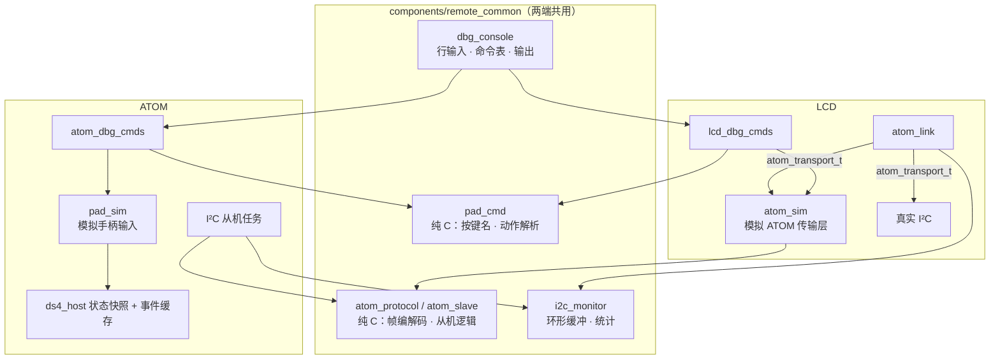
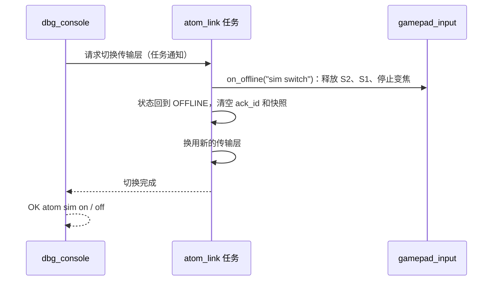

# UART 调试控制台设计

本文是 [UART 调试需求](../request/uart-debug-request.md) 的实现设计，定义两端控制台的行输入、命令注册、输出格式、LCD 的模拟 ATOM、ATOM 的模拟手柄与从机故障注入、I²C 监视，以及主机脚本工具 `tools/uart_script.py`。需求编号（R1.1 等）指需求文档中的条目。

> 部分实现：双端共享 debug_console / debug_line / debug_args，已有 help / version / status / log、请求号及 uart_script.py；LCD 保留 wifi / factory 与相机命令，并支持显示回调故障注入。ATOM 已接 pad_cmd / pad_player、pad sim 与动作序列，经真实 I²C 输入，LCD 标注 SIM。双端 I²C 监视 / 分类统计已接入；ATOM CRC / 丢响应 / 延时已实测；ATOM `i2c req` 已接入同一协议处理任务，Matrix 四角校准与独立强制故障图案已实现，LCD 本地模拟 ATOM 已接入协议客户端并通过构建 / 实机回归。当前命令见 [串口手册](../user-guide/serial.md)。下文接口为目标草案，实际共用代码位于 common/，ATOM 模拟播放器使用 10ms 周期与绝对截止时间；生产选项 CONFIG_REMOTE_DBG_SIM 已接入双端。

## 1. 设计约束

- 控制台任务优先级低于 I²C、蓝牙、相机和解码任务（R1.6）；命令处理函数不阻塞，耗时动作交给专门的任务执行。
- 模拟输入从尽量靠前的位置注入，之后的处理路径与真实链路完全相同；不在业务模块中加入“是否模拟”的分支。
- I²C 收发路径中不直接打印日志；监视数据先写入无锁环形缓冲，由控制台任务输出。
- 模拟状态只保存在 RAM 中，重启后恢复正常模式（R1.8）。
- 模拟和故障注入功能可以整体编译掉（R1.7），编译掉之后状态查询、日志级别和 I²C 监视仍然可用。

## 2. 模块划分



| 模块 | 位置 | 职责 |
| --- | --- | --- |
| `dbg_console` | `components/remote_common/` | UART0 行读取、命令表、参数拆分、`[dbg]` 输出、通用命令 `help` / `version` / `log` |
| `pad_cmd` | 同上 | 按键名称表、`tap` / `hold` / `release` / `stick` / `trigger` / `shoot` / `record` / `seq` 的解析，输出动作序列；纯 C |
| `pad_player` | 同上 | 按时间执行动作序列，调用各端提供的“写入手柄状态”回调 |
| `atom_protocol` / `atom_slave` | 同上 | 版本 2 帧格式、CRC8；从机命令处理（`HELLO` / `POLL`、事件确认、`gap`）；纯 C |
| `i2c_monitor` | 同上 | 帧记录环形缓冲、`i2c log` 过滤、`i2c stats` 计数 |
| `lcd_dbg_cmds` | `main/` | LCD 专用命令；`status` 汇总 |
| `atom_sim` | `main/` | 实现 `atom_transport_t`，内部运行一个 `atom_slave` 实例 |
| `atom_dbg_cmds` | `m5_atom_matrix/main/` | ATOM 专用命令；`status` 汇总 |
| `pad_sim` | `m5_atom_matrix/main/` | 把模拟手柄状态写入 `ds4_host` |

根工程自动包含 `components/` 下的组件；ATOM 工程在 `m5_atom_matrix/CMakeLists.txt` 中加入 `set(EXTRA_COMPONENT_DIRS ../components/remote_common)`。I²C 协议设计中的“两端共用的 `atom_protocol.h`”也放在此组件中。

## 3. 控制台

### 3.1 任务与输入

| 项目 | LCD | ATOM |
| --- | --- | --- |
| 任务名 | `dbg_console`（替代现有 `pair_console`） | `dbg_console` |
| 优先级 | 2 | 2 |
| 栈 | 4096 字节，内部 RAM | 4096 字节 |
| UART | UART0，115200，`uart_driver_install` 接收缓冲 512 字节 | 同左 |

- 逐字节读取，`\r`、`\n` 都作为行结束，`\r\n` 只算一次；空行忽略。
- 行缓冲 160 字节。超长时丢弃到下一个行结束，返回 `ERR line too long`。
- 支持退格（`0x08`、`0x7F`）删除缓冲中的上一个字节；其他控制字符丢弃。
- **不回显输入**。UART 的收和发是两条线，日志输出不会打断正在输入的命令（R1.5）；关闭回显使脚本的日志里不出现重复内容。手动调试需要回显时用 `echo on`，仅在当前运行期间有效。
- 参数拆分使用 `esp_console_split_argv()`，支持双引号和反斜杠转义；命令注册与分派使用 `esp_console_cmd_register()` / `esp_console_run()`。不使用 linenoise REPL：它会向终端发送探测和转义序列，与日志交错时容易乱码，也不适合脚本。

### 3.2 兼容现有单字符命令（R1.2）

一行只有一个字符且为下列之一时，按别名执行：

| 输入 | 等价命令 | 行为 |
| --- | --- | --- |
| `j` / `J` | `cam live` | 开始取景 |
| `s` | `cam stop` | 停止 |
| `S` | `ui settings` | 切换设置界面 |
| `p` / `P` | `cam pair` | 配对诊断 |

`tools/serial_log.py --command j` 发送的是 `j\n`，行为不变。行为变化：在 `idf.py monitor` 中手动输入时，现在需要按回车。不采用“单字符超时自动执行”，因为慢速输入 `status` 时会在第一个 `s` 后误触发停止。

### 3.3 输出格式（R1.3）

```text
[dbg] <内容行>
[dbg] OK <命令名> [摘要]
[dbg] ERR <命令名> <原因>
```

- 每条命令以且仅以一行 `OK` 或 `ERR` 结束；多行结果先输出内容行，最后一行为 `OK`。
- 行首可选请求号：输入 `#12 tap start` 时，该命令的所有输出行为 `[dbg] #12 …`。脚本工具用请求号匹配结果，避免把前一条命令的迟到输出当成本条结果。
- 异步完成的动作（见 3.5）在执行完毕后另输出一行 `[dbg] [#n] DONE <命令名>` 或 `[dbg] [#n] FAIL <命令名> <原因>`。
- 输出函数 `dbg_printf()` 先在栈上格式化整行，再一次性写入 `stdout`。ESP-IDF 的 `stdout` 按调用加锁，保证同一行不会与日志交错；不同行之间可能夹有日志，这是允许的。
- 模拟相关输出带 `SIM` 字样（R7.1），例如 `[dbg] SIM pad connect`。

### 3.4 命令注册

```c
typedef int (*dbg_cmd_fn)(dbg_ctx_t *ctx, int argc, char **argv);

typedef struct {
    const char *name;       /* 第一个词，例如 "atom" */
    const char *usage;      /* help 中显示的语法 */
    dbg_cmd_fn  run;
    bool        sim;        /* 属于模拟 / 故障注入类，CONFIG_REMOTE_DBG_SIM=n 时不注册 */
} dbg_cmd_t;

void dbg_console_start(const dbg_cmd_t *commands, size_t count);
void dbg_ok(dbg_ctx_t *ctx, const char *fmt, ...);
void dbg_err(dbg_ctx_t *ctx, const char *fmt, ...);
void dbg_line(dbg_ctx_t *ctx, const char *fmt, ...);
```

各业务模块不直接依赖控制台；命令处理函数在 `lcd_dbg_cmds` / `atom_dbg_cmds` 中调用模块的公开接口。热点相关的 `wifi`、`factory` 命令见 [Wi-Fi 热点设计](wifi-ap-design.md#串口命令)。

### 3.5 同步与异步命令

| 类型 | 命令 | 返回时机 |
| --- | --- | --- |
| 同步 | 查询、开关、`pad connect`、`stick`、`trigger`、`hold`、`release`、故障注入设置 | 处理完成后立即 `OK` / `ERR` |
| 异步 | `tap`、`shoot`、`record`、`seq` | 解析成功即 `OK queued`，执行完毕输出 `DONE` |

异步动作交给 `pad_player` 任务执行，控制台随时可以接收下一条命令。新的异步动作排在已排队动作之后；`release all`、`atom offline`、`atom sim off`、`pad sim off`、`pad disconnect` 会清空队列并立即执行。

### 3.6 通用命令（R1.4、R1.5）

| 命令 | 输出 |
| --- | --- |
| `help` | 每条命令一行 `usage`；编译掉的模拟命令不列出 |
| `version` | `esp_app_get_description()` 的版本号、编译日期时间、ESP-IDF 版本、I²C 协议版本、`CONFIG_REMOTE_DBG_SIM` 是否启用 |
| `status` | 见第 4 节 |
| `log <tag\|*> <none\|error\|warn\|info\|debug\|verbose>` | 调用 `esp_log_level_set()`，只在本次运行有效；ATOM 已启用 `CONFIG_LOG_MAXIMUM_LEVEL_DEBUG`，LCD 最高级别受 sdkconfig 限制，超出时返回 `ERR` |
| `echo on\|off` | 输入回显 |

## 4. 状态查询（R2）

每个模块提供一个返回快照的函数，在自己的锁内拷贝，控制台只负责格式化：

```c
void atom_link_get_status(atom_link_status_t *out);      /* LCD */
void camera_pair_get_status(camera_status_t *out);       /* LCD，重构后为 camera_controller */
void ds4_host_get_status(ds4_host_status_t *out);        /* ATOM */
void matrix_status_get_snapshot(matrix_status_snapshot_t *out);  /* ATOM */
```

LCD `status` 示例：

```text
[dbg] cam link=LIVEVIEW fps=3.8 last_error=none
[dbg] atom state=ONLINE proto=2 boot_id=0x5c1e09a2 fails=0 sim=off
[dbg] pad link=connected buttons=0x00000 L2=0 R2=0 RX=0 RY=0 battery=8 ack=0x3a7f0c12
[dbg] gimbal link=search
[dbg] mem internal=81234 psram=6012345 min_internal=70112
[dbg] OK status
```

ATOM `status` 示例：

```text
[dbg] lcd seen=yes last_valid_ms=32 bad_cmds=0
[dbg] pad link=connected source=real buttons=0x00000 L=(0,0) R=(0,0) L2=0 R2=0 battery=8
[dbg] events queued=0/128 dropped=0 gap_pending=no
[dbg] gimbal link=off
[dbg] led pattern=normal faults=0x00 forced=0x00
[dbg] i2c drop=0 corrupt=0 delay_ms=0
[dbg] OK status
```

字段名固定，方便脚本用 `expect` 匹配。尚未实现的模块输出 `n/a`。

## 5. 手柄动作命令（R5）

### 5.1 解析：`pad_cmd`

纯 C，不依赖 FreeRTOS。输入一行参数，输出动作数组：

```c
typedef enum {
    PAD_ACT_PRESS,      /* buttons |= mask */
    PAD_ACT_RELEASE,    /* buttons &= ~mask */
    PAD_ACT_STICK,      /* side, x, y */
    PAD_ACT_TRIGGER,    /* side, value */
    PAD_ACT_WAIT,       /* ms */
} pad_act_kind_t;

typedef struct {
    pad_act_kind_t kind;
    uint32_t mask;
    uint8_t  side;      /* 0 = 左 / LT，1 = 右 / RT */
    int16_t  x, y;
    uint16_t value_or_ms;
} pad_act_t;

#define PAD_ACT_MAX 32
int pad_cmd_parse(int argc, char **argv, pad_act_t *out, size_t capacity,
                  const char **error);     /* 返回动作数，负数为错误 */
uint32_t pad_cmd_button_mask(const char *name);  /* 未知名称返回 0 */
```

- 按键名称表与 [I²C 协议的按键位图](i2c-protocol-design.md#按键位图) 一一对应，Xbox 名称和 DS4 名称映射到同一位，不区分大小写（R5.1）。
- `lt` / `rt`（DS4 名称 `l2` / `r2`）也可以用在 `tap` / `hold` / `release` 中，表示扳机半压与松开：`hold rt` 等价于 `trigger rt half`，`release rt` 等价于 `trigger rt off`。需求中的示例 `seq hold rt; wait 300; trigger rt full; …` 依此解释。
- 扳机数字位（L2 / R2）不单独设置，由模拟量推导：模拟量 ≥ 半压阈值时置位，与真实 DS4 报告一致。
- 展开规则：

| 命令 | 展开为 |
| --- | --- |
| `tap a+b 150` | `PRESS(a\|b)`、`WAIT 150`、`RELEASE(a\|b)` |
| `hold rb` | `PRESS(rb)` |
| `hold rt` | `TRIGGER(R, 153)` |
| `release all` | `RELEASE(全部)`、两个 `STICK 0,0`、两个 `TRIGGER 0` |
| `trigger rt half` | `TRIGGER(R, 153)` |
| `shoot` | `TRIGGER(R,153)`、`WAIT 200`、`TRIGGER(R,242)`、`WAIT 200`、`TRIGGER(R,153)`、`WAIT 200`、`TRIGGER(R,0)` |
| `record` | `TRIGGER(L,153)`、`WAIT 200`、`TRIGGER(L,242)`、`WAIT 200`、`TRIGGER(L,0)` |
| `seq A; B; …` | 依次展开各段后拼接；段内不允许再嵌套 `seq` |

- `half`、`full` 取 [扳机状态机](gamepad-design.md#5-扳机状态机) 阈值区间的中间值：半压区间 77–229 取 153，全压区间 230–255 取 242。阈值修改时同步修改此处，主机测试检查两者一致。
- 数值范围：摇杆 -128..127，扳机 0..255，`tap` / `wait` 1..10000 ms；单条命令展开后超过 32 个动作返回 `ERR too many actions`。
- `shoot`、`record` 解析成功时输出一行 `[dbg] SIM WARN camera will receive shutter/record`（R7.2）。

### 5.2 执行：`pad_player`

```c
typedef struct {
    void (*apply)(const pad_sim_state_t *state);   /* 各端提供 */
} pad_player_ops_t;

typedef struct {
    bool     connected;
    uint32_t buttons;
    int8_t   lx, ly, rx, ry;
    uint8_t  l2, r2;
    uint8_t  battery;        /* 0–10，255 不可用 */
} pad_sim_state_t;
```

- 常驻任务 `pad_player`，优先级 3（高于控制台，低于 I²C 和蓝牙），栈 3072 字节，从深度 4 的队列取动作序列。
- 每个非 `WAIT` 动作修改内部的 `pad_sim_state_t` 后调用一次 `apply`；同一时刻的连续动作（例如 `PRESS` 之后紧跟 `STICK`）合并为一次 `apply`。
- `WAIT` 使用 `vTaskDelayUntil()`，以序列开始时刻为基准累加，避免误差积累。两端 `CONFIG_FREERTOS_HZ=1000`，调度粒度 1 ms，满足 ±20 ms（R5.6）。
- 实际时长记录在 `DONE` 行中，例如 `DONE tap elapsed=101ms`，供测试核对。

按键事件由各端的 `apply` 生成，规则与真实手柄相同（R5.5）：按键位图变化入事件缓存；摇杆、扳机模拟量只更新快照。

## 6. LCD 端：模拟 ATOM（R3）

### 6.1 注入位置

`atom_link` 的收发抽象为传输层接口，真实 I²C 和模拟 ATOM 是两个实现：

```c
typedef struct {
    esp_err_t (*probe)(void);
    /* 写请求、等待 T_prepare、读响应；返回 ESP_ERR_TIMEOUT 等与真实 I²C 相同的错误码 */
    esp_err_t (*transact)(const uint8_t *request, size_t request_len,
                          uint8_t *response, size_t response_len);
} atom_transport_t;

void atom_link_set_transport(const atom_transport_t *transport);  /* 只在 atom_link 任务内生效 */
```

模拟 ATOM 在帧层面替换 I²C 总线，而不是在解码之后注入。理由：

- 帧之后的全部路径都与真实链路相同：CRC 校验、`seq` 检查、`HELLO` / `POLL` 状态机、`boot_id` 与 `gap` 处理、事件去重、`gamepad_input`。这比需求 R3.1 要求的“解码之后相同”覆盖更多代码。
- CRC 错误、超时等故障天然发生在帧层面，无需在解码器中加入测试分支。
- 模拟器内部运行与 ATOM 固件相同的 `atom_slave` 代码，事件缓存、`gap`、`local_mask` 行为与真机一致。

`atom sim on` 时 LCD 不再访问 `0x42`，总线上的 IO 扩展器 `0x24` 不受影响。

### 6.2 `atom_sim`

```c
typedef struct {
    bool     online;           /* atom online / offline */
    uint8_t  version;          /* atom version <n>，默认 2 */
    uint16_t fail_left, crc_left, timeout_left;
    pad_sim_state_t pad;
    uint8_t  gimbal_link;
    bool     force_gap, force_overflow;
} atom_sim_t;
```

| 命令 | 实现 |
| --- | --- |
| `atom sim on\|off` | 见 6.3 |
| `atom online` / `atom offline` | `probe` 和 `transact` 分别成功 / 返回 `ESP_ERR_NOT_FOUND`；离线经 3 次失败后由 `atom_link` 判定断开并执行安全释放 |
| `atom reboot` | 重新初始化 `atom_slave`：新的随机 `boot_id`、清空事件缓存 |
| `atom version <n>` | `atom_slave` 以版本 `n` 回应 `HELLO`；`n ≠ 2` 时 LCD 应进入版本不匹配状态 |
| `atom fail <n>` | 接下来 `n` 次 `transact` 返回 `ESP_FAIL` |
| `atom crc <n>` | 接下来 `n` 次响应的 CRC 字节取反 |
| `atom timeout <n>` | 接下来 `n` 次 `transact` 阻塞 100 ms 后返回 `ESP_ERR_TIMEOUT`，与真实超时时序一致 |
| `pad connect` / `disconnect` | `pad.connected`，`link_state` 为 3 / 0 |
| `pad battery <0-10\|none>` | `pad.battery`，`none` 为 255 |
| `gimbal state <off\|search\|connecting\|connected>` | `gimbal_link` 0–3 |
| `pad gap` | 下一个返回的事件强制带 `gap` |
| `pad overflow` | 置故障位 bit 0，下一个事件带 `gap`，与真实溢出一致 |
| 手柄动作 | `pad_player` 的 `apply` 写入 `pad`，按键变化推入 `atom_slave` 的事件缓存 |

- 三个故障计数相互独立，同时设置时按 `timeout` → `fail` → `crc` 的顺序消耗，每次事务只消耗一种。
- `atom_slave` 实例和 `atom_sim_t` 由互斥量保护：控制台和 `pad_player` 写入，`atom_link` 任务在 `transact` 中读取。临界区内只做内存拷贝和帧编码。
- `atom sim` 关闭时，模拟专用命令返回 `ERR atom sim is off`。

### 6.3 进入与退出（R7.3）



- 切换在 `atom_link` 任务内部完成，不在两次 `transact` 之间换掉接口指针。
- 退出模拟时先清空 `pad_player` 队列，再执行上述切换；安全释放由 `gamepad_input` 统一完成，不依赖模拟器再发送“松开”事件。
- 进入模拟时模拟手柄默认为未连接、未按下，需要 `pad connect` 后才有输入。

### 6.4 `SIM` 标记（R7.1）

`atom_sim` 开启时调用显示接口设置 `sim_active`（过渡期为 `board_7b_set_sim(bool)`，重构后由 `ui_presenter` 读取）。连接页标题右侧和状态栏第一项显示黄色 `SIM`。

## 7. ATOM 端：模拟手柄与从机调试（R4）

### 7.1 `pad sim`

`ds4_host` 把蓝牙回调中“解析之后”的部分提取为一个函数，真实输入和模拟输入都经过它：

```c
typedef enum { DS4_SOURCE_REAL, DS4_SOURCE_SIM } ds4_source_t;

void ds4_host_set_source(ds4_source_t source);
/* 更新状态快照；清除 local_mask 后按键位图变化时推入事件缓存 */
void ds4_host_apply_state(ds4_source_t source, const ds4_state_t *state);
```

- `apply_state` 的 `source` 与当前来源不一致时直接丢弃。因此 `pad sim on` 后真实 DS4 报告被忽略，但蓝牙连接本身保持。
- 模拟输入写入与蓝牙回调相同的快照和事件缓存，LCD 通过真实 I²C 读取，无法区分（R4.1）。
- 云台模块读取同一快照，左摇杆和 L3 的模拟输入同样驱动云台（R4.3）。
- `pad sim off`：清空 `pad_player` 队列 → 以模拟来源写入一次“全部松开、摇杆回中、扳机为 0”的状态，生成松开事件 → 切换为真实来源。真实手柄的下一个报告到达后快照恢复。
- 模拟期间 `pad connect` / `disconnect` 控制快照中的 `connected`，以及灯阵读取的手柄 `link_state`。

### 7.2 从机协议与故障注入

ATOM 的 I²C 从机任务（版本 2 中独立出来）调用 `atom_slave_handle()` 处理请求：

```c
/* 返回响应长度；0 表示不响应（帧头不是 0xA5 等） */
size_t atom_slave_handle(atom_slave_t *slave, const uint8_t request[9],
                         uint8_t *response, size_t capacity);
```

| 命令 | 实现位置 | 行为 |
| --- | --- | --- |
| `i2c req <hex>` | 控制台任务，持从机锁调用 `atom_slave_handle()` | 输入 9 字节十六进制（允许空格），以十六进制打印响应及解码后的结果码；不经过总线（R4.4） |
| `i2c drop <n>` | 从机任务 | 接下来 `n` 个合法请求不写发送 FIFO，LCD 读到空 FIFO 数据，按头部错误计为失败 |
| `i2c corrupt <n>` | 从机任务 | 接下来 `n` 个响应的 CRC 字节取反 |
| `i2c delay <ms>` | 从机任务 | 写 FIFO 前等待；0–200 ms，0 为关闭；超过 LCD 写后等待时间即造成失败 |

- `i2c req` 与真实请求修改同一个从机状态：携带 `ack_id` 的 `POLL` 会真的删除事件。LCD 在线时执行该命令输出 `WARN lcd online, request affects live state`，仍然执行。
- `i2c drop` / `corrupt` 只作用于合法请求，非法请求按协议本来就不响应或返回错误码。
- 故障计数用原子变量，控制台写、从机任务读并递减。

### 7.3 事件缓存与灯阵

| 命令 | 行为 |
| --- | --- |
| `pad overflow` | 在 `ds4_host` 锁内调用 `ds4_events` 的测试入口：把 `dropped` 加 1 并置 `gap_pending`，不实际塞满 128 项。灯阵和 LCD 看到的效果与真实溢出相同（R4.6） |
| `led test` | 切换四角校准，每秒左上红、右上绿、右下蓝、左下白；再次执行恢复，`led off` 同时清除强制图案 |
| `led fault <bt\|i2c\|overflow> on\|off` | 在独立 `matrix_debug_t.forced` 中置位；显示优先级按 `fault_mask \| forced_mask` 计算，真实故障不受影响（R4.7） |

强制故障和校准图都只在 RAM 中，重启后清除。

## 8. I²C 监视（R6）

### 8.1 记录

两端在一次事务结束后（LCD 在 `transact` 返回后，ATOM 在写入发送 FIFO 后）调用：

```c
typedef struct {
    uint32_t t_ms;
    uint8_t  req[9];
    uint8_t  resp[35];
    uint8_t  resp_len;
    uint8_t  result;      /* OK、TIMEOUT、BAD_CRC、BAD_HEADER、BAD_SEQ */
    uint16_t elapsed_ms;  /* LCD：写请求开始到读完响应 */
} i2c_frame_rec_t;

void i2c_monitor_record(const i2c_frame_rec_t *rec);   /* 不阻塞 */
```

- 日志关闭时只更新统计计数，直接返回。
- 日志开启时写入 32 项环形缓冲（约 2KiB）；缓冲满时丢弃新记录并累加 `log_dropped`，不等待。控制台任务每 20 ms 取出并打印，打印行之前若有丢弃则先输出 `[dbg] i2c log dropped=<n>`。
- `changes` 模式的比较在记录时完成：忽略递增序号及其依赖 CRC 后，与上一条语义相同且结果为 `OK` 的记录不入缓冲（R6.2）。

### 8.2 输出格式

```text
[dbg] i2c 12345 #a7 POLL  > a5 02 a7 10 12 0c 7f 3a 5b
[dbg] i2c 12345 #a7 POLL  < 5a 02 a7 10 00 1c … 9e OK 18ms
[dbg] i2c 12395 #a8 POLL  < 5a 02 a8 10 00 1c … 00 BAD_CRC 18ms
```

完整一帧约 150 字节，50 ms 一次相当于 3KB/s，占 115200 波特率约四分之一。连续运行时建议使用 `changes`。

### 8.3 统计

| 计数 | LCD | ATOM |
| --- | --- | --- |
| `total` | 事务数 | 收到的完整请求数 |
| `timeout` | `transact` 超时 | — |
| `bad_crc` | 响应 CRC 错误 | 请求 CRC 错误 |
| `bad_header` | 响应头部或命令回显不符 | 帧头、版本、命令码错误 |
| `bad_seq` | 响应 `seq` 不符 | — |
| `max_ms` | 最长事务耗时 | 收到请求到写入 FIFO 的最长耗时 |
| `log_dropped` | 监视缓冲丢弃数 | 同左 |

`i2c stats` 输出上述计数，`i2c stats reset` 清零。计数为 `uint32_t` 原子变量。

## 9. 编译选项（R1.7）

两端的 `main/Kconfig.projbuild` 增加：

```text
config REMOTE_DBG_SIM
    bool "UART debug: simulation and fault injection commands"
    default y
```

| 设置 | 效果 |
| --- | --- |
| `y`（开发默认） | 全部命令可用 |
| `n` | `dbg_cmd_t.sim == true` 的命令不注册；`atom_sim`、`pad_sim`、`pad_player`、`i2c drop/corrupt/delay`、`led fault` 的代码不编译；`ds4_host_set_source()` 固定为真实来源 |

发布构建在 `sdkconfig.defaults` 之外另用一个 `sdkconfig.release` 片段关闭此项。CI 的编译作业对两种设置都编译一次。

## 10. 脚本工具：`tools/uart_script.py`（R8）

### 10.1 用法

```text
python tools/uart_script.py --script SCRIPT [--port NAME=COMx ...] [--reset NAME]
                           [--log build/uart-script.log] [--timeout 3]
```

- `--port` 可以给多次，例如 `--port lcd=COM8 --port atom=COM9`；只有一个端口时可以省略名称，默认名为 `lcd`。
- 所有端口的输出按到达时间写入同一个日志文件，每行加 `[lcd]` / `[atom]` 前缀和相对时间。日志默认写在 `build/`，属于 [通信记录](../README.md#通信记录的公开范围)，不要提交。
- 串口打开方式与 `serial_log.py` 相同（DTR、RTS 先置低，避免意外复位）；`--reset NAME` 时按 `serial_log.py --reset` 的方式复位该设备。

### 10.2 脚本语法

```text
# 注释
@lcd atom sim on            # 发送命令到 lcd，等待 OK
@lcd pad connect
tap start                   # 省略设备名时发送到上一条命令的设备
expect "settings" 2         # 在该设备的输出中等待文本，超时 2 秒
wait 300                    # 本地等待 300 ms，不发送任何内容
!atom version 9             # 期待 ERR，收到 OK 视为失败
expect-any "[dbg] OK" 1     # 在任一设备的输出中等待
```

| 行 | 行为 |
| --- | --- |
| 普通命令 | 自动加上递增的请求号 `#n` 后发送，等待 `[dbg] #n OK` 或 `ERR`；收到 `ERR` 或超时即失败 |
| `!` 开头 | 期待 `ERR`，收到 `OK` 即失败 |
| 异步命令（`tap` 等） | 先等 `OK queued`，再等 `DONE`；`--timeout` 按动作总时长自动延长 |
| `wait <ms>` | 本地延时 |
| `expect <文本> [秒]` | 只匹配该行发送命令之后的新输出，不匹配历史输出 |
| `expect-any` | 同上，匹配所有设备 |

### 10.3 退出码（R8.2）

| 退出码 | 含义 |
| --- | --- |
| 0 | 全部通过 |
| 1 | 某行失败；输出失败行号、原因和最后 20 行日志 |
| 2 | 参数错误、脚本语法错误或串口无法打开 |

### 10.4 仓库自带脚本（R8.3）

放在 `tools/uart_scripts/`：

| 脚本 | 设备 | 验证内容 |
| --- | --- | --- |
| `lcd_start_mode.txt` | LCD | 模拟 ATOM 下 Start 切换界面、LB / RB 切换 Mode |
| `lcd_trigger_cross.txt` | LCD | RT 半压 → LT 半压 → RT 松开 → LT 松开，S1 在 RT 松开时释放，LT 无 S1 动作 |
| `lcd_offline_release.txt` | LCD | RT 全压时 `atom offline`，立即释放 S2、S1 |
| `lcd_i2c_fail.txt` | LCD | `atom fail 2` 不断开；`atom fail 3` 断开后自动重连，重试期间 `seq` 不变 |
| `lcd_gap.txt` | LCD | `pad gap` 后的事件不触发任何动作 |
| `atom_slave_req.txt` | ATOM | `i2c req` 正确帧与 CRC 错误帧 |
| `pair_pad_sim.txt` | LCD + ATOM | ATOM `pad sim on`、`tap start`，LCD 通过真实 I²C 切换界面 |
| `pair_drop.txt` | LCD + ATOM | ATOM `i2c drop 3`，LCD 判定断开后恢复 |

涉及相机的脚本（`shoot`、`record`）不放入默认集合，需要连接相机并手动确认后运行。

## 11. 实施顺序

1. **控制台框架**：建立 `components/remote_common`，实现 `dbg_console`，LCD 用其替换 `pair_console` 并保留单字符别名；ATOM 安装 UART 驱动并启动控制台。先实现 `help`、`version`、`status`、`log`。
2. **脚本工具**：`tools/uart_script.py`，先支持单设备，用第 1 步的命令自测。
3. **ATOM 模拟手柄**：`pad_cmd`、`pad_player`、`ds4_host_apply_state`、`pad sim`。此步不依赖协议版本 2，可在版本 1 上验证“ATOM 不接手柄、LCD 通过真实 I²C 收到事件”。
4. **I²C 监视**：两端 `i2c log` / `i2c stats`。
5. **协议版本 2**：随 [I²C 通信协议](i2c-protocol-design.md#实现清单) 实现 `atom_protocol` / `atom_slave`，ATOM 侧增加 `i2c req/drop/corrupt/delay`。
6. **LCD 模拟 ATOM**：`atom_transport_t`、`atom_sim`、`SIM` 标记。
7. **灯阵调试**：随 [Matrix LED 状态显示设计](matrix-led-design.md) 实现 `led test` / `led fault`。
8. 补齐 `tools/uart_scripts/`，并在 [串口日志工具](../development/serial-log.md) 中加入控制台命令说明。

## 12. 测试

### 主机单元测试

| 测试 | 被测 | 要点 |
| --- | --- | --- |
| `test_pad_cmd` | `pad_cmd.c` | 每个按键名及其别名；大小写；未知名称；`a+b` 组合；`tap` 默认 100 ms；`release all` 展开；`half` / `full` 取值落在 [扳机状态机](gamepad-design.md#5-扳机状态机) 区间内；`seq` 拆分、嵌套拒绝、超过 32 个动作；数值越界 |
| `test_dbg_line` | 行读取函数（与 UART 分离） | `\r`、`\n`、`\r\n`；退格；超长行丢弃后恢复；请求号解析；单字符别名 |
| `test_atom_slave` | `atom_slave.c` | 与 [I²C 协议测试](i2c-protocol-design.md#主机单元测试) 共用；另测 `pad overflow` 测试入口产生 `gap` |
| `test_i2c_monitor` | `i2c_monitor.c` | `changes` 过滤；缓冲满时丢弃计数 |

### 实机测试

验收以 [需求文档](../request/uart-debug-request.md#验收测试) 为准，另外补充：

- 日志高速滚动（`i2c log on`）时连续发送 100 条 `status`，每条都收到对应请求号的 `OK`。
- `tap start 100` 重复 50 次，`DONE` 行中 `elapsed` 均在 80–120 ms 之间。
- 控制台执行 `seq` 期间，取景帧率与不执行时相比下降不超过 5%。
- `CONFIG_REMOTE_DBG_SIM=n` 构建中 `help` 不列出模拟命令，执行 `atom sim on` 返回 `ERR unknown command`。

## LCD 本地模拟实际接入（2026-10-03）

`common/atom_sim` 构造完整响应字节，复用 `atom_receiver` / CRC 和现有纯 C `ds4_events` 队列（从 ATOM 模块编译同一源文件），经原有 `atom_client_response` 输入 HELLO / POLL / ACK / boot_id / gap。`main/lcd_sim` 保存 RAM 模型和 10ms 播放器；mutex 同步协议快照，UART 解析、播放器和通信任务不直接访问彼此的输入状态机。

atom_link 每轮选择实际总线或本地模型，启用模拟时绕过物理 probe / transmit / receive。来源 epoch 改变先调用原有 input_offline，重置客户端和事件基线，防止 UART 两次快速切换被单一 bool 漏掉；来源切换与主动离线使用任务通知打断重连等待。版本与重启走原客户端分支，三次失败仍按同一规则断开。主动 offline 按探测离线处理，不伪造版本不匹配。恢复实际链路重新 HELLO。I²C 统计继续只计物理帧。

关闭 `CONFIG_REMOTE_DBG_SIM` 后只保留空入口，不编译 atom_sim、pad_cmd / pad_player 及本地事件队列。现有 POLL 不传左摇杆，因此只保留解析 / 本地状态，暂不宣称云台输入实现。

异步 token 当前统一由 debug_console 的原子计数器生成，Wi-Fi / UI 偏好 / 手柄动作 / 原始请求共享同一个设备内的编号空间；不同端口按设备隔离。避免触摸板动作引发 UI 完成日志时使用与 pad 同号，误导脚本的 token 匹配。
