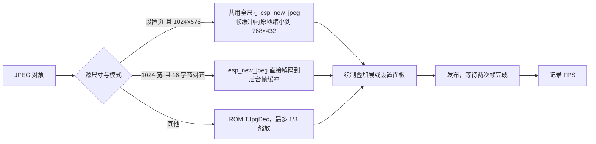

# 界面设计

本文是 [界面显示方案](../request/ui-request.md) 的实现设计，记录当前各画面的布局参数和绘制流程，并定义规划功能（信息显示档位、对焦框、对焦放大和统一提示）的界面状态和绘制规则。2026-10-06 当前已建立 app_ui / display_surface / board_7b 边界，实际进度见 [拆分进度](../development/module-split-status.md)。历史显示目标和 `ui_presenter` 的分工见 [Sony PTP/IP 客户端分层设计](sony-ptpip-design.md#11-显示抽象接口与-board_7b-实现) 第 11 节，本文不重复。

> 第 1–3、7 节按当前 `app_ui/ui_renderer.c`、`ui_model.c` / `camera_menu` 核对当前实现；第 4–6、8 节保留后续目标，部分状态绘制已接入。代码接入与视觉验收分别记录，见 [实施状态](../development/implementation-status.md)。

## 1. 显示参数

| 项目 | 值 |
| --- | --- |
| 分辨率 | 1024×600，RGB565 |
| 取景源图 | 1024×576，居中于 `(0,12)`，上下各 12 像素黑边 |
| 设置页缩略图 | 768×432，位于 `(0,0)`，下方 y ≥ 432 显示扩展参数 |
| 字体 | Inter（英文）、思源黑体（中文）、JetBrains Mono（数字），FreeType 灰度抗锯齿，见 [字体说明](../../components/app_ui/fonts/README.md) |
| 自适应字号 | `fit_font_size()` 从请求字号逐级缩小，直到文字宽度不超过可用宽度，最小 12 像素 |

颜色（RGB565）：

| 用途 | 值 |
| --- | --- |
| 普通文字 | `0xFFFF` 白 |
| 次要提示 | `0x7BEF` 灰 |
| 标题、连接阶段 | `0x07FF` 青 |
| 参数值、弱信号 | `0xFFE0` 黄 |
| 已连接 | `0x07E0` 绿 |
| 断开 | `0xF800` 红 |
| 连接页背景 | `0x1082` |
| 设置面板背景 / 分隔线 | `0x0841` / `0x7BEF` |

## 2. 当前画面布局

### 连接页

背景 `0x1082`，所有文字左边距 48 像素，最大宽度 928 像素。

| 元素 | 位置 `(x,y)` | 字号 | 颜色 |
| --- | --- | --- | --- |
| 标题 `easymcucourse camera console` | (48, 40) | 40，自适应 | 白 |
| `SSID: …` | (48, 130) | 32，自适应 | 白 |
| `Password: …` | (48, 190) | 32，自适应 | 白 |
| `IP: …` | (48, 232) | 22 | 灰 |
| `Expansion unit (ATOM): …` | (48, 270) | 30 | 绿 / 红 |
| `Controller (DS4): …` | (48, 330) | 30 | 绿 / 红 |
| `Gimbal: …`（当前禁用 / 未连接） | (48, 370) | 22 | 灰 |
| 连接阶段文字 | (48, 410) | 24，自适应 | 青 |
| `Connect camera to this Wi-Fi.` | (48, 466) | 24 | 灰 |
| `Enable PC Remote on camera.` | (48, 516) | 24 | 灰 |

SSID、密码和 IP 从动态元数据复制；密码关闭显示时为 `********`。相机离线时按Start/S仍可显示设置面板，Wi-Fi行只信息；配置修改通过启动页Web。

### 预览叠加层

右上角黑底状态框，8 行，英文标签依次为 WIFI、FPS、CAM、FW、BATTERY、手柄电量、MODE、FOCUS，字号 18，内边距 8，距顶部和右边 8 像素；宽度按最长一行计算，最大为屏宽减 16。

| 行 | 内容 | 颜色 |
| --- | --- | --- |
| 0 | `WIFI -60 DBM` / `WIFI --` | 白；RSSI 低于 −75 时黄 |
| 1 | `FPS 3.8` | 白 |
| 2 | `CAM ZV-E10` | 白 |
| 3 | `FW 2.00` | 白 |
| 4 | `BATTERY 75%` / `BATTERY --` | >50% 绿、21–50% 黄、≤20% 红，未知灰 |
| 5 | `DS4: 80%` / `DS4: --`（Xbox 兼容来源为 `XBOX:`） | >50% 绿、21–50% 黄、≤20% 红，未知灰 |
| 6 | `MODE MOVIE A` | 白 |
| 7 | `FOCUS MF` / `FOCUS AF-S` 等 | 白 |

LCD 在相机 BATTERY 下方显示当前手柄电量，DS4 的 0–10 档乘 10 显示估算百分比；未知或断连显示 `--`，不保留旧电量。DS / BLE 手柄与云台电量仍分别显示于 Matrix 第一 / 第二 / 第三行。已确认录像时左上角显示红色 `REC mm:ss`，底部显示 Mode / Focus / Control 状态。录像状态来自回读，计时只用于显示，不证明录像协议效果。

### 设置页

左侧 768×432 缩略图，右侧 x ≥ 768 的 256 像素宽参数面板：背景 `0x0841`，x = 768 处为灰色分隔线。17行，行高28，首行 y = 12，左内边距 8，字号 18 自适应。

| 行 | 内容 | 颜色 |
| --- | --- | --- |
| 0–3 | WIFI、FPS、CAM、FW | 白；RSSI 低于 −75 时黄 |
| 4 | `BATTERY 75%` / `BATTERY --` | >50% 绿、21–50% 黄、≤20% 红，未知灰 |
| 5 | `DS4: 80%` / `DS4: --` | >50% 绿、21–50% 黄、≤20% 红，未知灰 |
| 6–7 | MODE、FOCUS | 黄；Focus 不可写时灰显 |
| 8–14 | SHUTTER、APERTURE、ISO、EV、WB、METER、FLASH | 黄；不可写参数灰显 |
| 15 | `MORE (A enter)` | 黄 |
| 16 | `WI-FI (Web settings)` | 黄 |

独立DS4 CONNECTED/DISCONNECTED行已移除，电量行保留。前八行顺序与LIVE相同。光标在Focus、Shutter、Aperture、ISO、EV、WB、Meter、MORE、Wi-Fi九项循环，ID固定，初始Focus。相机枚举左右首尾循环，缺完整枚举的快门/光圈保留相对步进。高亮0x1947，状态y=542/目标y=570。Wi-Fi只显示信息，维护与热点编辑菜单及二次确认已删除；MORE子菜单保持。当前视觉尚待实机验收。

数值格式：ISO 低 24 位，`0x00FFFFFF` 为 AUTO；快门高 16 位 / 低 16 位为分子 / 分母，0 为 BULB；光圈为 F 值 ×100；EV 为 ×1000；枚举按属性代码查表，未收录时显示十六进制。

## 3. 当前绘制流程



- 全屏原尺寸、全宽且满足解码输出对齐时，只清除上下黑边；解码覆盖整个图像区域，包括上一帧叠加层。缩略图及 ROM 路径仍整屏清零，再解码和绘制。
- FPS 以成功发布的帧间隔统计，约每秒更新；超过 2 秒无新帧时归零重新统计。
- 连接阶段、ATOM / DS4、热点文本及菜单更新会触发连接页或离线设置面板重绘；JPEG 运行时按当前模式绘制。

## 4. 界面状态（规划）

`ui_presenter` 持有以下状态，全部由手柄动作和 `camera_model` 驱动：

```c
typedef enum { UI_SCREEN_CONNECTION, UI_SCREEN_LIVE, UI_SCREEN_SETTINGS } ui_screen_t;
typedef enum { UI_INFO_FULL, UI_INFO_COMPACT, UI_INFO_HIDDEN } ui_info_level_t;

typedef struct {
    ui_screen_t     screen;
    ui_info_level_t info_level;       /* NVS 保存 */
    uint8_t         menu_cursor;      /* SETTINGS 中的光标行 */
    bool            focus_box_on;
    float           green_u, green_v; /* 绿框归一化坐标 0..1 */
    struct { char text[16]; display_tone_t tone; int64_t until_us; } toast;
} ui_state_t;
```

屏幕切换规则：链路不在 `LiveView` 时为 CONNECTION；第一帧显示后为 LIVE；Start 在 LIVE / SETTINGS 间切换；取景断开回到 CONNECTION，但保留 `info_level` 和 SETTINGS 偏好。

## 5. 状态栏与信息显示档位（部分已接入）

当前ui_preferences.c在启动时通过common_runtime只读加载schema1/pad/info并发布原子快照；失败或未来版本用RAM默认值且不覆该存储。无偏好task/queue/writer，正常message仅GET；UART参数设置与触摸板循环写入已删除。Web保存后重启加载。信息档位只作用于 LIVE；SETTINGS 保持菜单、命令状态与录制计时。全显保留右上相机电量 / 对焦，精简保留录像计时、≤20% 电量告警和拒绝 / 超时，隐藏只保留录像红点；所有档位在模拟时继续显示 SIM。下一张成功解码的取景帧应用叠加策略。部分其他状态条目继续规划。

状态栏条目按优先级排列，空间不足时从低优先级开始省略：

| 优先级 | 条目 | 全显 | 精简 | 隐藏 |
| --- | --- | --- | --- | --- |
| 1 | `REC` 红点 + 时长 | ✓ | ✓ | 只显示红点 |
| 2 | 命令提示（精简仅 `REJECTED` / `TIMEOUT`） | ✓ | ✓ | — |
| 3 | 相机电量告警（≤20%） | ✓ | ✓ | — |
| 4 | `MF` / `MF BOX`、`MAG ×n` | ✓ | — | — |
| 5 | `BATTERY 75%`、对焦模式 | ✓ | — | — |
| 6 | WIFI、FPS、CAM、FW、MODE | ✓ | — | — |

对焦框尚未接入，目标是在三个档位都绘制。

## 6. 对焦框坐标（规划）

所有位置使用以取景图像为基准的归一化坐标 `(u, v)`，`u, v ∈ [0, 1]`，左上为 `(0, 0)`：

| 画面 | 图像区域 | 屏幕坐标 |
| --- | --- | --- |
| LIVE | `(0,12)`–`(1023,587)` | `x = u × 1024`，`y = 12 + v × 576` |
| SETTINGS | `(0,0)`–`(767,431)` | `x = u × 768`，`y = v × 432` |

- 相机坐标与 `(u, v)` 的换算待抓包确认属性 `0xD2DC` 的取值范围后补充。
- 绿框边长为图像宽度的 8%，线宽 3 像素；红框同尺寸，线宽 2 像素。两框重合时只画绿框。
- 绿框移动受限于图像区域，框体不越过边缘。

## 7. 设置菜单（已接入）

- 画面导航顺序为Focus、Shutter、F-Number、ISO、EV、WB、Metering、MORE、Wi-Fi；光标背景 `0x1947`。
- 缺失能力或不可写项灰显，光标可经过，左右不发送写入。
- 参数行始终保留相机回报的实际值；底部另外显示目标与 PENDING。选中参数的 APPLIED / REJECTED / TIMEOUT 终态保留 3 秒。
- 参数目标合并、500 ms 待确认刷新与 10 秒超时见 [设置菜单设计](camera-menu-design.md)，Web设置与重启规则见 [Wi-Fi 设计](wifi-ap-design.md)。

## 8. 提示信息（规划）

| 提示 | 色调 | 显示时长 |
| --- | --- | --- |
| `PENDING` | ACCENT | 直到状态变化，最长 2 秒 |
| `REJECTED` | BAD | 2 秒 |
| `TIMEOUT` | WARN | 2 秒 |
| `NO ZOOM` | WARN | 1.5 秒 |

提示显示在状态栏下方，不进入画面中心 50% 区域。同时只显示一条，新提示覆盖旧提示。

## 9. 性能

- 设置页复用全屏解码器，在 LCD 帧缓冲原地最近邻缩小为 768×432，保留 1024 像素行距；缩小按从上到下、从左到右顺序，不申请额外图像缓冲。右侧及下方非图像区域清零后绘制参数。`JPEG phases us` 分别记录清零、头部准备、解码、行距搬移、叠加层和 LCD 发布；网络事务耗时仍由 `LIVEVIEW read` 记录。先据实测确定优化方向。
- 叠加层内容约每秒才变化一次（FPS），可缓存渲染结果，内容 `revision` 不变时直接贴图。
- 原尺寸全宽路径已改为只清黑边，其他路径保持完整清零。切换解码路径时释放未使用的解码器，最多保留一个全尺寸实例，LIVE / SETTINGS 共用；取消库内缩放实例，避免在线取景内存不足导致断连。

## 10. 测试

- 主机：`ui_build_status_screen` / `ui_build_overlay` 生成的行、色调与第 2 节一致；各档位条目取舍正确；归一化坐标换算在边界处不越界。
- 主机：`tools/font_preview_host` 输出连接页、参数面板截图，人工比对。
- 实机：三种画面切换、FPS 显示、断开返回连接页；规划功能按 [界面显示方案](../request/ui-request.md#验收测试) 验收。

### 截图参数扩展

设置页缩略图下方 `(0,432)`–`(767,599)` 增加两列五行只读参数，字号 18、行距 32。九项为画幅、驱动模式、照片效果、DRO、对焦区域、无线闪光、白平衡色温、白平衡 AB/GM 原始微调编码。白平衡模式、对焦模式、测光和闪光模式仍在右栏。未知枚举显示完整十六进制；缺失属性显示 `--`。无线闪光与白平衡微调尚未完成值映射验证，显示 RAW/十六进制，不猜测 ON/OFF 或 ±补偿值。扩展属性仅在整份 0x9209 数据集验证成功后发布。

### 录像红框与扩展子菜单（2026-10-03）

LIVE 在相机回读录像状态为录制中时绘制四像素 RGB565 红框（0xF800），所有信息档位均显示，位于最后叠加阶段；停止回读后的下一帧不再绘制。SETTINGS 不绘制外框。

MORE 按 A 打开右侧扩展面板，九项扩展参数从 y=44 开始、行距44，底部第十项 EXIT 按 A 返回，B同样返回；Start退出设置页时关闭子菜单。参数值与待确认目标分别显示，状态位于 y=510，TO目标位于y=542。主菜单属性ID不变，子菜单参数映射到7–15，EXIT为16，仅导航，不向相机写入。子菜单先分派，Wi-Fi主行只返回信息，不与扩展属性ID混用。

## 11. 生命周期与独占维护

UI public仅app_ui.h，Core生命周期/启动网络信息/健康查询。model/setters/menu/JPEG/Debug接口归private，其他功能组件只能typed UI消息，不能取得surface。JPEG与benchmark都调用同一ui_jpeg_renderer；UI endpoint承担解码，无额外JPEG worker。显示/decoder缓存由display_mutex串行，Connection refresh32768-byte PSRAM CPU1/prio2与endpoint32768 CPU1/prio4由Core停止。

normal admission关闭后先取消benchmark与普通writer，等待JPEG lease/completion、UI endpoint及renderer users退出；Core在前置owners排空成功后才ui_model_freeze_and_clear。它是依赖join前提下的永久freeze，不是独立并发setter屏障。保留健康标志/锁/单调generation，清空普通文本/菜单/属性/状态；renderer清旧连接缓存。之后只黑底白字48px居中MAINTENANCE，其他JPEG/overlay/menu/connection/Debug请求拒绝，不恢复正常模式。面板/font/cache保留用于固定画面。见 [资源表](module-resource-ownership.md)及 [清空记录](../records/module-ui-clear-20261006.md)。

## 12. 当前测试范围

原overlay基线使用legacy头保留原asserts；当前生产model/messages/frames/endpoint/renderer stop另有真实源码测试。display_surface验证duplicate acquire、timeout、cancel/reacquire、copy/stale lease、publication failure拒绝写入与recover generation；board fake验证buffer所有权/旧回调/恢复。

ui_frames/endpoint/bench的app_ui_show_jpeg是stub，证明lease/路由/排空。另新增Debug/Release真实ui_jpeg_renderer控制流测试，覆盖header/尺寸/输出长度/alloc/open/fast部分decode/ROM部分tile失败不publish、canvas取消、cache reset和后续good、publication失败禁写/恢复以及settings缩小和Debug合成图同入口。解码库/画布backend仍为stub，不能证明真实JPEG像素质量或RGB同步；历史liveview_pipeline不当作当前renderer覆盖。见 [renderer记录](../records/module-jpeg-renderer-20261006.md)。完整证据见 [清单](../development/module-split-checklist.md)。
