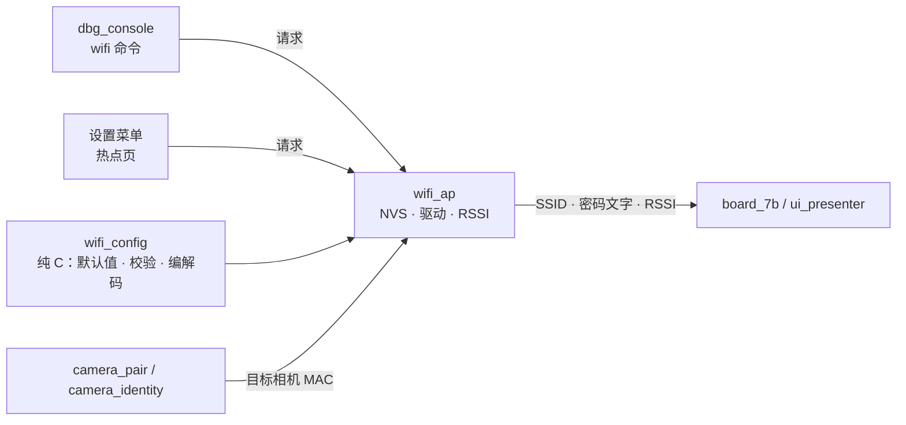
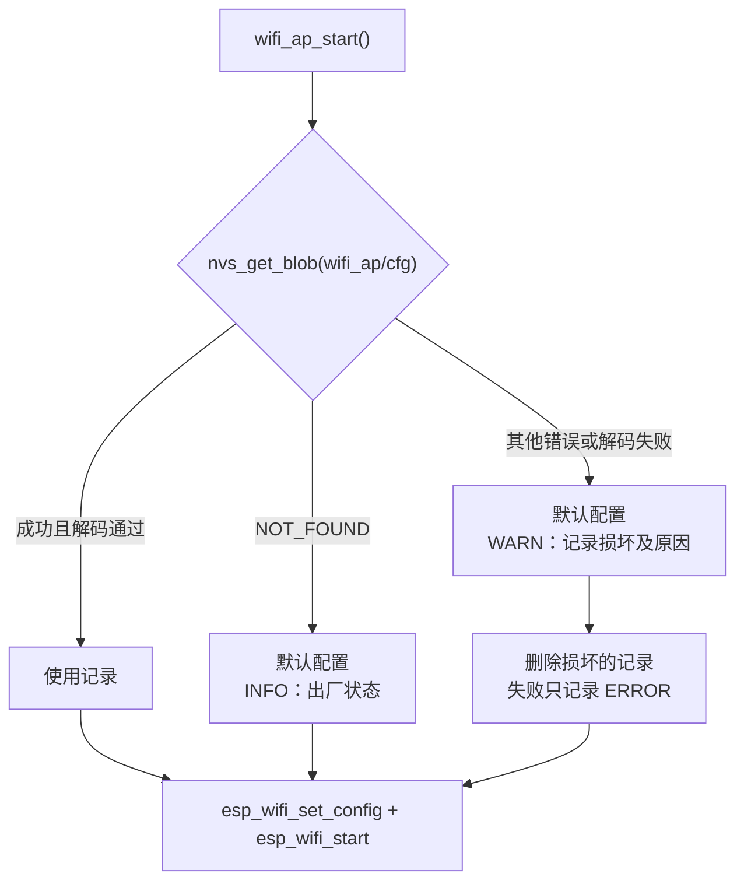

# Wi-Fi 热点设计

本文是 [Wi-Fi 热点需求](../request/wifi-ap-request.md) 的实现设计，定义热点配置的数据结构、默认值、NVS 持久化、校验、生效流程、相机 RSSI、显示（含 IP 地址）与恢复出厂设置。需求编号（R1.1 等）指需求文档中的条目。

> 草案：本设计尚未实现。当前实现见需求文档“当前实现”一节。

## 1. 设计约束

- 热点配置只有一个数据源：本模块在 NVS 中保存的记录。Wi-Fi 驱动继续使用 `WIFI_STORAGE_RAM`，不让驱动自行保存一份配置，避免两份配置不一致。
- 配置读取失败不得导致无法启动（R3.2）：任何 NVS 错误都回退到默认配置并记录日志，不调用 `ESP_ERROR_CHECK`。
- 密码不写入日志。日志只输出 SSID、信道和密码长度；串口只在显式请求时输出密码明文（见第 8 节）。原因见 [通信记录的公开范围](../README.md#通信记录的公开范围)。
- 重启热点可能耗时数百毫秒，不得在 `atom_link`、`camera_pair`、`jpeg_decode` 等实时任务中执行。
- 相机配对身份（NVS 命名空间 `sony_remote`）与热点配置分开保存，修改热点或只重置热点都不影响配对（R2.4、R5.1）。

## 2. 模块划分



| 模块 | 文件 | 职责 | 依赖 |
| --- | --- | --- | --- |
| `wifi_config` | `main/wifi_config.c/.h` | 默认配置常量、随机密码生成、字段校验、NVS 记录编解码 | 无（纯 C，可主机测试） |
| `wifi_ap` | `main/wifi_ap.c/.h` | 加载与保存配置、启动与重启热点、恢复出厂、客户端查询、目标相机 RSSI | ESP-IDF Wi-Fi、NVS、`wifi_config` |

`wifi_ap` 新增常驻任务 `wifi_ap`（优先级 2，栈 4096 字节，内部 RAM），串行处理“应用配置”“恢复出厂”请求，并周期更新 RSSI。`app_main` 主循环中的 `wifi_ap_log_clients()` 调用移入该任务。

## 3. 数据结构

```c
#define WIFI_SSID_MAX      32
#define WIFI_PASSWORD_MIN  8
#define WIFI_PASSWORD_MAX  63

typedef struct {
    char    ssid[WIFI_SSID_MAX + 1];         /* NUL 结尾，1–32 字节 */
    char    password[WIFI_PASSWORD_MAX + 1]; /* NUL 结尾，8–63 个可打印 ASCII */
    uint8_t channel;                         /* 1–13 */
    bool    show_password;                   /* 连接页是否显示明文，R4.2 */
} wifi_ap_config_t;
```

加密方式固定为 WPA2-PSK、不要求 PMF，最大客户端数固定为 4，不放入配置（R1.3）。

### NVS 记录

| 项目 | 值 |
| --- | --- |
| 命名空间 | `wifi_ap` |
| 键 | `cfg`，blob |
| 内容 | 下表，小端，固定 100 字节 |

| 偏移 | 长度 | 字段 |
| --- | --- | --- |
| 0 | 1 | `version`，当前为 `1` |
| 1 | 1 | `channel` |
| 2 | 1 | `flags`：bit 0 `show_password`，其余为 0 |
| 3 | 1 | `ssid_len` |
| 4 | 32 | `ssid`，不足部分填 0 |
| 36 | 1 | `password_len` |
| 37 | 63 | `password`，不足部分填 0 |

NVS 本身对 blob 带 CRC，记录内不再加校验。解码时逐项检查：blob 长度为 100、`version == 1`、长度字段在范围内、内容通过第 5 节的校验；任一项不满足即视为损坏。以后增加字段时提高 `version`，旧版本记录由解码函数迁移，未知的新版本按损坏处理。

## 4. 默认配置（R1）

默认配置是固定常量，所有设备相同：

| 项目 | 值 |
| --- | --- |
| SSID | `easycamctrl` |
| 密码 | `00000000` |
| 信道 | 6 |
| 显示密码 | 开启 |

```c
#define WIFI_DEFAULT_SSID      "easycamctrl"
#define WIFI_DEFAULT_PASSWORD  "00000000"
#define WIFI_DEFAULT_CHANNEL   6

void wifi_config_make_default(wifi_ap_config_t *out);
```

- 默认值不写入 NVS。NVS 中没有记录即表示“出厂状态”，恢复出厂设置只需删除记录。
- 固定的简单密码是需求中有意的选择（相机屏幕键盘输入困难），代价是附近任何知道默认值的人都能加入热点。缓解措施：
  - 维护页面另有屏幕 PIN 保护，加入热点不等于能修改配置或上传固件，见 [维护页面设计](maintenance-design.md#52-登录与会话r2)；
  - 相机首次配对需要在相机上确认，加入热点的其他设备无法冒用本设备的配对身份；
  - 当前密码等于默认值时，连接页密码行行尾显示黄色 `DEFAULT`，提示用户可以修改。

`NEW PASSWORD`（手柄菜单）、`wifi newpass`（串口）和网页“生成随机密码”仍生成随机密码，供需要更高安全性的用户使用：

- 12 个字符，字母表为 `abcdefghjkmnpqrstuvwxyz23456789`（去掉易混淆的 `i l o 0 1`），约 59 位熵。
- 随机数取自 `esp_fill_random()`；这些入口只在热点运行后可用，射频已开启，熵源有效。
- 字符选取使用拒绝采样（随机字节 ≥ 248 时丢弃重取），避免取模偏差。

```c
typedef void (*wifi_random_fn)(void *buffer, size_t length);

void wifi_config_make_password(char out[WIFI_PASSWORD_MAX + 1], wifi_random_fn random);
```

## 5. 校验（R2.2）

```c
typedef enum {
    WIFI_CFG_OK,
    WIFI_CFG_SSID_EMPTY,
    WIFI_CFG_SSID_TOO_LONG,
    WIFI_CFG_SSID_BAD_CHAR,
    WIFI_CFG_PASSWORD_TOO_SHORT,
    WIFI_CFG_PASSWORD_TOO_LONG,
    WIFI_CFG_PASSWORD_BAD_CHAR,
    WIFI_CFG_CHANNEL_RANGE,
} wifi_cfg_error_t;

wifi_cfg_error_t wifi_config_check_ssid(const char *ssid);
wifi_cfg_error_t wifi_config_check_password(const char *password);
wifi_cfg_error_t wifi_config_check_channel(unsigned channel, unsigned max_channel);
const char *wifi_config_error_text(wifi_cfg_error_t error);  /* 串口与界面提示共用 */
```

| 字段 | 规则 | 说明 |
| --- | --- | --- |
| SSID | 1–32 字节；不含 `0x00–0x1F`、`0x7F` | 按字节计长度，允许 UTF-8；控制字符会破坏界面和日志 |
| 密码 | 8–63 个字符，每个在 `0x20–0x7E` 之间 | 允许空格；64 位十六进制 PSK 形式不支持 |
| 信道 | 1 至 `max_channel` | `max_channel` 由国家码决定，见下文 |

错误文字为英文短句（例如 `password must be 8-63 printable ASCII characters`），串口 `ERR` 行和界面提示共用，满足“拒绝保存并提示原因”。

### 国家码与信道

ESP-IDF 默认国家码为 `01`，只允许信道 1–11，此时 SoftAP 设置信道 12、13 会失败。启动时用 `esp_wifi_set_country_code()` 设置固定国家码，取值由 Kconfig `APP_WIFI_COUNTRY` 指定，默认 `JP`（信道 1–13）。`max_channel` 从 `esp_wifi_get_country()` 读出的范围计算，不在代码中写死 13。

ZV-E10 能否加入信道 12、13 的热点待实机验证。

## 6. 加载与启动



- 记录损坏时删除该记录，下次启动按出厂状态处理，不再重复报警。日志明确提示“热点配置已恢复为默认值”，相机需按默认 SSID 和密码重新连接。
- `nvs_open` 本身失败（例如 NVS 未初始化）时使用默认配置，热点照常启动。
- 启动日志：`AP READY: SSID=<ssid> channel=<n> WPA2-PSK password_len=<n> IP=<ip>`，不输出密码；IP 从网络接口读取。

## 7. 修改与生效（R2.4）

所有修改都通过同一个请求接口进入 `wifi_ap` 任务，按顺序执行：

```c
typedef enum { WIFI_AP_RESET_NONE, WIFI_AP_RESET_WIFI, WIFI_AP_RESET_ALL } wifi_ap_reset_t;

/* 调用方先用 wifi_config_check_* 校验；本函数再校验一次。 */
esp_err_t wifi_ap_request_apply(const wifi_ap_config_t *config, TickType_t wait);
esp_err_t wifi_ap_request_reset(wifi_ap_reset_t level, TickType_t wait);
void      wifi_ap_set_show_password(bool show);              /* 只写 NVS，不重启热点 */
void      wifi_ap_get_config(wifi_ap_config_t *out);         /* 加锁拷贝 */
```

- `wait` 为 0 时只入队，立即返回（界面使用，结果通过提示显示）；非 0 时等待完成或超时（串口使用，便于返回 `OK` / `ERR`）。请求队列深度 2，满时返回 `ESP_ERR_INVALID_STATE`。
- 执行步骤：

  1. 再次校验；失败直接返回，不改动任何状态。
  2. 与当前配置比较；完全相同时直接返回成功。
  3. 写入 NVS 并 commit。失败时返回错误，热点保持旧配置，不进入下一步。
  4. 更新内存中的配置（加锁）。
  5. 只改 `show_password` 时到此结束；否则 `esp_wifi_stop()` → `esp_wifi_set_config()` → `esp_wifi_start()`。
  6. 通知显示更新 SSID 和密码文字，并按变化内容给出提示。

- 第 5 步失败时（理论上校验已通过，不应发生）回滚到旧配置：写回 NVS 并用旧配置重启热点，记录 `ERROR`。
- 热点重启会断开相机，现有取景重试逻辑负责重连，本模块不直接调用相机模块。

| 变化内容 | 提示 | 相机侧 |
| --- | --- | --- |
| 只改信道 | `Wi-Fi restarted` | SSID 和密码不变，相机预计自动重连（待验证） |
| 改 SSID 或密码 | `Reconnect camera to new Wi-Fi` | 需要在相机上重新选择热点并输入密码；配对身份不变，不需要重新确认配对 |

## 8. 修改入口

### 串口命令

命令注册在 [UART 调试控制台](uart-debug-design.md) 中，输出格式遵循控制台约定（`[dbg] OK` / `[dbg] ERR <原因>`）。参数含空格时用双引号。

| 命令 | 行为 |
| --- | --- |
| `wifi show` | 输出 SSID、信道、密码长度、显示密码开关、客户端列表（MAC、IP、RSSI） |
| `wifi show password` | 同上，另输出密码明文 |
| `wifi set <键> <值> [<键> <值>…]` | 键为 `ssid`、`password`、`channel`；全部校验通过后一次保存，只重启一次热点 |
| `wifi newpass` | 生成新的随机密码并生效，输出新密码 |
| `wifi display on\|off` | 连接页是否显示密码明文 |
| `factory wifi` / `factory all` | 进入恢复出厂确认，10 秒内需要 `factory confirm` |
| `factory confirm` | 执行待确认的恢复出厂；没有待确认请求时返回 `ERR nothing to confirm` |

示例：`wifi set ssid "My Cam AP" password "abc def 123" channel 11`。

### 手柄设置菜单

在 SETTINGS 参数菜单末尾增加 `WI-FI ›` 一项，进入后右侧面板改为热点页，布局沿用设置面板（256 像素宽、行高 38、字号 18）：

| 行 | 内容 | 操作 |
| --- | --- | --- |
| 0 | `WI-FI HOTSPOT` | 标题 |
| 1 | `SSID easycamctrl` | 确认键进入 SSID 编辑 |
| 2 | `PASS 00000000` / `PASS ********` | 只显示 |
| 3 | `NEW PASSWORD` | 确认键生成新密码（草稿） |
| 4 | `CHANNEL ‹ 6 ›` | 左 / 右在 1 至 `max_channel` 间调整（草稿） |
| 5 | `SHOW PASS ON` / `OFF` | 左 / 右切换，立即保存，不重启热点 |
| 6 | `APPLY` | 草稿与当前配置不同时可用，执行“修改与生效” |
| 7 | `RESET WI-FI` | 恢复出厂（只热点），需二次确认 |
| 8 | `RESET ALL` | 恢复出厂（全部），需二次确认 |
| 9 | `BACK` | 放弃草稿，回到参数菜单 |

- 上 / 下移动光标，与参数菜单一致。确认键和返回键的分配在 [手柄控制方案](../request/gamepad-request.md) 中确定（建议 A / B）；热点页内这两个键不触发变焦。
- SSID、密码、信道的修改先进入草稿，有未应用的草稿时行尾显示 `*`，`APPLY` 后才保存。
- **SSID 编辑**：只提供字符集 `a–z`、`0–9`、`-`、`_`。左 / 右移动字符位置，上 / 下切换当前位置的字符，确认键结束编辑，返回键放弃。更多字符只能通过串口设置。
- **密码**：不提供逐字输入，只能“重新生成”（R2.3 允许的替代方式）；自定义密码通过串口设置。
- **二次确认**：在 `RESET …` 行第一次按确认键后，该行变为 `PRESS AGAIN` 并保持 3 秒；3 秒内再按一次才执行，移动光标或超时即取消。
- 热点页只在 SETTINGS 中可达；取景断开回到连接页时放弃草稿。

### 网页维护页面

手柄只能编辑有限字符的 SSID、不能输入自定义密码。需要任意 SSID 和密码时，在连接页或设置菜单开启维护模式（取景中开启会先停止取景，相机连上后维护模式自动关闭），用手机或电脑浏览器打开 `http://192.168.4.1/` 修改。网页通过 `wifi_ap_request_apply(config, 0)` 提交，校验函数和错误文字与串口相同，详见 [维护页面设计](maintenance-design.md#6-热点设置r4)。

## 9. 显示（R4）

- 连接页的 SSID 行显示当前 SSID；密码行在 `show_password` 开启时显示明文，否则显示 `********`（R4.2）。密码等于默认值时行尾加黄色 `DEFAULT`（见第 4 节）。
- **IP 地址（R4.4）**：连接页在密码行下方新增 `IP: 192.168.4.1` 一行。
  - 地址在 `WIFI_EVENT_AP_START` 处理中用 `esp_netif_get_ip_info(ap_netif)` 读取，格式化为点分十进制后提交显示；界面代码不写死地址。维护页面信息框中的 URL 使用同一个值。
  - 热点启动前（开机初期、热点重启期间）显示 `IP: --`；收到 `WIFI_EVENT_AP_STOP` 时也提交 `--`。
  - 现有连接页各行纵向位置调整如下，字号不变；其余行（连接阶段文字和两行提示）位置不变：

    | 行 | 现在 y | 调整后 y | 字号 |
    | --- | --- | --- | --- |
    | `SSID: …` | 130 | 120 | 32 |
    | `Password: …` | 190 | 170 | 32 |
    | `IP: …`（新增） | — | 220 | 32 |
    | `Expend unit (ATOM): …` | 270 | 285 | 30 |
    | `Controller (DS4): …` | 330 | 340 | 30 |

  - 过渡期接口为 `board_7b_set_ip_text(const char *ip_or_null)`；重构后由 `ui_presenter` 从 `wifi_ap_get_ip()` 读取。
  - 取景画面和设置面板不显示 IP。
- 当前 `board_7b_init(ssid, password)` 只在启动时传入一次文字。过渡期新增 `board_7b_set_wifi_text(const char *ssid, const char *password_text)`，由 `wifi_ap` 在启动和每次生效后调用，`password_text` 已按开关处理。完成 [显示抽象](sony-ptpip-design.md#115-板级对象board_7bh) 重构后，改由 `ui_presenter` 从 `wifi_ap_get_config()` 生成文字，`board_7b` 不再接收凭据。
- 热点页和串口 `wifi show password` 是唯一不受开关影响、可以看到明文的位置。

## 10. 相机 RSSI（R4.3）

当前 `wifi_ap_log_clients()` 取 `clients.sta[0]`，有手机同时连接时可能显示手机的信号。改为按目标相机的 MAC 查找：

```c
void wifi_ap_set_target_mac(const uint8_t mac[6]);   /* NULL 表示没有目标 */
```

- 目标 MAC 由相机模块提供：当前为 `camera_pair.c` 中写死的相机 MAC；重构后由 `camera_identity` 在配对或加载记录时设置。
- `wifi_ap` 任务每 2 秒调用一次 `esp_wifi_ap_get_sta_list()`，在列表中找到目标 MAC 时提交其 RSSI，否则提交“无值”。
- 状态栏无值时显示 `WIFI --`（当前为 `WIFI -- DBM`，随本改动统一）。
- 客户端列表日志仍每 10 秒输出一次。

## 11. 恢复出厂设置（R5）

| 级别 | 动作 | 之后 |
| --- | --- | --- |
| 只热点（`WIFI_AP_RESET_WIFI`） | 擦除 `wifi_ap` 命名空间 → 载入默认配置（`easycamctrl` / `00000000` / 信道 6）→ 按第 7 节重启热点 | 不重启设备；相机按默认 SSID 和密码重新连接热点，无需重新配对 |
| 全部（`WIFI_AP_RESET_ALL`） | 擦除 `wifi_ap`；调用相机身份的清除接口擦除 `sony_remote`（GUID 和配对记录） | 记录日志后 `esp_restart()`，下次启动为出厂状态；相机需要重新配对 |

- 全部恢复出厂只清除本项目的命名空间，不调用 `nvs_flash_erase()`，避免误删 PHY 校准等其他数据。
- 擦除失败时返回错误，不重启，界面和串口显示原因。
- 二次确认在入口一侧完成（串口 `factory confirm`、界面 `PRESS AGAIN`），`wifi_ap_request_reset()` 本身不再确认。
- 无法进入界面和串口时，按 [故障排查与恢复](../user-guide/troubleshooting.md) 擦除 NVS（R5.3）。

## 12. 并发

| 数据 | 写者 | 读者 | 保护 |
| --- | --- | --- | --- |
| 当前配置 | `wifi_ap` 任务 | 串口、界面、显示 | 互斥量，读取方拿拷贝 |
| 请求队列 | 串口任务、界面 | `wifi_ap` 任务 | FreeRTOS 队列 |
| 目标 MAC | 相机模块 | `wifi_ap` 任务 | 临界区，6 字节拷贝 |
| RSSI | `wifi_ap` 任务 | 绘制 | 原子变量（沿用现有 `wifi_rssi`） |

Wi-Fi 驱动调用（`esp_wifi_stop/set_config/start`）只在 `wifi_ap` 任务中进行；`wifi_ap_start()` 在创建任务之前完成首次启动。

## 13. 测试

### 主机单元测试 `test_wifi_config`

- SSID：0、1、32、33 字节；含 `0x1F`、`0x7F`；多字节 UTF-8 恰好 32 字节。
- 密码：7、8、63、64 个字符；含 `0x1F`、`0x7F`、非 ASCII；含空格。
- 信道：0、1、`max_channel`、`max_channel + 1`；`max_channel` 为 11 和 13 两种情况。
- 默认配置为 `easycamctrl` / `00000000` / 信道 6 / 显示密码，且自身能通过校验。
- 随机密码：长度 12，只含字母表字符；用固定随机序列验证拒绝采样（输入 ≥ 248 的字节被跳过）。
- 记录编解码往返；长度不为 100、版本为 0 或 2、长度字段越界、内容不合法时解码失败。

### 实机测试

验收以 [需求文档](../request/wifi-ap-request.md#验收测试) 为准，另外补充：

- 用 `nvs_set_blob` 写入 50 字节的 `cfg`，确认以默认配置启动、日志为 `WARN` 且损坏的记录已删除；再次重启不再报警。
- 开机过程中观察连接页：先显示 `IP: --`，热点启动后变为 `IP: 192.168.4.1`；`wifi set channel 11` 重启热点期间短暂显示 `--` 后恢复。
- 改信道 12、13 后确认 ZV-E10 能否加入（待验证）。
- 应用配置过程中连续发送第二个请求，确认按顺序执行或返回队列满，不交错。
- 全部恢复出厂后确认 `ds4_host`（ATOM 侧）和 PHY 数据不受影响，相机重新出现配对确认。

## 14. 实施步骤

1. 新增 `wifi_config.c/.h` 和主机测试。
2. `wifi_ap` 改为从 NVS 加载配置，删除 `AP_SSID` / `AP_PASSWORD` 宏；`board_7b_init()` 改用加载后的配置。
3. 新增 `wifi_ap` 任务、请求队列和 RSSI 按 MAC 查找，主循环中移除客户端查询。
4. 随 [UART 调试控制台](uart-debug-design.md) 注册 `wifi` 和 `factory` 命令。
5. 界面设置菜单实现后增加热点页。
6. 更新根目录 README 中的热点说明、[当前系统架构](architecture-design.md#10-持久化) 的持久化表，以及 [故障排查与恢复](../user-guide/troubleshooting.md) 中的恢复出厂方法。
