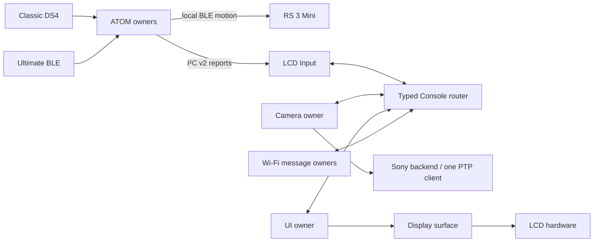

# System architecture

**English** · [简体中文](../../design/architecture-design.md) · [日本語](../../ja/design/architecture-design.md)

Current source has two independent firmware projects: ESP32-S3 LCD provides the AP, Sony PTP/IP and display; classic ESP32 ATOM receives controllers, publishes I²C v2 input and directly controls the Mini over BLE. Physical gimbal motion does not depend on LCD, camera or the selected LCD input source.

Core owns composition, startup barrier, modes, health, stop/restart and factory coordination. Main only starts Core. UART is a typed-message encoder; router owns transport/deadlines/leases and never executes business work under its lock. Input alone arbitrates copied reports and camera/UI actions. Camera alone owns session/backend/control and two readonly JPEG slots. Wi-Fi facade/backend/message lanes own AP and socket I/O. UI alone owns the presentation model and back-canvas lease.

Startup: UI/I²C prepare → AP and HTTP trigger → normal router/Input/network/providers/Camera/UART → health and barrier release. First HTTP claim drains normal owners and freezes MAINTENANCE before full Web; NORMAL closes the trigger. Maintenance is unauthenticated and exits by reboot.

Boot allocates two 512KiB JPEG objects, two 1024×600 RGB565 PSRAM frames, one 4096-byte JPEG work area and a decoder. Recovery reuses these objects. Internal bounce memory is 40KiB. Default main stack is 24576 bytes; older32768-byte task tables are historical. Stable 80MHz and experimental120MHz PSRAM profiles have distinct builds.

See [resources](module-resource-ownership.md), [messages](module-message-contracts.md), [actual dependencies](module-dependency-graph.md) and [status](../development/current-status.md). Four fresh builds/267 host cases do not establish full physical or performance acceptance.
