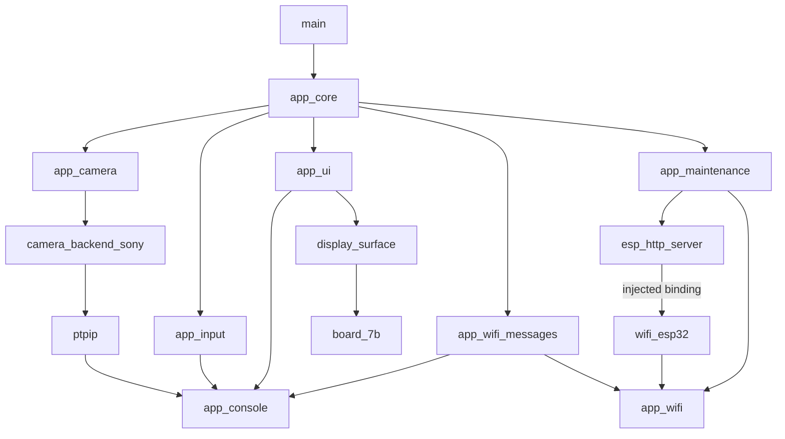

# Module dependency graph

**English** · [简体中文](../../design/module-dependency-graph.md) · [日本語](../../ja/design/module-dependency-graph.md)

The real LCD build graph is checked by `tools/check_component_graph.py` using IDF project_description/compile_commands plus post-project HTTP links. `tools/check_module_symbols.py` audits component archives against explicit dependencies. Current fresh graph has20 nodes/91 explicit edges and is acyclic within the checked project+injected-HTTP scope, not a claim about every internal IDF graph.

This diagram shows major edges; the [Chinese complete graph](../../design/module-dependency-graph.md) and generated JSON preserve every public/private/SDK edge. Actual HTTP translation units must receive `lwip_bind=wifi_esp32_http_bind`; the post-project link edge cannot be proved by a hand-drawn graph alone.

Normal runtime domains exchange typed router requests/events/leases. Direct provider, backend ops and surface interfaces have explicit owners. Core lifecycle/storage/restart callbacks are composition exceptions, not normal cross-domain bypasses. Reverse injected callbacks do not create compile dependency edges and can run in the final lease holder, not necessarily router task.

Release keeps an empty SIM component for IDF early dependency discovery but compiles no SIM implementation. Symbol exclusions and metadata are distinct checks. Direct symbol gates cannot discover every function pointer; source callback binding audits supplement them. See [messages](module-message-contracts.md), [resources](module-resource-ownership.md) and [acceptance](../development/module-split-checklist.md).
