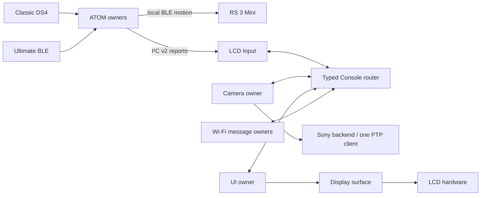

# システム構造

[English](../../en/design/architecture-design.md) · [简体中文](../../design/architecture-design.md) · **日本語**

二つの独立firmwareです。ESP32-S3 LCDはAP/Sony PTP-IP/display、従来ESP32 ATOMはコントローラー受信・I²C v2入力とMini BLE直接制御を担当します。実gimbal動作はLCD/Camera/選択LCD入力に依存しません。

Coreは構成、barrier、mode、health、stop/restart、factoryを所有しMainはCore開始だけです。UARTはmessage encoder、routerはtransport/期限/leaseでlock中業務処理しません。Inputだけがreport/actionを仲裁、Cameraだけがsession/backend/controlと二JPEG slotを所有します。Wi-Fi facade/backend/laneがAP/socket、UIがmodelとback canvasを所有します。

起動はUI/I²C準備 → AP/HTTP trigger → router/Input/network/provider/Camera/UART → health/barrier解除です。初HTTP claimで通常owner排出と固定MAINTENANCE後Web有効。NORMALは入口閉鎖、認証なしmaintenanceからは再起動で退出します。

起動時に512KiB JPEG二個、1024×600 RGB565二画面、4096byte work、decoderを確保し復旧で再利用します。内部bounceは40KiB。現在main stack24576byte、旧32768表は履歴です。Stable80MHzと実験120MHz PSRAMは独立buildです。

[リソース](module-resource-ownership.md)、[message](module-message-contracts.md)、[依存](module-dependency-graph.md)、[現状](../development/current-status.md)を参照します。四build/267Hostは全面実機・性能合格ではありません。
