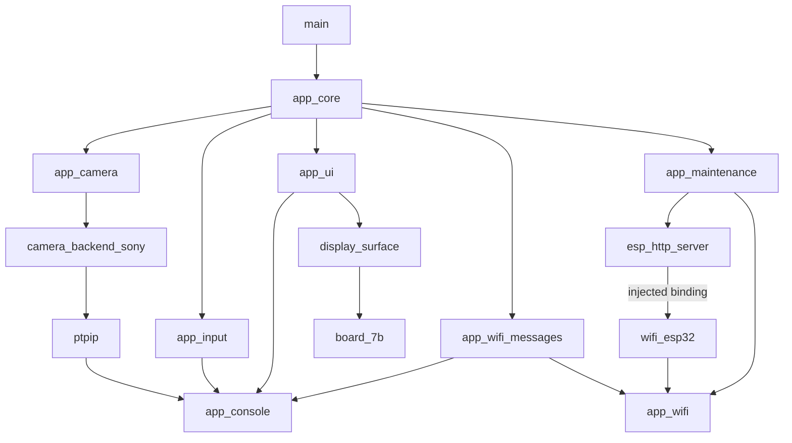

# モジュール依存グラフ

[English](../../en/design/module-dependency-graph.md) · [简体中文](../../design/module-dependency-graph.md) · **日本語**

実LCD graphは `check_component_graph.py` がIDF project_description/compile_commandsとHTTP追加linkから検査、`check_module_symbols.py` がarchive直接参照を照合します。現新buildは20node/91明示edgeで対象project+注入HTTP範囲が非循環、全IDF内部を指しません。

主要辺のみを表示し、[完全中国語graph](../../design/module-dependency-graph.md)とJSONに全public/private/SDKを保持。HTTP全TUに `lwip_bind=wifi_esp32_http_bind` が必要で、手描き図だけで追加linkを証明しません。

通常domainは型付きrequest/event/lease。provider/backend ops/surfaceは明示owner。Core lifecycle/storage/restartは構成例外で通常迂回ではありません。注入逆callbackはcompile辺を作らず、lease最後の保持taskで実行し得ます。

ReleaseはIDF early discovery用空SIMだけで実装なし。metadataとsymbol除外は別。直接symbolは全関数pointerを検出できずbinding source監査を補います。[message](module-message-contracts.md)、[所有権](module-resource-ownership.md)、[検証](../development/module-split-checklist.md)を参照してください。
