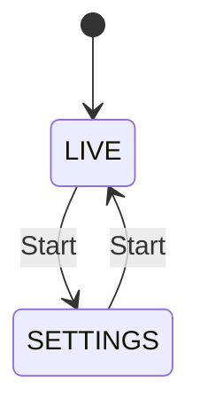
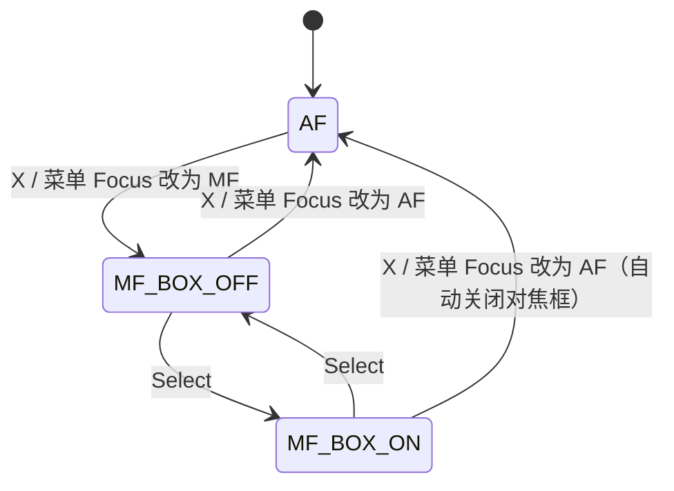

# 手柄控制方案

手柄经 M5Stack ATOM Matrix 接收后通过 I²C 上报 LCD（见 [ATOM 子项目](../../m5_atom_matrix/README.md) 和 [I²C 通信协议](../design/i2c-protocol-design.md)）。分类见[文档总览](../README.md#适配目标)：蓝牙链路分传统蓝牙与 BLE，输入报告分 Sony 兼容与 Xbox 兼容，两个维度独立，报告不能共用解析器。

当前输入链路实现传统蓝牙、Sony 兼容的 DualShock 4。八位堂 Ultimate 2 的 BLE 扫描 / 配对 / 标准电量读取已接入，并实测读取 88%；HID 报告与按键映射仍在适配，不能将已连接等同于已能控制相机。下文的按键动作对两类手柄相同。左摇杆和 L3 不上报 LCD，ATOM 本地云台控制仍为未实现的目标功能。本文按 Xbox 布局命名按键，与 Sony 兼容手柄的对照如下：

| 本文名称 | DS4 按键 | 位置 / 类型 |
| --- | --- | --- |
| LT / RT | L2 / R2 | 模拟扳机，0–255 |
| LB / RB | L1 / R1 | 肩键 |
| Select | Share | 左上小键 |
| Start | Options | 右上小键 |
| 方向键 | 方向键 | 十字键 |
| A / B / X / Y | ✕ / ○ / □ / △ | 右侧四键，下 / 右 / 左 / 上 |
| 左摇杆 / 右摇杆 | 左摇杆 / 右摇杆 | -128..127 |
| L3 / R3 | L3 / R3 | 摇杆按下 |

本次更新需求：LB/RB（L1/R1）变焦或条件手动对焦，Y 切换曝光 Mode，X 切换对焦模式。新映射与输入状态机已编译并烧录，尚待相机动作实机验收；Start 切换界面已实现。2026-10-03 用户确认当前为电动变焦镜头，运行时按此声明选择变焦；非电动变焦镜头的 MF 替代分支仍未实机启用。下文定义目标行为；标注“待抓包确认”的 Sony 命令需先用 Imaging Edge Remote 抓包并在 ZV-E10 上验证。

## 界面模式

界面分 LIVE（全屏取景）和 SETTINGS（缩略图 + 参数菜单）两种，画面布局、状态栏和提示信息见 [界面显示方案](ui-request.md)。

界面模式与相机对焦模式相互独立：

- Start 只切换 LIVE / SETTINGS，不修改相机 AF/MF。
- X 循环切换相机支持的对焦模式，也可通过设置菜单的 `Focus` 项或相机机身修改；以相机回报为准。
- 相机会话中的 Select 仅在 MF 时打开 / 关闭手动对焦框，不切换对焦模式。连接页无相机会话时，长按 Select / Share 两秒切换网页维护模式，按住不重复；设置页不触发该长按操作。

## 按键总表

“—”表示无功能。

| 输入 | LIVE（AF） | LIVE（MF） | SETTINGS |
| --- | --- | --- | --- |
| LT 半压 | 对焦（S1） | S1 | 对焦（S1） |
| LT 全压 | 开始 / 停止录像 | 同左 | 同左 |
| RT 半压 | 对焦（S1） | S1 | 对焦（S1） |
| RT 全压 | 拍照（S2） | 同左 | 同左 |
| LB / RB | 按住变焦 Wide / Tele | 非电动变焦镜头时近 / 远对焦；否则变焦 | 按相机对焦模式与镜头类型执行同样映射 |
| Select | — | 打开 / 关闭手动对焦框 | — |
| Start | 进入设置 | 进入设置 | 退出设置 |
| 左摇杆 | 云台 Pan / Tilt | 同左 | 同左 |
| L3 | 云台回中 | 同左 | 同左 |
| 右摇杆 | — | 对焦框开启时移动绿框 | — |
| R3 | — | 对焦框开启时绿框回到画面中心 | — |
| 方向键 上 / 下 | — | — | 移动参数光标 |
| 方向键 左 / 右 | — | — | 修改当前参数值 |
| A / B | — | — | A 进入 ASPECT / MORE、WI-FI；扩展页 EXIT+A 或 B 返回；维护入口双 A 确认 |
| X | 循环切换对焦模式 | 同左 | 同左 |
| Y | 循环切换下一个曝光 Mode | 同左 | 同左 |

扳机、LB/RB、X/Y、左摇杆和 L3 在 LIVE / SETTINGS 下遵循同样规则，保证随时可以拍摄、录像、变焦和操作云台。

## 扳机（LT / RT）

DS4 扳机为模拟量，分两档并带迟滞防抖：

| 档位 | 进入 | 退出 |
| --- | --- | --- |
| 半压 | ≥ 30% | < 20% |
| 全压 | ≥ 90% | < 80%（回到半压） |

**RT 拍照**

1. 半压：S1 按下，相机对焦。
2. 全压：S2 按下，拍照；保持全压时是否按驱动模式连拍需实机确认。
3. 退回半压：S2 释放。
4. 完全松开：S1 释放。

**LT 录像**

1. 半压：S1 按下，相机对焦。
2. 每次从非全压进入全压：根据相机确认的录像状态请求相反目标；未录像发送 `0x9207(0xD2C8)` 的 u16 值 2，录像中发送值 1。状态未知或已有待确认请求时不重复发送，并提示等待状态确认。这是显式开始/停止，不能把值 1 当作紧随开始的按键释放。
3. 完全松开：S1 释放。

录像状态以相机属性为准。

**安全规则**

- LT、RT 共用相机 S1：`S1 = LT半压 或 RT半压`，只在合并状态变化时发送，避免松开一个扳机误释放另一个的 S1。
- 手柄连接后必须先观察到 LT、RT 都完全松开，才允许拍照或录像。
- 手柄断开、ATOM I²C 超时、相机断开或任务重启时立即清空扳机状态，并释放已按下的 S1/S2；重连后不得重放旧命令。
- 拍照、录像和释放命令走高优先级队列，在每帧取景读取前优先处理。

## 曝光 Mode（Y）

每按一次 Y（△），在相机返回的曝光 Mode 枚举中循环切换到下一项（属性 `0x500E`，通过 `0x9205` 写入）。LIVE / SETTINGS 均有效，按住不重复；新按键映射已接入工作区，待实机验收。

- 可选值以相机实际返回为准。
- 回读确认后才视为生效；相机拒绝（例如录像中）时保持原值。
- 相机返回成功后约 5 秒属性才更新；2026-10-02 工作区已加入“合并到最终目标、生效后再发下一次”的状态机，等待确认时每约 500 ms 查询，10 秒超时；尚待实机验收。

## 手动对焦框（Select + 右摇杆）

仅当相机回报为 MF 时有效。红框为相机当前对焦位置，绿框为右摇杆正在移动的目标点，显示规则见 [界面显示方案](ui-request.md#手动对焦框规划)。

- **Select**：MF 下打开 / 关闭对焦框；AF 下无操作。
- **右摇杆**：移动绿框。速度与摇杆偏移量成正比，中心设死区，移动到画面边缘时限位。
- **R3**：绿框回到画面中心，仅在对焦框开启时有效；与右摇杆移动一样按下方规则自动提交。按 R3 时右摇杆偏移量不计入移动，避免按下时误推摇杆。
- **提交**：右摇杆回中（或按 R3）后 300ms 无新移动，自动把绿框位置发送给相机。
- **模式变化**：相机切换为 AF 时自动关闭对焦框。
- **待验证**：MF 下相机是否接受对焦位置属性（预计 `0xD2DC`）。

## 设置模式（方向键）

| 菜单项 | 相机属性 | 修改方式（待抓包确认） |
| --- | --- | --- |
| Shutter 快门 | `0xD20D` | 步进 ±1 |
| F-Number 光圈 | `0x5007` | 步进 ±1 |
| ISO | `0xD21E` | 枚举写值 |
| EV 曝光补偿 | `0x5010` | 枚举写值 |
| WB 白平衡 | `0x5005` | 枚举写值 |
| Focus 对焦模式 | `0x500A` | 枚举写值 |
| Metering 测光 | `0x500B` | 枚举写值 |

- **上 / 下**：移动参数光标，到首尾循环；仅在 SETTINGS 有效。
- **左 / 右**：修改当前参数为上一个 / 下一个值；完整枚举首尾循环，第一个值按左到最后一个，最后一个值按右到第一个。相机未提供完整枚举时，快门、光圈仍使用相对步进，边界循环待协议支持。按住 400ms 后开始重复，重复命令只保留最新目标值。
- 当前曝光 Mode 下不可修改的项（例如 P 模式的光圈）左右无效。
- 相机确认并回读后才视为生效；拒绝、超时或断线时恢复原值。菜单显示见 [界面显示方案](ui-request.md#设置菜单)。

## 左摇杆（云台）

所有模式下均控制云台，不与其他功能冲突。左摇杆和 L3 在 ATOM 内部处理，ATOM 直接向 BLE 云台发送命令，不上报 LCD；LCD 只显示云台连接状态，LCD 断开不影响云台。详见 [I²C 通信协议](../design/i2c-protocol-design.md#云台本地控制)。

- X 轴：水平转动（Pan）；Y 轴：俯仰（Tilt）。
- 中心死区约 10%，速度曲线采用二次方，小幅推杆便于微调。
- 漂移校准、软限位和启用开关保存在 ATOM，入口在 ATOM 本地实现。
- 手柄断开或输入超时（建议 200ms）必须立即停止云台。

**L3 云台回中**：所有模式下有效，云台以限速平滑转回 Pan / Tilt 零位（上电或校准时记录的位置）。回中过程中推动左摇杆立即取消回中，恢复手动控制；按下 L3 时左摇杆偏移量不计入，避免按压时误推。

## 右侧四键

布局：A（✕）下、B（○）右、X（□）左、Y（△）上。

### 对焦模式（X）

每按一次 X（□），按相机 `Focus`（`0x500A`）返回的可选枚举顺序循环到下一项；LIVE / SETTINGS 均有效，按住不重复。不写死为 AF/MF 二选一，相机支持的 AF-S、AF-C 等模式均以实际枚举为准。

- 相机未连接、属性只读、模式未知或无有效枚举时不发送修改命令。
- 相机确认并回读后才视为生效；拒绝、超时或断线时保持实际值。
- 切换对焦模式时取消 LB/RB 的当前变焦 / 对焦操作及待执行步进；两肩键必须先松开再按。切到 AF 时自动关闭手动对焦框。

### 曝光 Mode（Y）

Y（△）循环切换曝光 Mode，详见上文 [曝光 Mode（Y）](#曝光-modey)，不再控制远对焦或屏幕信息档位。

## 变焦 / 手动对焦（LB / RB，即 L1 / R1）

LIVE / SETTINGS 均有效。每次按下时根据已确认的镜头类型与相机对焦模式选择功能，并锁定到释放。

| 按键 | 变焦 | 非电动变焦镜头且 MF |
| --- | --- | --- |
| LB（L1） | Wide（拉远） | 近对焦（+1） |
| RB（R1） | Tele（拉近） | 远对焦（−1） |

### 变焦

- 电动变焦镜头下按住持续变焦，松开停止。非电动变焦镜头且非 MF 时，若相机明确支持清晰影像变焦 / 数字变焦，仍执行变焦；不支持时无动作。
- 按下发送变焦开始，松开发送停止（`0xD2DD` ZoomOperation，INT8：正值 Tele、负值 Wide、0 停止，速度范围待抓包确认）。
- 当前用户确认电动变焦镜头，因此肩键允许请求变焦，再以相机接受响应确认命令。镜头未确认时才要求 `0xD25B` ZoomEnableStatus 明确允许变焦；不能单凭该属性判断镜头类型，类型未知时不启用手动对焦替代。
- LB+RB 同时按下立即停止，两键都松开后才接受新操作。
- 手柄断开、ATOM I²C 超时、相机断开时释放变焦；相机会话可用时立即发送停止，停止命令走高优先级队列。

### 非电动变焦镜头且 MF 时的手动对焦

- 启用条件：已确认镜头为非电动变焦镜头且相机明确回报 MF；无需打开对焦框。不要求 ZoomEnableStatus=0，即使数字变焦可用，此条件下也优先手动对焦。镜头类型或对焦模式未知时不启用。
- L1 近对焦、R1 远对焦，只改变焦距方向上的焦点位置，不移动画面中的对焦框。用户已确认正值向近处，发送 L1=+1、R1=−1；其余镜头 / 相机需另行验证。
- `0x9207(0xD2D1)` 使用 2 字节有符号小端值，已捕获 +1/+3/+7/−3/−7 并返回 OK。单击最小档一步；按住 400 ms 后每 150 ms 重复一次，不积压步进命令。
- L1+R1 同时按下停止重复并取消未执行步进，两键都松开后重新解锁。
- 松开、切 AF、镜头类型 / 能力变化或断线时取消当前操作、重复状态及未执行步进；条件恢复后必须先松开再按，旧按压不得重新解释为变焦或对焦。LIVE / SETTINGS 切换不改变映射。

### 待定功能

以下操作在四键重新分配后失去按键，留待后续决定：

| 功能 | 建议按键 |
| --- | --- |
| 对焦放大：切换倍率 / 退出 | 待分配 |
| 屏幕信息显示：全显 / 精简 / 隐藏 | DS4 触摸板按下（暂定，已接入）；Xbox 对应键待适配 |
| A / B | 预留 |
| 手柄休眠 / 断开 | PS 长按 2 秒 |
| 预留 | 触摸板按下 |

## 输入处理规则

- 按键只在“按下边沿”执行一次性操作；ATOM 事件队列已保证短按不丢失并按事件 ID 去重。
- 摇杆和扳机使用最新状态快照，不把每个 HID 报告排入命令队列。
- 位置类命令（对焦框、放大区域；云台在 ATOM 内）限速约 5 次/秒，参数类命令合并到最新目标。
- LB+RB 同时按下停止变焦 / 对焦，并锁定到两键均释放；方向键左+右同时按下时忽略。

## Sony 协议验证表

| 功能 | 预计属性 / 命令 | 当前状态 |
| --- | --- | --- |
| 曝光 Mode | `0x500E` + `0x9205` | 已实现，生效延迟约 5 秒 |
| 相机电池 | `0xD218` | 待确认 |
| S1 半压 | `0xD2C1` + `0x9207` | 已捕获 u16 2 按下、1 释放，均 OK；实际合焦另行确认 |
| S2 拍照 | `0xD2C2` + `0x9207` | 已捕获 u16 2 全按及后续对象传输；标准释放和连拍待验证 |
| 拍照后控制 | `0xD2E6` + `0x9207` | 两轮捕获 u16 1；含义未知，不代替标准释放 |
| 录像开始 / 停止 | `0xD2C8` + `0x9207` | 已捕获 u16 2→1，均 OK；参考实现对应开始/停止 |
| 录像状态 | `0xD21D` | 参考命名 MovieRecordingState；完整读回及枚举待验证 |
| MF 近 / 远 | `0xD2D1` + `0x9207` | 已捕获 i16 +1/+3/+7/−3/−7；用户确认正值向近处，代码使用 ±1，待实机验收 |
| 对焦框位置 | `0xD2DC` + `0x9205` | 待确认 MF 下是否有效 |
| 变焦 | `0xD2DD` ZoomOperation + `0x9207` | 待抓包确认速度范围和停止值 |
| 变焦状态 | `0xD25B` / `0xD25C` / `0xD25D` | 待确认 ZV-E10 是否回报 |
| 对焦放大（第 3 版） | `0xD254` + `0x9205`，8 字节负载 | 已捕获写入并返回 OK；字段布局和效果待验证 |
| 对焦放大（旧方式） | `0xD2CB` / `0xD2CC` / `0xD2CD`–`0xD2D0` + `0x9207` | `0xD254` 不可用时的备选 |
| 放大状态回读 | `0xD22D` / `0xD22F` / `0xD230` | 待确认 |
| 放大时的取景画面 | `0xFFFFC002` | 待确认返回放大后画面，且循环读取不会退出放大 |

## 验收测试

上述协议证据见 [2026-10-01 三轮抓包分析](../records/protocol-analysis-20261001.md)。已捕获不等于固件已实现；未完成释放、状态回读及方向验证前，不宣称拍照/录像/对焦控制已完整验收。

- LT/RT 单独按压、同时按压、交叉释放、带压连接、蓝牙断线，不得误拍或遗留 S1/S2。
- 拍照单张、连拍、录像开始 / 停止；录像中切换曝光 Mode 被拒绝时有正确反馈。
- AF/MF 由菜单和相机机身切换时，Select 只控制对焦框；切到 AF 时对焦框自动关闭。
- 绿框停止移动 300ms 后自动提交。
- L1/R1 按住变焦、松开停止；两键同按、手柄断开、ATOM 断开时立即停止；已确认电动变焦镜头允许请求变焦；其他镜头在变焦能力未知或不可用时不发送变焦开始。
- 非电动变焦镜头且 MF 时，L1/R1 只近 / 远对焦；数字变焦可用也不改变此映射。单击一步、长按限速重复、同按取消并锁定到释放；按正值近、负值远实机验收。
- 电动变焦镜头在 MF 下仍执行变焦；镜头类型未知时不启用手动对焦替代。验证镜头识别不能仅使用 ZoomEnableStatus。
- LIVE / SETTINGS 下映射一致；切换对焦模式、镜头类型 / 能力变化时取消旧操作，先释放再接受新按压，避免变焦 / 对焦互相误触发。
- Y 单击循环下一曝光 Mode，X 单击循环下一对焦模式，长按不重复；只读、枚举缺失、拒绝或断线时不假报生效。X 切到 AF 时关闭对焦框。
- 云台在手柄断开、手柄输入超时时立即停止；LCD 断开或 I²C 断开时云台仍可由手柄控制。
- L3 回中在各模式下有效，回中途中推左摇杆可立即取消。
- R3 只移动绿框到中心，提交前红框不变；对焦框关闭或 AF 下按 R3 无操作。
- Wi-Fi 断线、相机重启、命令超时后，旧命令不会在重连时执行。

### 2026-10-03 手柄类型选择

OTA 维护网页提供 DS 手柄 / Xbox 兼容手柄选择，默认 DS，保存到 NVS，恢复出厂后回到 DS。当前按 DS4 开发。DS 只接收经典蓝牙 DS4；Xbox 兼容选项使用已支持的 BLE HID 适配器，不保证所有 Xbox 手柄兼容。切换先释放旧输入，重新握手后仅发布所选来源；Matrix 两行电量仍独立显示已连接设备。
