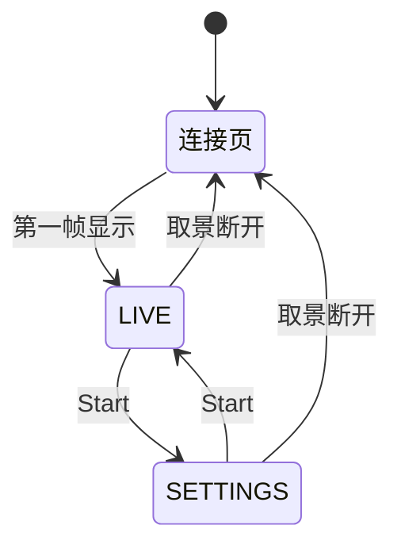

# 界面显示方案

LCD 为 1024×600 RGB565（Waveshare ESP32-S3-Touch-LCD-7B），不启用触摸，全部操作来自手柄，按键规则见 [手柄控制方案](gamepad-request.md)。字体为 Inter（英文）、思源黑体（中文）、JetBrains Mono（参数数字），见 [字体说明](../../components/board_7b/fonts/README.md)。

标注“规划”的章节为目标行为；电量、录像计时与控制状态已有部分绘制，具体边界以下表与 [实施状态](../development/implementation-status.md) 为准。

## 画面

| 画面 | 出现时机 | 布局 |
| --- | --- | --- |
| 连接页 | 开机、相机未连接或取景断开 | 标题 `easymcucourse camera console`；SSID、密码、LCD 的 IP 地址各占一行（IP 见 [Wi-Fi 热点需求](wifi-ap-request.md) R4.4）；ATOM、手柄、相机连接状态；连接阶段（等待相机、连接会话、配对确认、等待预览） |
| 取景（LIVE） | 第一帧解码成功后 | 1024×576 取景居中，上下各 12 像素黑边，叠加状态栏 |
| 设置（SETTINGS） | 按 Start 或串口 S；相机离线时也可导航 | 左侧 768×432 取景缩略图，右侧参数菜单和手柄状态，缩略图下方显示扩展拍摄参数 |

取景实测约 3.5–4.0 FPS，设置画面因缩放 JPEG 并绘制菜单约 2.4 FPS。

## 状态栏

**当前实现**（LIVE 右上角）：从上到下为 Wi-Fi RSSI、实际 FPS、相机型号、相机固件版本、相机电量、手柄电量、曝光模式、对焦模式，英文标签依次为 `WIFI`、`FPS`、`CAM`、`FW`、`BATTERY`、`DS4:`（Xbox 兼容来源为 `XBOX:`）、`MODE`、`FOCUS`，共八行。FPS 初始显示 0.0，约 1 秒后得到统计值，暂停时保留最后读数。

**状态条目及实现边界：**

| 项目 | 显示 | 来源 / 当前状态 |
| --- | --- | --- |
| 手柄电量 | LIVE 与 SETTINGS 的 BATTERY 下一行，如 `DS4: 80%`；未知或断连显示 `DS4: --`，>50% 绿、21–50% 黄、≤20% 红，未知灰 | 2026-10-04 用户新增 LCD 手柄信息；ATOM I²C 电量 0–10 档乘 10 为估算百分比，Xbox 兼容来源显示 `XBOX:`，无有效电量显示 `--`。Matrix 第一 / 第二行保留 |
| 相机电量 | LIVE 与 SETTINGS 右侧第五行 `BATTERY 75%` | `0xD218`；未知显示 `--`，>50% 绿、21–50% 黄、≤20% 红，未知灰，视觉待验收 |
| 对焦模式 | LIVE 与 SETTINGS 右侧第八行 `FOCUS MF` / `FOCUS AF-S` 等，SETTINGS 该行可编辑 | `0x500A`；对焦框与 `MF BOX` 仍规划 |
| 录像 | 红点 `REC` + 已录时长；LIVE 外侧四像素红框 | `0xD21D`；红框跟随回读录像状态，在所有 LIVE 信息档位可见；停止回读后下一帧清除。2026-10-03 视频模式红框和连续取景经用户确认，其他档位视觉仍待验收，见[实测记录](../records/record-border-aspect-test-20261003.md) |
| 变焦 | 当前倍率；变焦中显示变焦条 | `0xD25C` / `0xD25D` |
| 对焦放大 | `MAG` + 当前倍率 | `0xD22F` |
| 命令状态 | `PENDING` / `REJECTED` / `TIMEOUT`，短暂显示 | 已接入 Mode / Focus / Control 与菜单终态；统一提示与 NO ZOOM 仍规划 |

## 屏幕信息显示档位（已接入）

全显 / 精简 / 隐藏三档已接入。暂定 DS4 触摸板按下循环切换（询问按键偏好后尚未收到回复，采用推荐映射），也可用串口 ui info；只改变 LIVE 叠加层，不向相机发送命令，SETTINGS 菜单保持可见。Y 已改为切换曝光 Mode，X 改为切换对焦模式；L1/R1 的变焦 / 条件手动对焦映射见 [手柄控制方案](gamepad-request.md)。

| 档位 | 显示内容 |
| --- | --- |
| 全显 | 完整状态栏、FPS、对焦框 |
| 精简 | 只保留 `REC`、电量告警、命令错误、对焦框 |
| 隐藏 | 只保留对焦框和 `REC` 红点 |

- `REC` 红点在任何档位都显示，避免误以为没在录像。
- 档位保存到 NVS `ui_prefs/info`，保存成功后发布；失败保留原档位，重启后保持。全部重置将其恢复全显。
- 模拟时三个档位均保留 SIM 标记。对焦框仍待接入，表中的对焦框属于未完成目标。

## 手动对焦框（规划）

相机处于 MF 且按 Select 开启时显示。

| 元素 | 含义 |
| --- | --- |
| 红框 | 相机当前对焦位置（以相机回报为准） |
| 绿框 | 右摇杆正在移动的目标点 |

- 开启时绿框与红框重合；提交前红框保持不动，相机确认后红框移到新位置并与绿框重合；相机拒绝时绿框退回红框位置并提示。
- 坐标映射：扣除 LIVE 画面上下各 12 像素黑边后归一化，再按抓包确认的相机坐标范围转换；SETTINGS 缩略图使用同一归一化坐标绘制。
- 若 MF 下相机不接受对焦位置属性（预计 `0xD2DC`），对焦框只能作为放大 / 参考位置，界面不得宣称相机会在该点对焦。

## 对焦放大（规划）

- 相机放大后，取景对象 `0xFFFFC002` 返回的即为放大画面，按原方式解码显示，不需要额外取图。
- 放大期间状态栏显示 `MAG` 和倍率；放大状态以相机回报（`0xD22D`）为准，相机自行退出放大时界面同步。
- 进入 SETTINGS 时自动退出放大。

## 设置菜单

**当前代码**：右侧显示曝光模式、ISO、快门、光圈、EV、白平衡、对焦、测光和闪光状态，每 5 秒从 `0x9209` 刷新，属性事件或输入触发立即刷新，待确认期间约 500 ms 刷新。七项主参数光标、九项扩展参数子菜单、方向键、WI-FI 与 MAINTENANCE 入口已接入，见 [菜单设计](../design/camera-menu-design.md)。`--` 表示相机报告“无值”或尚未取得数据；未收录的枚举显示原始十六进制。

**已接入，待实机视觉与参数效果验收：**

- 菜单文字为英文；移除独立 DS4 CONNECTED / DISCONNECTED 行，手柄电量行保留；前八行依次为 WIFI、FPS、CAM、FW、BATTERY、手柄电量、MODE、FOCUS，与 LIVE 一致，当前光标项高亮。光标顺序跟随画面，Focus 为首个可编辑项。完整枚举左右首尾循环；无完整枚举的快门 / 光圈相对步进边界循环仍待协议支持。
- EV 按实际有符号数值右增大、左减小，不按相机返回枚举的原始顺序决定方向；最大按右回最小、最小按左回最大。
- 当前曝光 Mode 下不可修改的项（例如 P 模式的光圈）显示为灰色。
- 修改后先显示目标值和 `PENDING`，相机确认并回读后才显示为实际值；拒绝、超时或断线时恢复原值并显示原因。

## 提示信息（规划）

| 提示 | 出现条件 |
| --- | --- |
| `PENDING` | 命令已发送，等待相机确认 |
| `REJECTED` | 相机拒绝命令（如录像中切换曝光 Mode） |
| `TIMEOUT` | 命令超时 |
| `NO ZOOM` | 按 L1/R1 请求变焦但相机回报不可变焦 |

提示短暂显示后自动消失，不遮挡取景中心区域。

## 验收测试

- 连接页依次显示各连接阶段，第一帧显示后自动进入 LIVE，断开后返回连接页。
- 触摸板单次按下切换，按住不重复、gap 不触发；X/Y 不改变信息档位。`REC` 红点始终可见，重启后档位保持。
- 红框随相机回报更新，绿框提交后红框跟随，拒绝时绿框退回；LIVE 与 SETTINGS 缩略图中对焦框位置一致。
- 放大期间状态栏显示 `MAG`，相机退出放大时界面同步。
- 命令提示在相机响应后正确切换，不把“已发送”显示为“已生效”。

## Aspect 扩展子菜单

设置页选中 MORE 按 A 进入，包含 ASPECT、DRIVE、EFFECT、DRO、AF AREA、WL FLASH、WB TEMP、WB AB RAW、WB GM RAW。上下选择、左右循环修改相机完整枚举；只读或无完整枚举项目不可修改。底部 EXIT 按 A 返回，B也可返回，Start返回LIVE。修改需要相机确认和回读，实际功能待验收。
