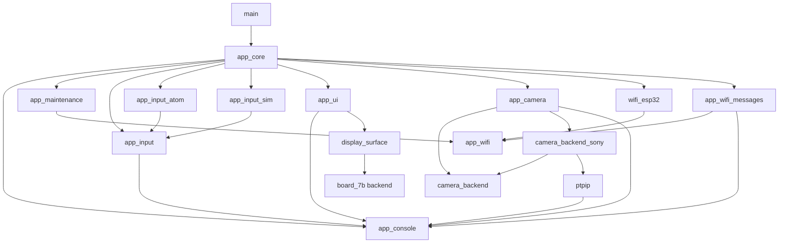
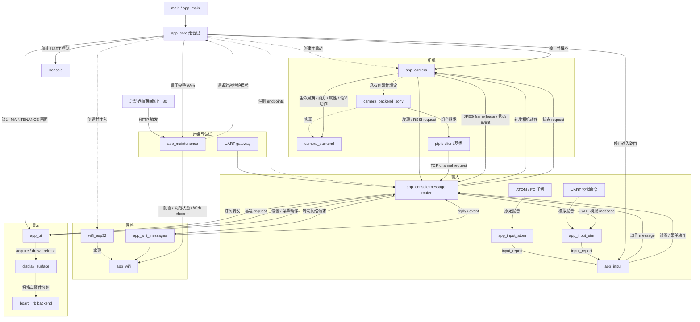
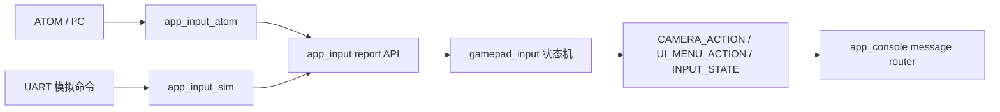
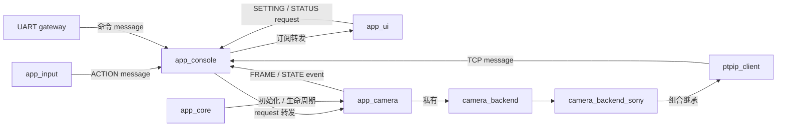
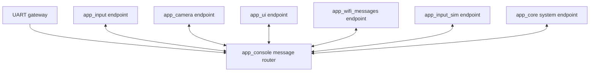
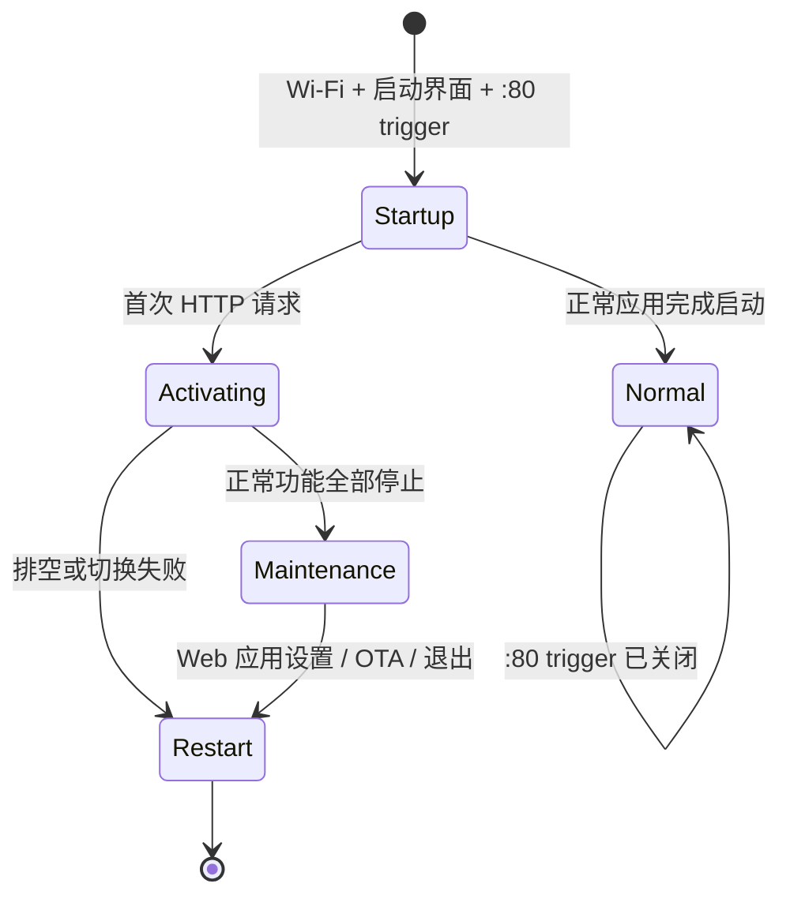

# `main` 模块拆分计划

本文规划对 LCD 工程 `main/` 中的应用代码进行模块化拆分。目标是降低耦合、缩小单文件职责并建立可测试的依赖边界；本轮只调整结构，不改变功能、协议、任务优先级、栈位置、持久化格式或用户界面行为。

## 1. 当前状态与主要问题

当前 `main/CMakeLists.txt` 将 `main/` 下 60 余个源文件注册为一个 ESP-IDF component，并直接依赖显示、PTP/IP、Sony 相机、Wi-Fi、HTTP、OTA、NVS、UART 和 I²C 等设施。这是本计划需要消除的现状，不作为迁移过程中的长期或临时目标结构。源码已有 `wifi_*`、`camera_*`、`maint_*` 等命名分组，但目录、独立构建单元和依赖方向尚未表达这些模块。

主要问题：

1. `camera_controller.c` 同时负责发现、连接、双通道握手、会话、属性刷新、控制执行、取景循环、重试以及维护租约，是首要拆分对象。
2. `wifi_ap.c` 同时包含 AP 驱动、客户端发现、NVS 配置、异步应用和恢复出厂编排，并直接调用相机、身份和 UI 模块。
3. `camera_console.c` 聚合相机、Wi-Fi、维护、OTA、显示、I²C 和模拟器命令，已成为跨模块依赖汇合点。
4. `camera_pair.h` 名称仍表示旧的配对职责，实际已经是相机服务的公共入口。
5. `maint_*`、输入和 Wi-Fi 代码直接调用 `board_7b` 或相机接口，使它们难以成为独立 component，并容易形成 `camera ↔ maintenance ↔ wifi` 循环依赖。
6. 主机测试通过相对路径直接编译 `main/*.c`。直接移动全部文件会同时造成大量测试路径变化，扩大一次重构的回归面。
7. `sony_camera` 当前在 CMake 中直接 `REQUIRES ptpip`，部分控制 API 接收 socket fd 和 transaction，厂商协议与具体传输尚未真正分离。

## 2. 拆分原则

- **行为保持不变**：先移动和收口接口，再重写内部实现；每个阶段都必须可独立构建和回归。
- **单向依赖**：底层模块不得回调上层具体模块；跨域流程由 `app` 编排。
- **唯一资源所有者不变**：相机任务继续唯一持有 socket；显示驱动继续管理帧缓冲；Wi-Fi worker 继续唯一执行 NVS 写入和驱动重启。
- **任务属性不变**：任务核心、优先级、栈大小、内部 RAM/PSRAM 分配和启动顺序在结构重构阶段不得修改。
- **纯 C 逻辑优先下沉**：无 ESP-IDF 依赖的状态机和编解码代码继续可被主机测试直接编译。
- **公共接口最小化**：每个模块只导出服务 API 和只读快照；内部状态放入 `private/` 或仅由模块源文件可见。
- **按功能建立独立 component**：迁出的每个功能域立即成为独立 ESP-IDF component，不在 `main` 中建立新的业务代码集合。
- **支持替换升级**：调用方只依赖稳定公共接口，不依赖实现文件、私有头或内部数据结构；替代实现只要满足同一接口和生命周期约定即可接入。

## 3. 目标模块

### 3.1 目标目录结构

```text
main/
  CMakeLists.txt
  app_main.c
components/
  display_surface/
    CMakeLists.txt
    include/display_surface.h
    private/display_backend.h
    display_surface.c
  board_7b/
    CMakeLists.txt
    board_7b_backend.c
    board_lcd.c
  app_core/
    CMakeLists.txt
    include/app_core.h
    app_health.c
    app_restart.c
    app_coordinator.c
  app_camera/
    CMakeLists.txt
    include/app_camera.h
    private/camera_runtime.h
    app_camera.c
    camera_runtime.c
    camera_discovery.c
    camera_session.c
    camera_properties.c
    camera_controls.c
    camera_identity.c
    camera_link.c
    liveview_pipeline.c
    setting_control.c
    camera_menu.c
    camera_actions.c
  app_wifi/
    CMakeLists.txt
    include/app_wifi.h
    private/app_wifi_backend.h
    app_wifi.c
    wifi_config.c
  wifi_esp32/
    CMakeLists.txt
    wifi_esp32.c
    wifi_apply.c
  app_wifi_messages/
    CMakeLists.txt
    wifi_message_endpoint.c
  camera_backend/
    CMakeLists.txt
    include/camera_backend.h
    camera_backend.c
  camera_backend_sony/
    CMakeLists.txt
    private/sony_backend.h
    sony_backend.c
    sony_commands.c
    sony_properties.c
    sony_liveview.c
  app_input/
    CMakeLists.txt
    include/input_service.h
    include/input_provider.h
    input_service.c
    gamepad_input.c
  app_input_atom/
    CMakeLists.txt
    atom_link.c
  app_input_sim/
    CMakeLists.txt
    include/input_sim.h
    input_sim.c
    lcd_sim.c
  app_ui/
    CMakeLists.txt
    include/app_ui.h
    ui_model.c
    ui_renderer.c
    ui_jpeg_renderer.c
    ui_display_bench.c
    wifi_menu.c
    wifi_menu_ui.c
    ui_preferences.c
  app_maintenance/
    CMakeLists.txt
    include/app_maintenance.h
    maintenance_app.c
    maintenance_trigger.c
    maintenance_web.c
    maintenance_json.c
    maintenance_wifi.c
    maintenance_ota.c
    ota_header.c
  app_console/
    CMakeLists.txt
    include/app_console.h
    include/app_message.h
    app_console.c
    app_message_router.c
    app_console_uart.c
    camera_console.c
    wifi_console.c
    input_console.c
    ui_console.c
    debug_console_commands.c
```

`main` 仍是 ESP-IDF 规定的入口 component，但只注册 `app_main.c`。它只调用 `app_core_start()`，不得包含相机、Wi-Fi、维护、输入或 UI 的业务实现。

现有 `components/board_7b/` 调整为 LCD-7B 硬件后端；新增 `display_surface` 作为唯一公开显示抽象。应用层不得直接包含 `board_7b.h` 或 `board_lcd.h`。

`maint_notice.h`、`maint_confirm.h`、`ota_health.h`、`restart_schedule.h` 等纯逻辑头文件随所属 component 放置，并继续由主机测试直接包含。已不参与 LCD 固件构建的 `focus_input.*` 移入 `tests/support/legacy/` 或明确删除前，必须先确认是否仍需要其独立回归。

### 3.2 Component 边界

| Component | 职责 | 允许依赖 |
| --- | --- | --- |
| `main` | ESP-IDF 应用入口；调用组合根 | 仅 `app_core` |
| `display_surface` | 硬件无关画布、buffer 所有权、刷新、同步和恢复接口 | 一个由构建配置选择的显示后端 |
| `board_7b` | LCD-7B 初始化、RGB/GDMA、帧扫描和硬件恢复 | ESP-IDF LCD/驱动；不得依赖应用业务模块 |
| `app_core` | 启动、健康检查、重启、跨模块流程编排 | 下列应用服务的公共接口 |
| `app_camera` | 唯一相机门面与 Camera message endpoint：生命周期、配对、控制、属性、状态和 JPEG frame | `app_console` message API 以及私有 `camera_backend`；不得直接依赖 Wi-Fi/UI |
| `app_wifi` | 应用唯一网络入口：Wi-Fi 配置、客户端/网络快照、异步操作和 TCP channel 抽象 | 不依赖 ESP-IDF Wi-Fi、lwIP 或业务模块 |
| `wifi_esp32` | `app_wifi` 的 ESP32 SoftAP、NVS、netif 和 TCP channel 实现 | `app_wifi`、ESP-IDF Wi-Fi/NVS/lwIP |
| `app_wifi_messages` | 正常应用的 Wi-Fi message endpoint，转发发现/RSSI/TCP/config 请求 | `app_console`、`app_wifi`；维护应用不依赖此 bridge |
| `camera_backend` | `app_camera` 私有的通用相机后端接口：生命周期、能力、属性、取景和语义动作 | 不依赖 PTP/IP、Sony 或应用业务模块 |
| `ptpip` | PTP/IP 基类：通过 Console message 请求 TCP channel，管理握手、session、transaction 和 dataset | `app_console`；不直接依赖 `app_wifi` |
| `camera_backend_sony` | 组合继承 PTP/IP 基类，实现 `camera_backend`，扩展 Sony 属性、取景和控制 | `camera_backend`、`ptpip`；不得复制 PTP/IP 基础能力 |
| `app_input` | 统一输入 report、来源仲裁和动作消息发布 | `common`、`app_console` message API；不直接调用相机/UI |
| `app_input_atom` | ATOM/I²C 手柄输入 provider | `app_input` provider 接口、ATOM 协议与 I²C |
| `app_input_sim` | UART 手柄模拟 provider | `app_input` provider 接口；仅在调试 Kconfig 启用 |
| `app_maintenance` | 独占维护应用：启动页端口 80 触发、无认证 Web、配置、OTA 和重启 | 仅 `app_wifi` 及 HTTP/OTA/JSON 基础库；不得依赖其他应用功能 |
| `app_ui` | 唯一渲染入口与 UI message endpoint；消费 JPEG/状态并发布设置/菜单消息 | `display_surface`、`app_console` message API；不直接调用相机/Wi-Fi |
| `app_console` | 正常应用核心消息总线与 UART gateway：typed message、request/reply、订阅和 lease 转发 | FreeRTOS/common 基础；不得依赖任何功能 component 或维护应用 |

编译期依赖方向：



正常应用的跨功能依赖统一指向 `app_console` message API，Console 本身不依赖功能 component。维护应用不连接消息总线，只回调 `app_core` 并直接使用隔离的 `app_wifi` API。

#### 运行时功能模块关联图

下图表达运行时的数据流和控制关系；虚线表示创建、实现绑定或回调注入，实线表示业务调用或数据流：



模块关系约束：

- `app_core` 只负责创建顶层服务、检查 `app_wifi`/`app_camera` 版本、注入依赖和控制启动/停止顺序，不接触相机内部 backend。
- `app_camera` 是正常应用的唯一相机门面；只有 `app_core` 直接调用生命周期 API，UI、输入和 UART gateway 均通过 Camera message。
- `camera_backend`、PTP/IP 基类和 Sony backend 是 `app_camera` 私有依赖，不向其他功能模块暴露。
- `wifi_esp32`、PTP/IP 基类和 Sony backend 不反向直接调用 UI、输入或维护模块。
- 正常模式下 PTP/IP 的发现、RSSI、TCP connect/send/receive/close 都封装为 message，由 `app_wifi_messages` 转发到 `app_wifi`。
- 设置/菜单动作以及 JPEG frame/状态订阅都通过 message router，不存在 UI ↔ Camera 直接函数调用。
- `app_console` 是核心消息接口；正常功能 component 只依赖其 message API，Console 不依赖具体功能 component。
- 大 buffer 通过 lease message 转发，router 不复制 JPEG 或 TCP payload。
- 维护应用不连接消息总线；维护模式由 `app_core` 停止 Console 后直接控制隔离的 `app_wifi` 和静态显示。

### 3.3 可替换与升级约定

每个功能 component 必须满足：

1. 公共头只放在该 component 的 `include/`，内部结构放在 `private/` 并通过 `PRIV_INCLUDE_DIRS` 暴露给自身。
2. 公共接口使用不透明句柄、值类型快照或显式回调表，不公开可变内部结构。
3. `CMakeLists.txt` 使用 `REQUIRES` / `PRIV_REQUIRES` 声明依赖，不依靠根 component 的依赖泄漏。
4. 可替换服务提供统一的 `init/start/stop/get_status` 生命周期；重复启动、停止超时及部分初始化失败的语义必须写入头文件。
5. 需要多实现时由顶层 Kconfig/CMake 选择一个实现，禁止两个实现同时导出同名符号。
6. 公共接口定义 `APP_*_API_VERSION`；不兼容升级必须提高主版本并同步调用方，兼容扩展只能追加能力查询或新函数。
7. 替换实现不得改变 NVS 格式、任务资源、协议或线程语义，除非另有迁移设计和验收记录。

### 3.4 显示抽象层

`display_surface` 是 `app_ui` 使用的底层显示接口。它维护前台/后台画布指针、画布租约、刷新代数和失败状态；`board_7b` 只实现面板初始化、扫描和硬件恢复。除 `app_ui`、显示后端及后端测试外，其他模块不得依赖 `display_surface`。

建议公共接口：

```c
typedef struct {
    uint16_t *pixels;
    size_t width;
    size_t height;
    size_t stride_pixels;
    uint32_t generation;
    void *lease;
} display_canvas_t;

esp_err_t display_surface_init(void);
esp_err_t display_canvas_acquire(display_canvas_t *canvas, uint32_t timeout_ms);
esp_err_t display_canvas_refresh(display_canvas_t *canvas);
void display_canvas_cancel(display_canvas_t *canvas);
esp_err_t display_surface_recover(void);
void display_surface_get_status(display_surface_status_t *status);
```

接口语义：

- `display_canvas_acquire()` 返回当前未扫描的完整 RGB565 后台画布；同一时刻只允许一个有效写租约。
- `display_canvas_refresh()` 原子提交画布并触发刷新/换帧；无论成功或失败，传入租约均立即失效。
- 放弃绘制必须调用 `display_canvas_cancel()`；调用方不得缓存 `pixels` 或跨代复用画布。
- 刷新失败后禁止再次写 buffer，必须由 `display_surface_recover()` 恢复并取得新 generation。
- 抽象层保存前后台 buffer 及其所有权状态，不增加第三份全屏拷贝；后端可按 DMA/PSRAM 约束提供物理内存。
- 宽、高、stride、像素格式和对齐从画布/能力接口读取，业务模块不得硬编码 LCD-7B 的地址或驱动对象。
- `app_ui` 内部的 JPEG 解码、UI 合成和显示基准都必须遵守同一 acquire → draw → refresh/cancel 流程。
- `board_lcd_back_buffer()`、`board_lcd_publish()` 和恢复细节改为后端私有 API，不再从公共头导出。

现有 `board_7b_set_*()` 领域状态接口迁移到 `app_ui` 的 UI model。正常模式由相机、Wi-Fi 和输入发布状态；维护画面只能由 `app_core` 设置独占显示锁。`app_ui` 在 `display_surface` 画布上统一绘制，业务模块不直接操作像素。

`app_ui` 额外公开统一帧与基准接口：

```c
/* Registers UI endpoint and CAMERA_FRAME/CAMERA_STATE subscriptions. */
esp_err_t app_ui_messages_start(void);
esp_err_t app_ui_display_bench_start(
    const app_ui_bench_config_t *config,
    uint32_t *token);
esp_err_t app_ui_display_bench_result(
    uint32_t token,
    app_ui_bench_result_t *result);
void app_ui_get_display_status(app_ui_display_status_t *status);
```

- `app_ui` 通过 `app_console_subscribe()` 订阅 `CAMERA_FRAME` 和 `CAMERA_STATE`，不包含或调用 `app_camera.h`。
- `app_camera` 发布完成边界校验的压缩 JPEG frame lease message，不取得 RGB565 画布，也不知道订阅者。
- `app_ui` 渲染任务取得画布、执行 JPEG 解码/缩放、绘制 overlay，并在完整成功后刷新。
- JPEG buffer 的所有权通过 message lease 交接；解码完成、丢帧、取消和失败路径都必须调用 `app_message_release()` 归还相机槽。
- 显示基准由 `app_console` 命令触发，但合成 JPEG、画布获取、overlay、刷新及计时全部在 `app_ui` 内执行。
- 基准和真实 JPEG 使用同一个内部 renderer；只允许输入来源和“是否实际发布”策略不同，不得维护第二套画布路径。
- health 任务通过 `app_ui_get_display_status()` 查询显示失败并请求恢复/排空，不直接调用 `display_surface`。

### 3.5 输入抽象层

`app_input` 是业务模块可见的唯一输入接口。真实 ATOM/I²C 手柄和 UART 模拟器分别作为 `app_input_atom`、`app_input_sim` provider，只能向抽象层上报统一 report，不能直接调用相机、维护、Wi-Fi 菜单或 UI。

建议 provider 接口：

```c
typedef enum {
    INPUT_SOURCE_ATOM,
    INPUT_SOURCE_UART_SIM,
} input_source_kind_t;

typedef struct {
    bool connected;
    uint32_t buttons;
    int16_t rx;
    int16_t ry;
    uint8_t lt;
    uint8_t rt;
    uint8_t battery;
    bool gap;
    uint32_t source_epoch;
    uint32_t report_id;
} input_report_t;

esp_err_t input_provider_register(
    input_source_kind_t kind,
    input_provider_handle_t *handle);
esp_err_t input_provider_publish(
    input_provider_handle_t handle,
    const input_report_t *report);
void input_provider_disconnect(
    input_provider_handle_t handle,
    input_disconnect_reason_t reason);
esp_err_t input_service_messages_start(void);
void input_service_get_status(input_service_status_t *status);
```

接口语义：

- provider 只负责设备协议、连接状态和原始 report 转换；按键边沿、扳机迟滞、长按/重复和动作映射统一由 `app_input` 处理。
- ATOM 的 HELLO/POLL、boot_id、ack_id 和 gap 在 `app_input_atom` 内转换为统一 `source_epoch`、`report_id` 和 `gap`。
- UART 命令只驱动 `app_input_sim` 生成同样的连接、快照、gap 和断开 report，不得直接修改 `gamepad_input` 状态或调用业务动作。
- 同一时刻只有一个 active source。来源切换前必须先向下游发布完整释放，再丢弃旧来源延迟到达的 report。
- 断开、gap、模拟停止、provider 重启或 report_id 回退都必须产生安全释放；释放完成前不得接受新来源的按下状态。
- `source_epoch + report_id` 用于拒绝旧事件和重复事件；业务模块不解释 ATOM 序号或 UART 模拟 token。
- 真实手柄和 UART 模拟必须经过同一个 `gamepad_input` 状态机，因此按键映射、重复时序、能力门禁和释放行为一致。
- 电量、设备类型和在线状态发布为 `INPUT_STATE` message，由 UI 订阅；ATOM 和模拟器不得直接调用显示接口。
- 生产构建关闭 `app_input_sim` 后不得链接模拟命令、模拟状态或测试故障注入代码。

统一数据路径：



### 3.6 Wi-Fi、PTP/IP 基类与 Sony 扩展

Wi-Fi、PTP/IP 和 Sony 按“网络 → 标准协议基类 → 厂商扩展”分层。Sony 不是与 PTP/IP 并列的 device 层，而是在 C 中通过结构体组合和 ops 扩展 PTP/IP 基类：

```text
app_core / app_ui / app_maintenance / app_camera
             │
             ├── app_wifi
             │      └── wifi_esp32 ── ESP-IDF Wi-Fi/NVS/netif/lwIP
             │
             └── app_camera
                    └── camera_backend
                           └── camera_backend_sony
                                  ├── 组合 ptpip_client 基类
                                  └── Sony 属性 / 取景 / 控制扩展
```

接口对象由 `app_core` 创建和注入，不使用可被任意模块修改的全局 backend 指针：

```c
wifi_esp32_create(&app_wifi);

app_camera_start(&(app_camera_config_t) {
    .backend = APP_CAMERA_BACKEND_DEFAULT,
});
```

`app_camera` 根据构建配置在内部创建 `camera_backend_sony`。Sony backend 内嵌并初始化一个 `ptpip_client_t`，`app_core` 和其他功能模块不持有 backend/PTP 对象。

#### `app_wifi` 接口

`app_wifi` 封装网络底层，直接调用方仅有 `app_wifi_messages` bridge、独立维护应用和 `app_core` 生命周期编排。PTP/IP、UI 和相机发现只能发送 message，不能包含 `app_wifi.h`。接口公开：

- 生命周期及当前网络 generation；
- 配置读取、校验、异步 prepare/commit/cancel 和结果 token；
- 已关联客户端的通用快照；
- 相机目标客户端选择及 RSSI 查询；
- 本机 AP 地址、在线状态和网络变更/停止通知；
- 带取消和绝对 deadline 的 TCP channel connect/send/receive/close；
- 与实现无关的网络错误、超时和统计快照。

TCP channel 使用不透明句柄，不向调用方暴露 socket fd：

```c
app_wifi_result_t app_wifi_channel_connect(
    app_wifi_t *wifi,
    const app_wifi_endpoint_t *endpoint,
    const app_wifi_deadline_t *deadline,
    app_wifi_channel_t **channel);
app_wifi_result_t app_wifi_channel_send(
    app_wifi_channel_t *channel,
    const void *data,
    size_t size);
app_wifi_result_t app_wifi_channel_receive(
    app_wifi_channel_t *channel,
    void *data,
    size_t size);
void app_wifi_channel_close(app_wifi_channel_t **channel);
```

只有 `wifi_esp32` 可以访问 `esp_wifi`、`esp_netif`、DHCP lease、lwIP socket 和 Wi-Fi NVS 实现。其他模块只使用 `app_wifi.h` 中的值类型、异步配置接口和不透明 channel。

PTP/IP 访问规则：

- `ptpip_client_t` 发布 `WIFI_CHANNEL_OPEN/SEND/RECEIVE/CLOSE` request message，不包含或调用 `app_wifi.h`。
- `app_wifi_messages` 接收这些 message，调用 `app_wifi` channel API，并用相同 correlation ID 回复。
- PTP/IP message 只携带 channel token、deadline 和 buffer lease，不携带裸 socket fd，也不复制传输 buffer。
- `ptpip` 移除 `PRIV_REQUIRES lwip/app_wifi`；取消、deadline、收发和关闭都通过 `app_console` request/reply。
- 网络 generation 改变时，bridge 发布 `WIFI_NETWORK_CHANGED`，PTP/IP 基类取消旧 correlation/channel token。

维护 Web 访问规则：

- `maintenance_web` 负责 HTTP 路由、JSON 和 OTA，不含认证，也不把这些业务下沉到 Wi-Fi 层。
- Web 获取 SSID、IP、客户端、默认密码状态和网络 generation 时只调用 `app_wifi`。
- Web 修改热点配置只使用 `app_wifi` 的 prepare/commit/cancel/result，不直接调用 NVS、Wi-Fi driver 或 netif。
- `maintenance_web`、`maintenance_wifi` 和 OTA 页面代码不得包含 `esp_wifi.h`、`esp_netif.h`、`lwip/sockets.h` 或 Wi-Fi 后端私有头。

#### PTP/IP 基类

`ptpip_client_t` 统一提供：

- command/event 双通道连接、初始化握手和关闭；
- OpenSession/CloseSession、transaction 分配和绝对 deadline；
- 标准 operation/data/response、事件轮询和 dataset 解析；
- 取消、网络 generation、错误分类和统计快照。

基类不包含 Sony opcode、Sony 属性枚举、取景对象代码或业务动作。原来散落在 `camera_controller.c`、`ptpip_transport.c` 和 `ptp_session.c` 的会话状态合并到单个 `ptpip_client_t`，避免 fd、transaction 和 deadline 分属多个全局状态。

#### Sony 组合扩展

C 没有语言级继承，使用组合实现：

```c
typedef struct {
    camera_backend_t interface;
    ptpip_client_t ptp;          /* 基类，唯一会话/事务所有者 */
    sony_capabilities_t caps;    /* Sony 扩展状态 */
    sony_properties_t props;
} sony_camera_backend_t;
```

`camera_backend_sony`：

- 实现通用 `camera_backend_ops_t`；
- 复用 `ptpip_client_t` 的连接、会话、transaction、事件和数据传输；
- 只扩展 Sony 初始化、属性描述、实时取景、拍照、录像、变焦、对焦和设置写入；
- 将 Sony 私有值转换为 `camera_backend` 的通用能力、状态和语义结果；
- 不复制 socket/channel、重试、deadline、packet 或 session 代码。

现有 `components/sony_camera/` 的解析、取景校验和命令编码并入 `camera_backend_sony`；独立 `sony_camera` component、`camera_device_sony`、`camera_transport_ptpip` 以及仅做转发的 wrapper 在调用方迁移后删除。

#### 整合与删减规则

保留：

- `ptpip_client_t` 所需的 packet、session、标准 dataset 和可取消 channel 传输；
- Sony 属性解析、JPEG 边界校验、实际使用的扩展命令与枚举；
- 主机测试覆盖的异常响应、超时、取消和数据校验。

删除或合并：

- 接收裸 fd/transaction 的 `sony_set_*` 和 `ptp_*` 兼容入口；
- `camera_transport`/`camera_device` 双接口及两层 adapter；
- 重复保存的 transaction、session-open、last-io、cancel 和 deadline 状态；
- 仅转发参数而不增加校验、状态或所有权语义的 wrapper；
- 经调用图和测试确认未引用的 PTP operation、Sony 映射及旧配对兼容 API。

不得仅凭“当前相机未触发”删除协议解析分支。删除项必须同时满足：无生产调用方、无需求引用、无抓包样本依赖，并在删除后通过主机回归与真实相机冒烟。

#### 替换规则

- 每个接口对象包含 `api_version`、`capabilities`、不透明 `context` 和只读 ops 表。
- `app_core` 检查顶层 `app_wifi`/`app_camera` 版本；`app_camera` 在内部检查 backend 版本和必需能力。
- 同一 `camera_backend` 只绑定一个实现；新增其他 PTP/IP 相机时复用 `ptpip_client_t` 并实现新的厂商扩展。
- 实现层返回统一错误分类，具体 `esp_err_t`、socket errno、PTP response 和 Sony response 仅保存在实现诊断信息中。
- 接口调用必须定义同步/异步、超时、取消、线程所有权和 buffer 生命周期；不得通过强制类型转换泄露实现结构。
- PTP/IP 基类可独立升级和测试；Sony backend 只能通过内嵌的 `ptpip_client_t` 执行 I/O。

### 3.7 `app_camera` 统一门面

`app_camera.h` 只提供给 `app_core` 的生命周期/独占编排；正常运行时的相机访问全部使用 `app_message.h` 中的 Camera message。`app_camera` 综合 `camera_backend`、身份存储、动作队列、属性状态机和 JPEG frame lease。

建议公共 API 分组：

```c
/* 仅 app_core 直接调用的生命周期 */
esp_err_t app_camera_init(const app_camera_config_t *config);
esp_err_t app_camera_messages_start(void);
esp_err_t app_camera_start(app_camera_start_mode_t mode);
bool app_camera_quiesce(uint32_t timeout_ms);
void app_camera_messages_stop(void);
```

门面规则：

- Camera message 只表达配对、连接阶段、通用能力、语义动作、设置、状态和 JPEG frame，不暴露 socket、PTP transaction、Sony property code 或后端 context。
- `app_camera` 是相机 task、backend 实例、相机身份和 frame slot 的唯一所有者；PTP transaction/session 由 backend 内嵌的基类持有。
- `app_camera` 内部通过构建选择的 factory 创建 `camera_backend_sony`；factory 头放在 private include 路径。
- `app_camera` 注册 Camera endpoint，消费 ACTION/SETTING/START/STOP/STATUS request，并发布 FRAME/STATE/CAPABILITIES event。
- UI 订阅 JPEG frame lease/status message，并通过 `app_message_release()` 归还；不得直接读取 liveview slot。
- 输入与设置页只发布 message，不包含 `app_camera.h`，也不得调用 backend/PTP/Sony 内部接口。
- `app_core` 使用 lifecycle/quiesce 完成独占模式切换；维护应用不得连接 Camera endpoint。
- UART 相机命令由 Console gateway 转换为 Camera message，不直接调用门面函数。
- `app_core` 只调用 init/start/stop 并启动 Console/Wi-Fi endpoints；不向相机注入 `app_wifi`，也不持有 backend/PTP 对象。
- 除 `app_camera`、camera backend 及其契约测试外，CI 禁止包含 `camera_backend.h`、`ptpip_*`、`ptp_*` 或 Sony backend 私有头。

调用关系：



### 3.8 `app_console` 核心控制接口

`app_console` 同时包含 typed message router 和 UART gateway。router 是正常应用所有跨功能运行时通信的核心；UART 只是其中一个消息生产者。删除 `app_diagnostics` component，维护应用不连接此总线。

`app_console` 连接关系：



建议接口：

```c
typedef struct {
    app_message_type_t type;
    app_endpoint_t source;
    app_endpoint_t target;
    uint32_t correlation_id;
    uint32_t generation;
    int64_t deadline_us;
    app_message_payload_t payload;
    app_message_lease_t *lease;
} app_message_t;

esp_err_t app_console_router_start(void);
esp_err_t app_console_endpoint_register(
    app_endpoint_t endpoint,
    const app_endpoint_config_t *config);
esp_err_t app_console_send(app_message_t *message);
esp_err_t app_console_request(
    app_message_t *request,
    app_message_t *reply);
esp_err_t app_console_reply(
    const app_message_t *request,
    app_message_t *reply);
esp_err_t app_console_subscribe(
    app_message_type_t type,
    app_endpoint_t subscriber);
void app_message_release(app_message_t *message);
bool app_console_router_quiesce(uint32_t timeout_ms);
```

消息规则：

- endpoint 在启动时注册固定深度 inbox；router 只校验、路由和管理 correlation/lease，不执行功能业务。
- request/reply 必须携带 correlation ID、绝对 deadline 和 generation；超时 reply 丢弃并释放 lease。
- event 使用订阅表扇出；订阅表在正常应用启动完成后冻结，运行中不得动态分配。
- 控制消息和 bulk lease 使用独立队列，JPEG/TCP 数据不得阻塞 STOP、RELEASE 或网络变更消息。
- JPEG 和 TCP payload 不进入消息内联区，只传 buffer lease、长度和只读/可写权限；router 不复制大 buffer。
- 每个 lease 只有一个 owner；多订阅者 event 使用显式引用计数，最后一个消费者调用 `app_message_release()` 才归还底层槽。
- endpoint 停止、超时、队列满和维护切换都必须由 router 回收在途 request/reply/lease。

必须使用 message 的路径：

- `CAMERA_DISCOVER_REQUEST/REPLY` 和 `WIFI_RSSI_REQUEST/REPLY`：Camera endpoint ↔ Wi-Fi endpoint。
- `WIFI_CHANNEL_OPEN/SEND/RECEIVE/CLOSE`：PTP/IP endpoint ↔ Wi-Fi endpoint。
- `CAMERA_ACTION`、`CAMERA_SETTING_ADJUST`、`CAMERA_MENU_ACTION`：Input/UI/UART → Camera endpoint。
- `CAMERA_FRAME`、`CAMERA_STATE`、`CAMERA_CAPABILITIES`：Camera endpoint → UI 订阅者。
- `UI_MENU_ACTION`、`INPUT_STATE`、`DISPLAY_BENCH_REQUEST/RESULT`：Input/UART/UI endpoint 间转发。
- `SYSTEM_STATUS_REQUEST`、`SYSTEM_RESTART_REQUEST`：UART gateway → `app_core` system endpoint。

UART gateway：

- 独占 UART 行读取、参数解析、help 和结果格式，但只生成 request message 或订阅 event。
- `status` 通过并行 request 收集各 endpoint reply，不读取模块全局变量。
- 模拟、故障注入和基准命令分别发送给 Input/UI endpoint。
- UART 任务故障不得停止 message router；维护切换时由 `app_core` 同时 quiesce UART 和 router。

依赖约束：

- 正常功能 component 依赖 `app_console` message API；`app_console` 不 `REQUIRES` 任何功能 component。
- endpoint handler 属于各自功能 component，Console 不保存或调用功能私有函数。
- 除 `app_core` 的启动/停止编排及独立维护应用外，跨 component 直接函数调用均禁止。
- 新功能先定义版本化 message contract，再注册 endpoint；不得把实现结构指针塞入 payload。

### 3.9 `app_maintenance` 独占应用

`app_maintenance` 不是正常应用的功能模块，而是与正常应用互斥的独立 Web 应用。它只依赖 `app_wifi` 和 HTTP/OTA/JSON 基础库，不依赖 `app_camera`、`app_input`、`app_ui` 或 `app_console`。

#### 启动界面端口 80 触发

1. 启动阶段先初始化 `app_wifi`、启动界面和维护 trigger listener。
2. trigger listener 只绑定 SoftAP 的 TCP 80，并且只在 `APP_MODE_STARTUP` 接受触发。
3. 浏览器首次访问任意 HTTP 路径时，`app_maintenance` 通过注入回调请求 `app_core` 进入独占维护模式。
4. `app_core` 原子地把模式从 STARTUP/正常过渡态切换为 MAINTENANCE，阻止新的相机、输入和 Console 工作。
5. 相机排空、输入释放、Console 停止、UI 锁定完成后，`app_core` 调用 `app_maintenance_activate()`。
6. trigger 请求返回 `302 /`，浏览器重新加载后由完整维护 Web 处理。
7. 若设备已进入 LIVE/SETTINGS 正常模式，端口 80 trigger 关闭；再次进入维护必须重启设备并在启动界面访问端口 80。



#### 独占与隔离

进入 MAINTENANCE 前必须按顺序完成：

1. 关闭正常模式新请求门禁。
2. 向 `app_input` 发布完整释放，停止 ATOM/UART 输入路由。
3. 停止并排空 `app_camera`、Camera endpoint、JPEG message lease 和 UI 订阅。
4. quiesce `app_console` message router 并停止 UART gateway，不保留维护消息或串口命令。
5. 取消 Wi-Fi 菜单草稿、显示基准及其他正常应用异步 token。
6. 清空 UI model，切换到不可叠加的维护专用画面。
7. 启用完整维护 Web 路由。

维护应用运行期间：

- LCD 全屏只显示固定文本 `MAINTENANCE`，不显示 PIN、SSID、IP、进度、按钮提示、相机画面或状态 overlay。
- `app_ui` 拒绝 JPEG、菜单、状态和基准请求；只有 `app_core` 可以退出该显示锁，且退出方式为重启。
- 相机、输入 provider、Console 和正常 UI worker 不得恢复或被 Web 直接调用。
- `app_maintenance` 不取得相机租约、不包含 `app_camera.h`，也不向输入系统注册动作。
- 与正常应用共享的仅限 `app_wifi`、底层显示硬件、health/restart 基础设施；共享对象由 `app_core` 控制生命周期。

#### 仅 Web 设置

维护期间所有操作只通过 Web 完成：

- 读取设备/版本/内存和当前网络信息；
- 修改热点 SSID、密码、信道及显示偏好；
- 执行恢复出厂、OTA、重启和退出维护；
- 查询异步应用、OTA 和重启结果。

不提供手柄、UART 或 LCD 菜单入口。需要修改其他正常应用配置时，由 `app_maintenance` 写入版本化配置存储，正常应用只在下次重启时加载；维护应用不得调用正常功能的运行时 API。

#### 无认证策略

用户已确认维护 Web 不认证：

- 不生成或显示 PIN，删除 `maint_auth` 及 token/session/cookie 逻辑。
- 连接 SoftAP 的任意客户端都可以触发维护、修改设置、恢复出厂、上传固件和重启设备。
- HTTP listener 必须只绑定 SoftAP，禁止暴露到其他 netif；不得设置 CORS 通配或加载外部脚本。
- Web 响应明确标注 `authentication: none`，文档和 UI 必须提示该安全边界。
- 无认证是明确产品策略，不得误写为“仅本机”或“安全访问”。

#### 应用接口

```c
typedef struct {
    bool (*request_exclusive)(void *context, uint32_t timeout_ms);
    void (*request_reboot)(void *context);
    void *context;
} app_maintenance_system_ops_t;

esp_err_t app_maintenance_init(
    app_wifi_t *wifi,
    const app_maintenance_system_ops_t *system);
esp_err_t app_maintenance_trigger_open(void);
void app_maintenance_trigger_close(void);
esp_err_t app_maintenance_activate(void);
void app_maintenance_get_status(app_maintenance_status_t *status);
```

回调由 `app_core` 注入，因此依赖方向仍为 `app_core → app_maintenance → app_wifi`；维护应用不包含 `app_core` 私有头。

## 4. 必须先消除的循环依赖

### 4.1 Wi-Fi 与相机

`wifi_ap.c` 当前通过恢复出厂流程调用相机维护租约和身份清除。调整为：

- `wifi_esp32` 只实现本机 Wi-Fi 配置重置，其他模块通过 `app_wifi` 请求；
- `app_coordinator` 负责“取得相机租约 → 清除相机身份 → 重置 UI 偏好 → 请求 Wi-Fi 重置 → 重启”的完整流程；
- Wi-Fi 客户端查询和相机 MAC 选择保留为只读/写入目标接口，不能反向调用相机。

### 4.2 正常应用与维护应用

当前维护代码会直接申请相机租约、更新 LCD 并接受手柄/UART 控制。调整为：

- `app_maintenance` 只发送“请求独占模式”回调，不调用相机、输入、UI 或 Console。
- `app_core` 负责停止和排空正常功能，再激活维护 Web。
- `app_ui` 的 MAINTENANCE 显示锁由 `app_core` 控制，不由维护应用直接绘制。
- 配置修改写入持久化记录，在重启后的正常应用读取，不进行跨应用运行时调用。
- 依赖方向固定为 `app_core → app_maintenance → app_wifi`；其他业务 component 不依赖维护应用。

### 4.3 输入与业务动作

`atom_link.c` 当前直接分派维护、Wi-Fi 菜单和相机动作，UART 模拟路径还可直接驱动模拟状态。调整为统一 report → 状态机 → message：

- ATOM 和 UART 模拟先经过同一 `input_provider_publish()` 与 `gamepad_input` 状态机。
- `app_input` 将结果转换为 `CAMERA_ACTION`、`CAMERA_MENU_ACTION`、`UI_MENU_ACTION` 和 `INPUT_STATE` message。
- message 只发送到 `app_console` router，由 router 按 endpoint 转发；输入模块不保存目标模块函数指针。
- provider 只产生 report，输入抽象层只产生 message，不操作 socket、NVS、相机或显示驱动。
- 不定义维护动作 message，独立维护应用只能由端口 80 触发。

### 4.4 控制台与所有模块

将运行时通信和 UART 命令统一到 `app_console` message router：

- 功能模块注册 endpoint/订阅并处理 typed message，不向 Console 暴露私有函数。
- UART adapter 负责 `help/version` 和文本↔message 转换；`status` 使用 request/reply 聚合。
- camera、Wi-Fi、input 和 UI 命令都映射为同一套运行时 message；不存在 maintenance message/adapter。
- 原 `camera_console.c`、`wifi_console.c` 和显示/模拟命令改为薄 message encoder；`maint_probe.c` 与维护串口入口删除。
- 功能模块依赖 `app_console` message API；Console router 不依赖功能模块。

## 5. `camera_controller.c` 内部拆分

先引入私有运行上下文，逐步替代散布的文件级全局变量：

```c
typedef struct camera_runtime camera_runtime_t;
```

建议职责：

| 文件 | 从现有控制器迁出的职责 |
| --- | --- |
| `app_camera.c` | Camera endpoint、启动/停止门禁、系统独占、request 处理和状态 event 发布 |
| `camera_runtime.c` | 相机任务主循环、重试和取消代数 |
| `camera_discovery.c` | 通过 Console request/reply 获取客户端/RSSI并执行候选筛选，不调用 Wi-Fi API |
| `camera_session.c` | 通过 `camera_backend` 编排连接、关闭、取消和重试，不解释 PTP/IP |
| `camera_properties.c` | 通过 `camera_backend` 刷新通用属性、能力和 UI 快照 |
| `camera_controls.c` | 高优先级动作、Mode/Focus/菜单写入与回读确认 |
| `liveview_pipeline.c` | 取景对象接收、JPEG 校验、frame message lease 发布和帧统计 |

约束：

- `camera_runtime.c` 是 backend 实例和相机任务生命周期的唯一所有者；transaction/session 留在 PTP/IP 基类。
- 子模块接收 `camera_runtime_t *` 或窄参数，不新建可变全局状态。
- `app_camera` 不包含 `ptpip` 或 Sony backend 私有头；具体协议只出现在 `camera_backend_sony` 及其 PTP/IP 基类。
- 原 `camera_pair.h` 先保留兼容包装；调用方迁移完后统一替换为 `app_camera.h`。

## 6. 分阶段实施

### 阶段 0：建立基线

1. 记录当前 54 项主机测试、LCD debug/release 构建结果和应用大小。
2. 保存关键任务的核心、优先级、栈大小和启动顺序清单。
3. 记录 `main` 对外头文件及调用方，禁止在拆分期间无意扩展接口。

完成条件：基线命令和结果写入新的 `docs/records/` 记录。

### 阶段 1：建立显示抽象、组合根和接口契约

1. 创建 `display_surface` component，实现画布 acquire、refresh、cancel、状态和恢复接口。
2. 将现有 `board_lcd` 帧缓冲和面板操作收口为 `board_7b` 私有后端；移除应用可见的 back-buffer/publish 接口。
3. 创建 `app_ui` 的 model/renderer，将 `board_7b_set_*()`、字体和业务页面绘制职责迁出硬件后端。
4. 将现有应用调用方全部改为依赖 `app_ui`；只有 `app_ui` 依赖 `display_surface`，并且不再公开 `board_7b.h`/`board_lcd.h`。
5. 创建独立 `app_core` component，将 health、重启和跨域流程编排迁入其中。
6. 将 `main/app_main.c` 缩减为调用 `app_core_start()`；`main/CMakeLists.txt` 只注册该入口文件。
7. 创建 `app_console` message router、endpoint、request/reply、订阅和 lease API，并先于正常功能 endpoint 启动。
8. 定义版本化 `app_message.h`，包含 Camera、Wi-Fi、Input、UI 和 System message contract。
9. 创建各功能 component 的生命周期和 message endpoint。
10. 在每个 message contract 中注明线程安全、deadline、generation、payload/lease 所有权和错误语义。

完成条件：`main` 不再包含业务实现；`app_core` 成为唯一组合根；message router 可用 fake endpoints 独立测试；除 `app_ui` 外的应用 component 不依赖任何显示后端或画布接口。

### 阶段 2：迁移 Wi-Fi、输入和 UI components

1. 创建 `app_wifi` 接口，将通用配置类型、校验、客户端快照、异步 token 和 TCP channel 语义迁入该 component。
2. 将 AP 驱动、NVS 和配置应用迁入 `wifi_esp32` 实现。
3. 创建 `app_wifi_messages` endpoint，把发现/RSSI/TCP/config message 转发到 `app_wifi`，并移除 Wi-Fi 实现对相机和 UI 的包含。
4. 将 `gamepad_input` 和来源仲裁迁入 `app_input`，只发布动作/状态 message。
5. 将 `atom_link` 迁入 `app_input_atom`，只通过 provider API 上报真实手柄 report。
6. 将 UART 手柄模拟迁入可选的 `app_input_sim`，串口命令只生成统一 report。
7. 将 Wi-Fi 菜单和 UI 偏好迁入 `app_ui`，通过 message 请求 Wi-Fi/Camera，不直接依赖对应门面。
8. 同步主机测试源文件路径，但不修改测试逻辑或减少测试项。

完成条件：Wi-Fi 接口、ESP32 实现和 message bridge 可分别构建；UI/相机只通过 message 访问 Wi-Fi；维护应用仍可不链接 Console 而直接使用 `app_wifi`；真实手柄和 UART 模拟产生相同动作 message。

### 阶段 3：迁移维护 component 并解除跨域编排

1. 将端口 80 trigger、完整 Web、配置、OTA 和网页资源迁入独立 `app_maintenance`。
2. 删除 PIN/auth/token/session 逻辑，并在 Web/文档中明确无认证策略。
3. 用 `app_maintenance_system_ops_t` 向 `app_core` 请求独占模式和重启，不包含 `app_core` 私有头。
4. 在 `app_core` 建立 STARTUP/NORMAL/ACTIVATING/MAINTENANCE 状态机和不可逆维护切换。
5. 在 `app_ui` 实现只显示 `MAINTENANCE` 的显示锁，拒绝其他 frame/model/benchmark。
6. 将恢复出厂、配置写入、OTA 和退出全部改为 Web 操作，并在完成后重启。
7. 删除手柄、UART、LCD 菜单维护入口以及维护对相机/输入/Console 的调用。
8. 保持现有配置 token、network generation、上传互斥和 OTA 失败回滚语义。

完成条件：`app_maintenance` 仅依赖 `app_wifi` 与基础库，可在没有相机、输入、UI 和 Console 的测试目标中构建；运行时进入维护后正常功能全部停止，LCD 仅显示 `MAINTENANCE`。

### 阶段 4：建立并拆分相机 component

1. 创建 `camera_backend` 通用接口，只定义生命周期、能力、属性、取景和语义动作。
2. 将 `ptpip` 整理为 `ptpip_client_t` 基类，用 Wi-Fi channel request/reply message 替代裸 socket fd，合并 session/transaction/deadline/cancel 状态并移除 lwIP/app_wifi 依赖。
3. 将现有 `sony_camera` 的属性解析、取景校验、命令编码和实际使用枚举迁入 `camera_backend_sony`。
4. 在 `sony_camera_backend_t` 中内嵌 `ptpip_client_t`，实现 `camera_backend_ops_t`，禁止复制 PTP/IP 基础逻辑。
5. 删除 `camera_transport`、`camera_device`、两层 adapter、裸 fd Sony API 和无语义 wrapper。
6. 创建独立 `app_camera`，迁移身份、链接、设置状态机、动作队列和取景流水线。
7. 按“纯状态逻辑 → backend 控制 → 发现 → 会话编排 → 主循环”的顺序拆分并迁移 `camera_controller.c`。
8. 每次只移动一个职责，保留临时兼容入口并执行完整回归；兼容入口在全部调用方迁移后删除。
9. `app_camera.h` 只保留给 `app_core` 的生命周期/quiesce；运行时动作、设置、状态和诊断全部定义为 Camera message。
10. `app_camera` 发布 JPEG frame lease event，由 Console 转发给 UI；取景解码、画布获取、叠加和刷新全部由 `app_ui` 完成。
11. 将 UI、输入和 UART 的相机访问迁移为 message；仅 `app_core` 直接调用 `app_camera.h`，维护应用不包含该头。
12. 将 Sony backend factory 设为 `app_camera` 私有构建依赖，从 `app_core` 和其他 component 的依赖列表移除。
13. 生成调用清单后删除无生产调用、无需求、无样本依赖的 PTP/Sony 代码，并记录每个删除项及替代路径。

完成条件：

- `app_camera` 可作为独立 component 构建和替换；
- `app_camera` 仅包含 `camera_backend.h`，不包含 PTP/IP 或 Sony 私有头；
- 除 Sony backend、PTP/IP 基类和契约测试外，没有模块包含 PTP/Sony 私有头；
- `ptpip` 只通过 Wi-Fi channel message 收发数据，不包含 app_wifi/lwIP 头或裸 socket fd；
- Sony backend 只通过内嵌 `ptpip_client_t` 收发和分配事务，没有第二套会话状态；
- 独立 `sony_camera`、`camera_transport*` 和 `camera_device*` component 已删除；
- 不再存在同时处理发现、会话、属性和 UI 的单一源文件；
- transport channel、事务号、缓冲槽和任务生命周期的所有权可从代码接口直接判断；
- 停止、维护占用、单帧损坏和连续损坏重连行为保持原样。

### 阶段 5：完成核心消息迁移与 UART gateway

1. 将剩余客户端发现/RSSI、TCP channel、设置/菜单动作、JPEG frame/状态回调改为 typed message，删除直接调用路径。
2. 将 UART 行读取、命令注册、公共帮助和状态聚合迁入 `app_console` gateway。
3. 将相机、Wi-Fi、输入、UI、模拟、故障注入和显示基准命令改为 message encoder；删除维护串口命令与探针。
4. 删除 `app_diagnostics` component；显示基准实现保留在 `app_ui`，UART 只发送 request 并读取 reply。
5. 各命令处理器只包含 message contract，不包含功能门面或私有头。
6. 用 Kconfig 控制模拟、故障注入和基准命令是否编译，不移除生产 help/status/控制命令。
7. 为每个 component 使用 `REQUIRES app_console` 表达 message 依赖，并禁止跨功能直接 include。
8. CI 增加直接调用旁路、lease 泄漏、私有头越界和依赖环检查。

完成条件：`app_diagnostics` 已删除；四类指定交互全部通过 message；UART gateway 故障不影响 router，router 只在正常 endpoints 全部 quiesce 后停止。

### 阶段 6：清理兼容层

1. 删除已无调用方的 `camera_pair.h` 兼容 API。
2. 删除旧路径转发头和重复命名。
3. 更新架构、开发、构建和测试文档。
4. 使用 `git grep` 或等价检查确认无旧路径和私有头跨模块引用。

## 7. 验证矩阵

每个阶段至少执行：

```powershell
cmake -S tests/host -B build/host
cmake --build build/host
ctest --test-dir build/host --output-on-failure
.\tools\idf.ps1 build
.\tools\idf.ps1 build -Profile stable
```

实际命令应沿用项目现有 debug/release 配置参数。阶段 3 以后额外验证：

- 画布重复 acquire、超时、cancel 后重取以及 refresh 后旧指针/旧 generation 失效；
- JPEG 解码失败不刷新半帧，刷新失败后禁止写入，恢复后只能取得新画布；
- 双 buffer 扫描/绘制所有权不重叠，连续 LIVE/SETTINGS 切换不增加全屏拷贝；
- `app_camera` 发布 JPEG message 后，在成功、坏帧、丢帧、超时、停止和显示失败路径中都准确回收 frame lease；
- 真实 JPEG 与显示基准经过同一个 `app_ui` renderer，基准命令不直接取得画布；
- 除 `app_ui` 和显示后端外，源码中不存在 `display_surface.h`、`board_7b.h` 或 `board_lcd.h` include；
- 同一组手柄 report 分别由 ATOM provider 和 UART 模拟 provider 上报时，产生完全相同的 `pad_action` 序列；
- ATOM 断开、gap、provider 重启、UART 模拟停止和来源切换都先产生完整释放；
- 旧 source_epoch、重复 report_id 和来源切换后迟到的 report 被拒绝；
- 关闭调试 Kconfig 的生产固件不链接 `app_input_sim` 及其串口命令；
- 使用 fake 门面回归 `app_console` 的相机、Wi-Fi、输入、UI、模拟和基准命令，并确认不存在维护命令；
- Console 停止、UART 读取失败和未知命令不改变业务任务生命周期或内部状态；
- 验证 request/reply correlation、deadline、generation、迟到 reply、endpoint 重启和队列满处理；
- 验证 control/bulk 双队列下 STOP/RELEASE/NETWORK_CHANGED 不被 JPEG 或 TCP bulk 阻塞；
- 验证 JPEG/TCP lease 零拷贝转发、引用计数、多订阅释放和 router quiesce 回收；
- 依赖扫描确认正常功能 component 只通过 `app_console.h`/`app_message.h` 跨域通信，Console 不依赖功能 component；
- 在 STARTUP 首次访问 SoftAP:80 会进入维护；进入 NORMAL 后端口 80 trigger 关闭且无法原地进入维护；
- 维护切换确认输入完整释放、相机/JPEG 排空、Console 停止、正常 UI token 取消后才启用完整 Web；
- 维护期间 LCD 像素输出只包含固定 `MAINTENANCE` 画面，JPEG、overlay、基准和状态提交均被拒绝；
- `app_maintenance` 独立测试目标只链接 `app_wifi` 和 HTTP/OTA/JSON stub，不链接相机、输入、UI 或 Console；
- Web 无 PIN/token/cookie/auth 检查，连接 SoftAP 的客户端可直接完成配置、OTA、恢复出厂和重启；
- 端口 80 只绑定 SoftAP netif，STA/其他 netif 不可访问；
- 使用 fake Wi-Fi message endpoint 验证 UI、相机发现和 PTP/IP channel，不链接 `app_wifi`/lwIP；
- 使用 fake `app_wifi` 回归 message bridge 与维护 Web 的配置 prepare/commit/cancel；
- 网络 generation 变化后旧 PTP/IP channel 立即失效，并且不会被新会话复用；
- 检查除 `wifi_esp32` 外不存在 `esp_wifi.h`、`esp_netif.h`、`lwip/sockets.h` 或裸 socket fd；
- 使用 fake `camera_backend` 回归 `app_camera` 的重试、停止、动作、属性和取景编排；
- 使用 fake Camera endpoint 分别构建 UI、输入和 UART gateway 测试，不链接 `app_camera`/backend/PTP/Sony component；
- 校验 FRAME/STATE 订阅、endpoint 停止、message 释放和超时回收，不发生重复释放或槽泄漏；
- 分别对 `wifi_esp32`、`ptpip_client_t` 基类和 `camera_backend_sony` 执行契约测试；
- 用 fake Console/Wi-Fi endpoint 独立测试 PTP/IP 基类，再用同一 fixture 测试 Sony backend 扩展，确认没有第二套 transaction/session；
- 检查除 `app_camera`、Sony backend、PTP/IP 基类和契约测试外不存在 `camera_backend.h`、`ptpip_*`、`ptp_*` 或 Sony 私有 include；
- 删除清单中的每个 PTP/Sony 符号均无生产调用、需求引用和 fixture 依赖；
- 停止取景并排空解码任务；
- `app_core` 独占切换取得/释放相机系统租约，维护应用不调用租约 API；
- Wi-Fi 仅显示配置与需要重启的配置；
- factory wifi / factory all 的成功、失败和超时；
- ATOM 断线、gap、来源切换和所有动作释放；
- OTA 上传期间关闭竞争及 health 内部栈重启；
- LIVE/SETTINGS 切换、首帧、坏帧和显示恢复；
- 应用镜像小于现有 5 MiB 门禁。

结构拆分完成后至少进行一次 LCD 实机冒烟；未完成实机验证时，文档必须明确写“构建/主机测试通过，硬件待验证”，不能把结构回归当作功能验收。

## 8. 验收标准

- `main/` 只保留 `app_main.c` 应用入口，组合根位于 `app_core`，业务代码位于职责明确的 components。
- component 依赖图无环，私有头不被跨模块包含。
- `app_ui` 是唯一应用层显示入口；相机、维护、`app_console` 和 `app_core` 均不得直接依赖 `display_surface`。
- 除 `app_ui`、显示后端及后端测试外不得包含 `display_surface.h`、`board_7b.h` 或 `board_lcd.h`。
- `display_surface` 统一维护画布 buffer、写租约、刷新代数和恢复状态；不存在绕过抽象层直接取得或发布帧缓冲的路径。
- 刷新接口在成功、失败和取消路径都能释放所有权，不发布部分 JPEG 或未完成 UI 帧。
- JPEG 解码画布和显示基准均由 `app_ui` 管理，并复用同一 renderer 与刷新路径。
- 真实手柄上报和 UART 模拟都只能通过 `app_input` provider API 进入系统，不存在直接修改输入状态或直接调用业务动作的旁路。
- `app_input` 统一完成来源仲裁、去重、按键边沿、扳机迟滞、重复和安全释放；具体 provider 不包含业务按键映射。
- ATOM 与 UART 模拟对等 report 的动作结果一致，来源切换不会遗留按下状态。
- `app_diagnostics` component 已删除；正常应用的模拟、基准、故障注入和状态命令统一归入 `app_console`，维护探针/串口命令已删除。
- `app_console` 是正常应用核心消息总线；UART gateway 与功能 endpoints 都使用同一 typed message contract。
- 依赖方向为 `功能 component → app_console message API`，Console router 不依赖任何功能 component。
- 客户端发现/RSSI、TCP channel、设置/菜单动作和 JPEG frame/状态订阅不存在直接函数调用旁路。
- JPEG/TCP payload 通过 lease 零拷贝转发，控制消息具有独立队列和更高处理优先级。
- `app_wifi` 与 `camera_backend` 分别形成网络和相机后端边界，调用方不依赖具体实现。
- `app_wifi` 是网络底层接口；正常应用通过 `app_wifi_messages` 访问，只有独立维护应用直接调用它。
- `ptpip` 只使用 Wi-Fi channel message，维护 Web 直接使用隔离的 `app_wifi` API，两者均不存在裸 socket/lwIP 旁路。
- 替换 `wifi_esp32` 时无需修改 `ptpip`、Web、UI 或相机模块。
- `app_camera.h` 仅供 `app_core` 生命周期编排；UI、输入和 UART 使用 Camera message，维护应用不连接 Camera endpoint。
- 配对、连接、动作、设置、能力、状态、JPEG frame 和诊断均由 Camera endpoint 的 request/event contract 提供。
- `camera_backend`、PTP/IP 基类和 Sony backend 仅为 `app_camera` 私有依赖；`app_core` 不创建、不保存也不调用这些对象。
- `app_camera` 可在 fake backend 下完整构建和测试，不链接 PTP/IP 或 Sony backend。
- `wifi_esp32` 和 Sony backend 可分别替换；新的 PTP/IP 厂商 backend 复用同一个 `ptpip_client_t` 基类。
- Sony backend 组合内嵌 PTP/IP 基类，连接、session、transaction、deadline 和取消状态均只有一份。
- 独立 `sony_camera`、`camera_transport*`、`camera_device*` 和纯转发 wrapper 已删除，保留代码均有调用方或测试依据。
- `camera_controller.c` 被拆为服务、运行时、发现、会话、属性和控制模块。
- 相机 transport channel/事务、显示缓冲、Wi-Fi/NVS 写入分别保持单一所有者。
- `app_maintenance` 可脱离相机、输入、UI 和 Console 独立构建，只通过 `app_wifi` 与注入的系统回调运行。
- 维护只能在启动界面访问 SoftAP:80 触发；进入正常模式后 trigger 关闭，进入维护后只能通过 Web 操作并以重启退出。
- 维护期间相机、输入、Console 和正常 UI 全部停止，LCD 只显示 `MAINTENANCE`。
- 维护 Web 明确无认证，不存在 PIN/token/session/cookie；任意热点客户端拥有全部维护权限。
- 所有现有主机测试保留且通过；不得通过删除测试或降低告警级别完成迁移。
- LCD debug/release 固件均构建通过，应用大小满足门禁。
- 启动顺序调整为基础 UI/`app_wifi` → 启动界面与 :80 trigger → 正常输入/Console/相机；ATOM 与 Wi-Fi 的硬件安全时序必须在实现阶段重新验证，health 任务仍使用内部 RAM 栈。
- PTP/I²C 协议保持不变；维护 HTTP 移除认证并改为启动页触发，配置存储若变化必须使用版本化迁移。
- 编译期依赖图和运行时功能模块关联图与最终代码一致，不存在图外的跨模块调用旁路。
- 架构文档、项目结构和测试路径与最终代码一致。

## 9. 非目标

本次结构重构不同时实施以下内容：

- 修改手柄按键映射、Sony 控制协议或相机重试参数；
- 改变 UI 布局、显示性能策略或 JPEG 缓冲大小；
- 修改与维护独占切换无关的任务优先级、栈大小或核心绑定；
- 改变 OTA 分区或正常应用 API；维护 Web API 按本计划调整；
- 借重构处理尚未定位的照片模式录像失败；
- 改变现有页面布局、字体视觉、像素格式或增加第三份全屏画布。

这些改动如有需要，应在模块拆分完成并建立稳定基线后单独设计和验收。
